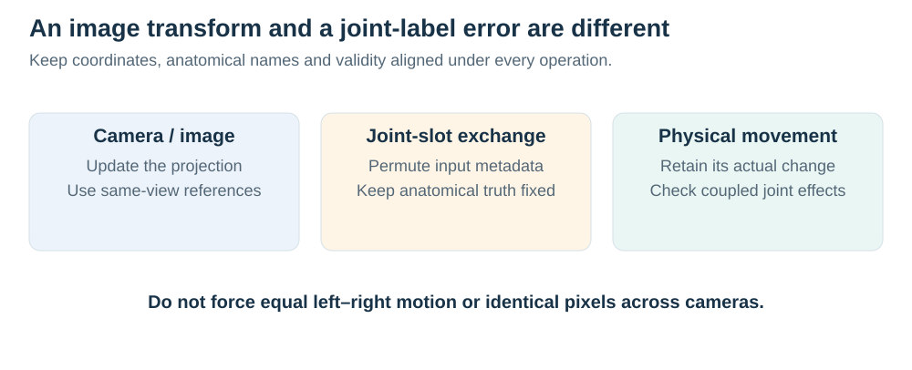
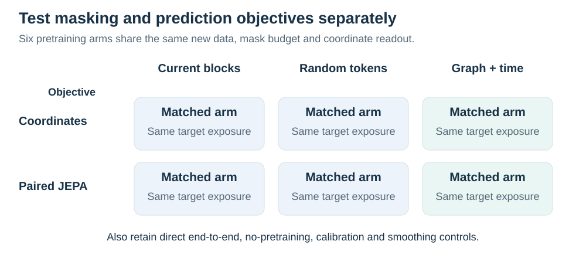

> Historical literature and hypothesis audit, retained when the active proposal changed on23September2026. Read the [current positioning](../../literature/novelty.md) for the implemented follow-up.

# Method hypotheses and closest prior art

19 September 2026. Independent literature and source audit. The ranked ideas below are hypotheses, not completed findings or claims of priority. No training, data downloads, or experiment-source changes were performed.

## Recommended scientific question

The most promising question is **whether restoring a noisy gait trajectory changes the measured difference between the two sides, and whether controlled synthetic training can reduce observation errors while retaining that difference**. The study should measure both desirable suppression of camera/estimator artifacts and undesirable suppression, amplification, or reversal of the movement signal. JEPA is one candidate mechanism to test against direct supervision; its inclusion is not an outcome to protect.

This framing is potentially useful because a more accurate average pose can still give a biased side-specific measurement. Its novelty is not established merely by combining a JEPA, a symmetry loss, and synthetic videos. The proposed contribution needs a reproducible failure or improvement in a meaningful measurement, an intervention that distinguishes competing explanations, and independent real reference evidence. If ordinary task-aware supervised training achieves the same outcome, report that result rather than attributing it to latent prediction.

## Keep the predecessor studies separate

The actual [gavd5-drift research assessment](../../../../../../gavd5-drift/neurips-laterality/RESEARCH_DIRECTIONS.md) describes 625 clips from 93 source videos, with five source-held-out folds and five initializations. Mirrored training improved the specified feature-consistency error by about 0.0084, while its predictive R² difference was 0.004 with interval [-0.006, 0.013]. Learned-minus-initial predictive R² was -0.018 [-0.039, 0.002]. Recomputing the target from the resized model inputs gave R² 0.218 on 623 clips from 92 sources. These motivate auditing input preparation, feature content, and readout separately; they do not show that all relevant information was irreversibly lost. Source video was the grouping unit, not verified person identity.

The separate [gavd6 latent-laterality result](../../../latent-laterality/results/validation.md) used AMASS trajectories with imposed changes of joint names. Its probability-aware SG-JEPA gain was reproduced by an otherwise matched 50/50 assignment-probability control. That result does not establish useful uncertainty estimation or anatomical-side recovery. Its historical predictions are unavailable in this checkout and its confirmation test remains sealed.

The [current synthetic restoration analysis](../../../synthetic-training-v2/results/seed17-complete-analysis-20260919/README.md) concerns rendered normal treadmill movement: direct supervision improves coordinates beyond affine calibration, paired JEPA adds little over initialized/shuffled controls, and amplitude/event distortions remain. These three evidence streams cannot be pooled into one clinical finding.

## Transformation contracts that must remain distinct

*For an imposed naming error, permute estimated-input metadata while retaining the anatomical truth. A camera change instead requires a correspondingly projected reference.*

| Intervention | What physically changes | Required behavior |
| --- | --- | --- |
| Appearance, blur, background, or an independently placed occluder | The motion is held fixed while its observation changes. | Retain the same measurement when it remains identifiable; uncertainty should increase when information is hidden. |
| A camera change or digital image reflection | Image geometry changes; the physical limb identities can remain fixed. | Transform image coordinates using the known projection and retain the declared anatomical identity map. A 2D geometric measurement need not remain numerically invariant across cameras. |
| A true change of movement side, amplitude, timing, or biomechanical parameter | The reference movement changes. | Track the independently measured reference change instead of averaging it toward a normal or symmetric pattern. |
| A temporary exchange of tensor joint names | The coordinate set can remain plausible while its naming is wrong. | Correct or explicitly represent the uncertain correspondence; do not interpret the exchange as a physical improvement or a new pathological movement. |

Digital flipping and mirroring a simulated body are not automatically the same anatomical intervention. Some augmentation conventions also exchange joint names; others preserve the original physical person's identity. Record the image transform, anatomical permutation, and camera operation separately and test the expected sign for each. A scalar measurement cannot be assigned an odd/even transformation rule from the word “reflection” alone.

Equivariance means that the output transforms consistently when its input is transformed. It does **not** require each person's left and right movements to be equal. A correct reflection-equivariant model can retain large asymmetry. By contrast, a penalty that pulls the two limbs toward equal trajectories explicitly suppresses the phenomenon being measured. These are different hypotheses and should have different controls.

## Closest primary literature and specific novelty threats

The [21 September masking extension](../../methods/masking.md) adds a concrete test of connected anatomical-region masking against the current stochastic time-block policy. [SkeletonMAE](https://arxiv.org/abs/2307.08476), [MAMP](https://arxiv.org/abs/2308.07092), [S-JEPA](https://www.ecva.net/papers/eccv_2024/papers_ECCV/papers/04755.pdf), and [Hui et al.](https://www.nature.com/articles/s41598-026-39330-9) already establish graph, motion-aware or anatomical temporal masking. The new study must contribute evidence about preserving signed movement and response under realistic observation loss. A better masked-feature loss or a graph sampler alone would not establish that contribution.

| Verified work | What overlaps with the proposed program | What remains to establish here |
| --- | --- | --- |
| Yamada et al., **Utility of synthetic musculoskeletal gaits for generalizable healthcare applications**, Nature Communications, 2025 ([paper](https://www.nature.com/articles/s41467-025-61292-1), [full text](https://pmc.ncbi.nlm.nih.gov/articles/PMC12227639/)) | Uses simulated musculoskeletal variation, synthetic-only gait-parameter estimation, and synthetic self-supervised pretraining for clinical downstream tasks. The method includes projected noisy 2D poses and camera variation. | Generic synthetic gait diversity, synthetic-to-real parameter estimation, and clinical self-supervised pretraining are already demonstrated. Test the effect of realistic estimator errors and restoration on *within-person signed responses*, with direct-versus-JEPA attribution. The paper itself cautions that varied muscle parameters are not equivalent to reproducing patients' impairments. |
| Shin et al., **DeepGaitLab: Accurate and Flexible Markerless Motion Tracking Powered by Synthetic Data**, Research Square preprint, 24 July 2026 ([record](https://pubmed.ncbi.nlm.nih.gov/42539015/), [preprint](https://doi.org/10.21203/rs.3.rs-8998239/v1)) | Reports synthetic-trained anatomical landmarks and multi-view measurement in 80 participants, including stroke, ACL reconstruction, and mild cognitive impairment. Its split-belt experiment evaluates step-length asymmetry against marker-based references. | “Synthetic training preserves abnormal asymmetry” is too broad a novelty claim. A narrower distinction is controlled attribution of single-video trajectory restoration and representation objectives. Treat these findings as preprint reports, and verify dataset/model access rather than assuming it from the availability statement. |
| Magruder et al., **GaitEncoder: A Foundation Model of Gait Kinematics for Diverse Clinical Applications and Pathologies**, medRxiv preprint, July 2026 ([paper](https://www.medrxiv.org/content/10.64898/2026.07.07.26357479v1.full), [authors' code](https://github.com/rdmagruder/GaitEncoder)) | Learns a clinical kinematic representation across several pathologies. Its preparation aligns walking direction, selects the more-impaired-side cycle when known, and flips left strides into a right-stride convention to remove anatomical laterality from the representation. | That convention can serve its intended impairment and clinical prediction tasks. A different task requiring the absolute anatomical side must retain or recover the transformation metadata. Test canonical features plus that metadata before arguing that a new encoder is necessary. Success at a signed measurement task would not show that GaitEncoder failed at its own tasks. |
| **Siamese denoising autoencoders for joints trajectories reconstruction and robust gait recognition**, Neurocomputing, 2020 ([paper](https://doi.org/10.1016/j.neucom.2020.01.098)) | Corrects noisy, missing, and outlying gait trajectories using a learned latent representation and Siamese training. | A paired encoder/decoder for gait correction is established. Abnormal-movement measurement and correct anatomical sign are different endpoints from identity recognition and need their own evidence. |
| Zeng et al., **SmoothNet: A Plug-and-Play Network for Refining Human Poses in Videos**, ECCV 2022 ([paper](https://www.ecva.net/papers/eccv_2022/papers_ECCV/papers/136650615.pdf)); Wang et al., **SynSP: Synergy of Smoothness and Precision in Pose Sequences Refinement**, CVPR 2024 ([paper](https://openaccess.thecvf.com/content/CVPR2024/html/Wang_SynSP_Synergy_of_Smoothness_and_Precision_in_Pose_Sequences_Refinement_CVPR_2024_paper.html)); Dong et al., **PS-Mamba: Spatial-Temporal Graph Mamba for Pose Sequence Refinement**, ICCV 2025 ([paper](https://openaccess.thecvf.com/content/ICCV2025/papers/Dong_PS-Mamba_Spatial-Temporal_Graph_Mamba_for_Pose_Sequence_Refinement_ICCV_2025_paper.pdf)) | Temporal refinement and the precision/smoothness tradeoff are established, including strong learned competitors. | Demonstrate a measurement consequence and a controlled reason it occurs. A novel-looking loss must be compared with a direct supervised refiner given the same measurements. |
| Moon et al., **PoseFix: Model-Agnostic General Human Pose Refinement Network**, CVPR 2019 ([paper](https://openaccess.thecvf.com/content_CVPR_2019/papers/Moon_PoseFix_Model-Agnostic_General_Human_Pose_Refinement_Network_CVPR_2019_paper.pdf)) | Uses synthesized estimator-error distributions for general pose refinement. | Rendered errors must offer a benefit over cheaper coordinate corruption and measured-error replay; their existence alone is not new. |
| Abdelfattah and Alahi, **S-JEPA: A Joint Embedding Predictive Architecture for Skeletal Action Recognition**, ECCV 2024 ([paper](https://www.ecva.net/papers/eccv_2024/papers_ECCV/papers/04755.pdf)); Mao et al., **Masked Motion Predictors are Strong 3D Action Representation Learners**, ICCV 2023 ([paper](https://openaccess.thecvf.com/content/ICCV2023/html/Mao_Masked_Motion_Predictors_are_Strong_3D_Action_Representation_Learners_ICCV_2023_paper.html)) | Skeleton feature prediction, motion prediction, and motion-aware masking already have substantial precedent. | Test measured signed movement, with the same supervision and capacity in coordinate controls. Neither a motion channel nor a mask policy is an established novel mechanism here. |
| **PoseBERT: A Generic Transformer Module for Temporal 3D Human Modeling**, 2022 ([paper](https://arxiv.org/abs/2208.10211)); Zhu et al., **MotionBERT: A Unified Perspective on Learning Human Motion Representations**, ICCV 2023 ([paper](https://arxiv.org/abs/2210.06551)) | Motion-capture pretraining, masked recovery, and transferable motion representations are established. | A clinical-restoration contribution must surpass broad claims of motion pretraining and respect the different 2D/3D tasks. |
| Cohen and Welling, **Group Equivariant Convolutional Networks**, ICML 2016 ([paper](https://proceedings.mlr.press/v48/cohenc16.html)); Garrido et al., **Self-supervised learning of Split Invariant Equivariant representations**, ICML 2023 ([paper](https://proceedings.mlr.press/v202/garrido23b.html)) | Group-consistent architectures and split invariant/equivariant representations are established. | An odd bilateral feature channel is a design choice, not proof of learned anatomical content or novelty. |
| Kim et al., **Regularizing Towards Soft Equivariance Under Mixed Symmetries**, ICML 2023 ([paper](https://proceedings.mlr.press/v202/kim23p.html)); Lee et al., **Soft Equivariance Regularization for Invariant Self-Supervised Learning**, ICLR 2026 ([paper](https://proceedings.iclr.cc/paper_files/paper/2026/hash/3be6511c8f56d0dca4b5ed59fdf9b2f4-Abstract-Conference.html)) | Learning with approximate/mixed symmetries and adding soft equivariance to invariant learning are established topics. | A learned symmetry-strength parameter is insufficient differentiation; identify the actual clinical transformation contract and show a useful tradeoff. |
| Ghaemi et al., **seq-JEPA: Autoregressive Predictive Learning of Invariant-Equivariant World Models**, NeurIPS 2025 ([paper](https://proceedings.neurips.cc/paper_files/paper/2025/file/2f63d2963526bdd9ff1b8bcc2dc9905a-Paper-Conference.pdf)); Bardes et al., **MC-JEPA: A Joint-Embedding Predictive Architecture for Self-Supervised Learning of Motion and Content Features**, arXiv, 2023 ([paper](https://arxiv.org/abs/2307.12698)) | JEPA with distinct invariance/equivariance demands, and joint motion/content learning, already exist. | Avoid “first symmetry-aware JEPA” or “first JEPA separating motion from nuisance.” This study needs an observable measurement advantage and controlled biological/observation interventions. |
| von Kügelgen et al., **Self-Supervised Learning with Data Augmentations Provably Isolates Content from Style**, NeurIPS 2021 ([paper](https://proceedings.neurips.cc/paper/2021/hash/8929c70f8d710e412d38da624b21c3c8-Abstract.html)); Ruiz et al., **Finding Differences Between Transformers and ConvNets Using Counterfactual Simulation Testing**, NeurIPS 2022 ([paper](https://proceedings.neurips.cc/paper_files/paper/2022/file/5ce3a49415f78db65a714b4f05c62f4e-Paper-Conference.pdf)) | Controlled rendering and augmentation-defined content preservation have existing theoretical and empirical foundations. | A renderer's controlled factor supports an intervention inside that simulator. It does not identify a human disease mechanism or prove universal causal disentanglement. |
| Biderman et al., **Lightning Pose: improved animal pose estimation via semi-supervised learning, Bayesian ensembling and cloud-native open-source tools**, Nature Methods, 2024 ([paper](https://doi.org/10.1038/s41592-024-02319-1)); Weinreb et al., **Keypoint-MoSeq: parsing behavior by linking point tracking to pose dynamics**, Nature Methods, 2024 ([paper](https://doi.org/10.1038/s41592-024-02318-2)) | Temporal/geometry consistency, uncertainty-aware smoothing, and separating tracking noise from behavior are established in adjacent pose measurement work. | A human-gait adaptation must demonstrate preservation of the relevant abnormal movement instead of treating plausible smoothness as sufficient. These animal tools are conceptual comparators, not automatically compatible human baselines. |
| Shan et al., **Diffusion-Based 3D Human Pose Estimation with Multi-Hypothesis Aggregation**, ICCV 2023 ([paper](https://openaccess.thecvf.com/content/ICCV2023/papers/Shan_Diffusion-Based_3D_Human_Pose_Estimation_with_Multi-Hypothesis_Aggregation_ICCV_2023_paper.pdf)); Zhang and Carlone, **CUPS: Improving Human Pose-Shape Estimators with Conformalized Deep Uncertainty**, ICML 2025 ([paper](https://openreview.net/pdf?id=v7ebdKPTnG)) | Multiple plausible poses and calibrated prediction sets are established. | New value would have to concern assignment-aware measurement uncertainty, meaningful anchor cost, or demonstrated validity under specific deployment conditions. Naive conformal guarantees do not automatically survive person dependence or clinical domain shift. |

The search also found **Entity-Centric World Models: Interaction-Aware Masking for Causal Video Prediction**, arXiv preprint, 2026 ([record](https://arxiv.org/abs/2605.15466)). Its object-interaction scope is less direct; it reinforces that causal/masked-world-model terminology is crowded. It should not replace the closer gait, equivariance, and refinement comparisons above.

## Ten ranked, independently falsifiable hypotheses

Ranking reflects fit to the existing evidence and potential measurement value, not predicted acceptance or a promise of novelty. These are alternatives to screen, not ten additions to one model.

| Rank | Hypothesis and practical question | Distinguishing experiment | What would refute or narrow it |
| --- | --- | --- | --- |
| 1 | **Paired training can retain a signed movement response while rejecting observation corruption.** Does a restoration method attenuate a genuine left/right change as if it were noise? | Cross reviewed movement levels with identical appearance/camera/corruption seeds. Measure the change in the declared bilateral quantity before/after restoration against the reference change, then repeat on independent real measured variation. | No response distortion in strong baselines; gains disappear against direct training with the same bilateral task loss; or the result depends on one synthetic motion editor. |
| 2 | **Some weak learned performance originates in preprocessing rather than inadequate pretraining.** Are time resampling, pooling, or framewise scaling removing the signed signal? | Evaluate the same reference measurement before/after every preparation step, then compare fixed and alternative preparation with initialized/direct/JEPA models at matched budgets. | The target remains equally recoverable and output utility is unchanged. A preprocessing fix alone is useful engineering but needs broad evidence for a method paper. |
| 3 | **A small verified anatomical anchor improves signed measurement more than an elaborate unanchored uncertainty model.** How much human input is needed to know which limb is affected? | Compare no anchor, one independently checked frame, a fixed annotation budget, and oracle assignment; use calibrated assignment hypotheses, a simple HMM/continuity baseline, and the old uniform-probability control. | The anchor does not improve accepted-case error or coverage; continuity solves the task; or natural videos rarely contain the tested ambiguity. |
| 4 | **Averaging ambiguous limb assignments suppresses asymmetry even when each assignment is plausible.** Should measurements be computed within hypotheses before summarizing uncertainty? | Compare measurement of the mean pose with the distribution of measurements across two assignment-consistent trajectories; use proper scoring, sign error, magnitude error, and coverage against known assignments. | A deterministic baseline is equally good at the same coverage, or the supposed ambiguity was supplied only by artificial swaps. |
| 5 | **A correct transformation contract preserves asymmetry better than indiscriminate invariance.** Which symmetry constraint is appropriate for the endpoint? | Compare no constraint, augmentation, exact output equivariance, soft equivariance, and a deliberately symmetry-forcing control, with matched learned/random features and distinct image-reflection/anatomical-intervention tests. | Only the deliberately inappropriate symmetry-forcing control fails; exact output parity improves its algebraic score but not independent movement prediction. |
| 6 | **Reference motion targets help JEPA preserve phase-specific bilateral information.** Does pretraining retain information needed for asymmetry beyond positions? | Predict reference displacement features at physical time lags and compare with direct coordinate-plus-motion-plus-bilateral supervision, coordinate pretraining, EMA/online encoders, and mismatched phase targets. | The direct method matches the improvement, the benefit comes from extra labels/readout updates, or a simple filter has equivalent measurement fidelity. |
| 7 | **Pose-dependent missingness creates selective measurement bias.** Are the most asymmetric or difficult phases disproportionately unscored? | Cross independent occluders with reference phase/asymmetry; report attempted-population error, uncertainty and eligibility by side/phase, then audit the same associations in real video. | Equal-population scoring removes the apparent method gain. That is an evaluation correction; scientific value requires a reproducible general failure and a better selection policy. |
| 8 | **Rendered estimator errors offer useful structure beyond generic coordinate noise.** Does an image-derived corruption distribution matter for clinical measurements? | Train otherwise identical restorers on Gaussian errors, empirically replayed training errors, and rendered estimator outputs; match motion, counts, severity, and supervision; test new estimators and real patients. | Cheap error replay matches rendering, or the gain reflects greater error severity rather than realistic structure. PoseFix and Yamada et al. are close comparators. |
| 9 | **An input-conditioned abstention rule avoids inventing biological symmetry during long occlusion.** Can the system flag unidentifiable measurements? | Calibrate confidence using separate people; compare interval width, empirical coverage and error at the same retained-person/clip coverage, including subgroup and occlusion-length breakdowns. | Confidence merely follows native detector scores, excludes disproportionately affected people, or coverage fails after domain change. Compare simple ensembles/state-space models before a large stochastic JEPA. |
| 10 | **A model can preserve within-person change more faithfully than absolute cross-person severity.** Does restoration retain a measured intervention/longitudinal response? | Use repeated sessions with independently measured side-specific outcomes; keep all sessions of each person together and test signed change, not only diagnosis/classification. | Change is explained by camera/session differences, references were not collected synchronously enough, or the model predicts person identity and baseline severity instead. This is the strongest clinical extension but has the largest data requirement. |

Views require particular care in hypotheses 1 and 5. Camera azimuth is a nuisance for some physical quantities, but it changes projected joint displacements. Evaluate view-specific projected references when the endpoint is 2D. Claim a view-independent anatomical measurement only with a defined reconstruction/measurement model and an adequate reference; do not train identical 2D outputs for physically different projections.

## The most focused extension: a measured response rather than a new architecture name

Use one bilateral quantity with a clearly stated anatomical anchor and reference. A first controlled endpoint could be the difference in left/right projected excursion over an aligned interval. It is a view-specific kinematic quantity, not automatically step length, a clinical joint angle, or disease severity. For a stronger endpoint such as step-time or step-length asymmetry, obtain independent event/geometry references and a compatible landmark set. The current body-12 tracks and ankle-separation peaks do not by themselves establish heel strikes, toe-off, or metric stride length.

Let A be the reference bilateral measurement and let A-hat be the same declared measurement on a restored trajectory. For matched movement variants, examine whether the restored difference, A-hat(b) minus A-hat(a), agrees with the reference difference, A(b) minus A(a). Plot the response over several reference effect sizes and report attenuation, amplification, sign reversal, and errors at unchanged-motion controls. Use the realized reference difference, not a simulator parameter such as “20% weaker muscle,” as the measurement target. A physical parameter may alter several aspects of motion at once.

Cross these movement variants with observation changes while retaining the same source motion, render seed, and geometry wherever logically possible. For changes that alter the camera projection, recompute the reference rather than treating it as unchanged. The response curve is an analysis device, not a new statistic or proof of a causal disease model. The new evidence would be a reliable description of what restoration does to an independently defined biological signal, supported by a successful controlled intervention and real replication.

Generate altered motion using a validated motion/simulation procedure and reject implausible artifacts under reference-only rules. Simple unilateral coordinate scaling is acceptable as a software stress test, but it is not validated hemiparetic or Parkinsonian gait. Include real abnormal motion with independent references before claiming preservation in patients. Neither healthy variation nor one asymmetric simulation setting represents all abnormal gait.

Separate recoverable movement from unobserved movement. If two reference states yield the same supplied input, a deterministic restorer cannot output the correct distinct response for both. Construct such a controlled ambiguity case and distinguish it from partial-visibility cases where the changed movement is observed. The correct response to absent information is an appropriate distribution or additional evidence; a point estimate's unavoidable error does not establish a learned restoration defect. A limb-name anchor can resolve anatomical sign while leaving an occluded trajectory unknown. A stronger empirical contribution would predict this evidence boundary and show when a small change in acquisition or annotation produces more benefit than a more elaborate model.

### Minimum attribution matrix

*This new masking screen is separate from the objective-by-paired-change-constraint matrix below. Combining both at once would obscure which change helped and multiply the compute budget. Anatomical attribution additionally requires matched-duration and topology-shuffled controls.*

Keep unchanged tracks, affine calibration, a tuned temporal filter and one verified learned refiner as practical controls. The representation attribution experiment uses matched frozen encoders and readout stages:

| Representation objective | Coordinate and motion supervision | The same supervision plus the bilateral measurement/response target |
| --- | --- | --- |
| Coordinate pretraining, then frozen encoder and coordinate readout | Stage-matched coordinate-pretrained control | Tests the added measurement/change term with the same trainable readout parameters |
| Paired feature prediction, then frozen encoder and coordinate readout | JEPA-style candidate | Tests feature prediction under the same trainable stage and outcome information |

Match actual motion/target exposure, model capacity as closely as possible, downstream-coordinate updates, tuning allowance, and report measured compute. Apply the selected readout constraint identically to initialized and mismatched-pair controls. Retain direct end-to-end training with and without the same constraint as a separate practical comparison. Comparing its interaction with a frozen-JEPA recipe alone would confound representation choice with which parameters can adapt. If the extra bilateral target is used only in the JEPA arm, the comparison cannot establish a JEPA-specific advantage.

The focused proposal adopts the inherited EMA reference teacher and frozen-encoder readout recipe. The new paired-change term is proposed at the coordinate-readout stage, with its evaluator and gradient checks specified in the [measurement protocol](../../methods/evaluation.md#primary-engineering-endpoint); it is absent from the predecessor implementation. A pairwise response-consistency loss could be mathematically close to ordinary task supervision. Compare it directly with per-example measurement supervision and shuffled pairs with matched differences before claiming that pairing is responsible. An architecture or loss name does not resolve that attribution problem.

A useful positive result would reduce corruption-induced error **and** preserve the signed reference response across new people, renderings and an independent real set, with a practical advantage over these strong controls. If direct task-aware learning matches JEPA, a sound paper may still show when generic restoration erases useful variation and how to prevent it, but the contribution would concern measurement-aware training/evaluation. To be substantive, that result must extend beyond the already established accuracy/smoothness tradeoff and the synthetic clinical successes of Yamada et al. and DeepGaitLab. If ordinary baselines preserve the response already, this branch has not established a new problem to solve.

## Secondary extension: explicitly priced anatomical information

Keep assignment uncertainty separate from coordinate uncertainty. A verified side label at one informative time can resolve a global naming ambiguity while leaving occluded coordinates uncertain. Compare the cost and benefit of zero, one, and a small fixed number of anchors under a preset policy. An annotation policy may inspect only available input confidence/visibility, not the evaluation reference or eventual model error. Include random anchor selection at the same annotation budget, transparent continuity/HMM correction, a 50/50 assignment control, and an oracle only as an unattainable ceiling.

Do not average two anatomically opposed hypotheses into a trajectory and assume that its bilateral measurement expresses uncertainty faithfully. Retain hypothesis-specific quantities and permit an unsigned magnitude or abstention when sign remains unidentifiable. If the hypotheses imply +a and -a with equal probability, zero is the correct posterior mean of signed asymmetry; its absolute value is not the expected asymmetry magnitude. This distinction alone is elementary probability, not evidence of a defective model or a new method. Test whether the resulting intervals and accepted-case errors are calibrated on new people, and report whose examples are rejected. This is a promising measurement contribution if real assignment ambiguity is independently annotated and sufficiently prevalent; it cannot be validated solely by injecting label swaps.

## Scope and evidence limits

This audit supports a short list of testable research directions; it does not certify a first-of-its-kind method or forecast a statistically significant result. The closest prior art already covers synthetic clinical gait learning, asymmetry measurement, denoising, equivariant learning, and probabilistic pose estimation. The opportunity is a specific, rigorously demonstrated connection between restoration, signed biological response and the information required to identify anatomical side.

The current eight-person experiment remains development. Its normal treadmill reference does not validate abnormal-gait preservation. Raw-video/reference inspection, a patient or intervention reference set, identity/recording separation, compatible landmark semantics, repeated training fits, and an untouched confirmation population remain necessary. The adjacent [paper-development plan](../../../synthetic-training-v2/research/paper-development-20260919/README.md) describes those data and statistical requirements. A new laterality hypothesis should not reopen the old sealed test under a failed confirmation protocol.
