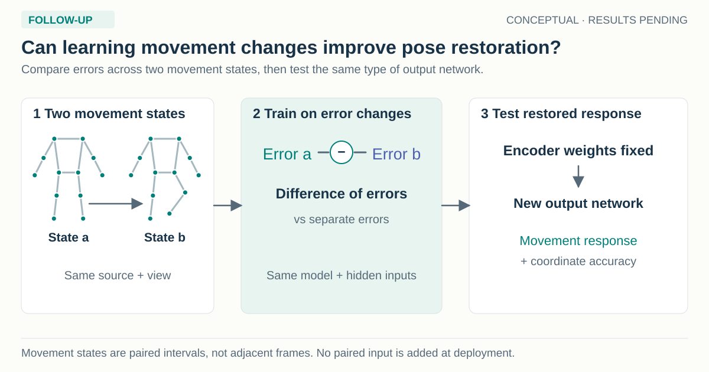
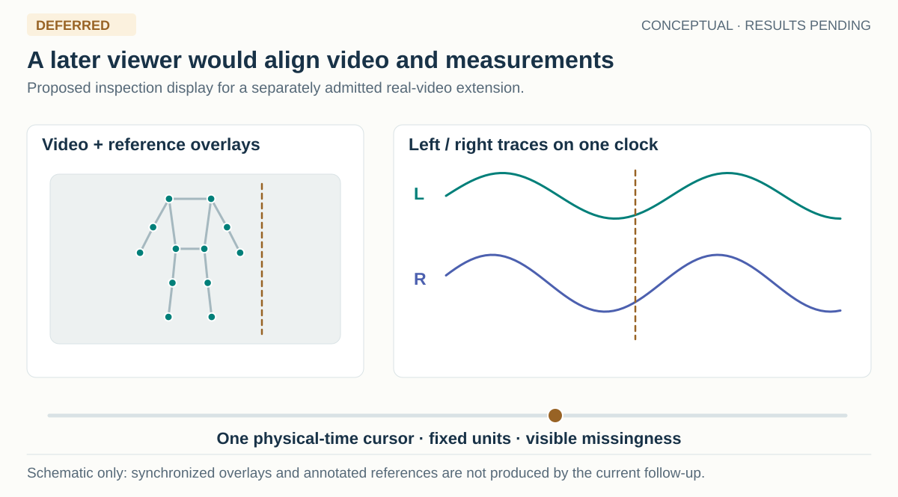

> Historical synthesis before the paper-style reorganization. Read the [current proposal](../../README.md) for the active design.

# Gait Fidelity

This research direction studies how pose restoration can preserve side-specific gait differences and genuine movement changes while reducing observation and tracking errors.

[Study index](../../../README.md) · [Predecessor synthetic-training study](../../../synthetic-training-v2/README.md)

[Visual guide](../../images/gallery.html) · [Masking experiment](../../methods/masking.md) · [Local video audit](../../data/local-videos.md) · [Browse the local videos](../../data/video-gallery.html)

19 September 2026. Literature-grounded research proposal; no new training or clinical validation has been performed. The experiments and claims below are prospective. This document extends the [earlier paper-development plan](../../../synthetic-training-v2/research/paper-development-20260919/README.md), incorporating closer clinical and synthetic-gait prior work found in a broader search.

**Recommendation.** Develop a controlled study of whether pose restoration can suppress errors from image capture and limb labeling while preserving the size, direction, and changes of genuine bilateral movement differences. Use paired synthetic interventions to identify what a model changes, and independently referenced real gait to establish practical value. Treat paired JEPA as one candidate mechanism to test against equally supervised direct training. A useful direct method or measurement finding would remain valuable if JEPA does not improve it.

The proposed research question is: **Can a model improve noisy gait measurements while preserving the biological differences and changes that clinicians need to measure?** This is narrower and more defensible than claiming a general gait world model or a clinical treatment system. The potential breakthrough would be showing, explaining, and reducing a systematic failure of learned restoration to retain real side-specific change under observational ambiguity. That outcome is a hypothesis, not a discovery already made.

*The diagrams throughout this study illustrate proposed concepts and workflows. They are editable SVGs, with rendered previews and an independent [review record](../../reviews/masking-data-20260921.md). They do not depict new efficacy results.*

**21 September update: two concrete extensions.** The requested multiple-sclerosis notebook already uses changing anatomical-region masks. Synthetic training v2 also uses stochastic masks, but largely removes whole-body time blocks under its current complete-input configuration. The next useful experiment compares those temporal masks with joint-wise and connected-region masks under matched supervision, while checking that hips and ankles receive context at every time position across draws. A local mask-bank audit found that changing the mask alone does not ensure balanced exposure: the left hip was visible in only 7.0% of draws at one central block, versus 51.6% at the first. The [masking study](../../methods/masking.md) specifies the comparison and the implementation checks needed before training.

The local `multiple-sclerosis/video-data-full` collection contains 91 readable clips from 41 filename-derived source videos, totaling 9.21 minutes. It is useful for examining natural observation errors and developing an independently annotated occlusion test. It currently lacks the verified person identities and independent motion references needed for a clinical fidelity claim. Moreover, **28 of its 41 sources, covering 61 clips, already occur in the local GAVD manifest**, so it cannot be described as an independent external dataset without a source-level exposure audit. The [video audit](../../data/local-videos.md) documents timing and interpolation problems in the existing pose cache; the [local gallery](../../data/video-gallery.html) plays the original videos and supports exporting review notes.

The predecessor now also has a [three-seed results writeup](../../../synthetic-training-v2/writeups/README.md). Direct coordinate training improves positions across these runs, while paired JEPA remains close to its controls and motion fidelity remains unresolved. These development findings motivate the new experiment; the sampler and video audits do not supply new model-performance evidence.

The search covered synthetic biomechanics, clinical markerless gait, representation invariance and equivariance, temporal pose refinement, probabilistic pose inference, clinical measurement validity, pathological gait generation, and relevant datasets. It cannot establish that every possible idea or prior paper has been found. The [search map](../../literature/search-map.md), [method audit](../../literature/novelty.md), [clinical-data audit](../../data/clinical-candidates.md), and [measurement design](../../methods/evaluation.md) expose the coverage and important uncertainties.

**Why laterality changes the objective**

An image can contain a genuine difference between a person's legs, an error in the estimated coordinates, or an error in which anatomical leg an estimated joint is assigned to. These can produce similar-looking traces. A restorer needs to distinguish them because the desired response differs: coordinate noise should be reduced; a true difference should be measured faithfully; uncertain anatomical assignment should be represented or resolved with valid additional evidence.

For example, a person may spend different amounts of time in the left and right steps. Better lighting should not change that physical measurement. A genuine change in the person's walking should change it, and relabeling the estimated legs should not silently reverse the reported anatomical side. A system that makes every trace smooth and symmetric can score well on some reconstruction objectives while being unsuitable for following that person's gait.

Accurate asymmetry measurement can support assessment of side-specific movement and change during rehabilitation. It does not itself diagnose the affected side or prescribe treatment. A longer step can occur on either side of a person with unilateral impairment, and symmetric step lengths do not imply symmetric mechanics. [Stenum et al.](https://journals.plos.org/digitalhealth/article?id=10.1371/journal.pdig.0000467) already validate video-based clinical measurements and within-person change. [Finley and Bastian](https://pmc.ncbi.nlm.nih.gov/articles/PMC5243179/) show why speed and different components of asymmetry must be considered together. The proposed advance must therefore concern preservation and error separation under controlled restoration, beyond measuring asymmetry in another cohort.

There are also limits to the connection with earlier local work. The gavd5-drift reflection/laterality experiments, gavd6 AMASS latent-assignment experiments, and current rendered restoration study have different datasets and endpoints. Reflection consistency is not proof of clinically useful information. In the latent-assignment study, uninformative assignment probabilities matched the apparent gain. In the current restoration study, initialized and shuffled controls closely match paired JEPA. These controls motivate a stronger mechanism test; they do not establish that laterality information is universally absent or that uncertainty averaging caused the current results. See the [local evidence audit](../../../synthetic-training-v2/manuscript/abstract-laterality-audit-20260919-v01.md).

**The closest prior work substantially raises the novelty requirement**

| Prior work | What it already contributes | Consequence for this proposal |
| --- | --- | --- |
| [Yamada et al., Utility of synthetic musculoskeletal gaits for generalizable healthcare applications, Nature Communications 2025](https://www.nature.com/articles/s41467-025-61292-1) | Biomechanically generated diverse gait, projected pose inputs, supervised gait-parameter estimation, and synthetic self-supervised pretraining for clinical tasks | Synthetic gait plus representation learning and clinical transfer is already established. Test actual rendered-image estimator errors and side-specific response preservation. |
| [DeepGaitLab, Research Square preprint, July 2026](https://pubmed.ncbi.nlm.nih.gov/42539015/) | Synthetic-data-trained multi-view tracking and clinical evaluation, including step-length asymmetry under split-belt walking | A generic asymmetry-preservation claim is also insufficient. Compare matched inputs and isolate restoration behavior; its multi-camera method can supply context or an explicitly privileged-input reference comparison. Access must be verified. |
| [Stenum et al., PLOS Digital Health 2024](https://journals.plos.org/digitalhealth/article?id=10.1371/journal.pdig.0000467) | Video gait analysis in clinical populations, multiple views, and sensitivity to within-person change | A changed gait parameter alone is not a new problem. Distinguish true change from changes in observation quality. |
| [SIE, ICML 2023](https://arxiv.org/abs/2302.10283) and [Soft Equivariance Regularization, ICLR 2026](https://arxiv.org/abs/2603.06693) | Preserving transformation-dependent information alongside invariance | Dividing features into invariant and side-sensitive components is an available design, not an adequate novelty claim by itself. |
| [SmoothNet](https://arxiv.org/abs/2112.13715), [SynSP](https://openaccess.thecvf.com/content/CVPR2024/papers/Wang_SynSP_Synergy_of_Smoothness_and_Precision_in_Pose_Sequences_Refinement_CVPR_2024_paper.pdf), and [PS-Mamba](https://openaccess.thecvf.com/content/ICCV2025/papers/Dong_PS-Mamba_Spatial-Temporal_Graph_Mamba_for_Pose_Sequence_Refinement_ICCV_2025_paper.pdf) | Temporal pose refinement and the relation between precision and smoothness | Coordinate improvement with temporal distortion is a starting observation; identify an application-relevant mechanism or boundary and compare credible refiners. |
| [DiffPose, ICCV 2023](https://openaccess.thecvf.com/content/ICCV2023/papers/Holmquist_DiffPose_Multi-hypothesis_Human_Pose_Estimation_using_Diffusion_Models_ICCV_2023_paper.pdf) | Multiple plausible pose hypotheses, including uncertainty in 2D detections | Maintaining more than one hypothesis is established. Test its effect on bilateral measurements and annotation cost, with a simple mixture baseline. |
| [GaitEncoder, medRxiv preprint, July 2026](https://www.medrxiv.org/content/10.64898/2026.07.07.26357479v1.full) | Clinical kinematic representation learning with deliberate side canonicalization | Side-canonical representations may suit its intended tasks. Measure whether anatomical metadata must be retained for a different, signed measurement task; do not claim the original method failed at its own task. |

Preprints supply useful current positioning but are not independently established clinical evidence. [PGcGAN](https://arxiv.org/abs/2603.14409) and [language-conditioned pathological gait synthesis](https://arxiv.org/abs/2606.06048) further show that simply generating abnormal-looking sequences is a crowded direction. Classification improvements cannot certify preservation of true physiological measurements.

For the GaitEncoder comparison, retain the inverse side/phase mapping and test canonical features plus that metadata before proposing a new anatomical-side encoder. Information intentionally moved into a coordinate convention need not be lost if its transform remains available.

**The directions considered, and what would make each worth pursuing**

The ranking is a judgment about fit to the existing work, practical relevance, and the evidence needed. It is not a forecast of significance or acceptance.

| Direction | Practical result to seek | Main novelty/evidence obstacle | Priority |
| --- | --- | --- | --- |
| Paired biological-change and observation-change training | Preserve true side-specific change while reducing false changes from blur, occlusion, cropping, and labeling errors | Could be an ordinary task loss unless controlled experiments explain a consequential failure and show independent transfer | Main direction |
| Assignment-conditioned outputs with occasional anatomical anchors | Retain asymmetry magnitude during ambiguous limb assignment and report signed results only with adequate evidence | Local SG-JEPA and probabilistic pose methods already cover parts of this; natural ambiguity and incremental value must be demonstrated | Targeted secondary direction |
| Preservation benchmark across existing refiners | Identify where commonly used corrections erase, amplify, or reverse clinically relevant differences | A score collection is insufficient; need a useful predictive mechanism and real references | Strong empirical route |
| Contact-aware temporal prediction | Preserve left/right step and support durations through short occlusions | Contact information is not recoverable in every view; temporal masking/motion supervision are established | Add only if event references exist |
| Anatomical versus image-coordinate factorization | Generalize side-sensitive measurements across cameras without treating projection changes as pathology | Equivariant representation methods and prior reflection work are close | Architectural control or supporting analysis |
| Selective restoration and abstention | Request a clearer view or keep the input when correction is likely to damage a measurement | Error estimates must be calibrated on fresh people; selective rejection can hide failures | Practical extension |
| Synthetic acquisition design | Recommend a view or short repeat recording that reduces signed-asymmetry uncertainty | Needs a prospective or held-view benefit over simple fixed-camera instructions | Longer-term useful extension |
| Estimator-error conditioning | Adapt to naturally different error patterns without retraining every pose estimator | Prior personalization lacked headroom; must beat pooled calibration and training | Lower priority until headroom appears |
| Physics/contact privileged teacher | Learn deployable features from synthetic contacts or forces available only during training | Force from pose can be unidentifiable; current local force evidence is weak | Contact targets before kinetic claims |
| Patient-specific longitudinal adaptation | Measure changes relative to a person's baseline | Adapting on follow-up data can erase real progression and invalidate the outcome | Longer-term, baseline-only fitting |
| Foundation-model scale or more JEPA variants | Broad representation reuse | Strong new gait foundation models exist; high compute and poor causal attribution | Do not make this the immediate plan |
| Generative pathological gait from text | Broader training diversity | Existing generative work; visual plausibility is not disease fidelity | Source diversity only after validation |

**The central experiment is a crossed intervention design**

*Horizontal comparisons change the observation; vertical comparisons change the motion. Compare each output with its own valid reference, including the correct camera projection.*

For a given source identity and motion, construct at least two levels of a physical motion condition and two levels of an observation condition. Render and estimate all four combinations. Examples of the observation condition are clean versus one-sided occlusion, two camera views, or a known local slot-assignment error. The motion condition should use independently captured gait states or a qualified simulation intervention. A mirrored motion with the anatomy contract transformed correctly is an important sign/transformation control, but mirrored twins alone do not establish preservation of graded biological change. Require at least one independently measured or reference-verified graded change beyond reflection before making that claim.

| | Original observation | Changed observation |
| --- | --- | --- |
| Original physical motion | Reference case | Same movement, changed visibility or tracking conditions |
| Changed physical motion | True movement difference to preserve | True difference under the difficult observation |

Let q denote a declared measurement of the reference and q-hat the same measurement derived from a method. The response error is the difference between the method's before/after change and the reference before/after change. The nuisance effect is the change in method error when only the observation changes. Their interaction asks whether a difficult observation specifically damages sensitivity to the real movement change. Compute these paired contrasts within source identities before aggregation.

For physical measurements in a common anatomical frame, observation-only changes should preserve the reference measurement. Raw 2D trajectories legitimately change with camera geometry. For those, use the correctly projected reference in each view and compare changes in error, rather than requiring the same pixel trajectory across cameras. Image mirroring, camera motion, tensor-slot permutation, and physical left/right counterfactual motion must have separate transformation contracts.

Use both simple negative controls and difficult valid cases: a true change of zero, changes in either direction, bilateral changes with little signed asymmetry, simultaneous change in gait speed, partial-limb swaps, genuine limb crossing, different visibility of the two legs, and long gaps. This prevents a predictor from winning by always reporting zero, by using the camera side as the affected side, or by treating all unusual movement as corruption. Fall/failed-simulation rates belong in the attempted population and must be reported under fixed validity rules.

An inexpensive initial sign-control panel crosses two mirror states, three naming states, two occlusion states and two cameras. It yields 24 track conditions but needs only eight RGB renders per source window, because imposed naming errors can be applied after frozen extraction. These artificial errors test a controlled failure mode; a separate natural-error audit must establish practical prevalence. The later graded-change panel is additional work. Do not count 24 conditions as 24 independent source people.

Create naming-corruption paths on whole extracted sequences before windowing. A joint permutation must move coordinates, confidence, validity, and corresponding joint metadata together. Independently randomize missingness and swap boundaries; fixed window positions, source identifiers, camera labels, and reused nuisance random seeds must not reveal the assignment answer. Require a metadata/missingness-only leakage probe, balanced convention checks, and a simple continuity baseline before admitting this benchmark. The historical laterality work already encountered such shortcuts, making this an essential design check rather than an optional ablation.

Compare the original restorer with an equally supervised direct model, temporal filtering, a verified learned refiner, direct prediction of the target gait quantity without restoration, and a measurement-preserving direct restorer. The direct-quantity model is necessary: if a clinician only needs a few measurements, reconstructing every coordinate may impose unnecessary errors and computation. Report what restoring trajectories adds, such as reusable waveforms and support for measurements not used in training.

Separate supported measurements from unobservable ones. If two physical motions give the same supplied observation but different target measurements, a deterministic method cannot identify both correctly without additional evidence. Controlled hidden-limb pairs can demonstrate this ambiguity within the experiment; limited image visibility alone does not prove non-identifiability in real videos, where other temporal or appearance cues may remain. Evaluate response fidelity where the retained inputs support it, and calibrated distributions or abstention where ambiguity remains. Include a low-cost additional cue, such as one verified limb label or a second view, when it actually resolves the missing information. A limb label can resolve sign while leaving hidden motion uncertain. This separates avoidable signal distortion from an impossible recovery target.

**A model proposal that remains testable**

Stochastic graph-time masking is a proposed pretraining ablation within this framework. It varies which anatomical region supplies context, rather than hiding selected clinical joints permanently. The [detailed protocol](../../methods/masking.md) distinguishes the matched coordinate-pretraining comparator from direct end-to-end training, separates graph connectivity from interval length, and retains initialized and shuffled-feature controls. It also prevents a mask pattern, preprocessing transform or diagnosis label from silently supplying the answer. Graph masking is established prior art; its value here would be a measured improvement in gait fidelity under independent observation challenges.

Begin with the current model family and a small additional constraint, rather than a new large architecture. Give training two types of pairs: the same motion under different observation conditions, and different motion states under matched observation conditions. The prediction objective should retain the reference change between the latter pair while removing variation attributable solely to observation. Reference changes can be supervised in coordinates, in explicitly named motion quantities, or through learned features.

Compare three matched variants: direct position-and-motion training; direct training with the same paired-change constraints; and paired feature prediction with those constraints followed by the same readout. Initialized and shuffled reference features remain required. Match data, masks, downstream supervision, tuning allowance, and report both update counts and total compute. This determines whether the intervention design or learned feature prediction supplies any benefit. No formulation can guarantee the representation is causally identifiable merely because simulator variables are known. [Weakly supervised causal representation learning](https://arxiv.org/abs/2203.16437) establishes such conclusions under explicit assumptions, not arbitrary rendering pipelines.

Retain an unconstrained paired-JEPA arm on the same new data and schema to complete the direct-versus-JEPA by added-constraint comparison. Historical results cannot supply that missing cell after the training population, landmark set, or budgets change. Per-example measurement supervision and pair constraints must have the same target exposures and batch structure. This makes any interaction between feature prediction and the new constraint separately testable.

An output-level pair constraint can simply penalize the absolute difference between the predicted and reference changes in q. This is ordinary task-aware supervision until evidence distinguishes it. Compare that constraint with per-example q supervision, matched-difference shuffled pairs, and an equally supervised direct measurement head before attributing a gain to correspondence. Also compare expensive rendered estimator errors with coordinate-noise training and empirical training-error replay, following the general corruption-synthesis precedent of [PoseFix](https://openaccess.thecvf.com/content_CVPR_2019/papers/Moon_PoseFix_Model-Agnostic_General_Human_Pose_Refinement_Network_CVPR_2019_paper.pdf). Actual error frequency, severity, and training exposure must be matched rather than giving rendering a broader dataset.

Preserve a measurement not used in the training constraint, as well as whole-waveform error and coordinate fidelity, to detect metric-specific gaming. Hold out at least one intervention family and one observation family before confirmation. A model trained to preserve step-time change should not be credited with general biomechanical preservation unless its other measurements are evaluated. If the direct constrained model matches JEPA, report that outcome and keep the simpler method as a candidate.

A broad pose-refinement claim also needs a compatible recent learned baseline such as SynSP or PS-Mamba, with joint mapping and tuning budget verified. If only a faithful SmoothNet adaptation is feasible, bound the comparison accordingly and label the adaptation; do not present it as the authors' reproduced benchmark. Strong novelty would require a response failure across credible alternatives, a control that explains its boundary, and useful improvement on an untrained endpoint or intervention family with independent real-reference support. A significant reduction on the directly supervised synthetic scalar alone would remain a weak contribution.

For uncertainty, a useful analytic example is two anatomical assignments that imply +a and -a signed asymmetry with equal probability. The signed posterior mean is zero, although the asymmetry magnitude is a under both assignments. This follows from elementary probability and is not a new theorem. It illustrates why averaging incompatible poses or signed quantities can misrepresent the magnitude of asymmetry. It does not establish the cause of the current seed-17 findings. Test a two-hypothesis or simple temporal-state mixture first, with calibrated probabilities and an optional verified anatomical anchor. A JEPA mixture must improve on that baseline. Never select the best hypothesis using test truth and call it deployment performance.

Absolute anatomical side may be identifiable from pixels, a trusted orientation cue, or a verified limb annotation even when a coordinate-only sequence is ambiguous. Define the information actually supplied. An affected-side diagnosis is not an interchangeable substitute for a left/right limb anchor. If requesting human input, measure annotation time and error, propagate imperfect anchors, and compare fixed versus uncertainty-selected queries without allowing test references into query selection.

**Choose reference data before committing to a clinical claim**

| Evidence layer | Suitable source | What it can establish |
| --- | --- | --- |
| Controlled engineering diagnosis | Reviewed AMASS, exact rendered pairs, real estimator outputs | Distortion of known projected movement and known synthetic assignment errors; not patient benefit |
| Recorded pathological source movement | [Full-body mocap of 138 able-bodied adults and 50 stroke survivors](https://www.nature.com/articles/s41597-023-02767-y) | Real stroke trajectories for controlled rendering or independent kinematic tests; synchronized public RGB is unverified, and retargeting must preserve the source measurements |
| Mechanically structured intervention | [Generative GaitNet](https://arxiv.org/abs/2201.12044) or a validated existing simulation export | Effects within a specified simulation family; unilateral parameter changes are not verified patient counterfactuals |
| Ordinary real-image transfer | MoVi or another synchronized calibrated video/mocap dataset | Robustness to real imaging and fresh people; a healthy dataset does not establish abnormal-gait preservation |
| Public clinical video feasibility | [LIVE-GaitNeuroKids v1.1](https://zenodo.org/records/21278362) | A listed 1.7-GB video archive, 22 children with CP including 12 with hemiparesis, and wearable references; 30-fps video is not hardware-synchronized, Xsens is not optical truth, and the small unilateral subgroup limits power |
| Clinical measurement and observed change | DeepGaitLab cohort if the necessary data can actually be accessed, or a clinical collaboration with synchronized video and independent references | Real side-specific measurement fidelity and response fidelity under the supported conditions |
| Broad application demonstration | GAVD or public clinical pre-extracted tracks | Clinical labels or qualitative generalization; dense independent trajectory truth cannot be invented from another estimator |

The new [clinical-data audit](../../data/clinical-candidates.md) gives additional options, including public marker/EMG data and clinical videos whose synchronization or access restricts their role. Availability of a paper, output table, or code repository does not imply public raw videos. The Stenum stroke/PD videos are not public; a commonly reused cerebral-palsy dataset records video and mocap on different walks within the same visit, so it supports visit-level quantities rather than synchronized trajectory truth. The DeepGaitLab preprint's statement of sharing has not established that its closed-beta access path currently supplies the necessary raw files.

For a prospective clinical primary endpoint, signed step-time asymmetry is a reasonable candidate when independent contact timing is available, with step-length and sagittal kinematic measures as separately validated supporting outcomes. The exact protocol must be fixed after a development-only reference import establishes validity. At 25 Hz, frames are 40 ms apart; sub-frame timing claims need independent validation. Step-length measurements additionally need validated geometry. Reference contacts supplied to an evaluator are privileged information and must be separated from a deployed pipeline that detects its own events. Current horizontal ankle-separation peaks are not automatically heel strikes or clinical asymmetry.

A proposed signed definition is mean right step time minus mean left step time, where right step time runs from left initial contact to the next right initial contact, and vice versa. Freeze the contact definition, consecutive-step pairing, bout boundaries, reference eligibility, and attempted-trial failure policy before predictions. Use initial contact rather than assuming every pathological step begins at the heel. Retain missed and extra predicted events and require adequate event coverage alongside measurement error; averaging only correctly matched steps can make the worst model appear accurate. Oracle events may isolate coordinate-dependent outcomes such as step length; they cannot validate step-time recovery because the timing answer has been supplied. The practical result must include the deployed event procedure and its failures.

If reliable events cannot be obtained, the first experiment should explicitly remain an engineering preservation study with projected side-specific trajectories. Do not replace its endpoint after seeing which measurement favors the model. Any clinical method will need more than the current body12 schema when its measurement requires heel, toe, contact, or additional anatomical landmarks; available coordinates, required schema changes, and model retraining must be budgeted explicitly.

Fresh population claims require identity separation across collections and checkpoints. AMASS includes BMLmovi; conservative MoVi transfer excludes potentially overlapping BML training identities until a valid crosswalk exists. Fit all learned and calibration controls on the same permitted roster. Keep the inspected eight people as development. Split before augmentation, simulation siblings, mirrored motion, or derived windows, and audit identities in external encoders where possible.

**Quality review and visualization are part of the scientific design**

*The [new local gallery](../../data/video-gallery.html) provides raw-video playback, metadata filters and review-note export. Synchronized pose/reference overlays and measurement traces in this diagram remain implementation work.*

Each synthetic intervention must have a retained original/reference comparison and a visual explanation of what changed. The useful review display is a synchronized four-panel view of the crossed design, with original RGB, exact input crop, reference skeleton, estimator output, restored output, and fixed-axis left/right traces. Expose reference validity, image visibility, model missingness, anatomy labels, camera geometry, source motion, intervention parameters, and timestamps. A shared cursor and frame stepping should show whether a detected change is physical, observational, or a mapping error.

For body-model transfers, verify the joint/marker mapping, foot contact, no retargeting-induced foot sliding while preserving reference-observed foot drag, limb lengths, speed, support durations, and retained natural variation. For clinical videos, verify synchronization, reference quality, independent side labels, and consent/access scope. Do not normalize each limb's amplitude separately, time-warp away between-leg timing differences, or remove unusual cycles merely because they look unlike healthy gait. A reference-based validity rule may reject invalid evidence; severity alone is not an invalidity criterion.

Review clips selected by metadata and a frozen random sample, plus all automatic flags, before ranking methods. Log source hashes, reviewer, decision, and reason; audit a fixed share independently. The [existing data-review page](../../../synthetic-training-v2/research/paper-development-20260919/data-review.html) already exposes retained trajectory figures and exported notes. It contains a small selected set of diagnostic plots, not the new raw-video intervention viewer. Building that synchronized viewer and retaining adequate RGB exports are still implementation work.

**Statistical evidence must match the proposed benefit**

The primary independent units are real people or independent source identities, with simulated conditions and renderings repeated within them. Thousands of views of a small number of source motions cannot establish population generalization. Synthetic identities generated around one template also do not equal independently sampled patients. Model seeds are a second crossed source of variation because one fitted model is applied to every person. Keep all comparisons paired on the same valid reference population and report every declared seed.

Predefine one primary response-error comparison against the strongest matched direct model, a position-fidelity guardrail, and a nuisance-error criterion. The gain must survive all required criteria; a reduced response error bought by retaining all tracking noise is not the desired result. Choose meaningful tolerances using reference repeatability, absolute error, and intended measurement use. Detection above zero, demonstration above a useful minimum, noninferiority, and equivalence answer different questions and need different confidence-bound rules. Account for the declared testing hierarchy, secondary endpoints, and subgroup claims.

Measure the actual variance of the new paired endpoint on development people before calculating sample size. The previous plan's illustrative 61-person calculation concerned a different displacement comparison and cannot be reused as a powered clinical asymmetry design. Study the sensitivity of uncertainty estimates when only three to five trained seeds are available. Report confidence intervals, absolute units, person-level scatter, sign errors with a prespecified near-zero eligibility rule, and all failures. Correlation alone can be high when measurements are systematically shrunk or biased. Repeated-visit agreement is required before claiming reliable longitudinal monitoring; successful split-belt or speed-change measurement does not demonstrate rehabilitation effectiveness.

An empirical paper remains possible without a new architecture if it identifies a consequential, repeatable failure, shows the cause through controlled changes, predicts when the failure occurs, and supplies a validated remedy or acquisition rule. A non-significant JEPA comparison alone does not establish equivalence or a substantial contribution. Stop at a prespecified sample/resource bound; do not add subjects, seeds, endpoints, or datasets until a desired p-value appears.

**What to do first**

*A successful audit permits the next experiment; it does not establish a restoration benefit.*

1. Retrieve the retained model and prediction assets and verify which checkpoints can be evaluated without retraining. Reuse the completed run for development diagnostics.
2. Use the [local video audit and gallery](../../data/local-videos.md) to select usable continuous segments, resolve source overlap and rights, and re-extract poses with retained physical timestamps and observed/imputed flags. Independently annotate a blinded sample for natural left/right mistakes and side-dependent visibility. The current thumbnails are feasibility review, not those annotations. Check the body12 graph adapter and mask coverage before the small [masking comparison](../../methods/masking.md). If the target failure is rare, reduce its prominence before building a specialized model.
3. First inspect LIVE-GaitNeuroKids terms, one raw video/reference trial, side labels, and synchronization; in parallel inspect the stroke C3D source-motion release and a faithful rendering adapter. If reliable video alignment is unavailable, retain LIVE only for outcomes its references actually support and use a declared healthy synchronized source such as MoVi for real-image engineering validation. That fallback cannot carry a clinical trajectory claim. DeepGaitLab access or a clinical collaboration is a further route, not an assumed first-week dependency. Data access, reference import, joint mapping, endpoint validity, and rendering throughput are first-stage gates.
4. Build a small crossed development panel, including zero-change and bilateral-change controls, and measure response error for unchanged inputs, affine calibration, filtering, direct restoration, paired JEPA, and simple assignment mixtures.
5. Only after a meaningful failure appears, compare the matched paired-change objectives and select at most one method for fresh confirmation. Freeze its endpoints, margins, population, and analysis before opening test predictions.

This first stage can be compact if current assets and a usable reference dataset are available. New simulator training, clinical data access, a landmark-schema change, and an independently powered patient evaluation can exceed the current paper week. If those dependencies do not resolve, write a bounded engineering paper or continue the research beyond the deadline; do not describe simulated asymmetry as validated patient benefit.

A suitable working title is **Preserving Gait Asymmetry under Pose Restoration: Learning from Paired Motion and Observation Changes**. The final title should name JEPA only if the experiments establish its specific contribution.

The dated review and validation records describe the original proposal. The [relocation record](relocation-20260921.json) records this study’s new home and the link checks performed after the move.

The direction was subsequently shortened to **Gait Fidelity**; the [rename record](rename-20260921.json) preserves the previous name and the checks performed.
