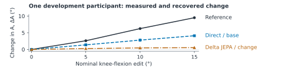
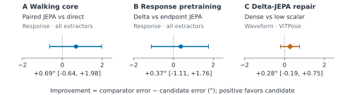

# Movement fidelity in pose restoration

Three synthetic experiments on predictive representations and gait measurement

Research overview · 25 September 2026 · Development evidence, not independent confirmation

## 1. Introduction

Video-based biomechanics and ambient sensing need reliable movement measurements [1,2]. A plausible pose reconstruction can still alter how much a knee moves or which leg changed. We ask whether **predicting reference-motion features helps restoration preserve movement changes beyond direct coordinate training**, and whether supervising change improves the measurement without damaging its trajectory.

## 2. Data collection

The study reuses AMASS (Archive of Motion Capture as Surface Shapes), rendered through a body model [3]. Pose estimators locate joints in rendered images; projected model joints supply references. Each sample contains **128 timestamps at 25 Hz**, 12 joints' two-dimensional coordinates, confidence, and availability. Knee edits are crossed with side-exchanging mirrors, camera view, occlusion, and left–right labeling errors.

Training uses **112 people and 1,645 windows**. All experiments reuse **14 development people and 155 windows**, with three random training seeds. ViTPose observations and the 15° edit are withheld from restoration training. No real-video results are included. [E]

<figure id="brief-sample"><figcaption><strong>Actual aggregate, not a raw trajectory.</strong> Participant rub002, selected by sorted identifier; clear side view, original orientation, averaging motions, estimators, naming conditions, and seeds. All contributing contrasts succeeded. Raw frames and pose arrays are unavailable locally, preventing a verified reconstruction example. [E]</figcaption></figure>

## 3. Methodology

Each hip–knee–ankle triplet defines a projected angle. A leg's **excursion** is its 95th-percentile minus 5th-percentile angle. Define <i>A</i> = right excursion − left excursion and Δ<i>A</i> = <i>A</i>b − <i>A</i>a between original and edited motions. Illustratively, equal 50° excursions followed by a left excursion of 40° produce +10°; recovering +4° attenuates the change, while −10° reverses it. The reference response is measured after projection, not assumed equal to the body-model edit.

Absolute response error is checked against **waveform error**, the mean absolute error in both legs' angle-over-time sequences, and coordinate error. Matching one scalar response can conceal incorrect trajectories.

## 4. AI models and techniques

Our **joint-embedding predictive architecture (JEPA)** learns numerical features by predicting a training-only reference-pose teacher's features [4]. A four-layer transformer encodes observed joint–time patches, half artificially hidden during pretraining. A small **readout** then learns coordinate restoration while the encoder stays fixed. Direct restoration trains both together; neither approach forecasts future motion.

## 5. Experiments

The **core** compares direct training, coordinate/JEPA pretraining, and controls testing untrained-feature capacity and correct reference pairing. Each receives coordinate-only or change supervision. The **response follow-up** compares predicting feature differences between movement states (delta JEPA) with independently predicting each state's features. The **repair** compares a tenfold smaller scalar-loss weight with supervision of angular changes at every supported frame and leg, holding coordinate and geometry terms fixed. Each pretraining/readout phase uses 2,000 updates; direct training uses 4,000 jointly trainable updates. These schedules do not equalize optimization opportunities. [E]

## 6. Results

Relative to unchanged estimated poses, direct coordinate training reduces response error from **12.69° to 7.54°** and waveform error from **18.57° to 12.07°**. Adding the original change-supervised objective worsens mean waveform error in all five core families and all three follow-up variants. For delta JEPA on held-out ViTPose, waveform error is **23.17°** with the original scalar objective, **19.47°** with lower scalar weight, and **19.19°** with dense supervision. Lowering the weight recovers about 93% of the dense arm's mean improvement over the original objective. [E]

<figure id="brief-primary"><figcaption><strong>Primary comparisons remain uncertain.</strong> Positive favors the candidate; all reuse 14 people. First two panels compare models with original change supervision in both arms: response error over three estimators; 95% intervals resampling people and seeds. Repair: paired-person t interval after averaging seeds, waveform error on ViTPose only. Spanning zero does not establish equivalence. [E]</figcaption></figure>

Nonfinite joints or degenerate segments can invalidate a response, incurring a **720° scoring penalty**. About 74% of delta JEPA's 0.37° mean advantage comes from fewer penalized failures. Predicting Δ<i>A</i> = 0 gives **5.81°** pooled error, below all 16 learned variants in the response experiment. Direct restoration retains conditional sensitivity: error is 3.90° in clear observations versus 11.19° under occlusion. [E]

## 7. Discussion

The readout objective and its weight materially change the apparent value of predictive features; a JEPA benefit remains unestablished. Biomechanical interpretation needs valid movement changes and side assignments; ambient sensing needs measurements that remain reliable as visibility changes. These experiments motivate evaluating the measurement, trajectory, and failure rate together, without validating either application.

Projected angles and synthetic edits are not clinical measurements. The small cohort is repeatedly reused, with no completed independent confirmation or real-video reference evaluation. Next tests should freeze comparisons on uninspected people and retain direct-training and zero-response controls while checking optimization sensitivity.

<strong>Sources.</strong> [E] <a href="full-writeup.html#evidence-and-references">Full draft, evidence links and methods</a>; exports in <code>outputs/iclr</code>, verified 25 September 2026. [1] Uhlrich et al., <a href="https://doi.org/10.1371/journal.pcbi.1011462">OpenCap</a>, 2023. [2] Haque et al., <a href="https://doi.org/10.1038/s41586-020-2669-y">Ambient intelligence in healthcare</a>, 2020. [3] Mahmood et al., <a href="https://openaccess.thecvf.com/content_ICCV_2019/html/Mahmood_AMASS_Archive_of_Motion_Capture_As_Surface_Shapes_ICCV_2019_paper.html">AMASS</a>, 2019. [4] Assran et al., <a href="https://openaccess.thecvf.com/content/CVPR2023/html/Assran_Self-Supervised_Learning_From_Images_With_a_Joint-Embedding_Predictive_Architecture_CVPR_2023_paper.html">I-JEPA</a>, 2023.

