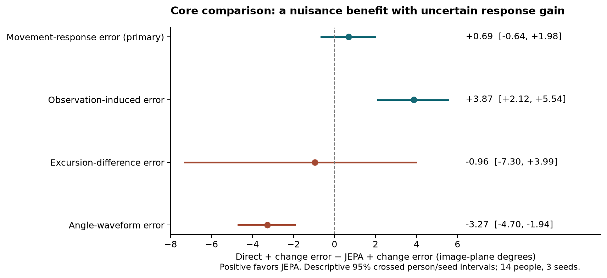
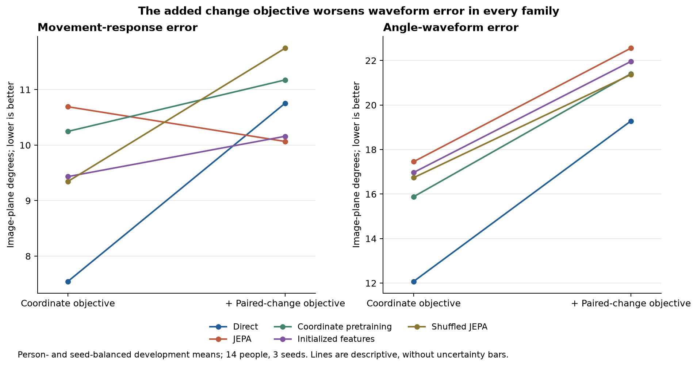

The completed Gait Fidelity core provides evidence that restoration can improve projected movement measurements under the tested synthetic conditions. It does **not establish an advantage for the tested JEPA procedure**. Direct coordinate training without the added paired-change objective has the lowest average error on every metric in the supplied person-level table. JEPA with paired-change training reduces sensitivity to observation changes relative to direct training with that same objective, but its movement-response advantage is uncertain and its coordinate and angular-waveform errors are worse. These findings identify a useful method and a training tradeoff while leaving the proposed pretraining mechanism unresolved.

This analysis was prepared on 24 September 2026 from the six files supplied in [`outputs/gait-fidelity`](../../../../../outputs/gait-fidelity). The saved configuration identifies `walking-core-01`. The [current study proposal](../../README.md) instead describes the later `jepa-response-01` experiment, whose delta-JEPA, endpoint-JEPA and coordinate-delta results are absent from this export. The two experiments answer different questions and must remain distinct.

**What was evaluated.** The core asks whether correcting estimated trajectories can preserve a side-specific movement change while reducing observation errors. For each leg, knee excursion is the 95th minus the 5th percentile of the image-plane hip–knee–ankle angle. Define `A = right excursion − left excursion`. Movement-response error measures the absolute discrepancy between the restored and reference changes in `A` across paired movement states. Excursion-difference error measures error in `A` at an individual state. Waveform error compares the angles over time. Observation-induced, or nuisance, error measures how the error in `A` changes when naming or occlusion changes at fixed movement and camera.

These endpoints distinguish questions that coordinate error alone cannot answer. An accurate response can coexist with inaccurate absolute measurements because shared errors at the two endpoints cancel. A model can also reduce nuisance sensitivity by reducing its sensitivity to all inputs, including useful movement. A successful study therefore needs response, nuisance, level, waveform and coordinate results together.

The source configuration uses AMASS-driven synthetic bodies and projected references, three pose estimators, two cameras, original and mirrored physical states, clear and occluded observations, and correct, global-swap and temporary-swap naming conditions. Commanded movement levels are 0°, 5°, 10° and 15°, with 15° held from training. The reference change in the projected measurement need not equal the commanded edit. Windows contain 128 samples at 25 Hz. These are engineering measurements of rendered motion; they do not establish anatomical three-dimensional knee range, disease severity, treatment response or affected-limb correctness.

The person table contains a complete `16 methods × 14 people × 3 seeds` panel, with 672 rows and nine finite metrics. Ten methods are trained neural procedures, accounting for the 30 reported fitted models; six are unchanged, filtering or calibration controls. The evaluation people comprise 12 BioMotionLab_NTroje identities and two KIT identities. The supplied artifacts do not establish the training-person, motion or window counts. Repeated renders, estimator outputs and seeds are not additional participants. The evaluator first averages variants within source windows, then windows within motions, then motions within people; methods and seeds share the same 14-person panel.

I reconstructed all 16 report rows and all four saved paired comparisons, including their person-conditional intervals, crossed person/seed intervals and per-seed effects. Reconstruction agrees to numerical precision; the report means agree at their displayed four-decimal precision. [Verification and input hashes](verification.json) record these checks. They validate consistency of the exported summaries, not reconstruction from the unavailable raw predictions or verification of upstream cohort selection.

**The declared core comparison gives a mixed result.** The saved candidate is `M-paired_jepa-graph_time-paired_change`; its comparator is `P-direct-none-paired_change`. Both include the downstream movement-change objective. Positive improvement below means direct error minus JEPA error. Intervals are the saved descriptive 95% crossed person/seed bootstrap intervals, using 2,000 draws and seed 731.

| Endpoint | JEPA + change | Direct + change | Improvement from JEPA | 95% interval |
| --- | ---: | ---: | ---: | ---: |
| Movement-response error, primary | 10.066° | 10.754° | +0.688° | [−0.640°, +1.977°] |
| Observation-induced error | 12.760° | 16.626° | +3.866° | [+2.117°, +5.538°] |
| Excursion-difference error | 16.198° | 15.238° | −0.960° | [−7.304°, +3.992°] |
| Angle-waveform error | 22.553° | 19.281° | −3.272° | [−4.699°, −1.944°] |

The primary estimate is a 6.4% response-error reduction, but the interval admits both modest harm and improvement. Its seed-specific improvements are +0.408°, +0.147° and +1.510°. Nine of 14 people improve after averaging seeds; five worsen. The leave-one-person-out mean remains positive, ranging from +0.391° to +0.808°, so no single person creates the positive point estimate. Nevertheless, person and training variability leave its magnitude poorly resolved. Neither superiority nor equivalence is established, and no useful-effect margin was specified.

The nuisance advantage is more consistent: all three seed averages and all 14 person averages favor JEPA. Conversely, all three seed averages and all 14 person averages have worse waveform error with JEPA. The person table also shows worse visible-coordinate, all-reference-coordinate and displacement errors for every person after averaging seeds. Mean visible normalized location error is 0.06838 for JEPA versus 0.04753 for direct + change, approximately 44% higher. All-reference coordinate error is 0.06998 versus 0.05179, and 0.2-second displacement error is 0.03803 versus 0.03157. These normalized errors have no degree units.

An additional exploratory contrast finds 3.554° lower movement-by-nuisance interaction error with JEPA, with interval [0.667°, 6.398°]. This is compatible with observation conditions disturbing its response less, but it does not establish a correct response or trajectory. The inference supported here is a tradeoff between observation sensitivity and reconstruction accuracy under these training procedures. General gait-fidelity superiority is not supported.

**The strongest practical result is direct coordinate training without the additional change loss.** The following table places the declared comparison alongside the relevant baselines. Lower values are better throughout.

| Method | Movement response | Observation-induced | Excursion difference | Angle waveform | Visible coordinate NLE |
| --- | ---: | ---: | ---: | ---: | ---: |
| Unchanged estimator output | 12.688° | 17.602° | 12.971° | 18.571° | 0.06771 |
| Direct, coordinate objective | **7.544°** | **10.493°** | **9.128°** | **12.073°** | **0.02484** |
| Coordinate pretraining, base readout | 10.247° | 11.125° | 11.134° | 15.880° | 0.04824 |
| JEPA, base readout | 10.691° | 14.167° | 11.953° | 17.453° | 0.06258 |
| Direct + change | 10.754° | 16.626° | 15.238° | 19.281° | 0.04753 |
| JEPA + change | 10.066° | 12.760° | 16.198° | 22.553° | 0.06838 |

Direct/base has the lowest mean on all nine exported metrics, including the geometric assignment diagnostic. Relative to unchanged observations, it reduces movement-response error by 40.5%, nuisance error by 40.4%, excursion-difference error by 29.6%, waveform error by 35.0% and visible-coordinate error by 63.3%. Its exploratory response improvement is 5.144° [2.152°, 8.651°]. Response improves for ten of 14 people and nuisance error for 13; an average benefit is not an individual guarantee.

Direct/base also outperforms JEPA/change in response by 2.522° [0.945°, 4.364°], nuisance error by 2.267° [0.859°, 3.990°], and waveform error by 10.480° [9.451°, 11.794°]. These newly computed intervals are descriptive, selected after inspecting the development results, and unadjusted for multiple comparisons. They do not replace the declared primary contrast. They do show why the paper must retain the strongest observed baseline when discussing practical utility.

This result gives a bounded positive answer to the broad research question: learned restoration can improve the measured synthetic response and suppress observation error simultaneously. It does not show complete preservation, clinical acceptability or that coordinate improvement guarantees fidelity in other settings. Direct and frozen-readout models also differ in how much of the encoder remains trainable. Both have 4,000 nominal total updates, but matching update counts does not equalize learning opportunity or measured compute.

**Adding the paired-change objective is the main intervention to investigate.** Within each method family, the following differences are `paired_change − base`, so positive values indicate deterioration.

| Model family | Change in response error | Change in nuisance error | Change in excursion-difference error | Change in waveform error |
| --- | ---: | ---: | ---: | ---: |
| Direct | +3.210° | +6.133° | +6.110° | +7.208° |
| Coordinate pretraining | +0.927° | +1.319° | +3.072° | +5.525° |
| Paired JEPA | −0.625° | −1.407° | +4.245° | +5.100° |
| Initialized encoder | +0.726° | +0.393° | +2.404° | +4.988° |
| Shuffled-reference JEPA | +2.401° | +1.419° | +0.947° | +4.632° |

Waveform error worsens in every family, and every family's person-averaged waveform deterioration is positive for all 14 people. Four families also worsen in mean response error. JEPA's 0.625° response improvement has interval [−0.767°, +2.200°] when expressed as base minus paired error; it remains uncertain. Direct training's response deterioration is 3.210° [1.382°, 4.994°]. Its coordinate, nuisance and waveform errors deteriorate as well.

The added objective changes JEPA's relative response performance against direct from 3.147° worse to 0.688° better. That 3.835° shift consists arithmetically of a 3.210° deterioration in direct training and a 0.625° improvement in JEPA. About 84% of the shift is therefore associated with the direct method's deterioration. This is a decomposition of the observed means, not proof of an optimization mechanism. A positive factorial interaction cannot by itself justify preferring the final JEPA model.

The implementation makes several explanations worth examining. The movement term supervises a scalar difference, allowing common endpoint errors to cancel. Its percentile gradients reach few time samples, and its coefficient must interact with the coordinate objective and short-segment penalty. Training support is pairwise, whereas evaluation uses common reference support across a complete source family. Generalization, objective balance, support mismatch and prediction failures could all contribute. The summaries cannot identify which explanation caused the deterioration. Optimization traces, signed errors, actual response curves and predictions are needed before claiming a root cause.

**The representation controls do not establish a JEPA-specific benefit.** Among the matched `paired_change` frozen-readout controls, JEPA's response advantage is 0.093° over initialized features [−1.394°, +1.393°], 1.680° over shuffled-reference JEPA [−1.094°, +4.733°], and 1.108° over coordinate pretraining [−0.654°, +2.997°]. Each interval crosses zero. With the base readout, JEPA's mean response error is worse than all three controls: 10.691° versus 9.433°, 9.345° and 10.247°, respectively.

The initialized control still has a trained readout and a coordinate residual path, so its performance should not be interpreted as prediction by a completely untrained model. It does show that similar downstream performance can arise without JEPA pretraining. These observations leave useful information in the frozen encoder unproven; they do not prove representation collapse or that all JEPA formulations fail. The local result set also contains no time-block, uniform-token or shuffled-topology comparison, so it cannot establish an advantage from anatomical graph-time masking.

The separation of level and response error is especially visible at seed 29. JEPA/change has excursion-difference error 23.770°, compared with 11.950° and 12.874° at seeds 17 and 43, while its response errors are 9.901°, 10.807° and 9.491°, respectively. Shared bias cancellation is one possible explanation, but signed endpoint errors are unavailable. The crossed interval for the level comparison appropriately widens to [−7.304°, +3.992°]; averaging seeds without reporting this variation would conceal substantial instability.

**Coverage supports comparison but leaves an important decomposition unresolved.** Each method/seed has 55,800 reference-eligible records. Thus there is no angular reference exclusion within the exported development panel. Earlier exclusions during preparation are outside this denominator, and reference eligibility says nothing about motion representativeness. Pooled prediction success rates are 99.747% for direct/base, 99.567% for JEPA/change, 99.404% for direct/change and 99.258% for unchanged observations. These are record-weighted rates across method-specific seed evaluations, not person-balanced response-pair rates. The deterministic controls repeat identical predictions across seed rows.

Failures receive 360° for excursion-difference error, 720° for response or nuisance error, and 180° for waveform error. A 0.1-percentage-point failed-contrast fraction contributes 0.72° to an equally weighted response mean through the penalty term alone. That scale is comparable to the 0.688° primary advantage. Consequently, a high success percentage does not demonstrate that failures are irrelevant. JEPA/change has fewer failed records than direct/change, but the export cannot distinguish a benefit from fewer failed contrasts from a benefit in accuracy among successful contrasts. Both matter; they support different explanations. Global record rates cannot be subtracted from person-balanced contrast means to recover this decomposition.

The geometric assignment failure rate is also consequential: 49.7% for JEPA/change, 39.4% for direct/change and 21.0% for direct/base. This score combines geometrically wrong, ambiguous and missing lower-limb assignments over reference-resolvable pairs. Its denominator is different from window-level angular success. Thus a model can almost always output measurable angles while frequently failing the geometric side-assignment diagnostic. The values are not patient-level affected-side error rates, nor do they establish anatomical identity without an independent anchor.

The export omits `responses.csv`, `nuisance.csv`, `interaction.csv`, `per-window.csv`, per-family and condition tables, person-level coverage, prepared references, predictions and cohort/fit receipts. It therefore cannot establish response slope, attenuation versus amplification, sign reversal, no-change behavior, held-15° generalization, camera/estimator-specific performance, dependence on global versus temporary swaps, or the source of failed measurements. The saved prediction hashes identify expected artifacts but cannot verify absent files. All claims here concern the supplied aggregate evidence.

There are only three fitted seeds and 14 development people, concentrated in two collections. No independent confirmation or clinical validation is reported, and `meaningful_margin_deg` is null. The saved `scientific_gate: insufficient_evidence` reflects the development scope; the current evaluator writes that status without computing a formal acceptance test. Execution completion should therefore not be interpreted as scientific acceptance or rejection.

**How this informs the active follow-up.** The core motivates testing whether response information should be learned before freezing the encoder. It does not answer the current question of whether coupling latent residuals across movement states helps beyond independent endpoint supervision. That requires the absent delta-JEPA versus endpoint-JEPA results, with coordinate-delta as a control. A lower delta loss or a gain against plain JEPA would be insufficient to identify the proposed mechanism.

For the next analysis, the priorities are:

1. Recover the core's detailed exports and receipts, then reconstruct the hierarchy from predictions. Decompose each angular score into the contribution from failed contrasts and error on successful contrasts, with person-balanced denominators. Retain the declared all-attempted scores as primary.
2. Plot predicted against actual reference changes, separating camera, estimator, naming, occlusion and held intervention. Include a zero-response baseline, no-change controls, signed response bias and direction accuracy. A low absolute response error cannot alone establish movement sensitivity when the distribution of reference changes is unknown.
3. Examine why the fixed paired-change objective damages direct and coordinate methods. Inspect component loss and gradient scales, short-segment failures, support differences, seed-29 signed errors and a metadata-selected set of trajectories. Any coefficient or objective revision requires its own development comparison; changing the completed core would erase the comparison that made this issue visible.
4. Analyze delta JEPA against endpoint JEPA under the frozen follow-up protocol. Use encoder, predictor and teacher probes to distinguish accessible movement information from pretext fit, and keep direct/base visible as the practical reference. An improvement confined to the supervised scalar or accompanied by waveform deterioration should be reported as such. Then freeze a selected procedure and meaningful margins before using new people or independent real references for confirmation.

A defensible statement for the study is: “In a 14-person synthetic development evaluation, direct coordinate restoration reduced projected movement-response and observation-induced errors relative to estimated poses. The tested JEPA procedure with paired-change supervision reduced observation sensitivity relative to a direct model receiving the same supervision, but did not establish a movement-response advantage and produced worse trajectory fidelity. Adding paired-change supervision degraded several measures across model families, motivating a controlled investigation of training objectives and the information available in frozen representations.”

The [analysis script](analyze.py) reproduces the calculations with `.venv/bin/python docs/studies/gait-fidelity/results/core-analysis-20260924/analyze.py`. [Method means](method-means.csv), [seed means](seed-means.csv), [paired contrasts](paired-contrasts.csv), [person effects](person-effects.csv), [objective interactions](objective-interaction.csv), [coverage](coverage-by-seed.csv) and [source means](source-means.csv) retain the numerical detail. All new contrasts are exploratory; this analysis leaves the original result files and active protocol unchanged.
