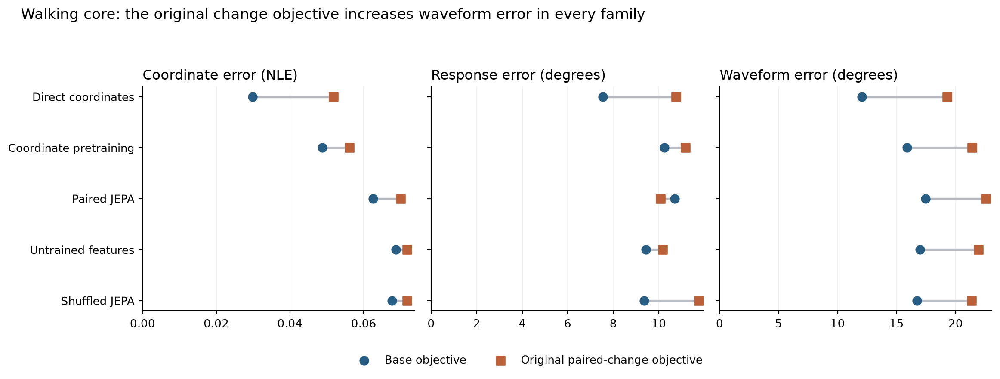
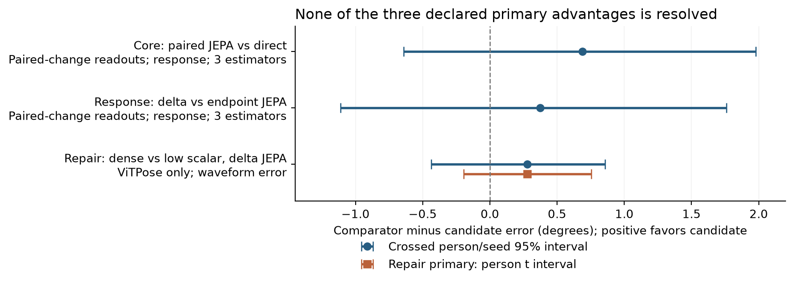
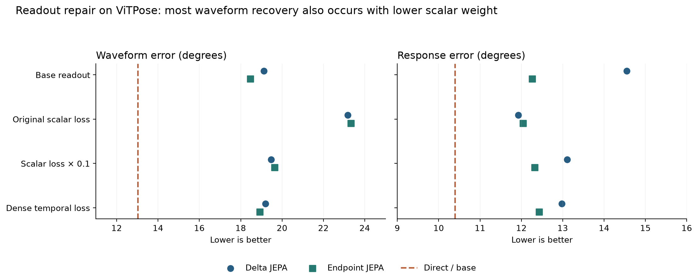
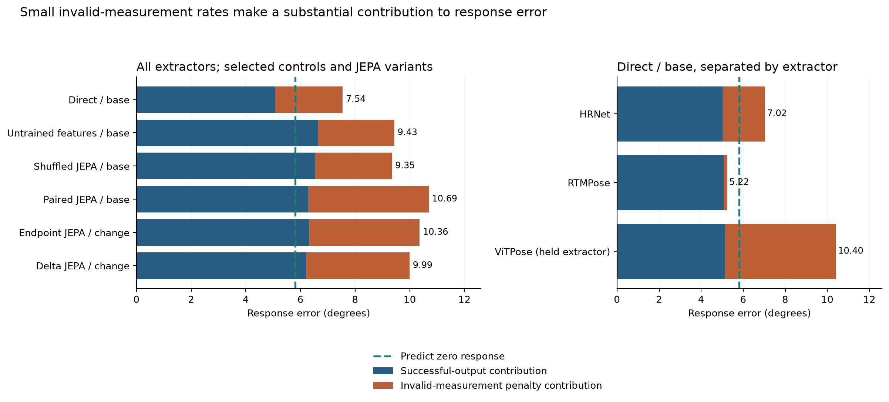
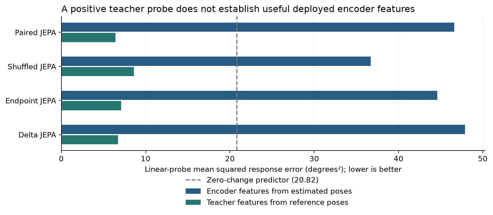

# What the completed gait-fidelity experiments establish

Analysis of the HAIC evidence downloaded on 25 September 2026. The accompanying [reader version](index.html) contains the same text and figures. All 69 transferred files passed their recorded SHA-256 checks, and the published primary effects and intervals were independently reconstructed from the person-level tables. This analysis concerns the completed walking core, JEPA response, and readout repair experiments.

The results give a qualified answer to the study's central question: **does learning to predict reference-pose features help a restoration model preserve meaningful movement changes beyond training directly on joint coordinates?** Under the procedures evaluated here, direct coordinate training provides the strongest practical reference. JEPA does not establish the intended response advantage, including after feature-difference pretraining and readout repair. The experiments do, however, reveal a repeatable problem with the original downstream change objective: its addition worsens knee-angle trajectories across every core model family, and much of that deterioration can be recovered by reducing its weight.

This is useful evidence about how to evaluate and train pose restoration. It shows why a model's coordinate error, its error in a particular movement measurement, and the reliability of that measurement need to be examined together. The small response gains of the tested JEPA variants are uncertain, and a substantial part of their mean advantage comes from differences in penalized measurement failures. A paper can develop that measurement argument while keeping the empirical claim tied to these synthetic walking conditions and this representation–readout pipeline.

Recorded AMASS motions drive a three-dimensional body model that is rendered into video. Fixed pose estimators, which locate body joints in images, produce the observed two-dimensional trajectories. Body-model joints projected into those same images supply the reference. This gives the experiment a known geometric target even when a joint is hidden from the estimator.

The study measures a specific change rather than gait quality in general. Each frame supplies two **image-plane knee angles**, formed by the projected hip, knee, and ankle. For each leg, its excursion is the 95th-percentile angle minus the 5th-percentile angle over a walking window. The measurement `A` is right-leg excursion minus left-leg excursion. Its response, `ΔA`, is the difference between two complete versions of the same motion: the original and a version with an edited knee-flexion parameter. These pairs are whole movement states, not neighboring video frames. A 10° body-model edit need not create a 10° change in projected `A`; the evaluator uses the projected reference change for that particular motion and view. The scalar measurement compresses the trajectory considerably—two angle sequences can have the same excursion while differing at many frames. [Measurement protocol][measurement]

The main quantities used below have different meanings:

| Quantity | What it measures | How to read it |
|---|---|---|
| Response error | Absolute difference between restored and reference `ΔA` | Lower is better; reported in degrees, including the declared failure penalty |
| Waveform error | Mean absolute error in the two knee-angle trajectories over reference-supported frames | Lower is better; retains information about the trajectory that the single excursion summary discards |
| Coordinate NLE | Joint-position error divided by the renderer's person-box diagonal | Lower is better; dimensionless. For example, 0.03 means an error averaging 3% of that scale, not three degrees |
| Nuisance error | Error in the measurement change induced by observation or naming corruption at fixed movement | Lower is better; assesses sensitivity to how a movement is observed |
| Direction accuracy | Fraction of reference-resolvable changes whose sign is predicted correctly | Higher is better; only reference changes with absolute magnitude above 1° enter this denominator, and failed predictions count as incorrect |

Coordinate NLE below uses all valid synthetic joints, including joints hidden in the rendered image. The “waveform” is simply the angle plotted against time; it is not an additional learned representation. Reference support is determined before looking at any method's predictions. [Coordinate and angular definitions][evaluation-code]

**The evidence population.** The completed training receipts contain 112 training people, 692 raw motions, and 1,645 source windows. Evaluation uses 14 different people across 155 windows. Twelve development people come from BioMotionLab_NTroje and two from KIT. The same development people and retained predictions are reused in all three stages; their counts cannot be added across experiments. Three random seeds repeat model fitting with different random choices, but do not turn 14 participants into 42. [Core ledger][core-ledger]; [repair population summary][repair-summary]

| Stage | New work completed | What the comparison asks |
|---|---|---|
| Walking core | 9 pretraining runs and 30 final neural fits, including 24 frozen-encoder readouts and 6 direct fits | Do reference-feature prediction and paired-change supervision improve restoration and movement measurement? |
| JEPA response | 9 new pretraining runs and 18 new readouts; the core neural predictions are retained | Does explicitly learning feature differences between movement states help beyond learning each endpoint? |
| Readout repair | 6 training-only calibrations and 12 new readouts; 15 previous fits are retained | Does dense angular-change supervision improve waveform accuracy beyond a lower-weight scalar change loss? |

Each source window has 128 frames sampled at 25 Hz, about 5.1 seconds. The 55,800 development records expand 155 windows across physical orientation, camera, pose estimator, naming corruption, observation condition, and movement-state records. In particular, `55,800 = 155 × 2 × 2 × 3 × 3 × 2 × 5`; the five state records include a duplicate baseline used for the no-change diagnostic. These are useful controlled observations, but they remain repeated observations of 14 people. Training excludes the ViTPose estimator and the 15° intervention, which are included in development evaluation. [Frozen core configuration][core-config]; [population audit](adversarial-review.md)

Reported means first average conditions within windows, windows within raw motions, and motions within people; the final summaries give equal weight to people and fitted seeds. This keeps people with many windows from dominating the results. Six deterministic core baselines have repeated seed rows for paired bookkeeping, with identical scores across those rows. All comparisons here use the published hierarchy rather than treating each record as an independent sample.

**Walking core.** Direct coordinate training improves the observations on all three main measures in Table 1. Relative to leaving estimated poses unchanged, its mean response error falls from 12.69° to 7.54°, waveform error from 18.57° to 12.07°, and coordinate NLE from 0.0718 to 0.0298. These are reductions of approximately 41%, 35%, and 58%, respectively. Every person's seed-averaged waveform and coordinate error improves; response error improves for 10 of the 14 people. Newly computed exploratory crossed-bootstrap intervals for the response and waveform improvements are [2.15°, 8.65°] and [5.55°, 7.64°]. These comparisons are descriptive and unadjusted for the many comparisons available in the study. [Core person data][core-person]; [recomputed comparisons](exploratory-comparisons.json)

*Table 1. Selected core methods with the base coordinate objective. Means pool the three estimators and weight people and fitted seeds equally. The full 16-method table, including both objectives and all deterministic baselines, is available in the [core means](walking-core-method-means.csv).*

| Method | Coordinate NLE | Response error, ° | Waveform error, ° |
|---|---:|---:|---:|
| Unchanged estimated poses | 0.0718 | 12.69 | 18.57 |
| Training-fitted joint offsets | 0.0709 | 9.95 | 17.37 |
| Training-fitted joint affine corrections | 0.0691 | 11.39 | 16.75 |
| Temporal filtering (`filter2`) | 0.0707 | 10.74 | 17.66 |
| Untrained frozen features | 0.0687 | 9.43 | 16.97 |
| Shuffled-reference JEPA | 0.0676 | 9.35 | 16.74 |
| Coordinate-pretrained frozen features | 0.0487 | 10.25 | 15.88 |
| Paired JEPA frozen features | 0.0626 | 10.69 | 17.45 |
| Direct coordinate training | **0.0298** | **7.54** | **12.07** |

JEPA, short for **joint-embedding predictive architecture**, trains an encoder to represent an observed pose sequence and a predictor to match features computed from the reference sequence by a slowly updated teacher. Features are the numerical vectors produced by the encoder. A **readout** is the output network that converts those features into corrected coordinates. Here the encoder is fixed during readout training. The untrained-feature control tests whether the architecture and readout can succeed without learned features, while shuffled-reference JEPA breaks the intended correspondence between observed and reference motion windows during pretraining. Their competitive response scores make an explanation based solely on learning the correct reference correspondence difficult to sustain.

The original paired-change objective creates a stronger and more consistent pattern than the choice among these frozen representations. It adds a penalty for error in the scalar response, together with a short-segment geometry term. Waveform error increases in all five model families, for every participant's seed-averaged score and every seed's population average. The increases range from 4.63° for shuffled JEPA to 7.21° for direct training. Coordinate error also rises in every family. Ordinary paired JEPA gains 0.63° in mean response accuracy while losing 5.10° in waveform accuracy, illustrating that a better scalar measurement can accompany a substantially worse trajectory.

*Figure 1. Each connector joins the two objectives for one model family; all panels show descriptive means over the same 14 people and three fitted seeds. Smaller values are better. The original change objective includes the scalar angular term and a geometry penalty, so this comparison initially identifies a problem with that objective package. The repair experiment subsequently separates scalar weighting from the dense alternative.*

The core's declared primary comparison was paired JEPA against direct training **with the paired-change objective in both arms**, rather than against the better-performing direct/base model. Its estimated response benefit is 0.69°, with an interval that includes both harm and benefit. This distinction matters when describing the result: a favorable mean against direct/change does not establish an improvement over the strongest practical reference, direct/base. [Core primary comparisons][core-comparisons]

**The response follow-up.** This stage changes what the representation is asked to predict. Both variants retain the original feature-prediction loss. Endpoint JEPA adds a continuous prediction error at each movement state; delta JEPA instead adds an error in the predicted feature difference relative to the teacher's feature difference across states. A coordinate-delta control provides an analogous coordinate-space objective. Each representation receives both a base readout and the original paired-change readout, so the effect of representation training can be examined alongside the downstream objective. [Response protocol][response-protocol]

With paired-change readouts, delta JEPA obtains response error of 9.99°, compared with 10.36° for endpoint JEPA. The estimated improvement is only 0.37°, and the crossed person/seed interval is [−1.11°, 1.76°]. The three seed-specific improvements are +0.75°, −0.15°, and +0.52°. Delta JEPA is also close to ordinary paired JEPA at 10.07° and initialized features at 10.16°, while direct/base retains its lower 7.54° error. The coordinate-delta control gives 14.52° with paired-change supervision and 10.18° with its base readout, showing that explicitly training differences does not by itself deliver better downstream responses in this setup. [Response means](jepa-response-method-means.csv); [declared comparisons][response-comparisons]

*Table 2. The three declared primary comparisons. “Improvement” is comparator error minus candidate error, so positive values favor the candidate. These rows answer different questions and must not be combined into one pooled effect.*

| Stage and contrast | Primary outcome and population | Improvement, ° | 95% interval, ° |
|---|---|---:|---|
| Core: paired JEPA vs direct, both paired-change | Response; all three estimators | +0.69 | [−0.64, 1.98], crossed bootstrap |
| Response: delta vs endpoint JEPA, both paired-change | Response; all three estimators | +0.37 | [−1.11, 1.76], crossed bootstrap |
| Repair: delta dense vs delta low-scalar | Waveform; ViTPose only | +0.28 | [−0.19, 0.75], person t interval |

A **crossed bootstrap** repeatedly resamples people and fitted seeds as two separate factors, preserving the pairing between methods. This gives a descriptive estimate of uncertainty from the limited people and runs available. The repair's primary **person t interval** instead averages the three paired seed differences for each person and estimates uncertainty over those 14 person averages. It is conditional on those fitted models. Its additional crossed-bootstrap interval is [−0.44°, 0.86°], reaching the same qualitative conclusion. All three primary intervals span zero. They do not establish equivalence, and there is no declared clinically meaningful margin against which to judge these differences.

*Figure 2. Primary comparisons remain uncertain. Blue intervals resample people and seeds; the orange interval is the repair's declared person-level analysis. The repair changes both the primary metric and the extractor population, which are labeled explicitly. These stages reuse development participants and are not independent replications.*

**Readout repair.** The repair tests an explanation suggested by the core: the scalar change penalty may exert too much influence on coordinate learning and may supervise too few parts of the trajectory. It freezes the fitted delta and endpoint encoders and trains new heads. One arm reduces the scalar coefficient from 1 to 0.1. The other penalizes the angular-response error at every supported time and leg, using a calibrated coefficient. Both retain the same coordinate term and short-segment geometry penalty. “Dense” therefore means supervision distributed over framewise angular changes, rather than supervision through one excursion-difference number.

The primary evaluation uses ViTPose, the estimator excluded from restoration training. On this population, delta JEPA's waveform error falls from 23.17° under the original scalar objective to 19.47° with the smaller scalar weight and 19.19° with dense supervision. The low-weight control accounts for about 93% of the dense arm's mean improvement relative to the original scalar objective. That fraction is a descriptive comparison of mean gains, not a causal attribution. The additional dense-versus-low-weight benefit is 0.28°, with the uncertainty shown above. Ten people favor dense supervision on waveform error, but one of the three seed averages favors the low-weight scalar control. [Repair extractor means](repair-extractor-means.csv); [repair comparisons][repair-comparisons]

*Table 3. Readout repair on ViTPose. These means must be compared within this table rather than against the pooled three-estimator means in Table 1.*

| Representation and readout | Waveform error, ° | Response error, ° | Coordinate NLE |
|---|---:|---:|---:|
| Delta JEPA, base | 19.13 | 14.55 | 0.0652 |
| Delta JEPA, original scalar | 23.17 | 11.93 | 0.0718 |
| Delta JEPA, low scalar | 19.47 | 13.11 | 0.0670 |
| Delta JEPA, dense | 19.19 | 12.98 | 0.0669 |
| Endpoint JEPA, base | 18.47 | 12.26 | 0.0657 |
| Endpoint JEPA, original scalar | 23.33 | 12.04 | 0.0724 |
| Endpoint JEPA, low scalar | 19.64 | 12.32 | 0.0674 |
| Endpoint JEPA, dense | 18.92 | 12.42 | 0.0671 |
| Direct coordinate training, base | **13.02** | **10.40** | **0.0315** |

Endpoint JEPA supplies a more favorable secondary result: dense supervision improves waveform error by 0.72° over its low-weight scalar control, with a person interval of [0.39°, 1.05°]. This is worth reporting, with its status as a secondary, unadjusted development comparison intact. It cannot replace the delta primary after seeing the results. Neither encoder's repair demonstrates that response accuracy is preserved: the delta primary's response improvement is 0.13°, with interval [−2.69°, 2.94°], and the endpoint comparison is similarly uncertain. Both dense arms remain roughly six degrees worse than direct/base in waveform accuracy.

*Figure 3. Lowering the scalar weight recovers most of the trajectory deterioration, while dense supervision has a smaller additional effect. The two new repair arms share initialization, sampling, coordinate supervision, geometry penalty, optimizer, and update count. Original scalar also contains the geometry penalty; base does not. Consequently, the base and direct lines are practical references, whereas dense versus low scalar is the matched primary contrast.*

The training-only calibrations make a weighting explanation plausible. At initialization, the unweighted scalar term's gradient magnitude is 8.40–12.01 times the coordinate term's across the six encoder/seed combinations. A gradient describes how small changes in model parameters would change the loss; the optimizer uses that information to adjust the parameters. Its root-mean-square magnitude summarizes the gradient's size across parameters and calibration batches. Multiplication by 0.1 brings the scalar contribution close to the coordinate term. Only 2.01–2.09% of eligible angle entries receive nonzero scalar gradients at that point, compared with 27.99–29.68% under dense supervision. These are angle-entry support fractions, not the fraction of training examples used. [Calibration data](readout-calibration.csv)

The results favor examining excessive scalar weighting before attributing the original trajectory damage to a lack of temporal supervision. The original and low-weight scalar arms retain the same geometry term, so their difference is informative about angular weighting. Nevertheless, the dense comparison changes both where gradients occur and what temporal information the loss contains. Initial gradient matching cannot show that updates stay matched throughout training, and these experiments do not isolate percentile-gradient sparsity as the unique cause.

**Why the response score needs its failure decomposition.** An angular measurement can fail even when the network returns coordinates. The evaluator requires usable hip–knee and knee–ankle segments on every fixed reference-supported frame; a nonfinite coordinate or a segment shorter than two pixels can invalidate the window. Failed eligible waveforms receive 180°, and failed movement contrasts receive 720°. These values are bounded scoring costs, not observed anatomical errors. One failed endpoint can affect several paired comparisons. [Angular evaluator][evaluation-code]

The exported person tables allow the total response score to be written as a successful-output contribution plus a failure-penalty contribution. The two terms use identical aggregation weights and add back to the published score. A successful-output contribution gives zero contribution to failed cases; it is different from the conditional mean error computed after excluding them.

*Table 4. Pooled response scores and their additive decomposition. The last row is a measurement-only baseline that always predicts `ΔA = 0`; it does not restore coordinates.*

| Method | Successful-output contribution, ° | Failure contribution, ° | Total error, ° |
|---|---:|---:|---:|
| Direct/base | 5.069 | 2.475 | 7.544 |
| Delta JEPA / paired-change | 6.210 | 3.778 | 9.988 |
| Endpoint JEPA / paired-change | 6.306 | 4.055 | 10.361 |
| Always predict zero response | 5.811 | 0 | 5.811 |

Approximately 0.277° of delta JEPA's 0.373° mean advantage over endpoint JEPA comes from the failure term, leaving 0.096° in the successful-output contribution. Thus about 74% of the observed mean gain concerns fewer penalized failures. The corresponding failure-rate difference is only about 0.038 percentage points under the 720° scoring rule. This arithmetic explains the result's sensitivity without turning the uncertain overall comparison into evidence of a reliable gain.

The zero-response predictor has a lower pooled error than any of the 16 neural methods in the response report. That is an important benchmark for the measurement claim: improving over noisy input alone does not establish useful sensitivity under the declared aggregate score. At the same time, the pooled score conceals an informative extractor difference. Direct/base obtains 5.22° on RTMPose, below the 5.81° zero-response baseline, with only 0.16° from penalties. Its HRNet and ViTPose totals rise to 7.02° and 10.40°, with penalty contributions of 2.00° and 5.27°. Successful-output contributions remain near five degrees across all three estimators.

*Figure 4. Orange segments show the declared cost of invalid measurements, and blue segments show error contributions from usable predictions. The dashed line is the zero-response benchmark on the same reference population. All bars include failures. Blue segments alone assign zero error to failed cases and therefore are not complete method scores. Comparing them with the zero-response benchmark would ignore the declared cost of failures.*

Direct/base has a person-balanced direction accuracy of 66.1%, compared with 48.4% for delta JEPA/change, among reference-resolvable changes. Together with its RTMPose result, this indicates useful response information despite the disappointing pooled absolute score. Values around 50% for JEPA should be reported as observed accuracies, without asserting a chance baseline that has not been established from the reference-sign distribution. The joint interpretation is that measurement reliability and magnitude accuracy both limit the result; the tables do not identify every failure's underlying cause.

Separating clear from occluded observations further localizes the difficulty. Direct/base has a 3.90° response error on clear observations, below the 5.81° zero-response benchmark. Under occlusion it rises to 11.19°, with 4.95° from invalid-measurement penalties and 6.24° from successful-output error contributions. The successful-output contribution therefore increases as well as the failure term; it is not a comparison restricted to the same successfully predicted cases. For delta JEPA/change, most of the clear-to-occluded increase is in the failure term, which rises from zero to 7.56°. All endpoint records in the exported coverage tables are reference-eligible, so these particular differences do not come from methods being scored on different reference-eligible populations.

*Table 5. Descriptive condition-specific response errors, in degrees. Clear means no added occlusion; both columns still pool naming corruptions, cameras, and estimators. Clear and occluded columns average all three nonzero intervention levels; the 15° column averages both observation conditions. These are overlapping views of the same development population, not additional samples. [Observation strata](response-by-observation.csv); [intervention strata](response-by-held_intervention.csv).*

| Method | Clear observations | Occluded observations | Held 15° intervention |
|---|---:|---:|---:|
| Direct/base | 3.90 | 11.19 | 10.31 |
| Delta JEPA / paired-change | 6.10 | 13.88 | 13.55 |
| Endpoint JEPA / paired-change | 6.35 | 14.38 | 13.89 |
| Zero response | 5.81 | 5.81 | 9.23 |

The ordering does not reverse at the larger, held intervention. Its higher absolute errors should nevertheless be interpreted with the reference scale in view: the zero-response error itself rises from 4.10° for the 5° and 10° edits to 9.23° at 15°. Larger errors at that level alone cannot distinguish weaker extrapolation from a larger response to reconstruct. These strata retain the original level weighting. The exported nonheld response stratum contains two levels and the held stratum one, so simply averaging the two would change the scientific question and fail to reproduce the published means.

**What the feature diagnostics contribute.** A linear probe fits a simple weighted combination of frozen features to predict the reference response. It asks whether that response is readily recoverable by that particular decoder. Here the probe uses three person-separated fitting folds over 333 pairs drawn from 112 training people. Those people were available during encoder training, so they are held out only from each probe fit. The probe analysis is a training-population feasibility check, not another evaluation on independent people.

The diagnostic summary's `positive_training_person_probe` label needs care: it is driven by the masked teacher branch, which receives reference poses. Across seeds, the deployed encoder's probe errors are worse than the zero-change baseline for every exported representation. For delta JEPA the encoder probe has mean squared error of 47.87 deg², compared with 20.82 deg² for predicting zero. Its teacher probe, supplied with reference poses, reaches 6.71 deg². Endpoint JEPA and ordinary paired JEPA show similar gaps, and the shuffled-reference control also yields favorable teacher probes. Mean squared error averages squared deviations, which is why these units are squared degrees and cannot be compared numerically with the absolute-error tables above. [Detailed diagnostic extracts](diagnostic-probes.csv)

*Figure 5. Person-balanced probe MSE averaged across three seeds on the training-person diagnostic panel. Encoder features use estimated poses; teacher features use reference poses. The plotted teacher statistics are the deployment-condition teacher probes, while the exported positive-status flag is computed from the masked teacher probe. Both must be distinguished from the encoder used for restoration.*

This feature evidence limits the claim that useful response information was successfully learned and merely required a repaired coordinate readout. It also leaves several explanations open. The fixed probe uses 36,864 feature coordinates arranged into one vector, 333 pairs, and one regularization setting, a penalty discouraging large fitted coefficients. Failure of that decoder does not establish that the features contain no response information. Feature variances are nonzero, which rules out a completely constant representation on the measured panel, but there is no effective-rank analysis to assess how many independent directions the representation retains. Partial collapse therefore remains untested.

Optimization is another relevant limit. The six new JEPA pretraining runs clipped gradients on 1,999 or 2,000 of their 2,000 updates, whereas the coordinate-delta runs clipped none. Gradient clipping rescales gradients before the optimizer update when their norm exceeds a threshold. This documents substantially different optimization regimes; without another controlled experiment it does not explain the performance difference. JEPA also uses 2,000 pretraining updates followed by 2,000 frozen-readout updates, while the direct model receives 4,000 coordinate updates that train the encoder and output network together. Total update counts match, but the trainable parameters and coordinate-supervised updates do not. The conclusions concern this schedule and a 10,280-parameter readout with a residual connection, which adds predicted corrections to the incoming observed coordinates. The compact packet does not contain learning curves establishing convergence. [Core and response ledgers][response-ledger]; [repair ledger][repair-ledger]

Taken together, the results support a paper about **the conditions under which pose restoration preserves a defined movement measurement**, with JEPA as the tested representation-learning hypothesis. There is positive evidence that direct restoration improves the source estimates and strong descriptive evidence that the original scalar objective damages trajectories across the tested families. Reducing the angular-loss weight recovers much of that damage, while the intended dense-supervision advantage remains uncertain. The response and feature diagnostics provide a useful account of why a small aggregate gain, a favorable teacher probe, or a lower coordinate error is insufficient on its own to establish reliable movement measurement.

The scope of that contribution should remain visible. Fourteen development people, concentrated in two source datasets, support clear comparisons for large effects but leave modest advantages uncertain. Repeatedly adapting experiments after inspecting this same cohort adds development information without supplying independent confirmation. The protected-person confirmation is absent, and the packet contains no GAVD evaluation or clinical validation. Image-plane knee angles and synthetic kinematic edits cannot establish anatomical joint range, treatment effects, or natural-video robustness. These experiments also do not evaluate future prediction or long-horizon simulation, so they support conclusions about predictive representation learning for restoration rather than world-model forecasting or planning.

For the manuscript, the defensible emphasis is the controlled separation of coordinate restoration, response preservation, and measurement reliability, followed by the matched loss-weight control that changes the interpretation of the repair. A claim of JEPA superiority would outrun the data. The next independent evaluation can test whether the large waveform effects and the failure sensitivity repeat, while any attempt to establish a small dense-versus-scalar benefit needs more independent evidence and a stated useful-effect threshold. The favorable endpoint-JEPA secondary result is a reasonable hypothesis for that future test, with its exploratory origin disclosed.

The current evidence also differs from the earlier eight-person, one-seed pilot described in the registered abstract. The manuscript should identify which results come from that pilot and which come from the present 14-person, three-seed study. Older statements about ankle-separation peaks or temporal smoothing require their own verified pilot evidence; they cannot be inferred from the current knee-response tables.

The analysis was challenged by three independent reviewers covering statistics, population/provenance, and representation mechanisms. Their substantive corrections and remaining limits are recorded in the [review note](adversarial-review.md). The underlying numerical tables and figures can be regenerated with [analyze.py](analyze.py); [verification.json](verification.json) records the exact downloaded inventory and checks. These checks verify the compact evidence and published aggregation, rather than recomputing predictions from checkpoints or raw videos. Figure sources are available as [PNG, SVG, and PDF files](figures/).

[measurement]: ../../methods/evaluation.md
[response-protocol]: ../../methods/jepa-response.md
[core-config]: ../../../../../outputs/iclr/walking-core/config.json
[core-person]: ../../../../../outputs/iclr/walking-core/evaluation/per-person.csv
[core-comparisons]: ../../../../../outputs/iclr/walking-core/evaluation/comparisons.json
[core-ledger]: ../../../../../outputs/iclr/walking-core/ledger.json
[response-comparisons]: ../../../../../outputs/iclr/jepa-response/evaluation/comparisons.json
[response-ledger]: ../../../../../outputs/iclr/jepa-response/ledger.json
[repair-comparisons]: ../../../../../outputs/iclr/readout-repair/development/evaluation/comparisons.json
[repair-summary]: ../../../../../outputs/iclr/readout-repair/development/evaluation/summary.json
[repair-ledger]: ../../../../../outputs/iclr/readout-repair/ledger.json
[evaluation-code]: ../../../../../src/gavd6_sjepa/research_directions/gait_fidelity/evaluation.py
