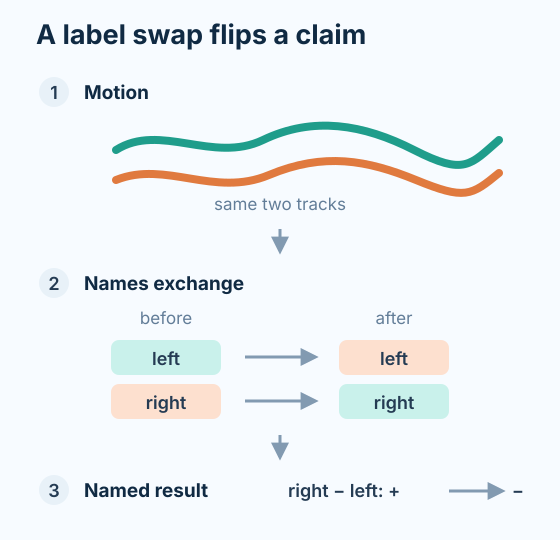
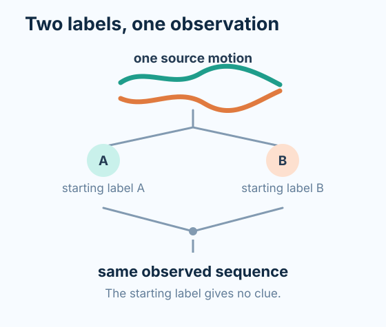
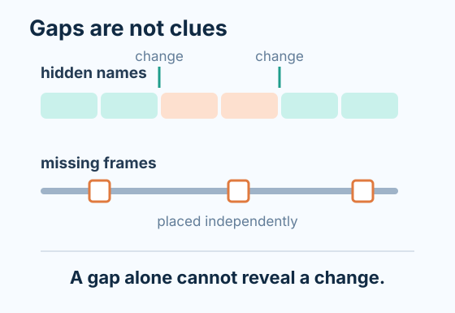

# Latent Laterality: what we have learned so far

**Study update — 31 August 2026**

> **Bottom line:** this study found a real failure mode in side-specific motion analysis and built a controlled AMASS benchmark that tests it without leaking the answer. The first seed-7 model comparison is now complete. SG-JEPA reduced the validation errors relative to a correction-first motion model, but an otherwise identical model given no useful left/right probabilities matched the improvement almost exactly. The result therefore does **not** support the proposed probability-aware mechanism. Under the study's pre-set rule, confirmation training should stop and the final test set should remain unopened.

## Research question

Video pose systems turn a moving person into a sequence of joint positions. Each row is given a name such as `left_knee` or `right_ankle`. During a leg crossing, blur, or occlusion, a tracker can continue producing plausible positions while silently exchanging the left and right names. The body did not change, but a result such as “right moves more than left” can reverse sign.

This study asks:

> When left/right names can change temporarily, can a predictive motion model recover which nearby parts of a sequence use the same naming convention, preserve side-sensitive information, and represent what remains uncertain?

The last part matters because the overall anatomical sign is sometimes impossible to recover from motion alone. If every left/right name in a sequence is exchanged, two opposite interpretations can produce exactly the same observed coordinates. Without an independent anchor—such as a verified marker, first frame, or force-plate assignment—a method can report the size of a side-to-side difference, but it cannot honestly name the anatomical side.

This is a controlled representation-learning study. It does not estimate how often real pose systems make this error, diagnose disease, or claim clinical usefulness.

## Data and benchmark

The study uses **AMASS**, a collection of three-dimensional human motion-capture recordings. Each recording was converted to a compact **Core11** skeleton: the pelvis plus five left/right joint pairs at the hip, knee, ankle, heel, and forefoot. Motion was sampled at 30 frames per second.

Preprocessing deliberately avoids named left/right joints when choosing the coordinate direction. It uses only the pelvis travel path and excludes recordings without a clear direction of motion. This prevents preprocessing from quietly supplying the answer, but it also limits the study to a selected set of travelling motions.

Of 8,854 source motions examined, 3,134 converted successfully and 3,076 were long enough for the benchmark. The identity-separated split contains:

| Split | Motions | People | Use |
| --- | ---: | ---: | --- |
| Training | 2,474 | 113 | Model fitting and calibration |
| Validation | 259 | 15 | Development decisions reported here |
| Test | 343 | 15 | Sealed; not evaluated |

The controlled error is generated once for each full sequence, before overlapping windows are made. A sequence is clean, globally relabelled, contains one temporary relabelled segment, or contains repeated changes. The benchmark also inserts short missing-data gaps independently of the label changes. It adds no general coordinate noise. Models see 64-frame windows, divided into 16 blocks of four frames, with a 32-frame stride.

The repaired benchmark pairs every source draw with a second view that has the opposite arbitrary coordinate label but exactly the same observed coordinates, missing-data pattern, and temporary-change path. This makes the arbitrary label useless as a shortcut. The pair counts as one scientific example, not two independent motions, and only one member is used as a training exposure. SG-JEPA and its uniform control create the complementary view inside the model.

## Models and evaluation

All three trained systems use a **joint-embedding predictive architecture (JEPA)**. A JEPA hides parts of a motion sequence and learns to predict their internal representations from the visible parts. In this experiment, 60% of eligible joint tokens are hidden during training. The neural models are transformer-based, use 96-dimensional features, and have matched core models with about 805,000 trainable parameters each. The full configuration allows up to 100 training epochs.

The decisive seed-7 comparison has three matched arms:

1. **Correction-first S-JEPA.** A transparent continuity model first chooses the most likely left/right naming path and corrects the sequence. A standard JEPA then learns from the corrected input.
2. **SG-JEPA.** The proposed model receives the uncorrected sequence. It separates features that should stay the same under relabelling from features that should change sign, and uses a calibrated probability over the naming path inside its masked-prediction loss.
3. **Uniform-uncertainty control.** This has the same architecture and training path as SG-JEPA, but every uncertain assignment is fixed at 50/50. It tests whether SG-JEPA benefits from the estimated path probabilities or merely from its architecture and paired representation.

The evaluation also includes simple raw-coordinate readouts, with no correction, continuity correction, and answer-key correction. A linear readout is fitted on training people and evaluated on the 15 unseen validation people, covering 1,146 overlapping windows. Errors are averaged within each person and then across people, so a person with many motions does not dominate the headline score.

Two targets are reported. The **side-sensitive** target preserves the magnitude of a left/right difference without claiming which anatomical side is larger. The **side-insensitive** target describes motion that should not change when the names are exchanged. Both use normalized mean absolute error; lower is better. No signed anatomical accuracy is reported.

## Results

### 1. The controlled naming error matters, but the first test was too easy

An exploratory swap probe showed that leaving prepared naming errors untouched produced a normalized squared-error score of 2.79, compared with 0.096 after a simple continuity correction. This established that the error can materially damage a side-sensitive calculation.

However, continuity correction tied the answer-key correction and detected every prepared boundary. The experiment had made the changes too obvious. It demonstrated the failure mechanism, but not a need for SG-JEPA. The run used a legacy model and an artificial starting reference. Its [summary](../../../outputs/swap-probe-seed7/summary.csv) and [boundary results](../../../outputs/swap-probe-seed7/validation_edge_metrics.csv) should not be read as SG-JEPA results.

### 2. The first persistent-sequence benchmark failed its fairness gate

The next benchmark applied one hidden naming path to each full sequence and required three checks to pass before model training. Missingness did not reveal the path, but the other two checks failed:

- An arbitrary coordinate label was predictable with a classification score (AUROC) of 0.680, where 0.500 is chance. Its cautious 95% upper estimate was 0.786, above the allowed 0.550.
- Continuity correction and answer-key correction both had zero side-sensitive error, leaving no meaningful room for a learned method to improve.

The benchmark correctly recorded `ready_for_sg_jepa: false`. This was a successful safeguard: it stopped a model from being rewarded for a bookkeeping shortcut or an already-solved task. The original [gate results](../../../outputs/latent-laterality/amass-benchmark-seed7/benchmark_gates.csv) and [decision record](../../../outputs/latent-laterality/amass-benchmark-seed7/gate_decision.json) preserve that failure.

### 3. The repaired benchmark passed

The repaired gate used 2,733 independent source draws from the training and validation portions of AMASS. Paired coordinate conventions produced 5,466 audit views across 128 people: 90 for fitting the continuity detector, 23 for calibration, and 15 for validation. No test person or test motion was read.

All three pre-set checks passed:

- Missing-data patterns provided no useful path clue: their relative improvement was -0.000239, below the 0.010 limit.
- The arbitrary coordinate convention was exactly unguessable: AUROC and its upper estimate were both 0.500, below the 0.550 limit.
- On sequences with temporary changes, continuity correction had side-sensitive error 0.114 while answer-key correction had error 0. The answer key therefore improved error by 100%, well above the required 5%.

The continuity rule was useful but imperfect. Among 177 validation sequences with one or more temporary changes, it recovered the complete path in 106 and made a path error in 71. Its correction made the side-sensitive result worse than no correction in 36 of the 177 sequences. This created a real opportunity for learning rather than guaranteeing a win for either method.

The gate recorded `ready_for_sg_jepa: true`. That meant the comparison was eligible to run; it did not predict that SG-JEPA would succeed. See the repaired [gate results](../../../outputs/latent-laterality/amass-benchmark-seed7-v2-chart-paired/benchmark_gates.csv), [decision record](../../../outputs/latent-laterality/amass-benchmark-seed7-v2-chart-paired/gate_decision.json), and [per-sequence results](../../../outputs/latent-laterality/amass-benchmark-seed7-v2-chart-paired/sequence_metrics.csv).

### 4. The seed-7 model comparison does not support the proposed mechanism

All three neural training arms completed and were evaluated on validation people only.

| Representation | Side-sensitive error | Side-insensitive error |
| --- | ---: | ---: |
| Raw, uncorrected | 1.6309 | 1.0820 |
| Raw, continuity-corrected | 1.5727 | 1.0221 |
| Raw, answer-key-corrected | 1.4851 | 1.0097 |
| Correction-first S-JEPA | 0.9300 | 0.7472 |
| SG-JEPA | 0.8671 | 0.6696 |
| Uniform-uncertainty control | 0.8668 | 0.6690 |

Compared with correction-first S-JEPA, SG-JEPA reduced the side-sensitive error by 6.8% and the side-insensitive error by 10.4%. Taken alone, that comparison would look encouraging.

The uniform control, however, reduced the same errors by 6.8% and 10.5%. It was fractionally better than SG-JEPA on both scores: 0.04% on the side-sensitive result and 0.08% on the side-insensitive result. SG-JEPA beat the uniform control for only 5 of 15 people on the side-sensitive score and 6 of 15 on the side-insensitive score.

This control is decisive because it differs from SG-JEPA in the proposed ingredient: informative path probabilities. The near-identical result means the gain over correction-first cannot be credited to using the estimated probabilities. It may come from the paired, relabelling-aware architecture, from training on uncorrected inputs, or from another difference between the model families; this experiment does not separate those explanations.

The full [validation summary](../../../outputs/latent-laterality/amass-gauge-v2-seed7-validation/gauge_readout_summary.csv), [window-level predictions](../../../outputs/latent-laterality/amass-gauge-v2-seed7-validation/gauge_readout_predictions.csv), [path metrics](../../../outputs/latent-laterality/amass-gauge-v2-seed7-validation/gauge_path_metrics.csv), and [evaluation contract](../../../outputs/latent-laterality/amass-gauge-v2-seed7-validation/evaluation_contract.json) record the result. The contract confirms that the test split was not evaluated.

## Interpretation and limits

The study has established that temporary left/right name changes can corrupt a side-specific motion result, that benchmark shortcuts can be detected before training, and that the repaired AMASS benchmark supports a fair and nontrivial model comparison. It has also produced a clear first model result: the proposed structured uncertainty did not add measurable value over a 50/50 control on seed-7 validation.

It has **not** established that SG-JEPA is better than simpler methods, that its path probabilities are useful, or that the small advantage of the relabelling-aware architecture over correction-first will repeat. Only one training seed and 15 validation people have been evaluated. Three people provide 73% of the validation sequences, although the headline scores reduce this imbalance by averaging over people. The corruptions exchange all five bilateral joint pairs coherently; real trackers may make partial, noisier, or shorter errors. The benchmark contains no general coordinate noise and only selected travelling AMASS motions. Its targets are coordinate-derived motion summaries, not clinical outcomes.

There is also no claim about anatomical sign. Every reported side-sensitive result is an unsigned magnitude because the benchmark intentionally supplies no global left/right anchor. GAVD and other real-video data remain a separate, unevaluated question and cannot be used to broaden this controlled AMASS result.

## Current conclusion and next decision

The pre-set advancement rule required SG-JEPA to improve on correction-first **and** required the uniform-uncertainty control not to reproduce that improvement. The first condition passed; the second failed. The correct decision is therefore:

> Do not run seeds 19 and 31, and do not open the sealed AMASS test split under the current confirmatory plan.

This is a useful negative result, not a failed study. The work has separated an architectural effect from evidence for the proposed uncertainty mechanism and has prevented a validation-only pattern from becoming an overstated test claim. Any continuation should be framed as a new exploratory phase: audit why informative and uniform probabilities train nearly identical representations, test probability quality directly, and revise the mechanism or comparison before defining a new confirmation rule.

For the detailed protocol and implementation, see the [working proposal](../../../notes/latent-laterality/proposal.md) and [HAIC run guide](haic-run-guide.md).
