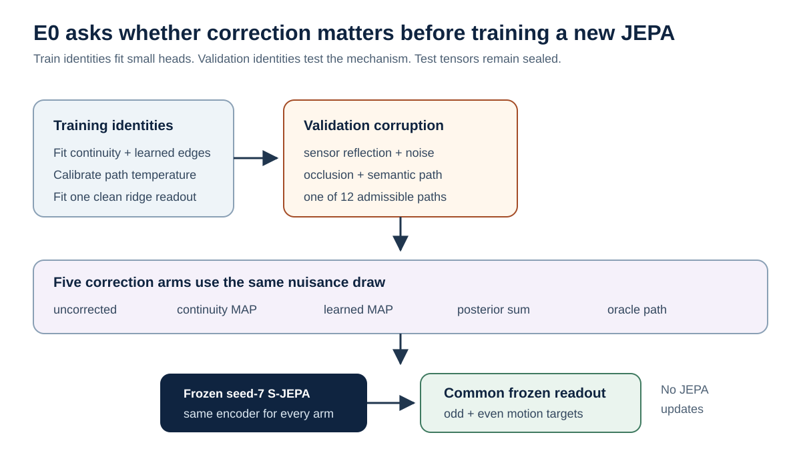
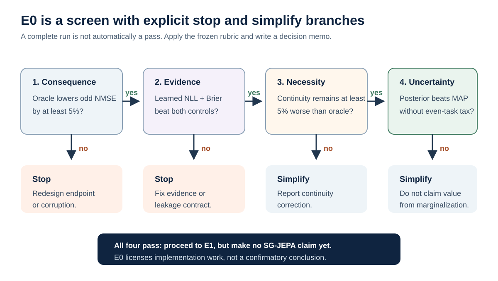

# Experiment E0: frozen-encoder swap probe

This guide runs the smallest experiment that can show whether temporary
left/right token-name swaps are consequential, recoverable, and worth modeling
with uncertainty. It uses the existing AMASS Core11 tensors and the exact
seed-7 standard S-JEPA checkpoint. It does **not** train SG-JEPA and does not
use the test split.

The scientific question is deliberately narrow:

> When a coherent 16-frame bilateral naming swap is hidden among independent
> coordinate reflection, noise, and missing distal joints, can a relative
> temporal corrector recover the convention and protect a common frozen
> lower-limb motion
> readout better than leaving the sequence corrupted?

Positive results justify implementing the full sequence-level AMASS-Gauge and
SG-JEPA study. They are not evidence that SG-JEPA works, that such failures are
common in real pose systems, or that pose alone measures clinical balance.



| Experiment property | E0 choice | Why this choice is useful |
| --- | --- | --- |
| Scientific role | Validation-only mechanism screen | Rejects an inconsequential corruption before new representation training |
| Learned components | Logistic edge heads, temperatures, and one ridge readout | Tests recoverability cheaply while holding the JEPA fixed |
| Independent split | Train identities for fitting; validation identities for the screen | Preserves the repository test split for the later frozen protocol |
| Main comparison | Uncorrected, two hard corrections, posterior marginalization, and oracle | Separates consequence, simple correction, uncertainty value, and upper bound |
| Output | Effect-size table plus a written proceed, simplify, or stop verdict | `COMPLETE.json` alone means the program finished, not that the scientific gate passed |

## 1. What was implemented

| File | Purpose |
| --- | --- |
| `src/gavd6_sjepa/swap_probe.py` | Typed corruptions, invariant boundary features, structured path inference, frozen encoding, metrics, and artifact writing |
| `scripts/run_swap_probe.py` | Local/HAIC command-line entry point |
| `slurm/run-swap-probe.sbatch` | Four-hour H100 validation job |
| `tests/test_swap_probe.py` | Algebra, corruption, parity, inference, leakage, and end-to-end smoke tests |

The pipeline compares five correction arms:

1. `corrupted_uncorrected`: no attempt to fix semantic swaps;
2. `continuity_map`: a one-feature aggregate kinematic-continuity model,
   followed by MAP selection within the declared path family;
3. `learned_map`: a richer global-chart-invariant boundary classifier followed
   by the same MAP procedure;
4. `learned_structured_posterior`: all twelve admissible complete paths are
   corrected separately and exactly marginalised after target prediction or
   frozen encoding, under the stated composite posterior; and
5. `oracle`: the saved synthetic path, which is the upper bound for semantic
   correction under the same nuisance draw.

`clean_reference` is an uncorrupted-input diagnostic, not an attainable
universal ceiling: it removes coordinate noise and occlusion as well as the
semantic corruption. It is not a sixth correction method.

The soft arm never averages left and right coordinates. Such an average would
create anatomically implausible poses and would not equal marginalization
through a nonlinear encoder.

## 2. Corruption and anchoring contract

Each selected window has 64 frames and sixteen 4-frame blocks. With probability
0.80, exactly four consecutive interior blocks receive the Core11 bilateral
token permutation $P$; its start is uniform over the eleven valid locations.
With probability 0.20, no semantic permutation occurs. These randomized,
clean/no-switch windows measure false corrections. The first and final blocks
are canonical in every event window, which fixes the generator's synthetic
path convention. This controlled anchor is not a deployment-time anatomical
cue.

The operation order is:

```text
clean coordinates
  -> independent mediolateral sensor-coordinate reflection
  -> independent Gaussian noise
  -> independent block/joint occlusion with validity update
  -> semantic bilateral token permutation P^g
```

Therefore applying the saved path a second time reconstructs the matched
nuisance-only reference exactly. Oracle-versus-reference embedding error tests
the implementation, while oracle-versus-clean target error retains the cost of
noise and missingness.

Nuisance draws use domain-separated deterministic seeds and cannot reveal the
semantic event by construction. Occlusion is sampled across blocks rather than
placed at event boundaries. A mask-only edge classifier is reported as a
leakage control. Its performance should stay near the input-free prior; a
strong result means the corruption design needs investigation.

The probe selects only starts on the 64-frame grid. These windows do not overlap,
so the same source frame cannot receive contradictory corruptions. The full
study should replace this shortcut with one persistent path per complete source
sequence.

## 3. What is learned

No JEPA parameters are updated.

- The continuity head is logistic regression on the aggregate across all five
  bilateral-pair same-versus-swapped boundary residuals.
- The learned edge head is logistic regression on per-joint-pair continuity,
  normalized margins, and validity coverage. These features are exactly
  invariant to a global semantic chart flip.
- The mask-only control receives only validity coverage.
- Edge heads are fitted on 80% of training identities, then each scalar
  temperature is calibrated on the held-out 20% by complete-path negative log
  likelihood. The calibration identities are never used to fit the
  logistic-regression coefficients.
- A known clean-versus-event path prior is applied once over the twelve
  realizable paths. The calibrated edge posterior is first converted to a
  likelihood factor, so that prior is not counted twice. Temperature scaling
  acts on evidence relative to the training edge prevalence, leaving that
  prevalence fixed. Boundary factors share blocks, so their product is a
  calibrated *composite* posterior rather than a claim of conditionally
  independent evidence.
- One common ridge probe is trained on clean embeddings from the model-fitting
  AMASS identities to
  predict right-minus-left and total distal within-block motion energy. It is
  frozen and reused for every validation arm.
- The legacy frozen S-JEPA encoder receives zero-filled coordinates but no
  validity channel. Validity influences the edge features and target pooling,
  not the encoder input. E0 can therefore screen this checkpoint, but it cannot
  establish the validity-aware representation claim planned for E1 onward.

All fitting and calibration data come from training identities only. Validation
identities are used only for the preliminary comparison. The runner reads the
all-split manifest and builds an all-split window index, so test identity names
are present in memory. It selects no test rows and never opens or evaluates test
tensors. The later sealed protocol should avoid even this metadata contact.

## 4. Prerequisites

On the Linux GPU cluster, create the locked CUDA environment once:

```bash
uv sync
```

The lock intentionally pins a CUDA-only PyTorch wheel. On macOS, use an
already-working local Python environment for the CPU smoke test. For this
checkout, `.venv/bin/python` is the supported command below. Run the real
job on HAIC. Do not attempt to solve the Linux CUDA lock on a Mac merely to run
this screen.

For the real run, set the AMASS root and verify the exact inputs:

```bash
export GAVD6_ROOT=/path/to/gavd6
cd "$GAVD6_ROOT"
export AMASS_RUN_ROOT="$GAVD6_ROOT/outputs"

test -f "$AMASS_RUN_ROOT/manifests/amass_core11_conversion.csv"
test -f outputs/repaired-jepa-seed7-v2/seed-7_standard_sjepa_best.pt
test -d "$AMASS_RUN_ROOT/core11"
shasum -a 256 outputs/repaired-jepa-seed7-v2/seed-7_standard_sjepa_best.pt
```

The printed checkpoint digest must be
`d12ddf0a8412bcae58ed167cc1ec560b978bffa590fd631ab23e519216b646bd`.
The runner verifies it before work begins. Copy or stage that exact file on
HAIC; do not select a checkpoint by a `latest` name. It remains a legacy
diagnostic checkpoint, not repaired-model evidence.

## 5. Test locally first

Run the focused property tests:

```bash
.venv/bin/python -m unittest tests.test_swap_probe -v
```

**Current checkout status, 2026-08-28:** all 24 focused swap-probe tests pass,
including the end-to-end synthetic artifact test. The identity holdout now uses
the fixed corruption draws to guarantee clean and event paths in calibration
while retaining event paths for model fitting. It fails early with a clear
data-support error when no valid identity-disjoint partition exists. The full
repository suite also passes all 71 tests. Require these checks to remain green
before submitting the H100 job.

Run the entire CPU pipeline without AMASS tensors or a checkpoint:

```bash
.venv/bin/python scripts/run_swap_probe.py \
  --synthetic-smoke \
  --device cpu \
  --num-workers 0 \
  --batch-size 8 \
  --encoder-batch-size 16 \
  --event-probability 0.50 \
  --output-dir outputs/swap-probe-smoke-001
```

The synthetic encoder is untrained. This command checks execution and artifact
contracts only; its numerical results have no scientific meaning. The program
refuses to write into a non-empty output directory, so choose a new directory
for every run.

## 6. Run the preliminary AMASS validation experiment

An interactive allocation can run the same command directly:

```bash
uv run --no-sync python scripts/run_swap_probe.py \
  --manifest "$AMASS_RUN_ROOT/manifests/amass_core11_conversion.csv" \
  --tensor-root "$AMASS_RUN_ROOT/core11" \
  --checkpoint outputs/repaired-jepa-seed7-v2/seed-7_standard_sjepa_best.pt \
  --output-dir "$AMASS_RUN_ROOT/swap-probe-seed7" \
  --device cuda \
  --num-workers 4 \
  --max-train-windows 20000 \
  --max-validation-windows 2800
```

For Slurm:

```bash
cd "$GAVD6_ROOT"
export HAIC_ACCOUNT=mind  # Replace with the allocation you are authorized to use.
export AMASS_RUN_ROOT="$GAVD6_ROOT/outputs"
export SWAP_PROBE_OUTPUT_DIR="$AMASS_RUN_ROOT/swap-probe-seed7-initial"

sbatch --account="$HAIC_ACCOUNT" --export=ALL \
  slurm/run-swap-probe.sbatch
```

Optional canonical-run environment overrides are `SWAP_PROBE_OUTPUT_DIR`, `SWAP_PROBE_SEED`,
`SWAP_PROBE_BATCH_SIZE`, `SWAP_PROBE_ENCODER_BATCH_SIZE`,
`SWAP_PROBE_NUM_WORKERS`, `SWAP_PROBE_TRAIN_WINDOWS`,
`SWAP_PROBE_VALIDATION_WINDOWS`, and `SWAP_PROBE_EVENT_PROBABILITY`.
The Slurm script also exposes checkpoint-path and expected-digest overrides for
debugging. Leave both unset for the canonical E0 run. Any run that changes both
values can bless a different artifact and must be labelled noncanonical rather
than pooled with the frozen seed-7 result.

Twenty thousand training windows are enough for the small edge heads and
common probe. The current manifest supplies approximately 2,821 non-overlapping
validation windows, so the default of 2,800 nearly exhausts this permitted
validation pool without opening AMASS test. Exact candidate enumeration
evaluates twelve paths under a composite posterior rather than drawing samples.
If memory is tight, lower
`--encoder-batch-size` first; if runtime is long, lower validation windows. Do
not change the corruption after examining validation results and then call the
same run confirmatory.

The program never resumes or overwrites a non-empty output directory. Give each
attempt a fresh run suffix (and do so whenever changing
`SWAP_PROBE_SEED`).
After `sbatch` prints a job ID such as `12345`, monitor it with
`squeue -j 12345`, inspect its state with `sacct -j 12345`, and follow the
explicit root-level log with
`tail -f slurm-swap-probe-12345.out`.
The runner prints the manifest, tensor root, checkpoint digest, output path,
and phase-level progress before and during computation.

## 7. Output artifacts

| Artifact | Read it for |
| --- | --- |
| `effective_config.json` | Exact corruption, sample counts, scales, checkpoint/manifest hashes, and command |
| `corruption_manifest.csv` | Per-window semantic path, root anchor, sensor bit, occluded block/joints, and nuisance seeds |
| `lightweight_models.joblib` | Fitted continuity, learned-edge, mask-only, and common-probe models |
| `validation_edge_metrics.csv` | Edge AUPRC/Brier/log loss, path/event recovery, and false-switch rate |
| `validation_prior_sensitivity.csv` | The same recovery metrics after 0.20, 0.50, and configured event-prior reweighting |
| `validation_reliability.csv` | Edge-posterior reliability bins |
| `validation_condition_summary.csv` | Separate clean/no-switch and swapped-event downstream-error summaries |
| `validation_uncertainty.csv` | Paired structured-posterior-minus-MAP normalized-MSE deltas in fixed entropy bins |
| `validation_window_metrics.csv` | Long-form arm/window predictions and errors |
| `summary.csv` | Window means and sequence-then-identity macro means |
| `COMPLETE.json` | Successful process-completion marker and explicit test-seal state; it is not a scientific pass verdict |

The key targets are computed from within-block finite differences. Differences
never cross a semantic event boundary, so right-minus-left energy is exactly
odd under $P$ and total energy is exactly even. They are kinematic mechanism
diagnostics, not force, diagnosis, fall risk, or a clinical balance score.

## 8. Read the results as gates



E0 is a validation screen, not a confirmatory test of H1 through H5. The
following provisional rules make its proceed decision reproducible. Freeze
them before the first real E0 run. If a validation pilot changes a threshold,
record the old value, new value, and reason in the decision memo.

| Gate | Statistic and direction | Proceed rule | Stop or simplify rule |
| --- | --- | --- | --- |
| Consequence | Identity-macro `direct_odd_nmse` in `swapped_event` windows | Oracle gives at least 5% relative error reduction versus `corrupted_uncorrected` | Below 5%: the endpoint is not sufficiently affected |
| Relative evidence | `structured_path_nll` and `edge_brier` | `learned` is strictly lower than both `input_free_path_prior` and `mask_only_control` on both metrics | Otherwise learned motion evidence has not beaten the controls |
| Leakage control | Relative path-NLL reduction `(NLL_prior - NLL_mask) / NLL_prior` | Value at most 0.01 | A larger gain suggests the nuisance mask reveals the event |
| Simple correction | Identity-macro swapped-event `direct_odd_nmse` | Oracle remains at least 5% lower than `continuity_map` | Within 5%: report the transparent continuity corrector as sufficient |
| Uncertainty value | Highest nonempty entropy bin in `validation_uncertainty.csv` | `posterior_minus_map_direct_odd_nmse < 0` | Zero or positive: do not claim value from posterior marginalization |
| Frozen readout | Identity-macro `probe_odd_nmse` | At least one non-oracle correction improves on `corrupted_uncorrected`, and the clean-reference probe is prespecified as usable | Otherwise E0 supports coordinate correction only, not representation protection |
| Preservation | Identity-macro `probe_even_nmse` and clean/no-switch error | Corrected error is no more than 2% above `corrupted_uncorrected` | Above 2%: correction imposes an unacceptable preservation cost |

The 1% leakage tolerance and the frozen-probe usability criterion require an
explicit pre-run scale or threshold in the decision memo because the current
program does not estimate confidence intervals. E0 effects remain descriptive;
the full study later recomputes identity-clustered intervals and the
length-normalized unanchored path score.

Prefer the sequence-then-identity macro columns in `summary.csv`; window means
are diagnostics. Edge AUPRC and reliability are pooled exploratory statistics
in this probe. The inference prior is artificial: interpret the configured
0.80-event result only alongside `validation_prior_sensitivity.csv`, not as a
deployment prevalence. A paper analysis must stitch complete sequences,
aggregate by identity, bootstrap identities, repeat selected arms across seeds,
and evaluate the sealed test protocol once. The sensitivity file reweights
recovery metrics only; downstream posterior-averaged target and probe results
remain conditional on the configured prior in this short screen.

## 9. What this probe cannot establish

This screen cannot show that:

- real pose estimators exhibit coherent semantic swaps at a meaningful rate;
- an unanchored absolute left/right sign can be recovered;
- calibrated composite-posterior marginalisation is better than a jointly
  trained SG-JEPA;
- a new representation outperforms the frozen standard S-JEPA baseline; or
- any metric is a validated biomechanics or balance-assessment endpoint.

Its value is speed. Within one short validation job it can reject an
inconsequential corruption, reveal that a simple corrector already solves the
problem, or establish the oracle gap and ambiguity-dependent benefit needed to
justify spending the next GPU hours on the full study.
