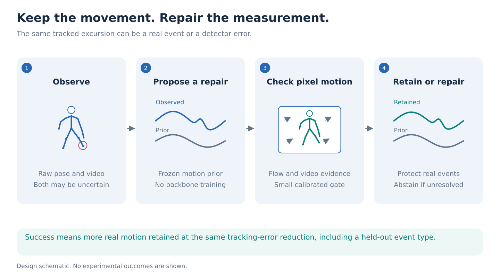

# Preserve real movement while repairing tracking failures

This tutorial explains how to test one idea: **use evidence from the video to repair tracking mistakes while keeping movements that really happened.**

The research question is whether a small learned correction can preserve more real movement than strong existing methods while removing a comparable amount of tracking error. The improvement must also hold for a type of movement change that the correction was not trained on.

The first two days test whether the idea is worth pursuing. The first week develops the core result. Step 12 maps that work to the current twelve-day paper schedule.

**Evidence status:** This is an experimental plan. The [validation record](../../../../notebooks/motion_preservation/VALIDATION.md) documents software and demonstration checks, not a successful real-checkpoint experiment. Examples and numerical values used to teach the concepts below are illustrative unless explicitly identified as protocol settings.

| Read in order | What you will understand |
| --- | --- |
| [Steps 1 to 4: the question and the examples](#step-1-understand-the-difference-between-a-movement-and-a-tracking-mistake) | How to distinguish reference motion, observed motion, and tracking error |
| [Steps 5 to 7: the repair method](#step-5-ask-a-frozen-motion-model-to-propose-a-repair) | How the motion prior, optical flow, and small gate work together |
| [Steps 8 to 10: the evidence](#step-8-compare-against-methods-that-could-explain-away-the-result) | How to compare methods fairly and interpret their scores |
| [Steps 11 and 12: transfer and execution](#step-11-test-whether-the-finding-extends-beyond-its-construction) | What to test next, which notebooks to run, and when to stop |

## Step 1. Understand the difference between a movement and a tracking mistake

A **pose tracker** estimates body-joint locations in a video, such as the hip, knee, and ankle. One set of locations is a pose. A sequence of poses is a **trajectory**, which describes how those joints move over time.

Tracking is imperfect. An ankle estimate might jump onto a nearby object, disappear behind another person, or drift gradually away from the foot. These changes appear in the estimated trajectory even when the person did not make them.

A **motion prior** is a model that has learned patterns from many examples of human movement. It can propose a more plausible trajectory. For example, it may replace a sudden ankle jump with a smoother path. A **frozen** prior has fixed model weights: we use what it has already learned without retraining it.

That correction can also remove a genuine movement. Imagine that a person briefly lifts one foot higher than usual. If the model treats the lift as a tracking error, its output becomes smoother but loses something that happened.

An average error score can hide this loss. A method may improve many joint estimates while damaging one foot's movement for a few frames. The overall average can improve even though the event we wanted to study has disappeared.

We will call a particular movement change an **event**. Here, an event is a measurable change in foot height or body timing. It is not a diagnosis, and it need not indicate abnormal gait.

Keep three objects separate throughout the experiment:

| Object | Meaning | Role in the experiment |
| --- | --- | --- |
| Reference motion | The motion used to create a controlled example | Supplies training targets and evaluation answers |
| Observed motion | The estimated skeleton, including any tracking mistakes | Input to the repair method |
| Repaired motion | The trajectory returned by the method | Output that we score |

During evaluation, the repair method must not see the reference answer. It receives the observed motion and the permitted video evidence.

**Success requires both preservation and repair.** Keeping the original trajectory preserves genuine movement but also keeps tracking errors. Heavy smoothing may remove errors while deleting genuine movement. We want a better balance between those two outcomes.



*This is a design diagram. It does not show a measured result.*

## Step 2. Choose data with answers we can check

### Start with AMASS for controlled experiments

[AMASS][amass] brings motion-capture datasets into a shared body representation. Its body parameters allow us to reconstruct an animated skeleton and a surface mesh. A mesh is a collection of triangles that represents the body's visible surface.

**Rendering** means drawing that animated body from a chosen camera to create a video. We can then add tracking error to the skeleton separately and check what a repair method does. The reference is exact relative to the constructed example, although the underlying body model remains an approximation of a person.

Use the existing [AMASS manifests](../../../../manifests/amass/) to locate the recordings available on HAIC. A **manifest** is an inventory of files and their metadata. A row in it does not guarantee that the corresponding file is accessible at the configured scratch path.

The body reconstruction requires the licensed SMPL-H and DMPL assets. SMPL-H describes the articulated body and hands; DMPL adds modeled soft-tissue motion. The [cluster guide](../../../../slurm/motion-preservation/README.md) specifies the required files and paths.

### Use the whole body before trying a reduced skeleton

The initial experiment uses 22 joints, including the spine, shoulders, elbows, and wrists. Arms and trunk matter because some events concern their timing relative to the legs or pelvis.

Sample the trajectory at 20 frames per second. This means adjacent frames are 0.05 seconds apart. Keep the timestamps so that motion rates retain their physical meaning.

The released motion model expects the [HumanML3D representation][humanml3d]: 263 numerical features per time step describing aspects of body position, rotation, velocity, and contact. These are **features, not 263 joints**. Step 5 explains how to translate between this format and our 22-joint trajectories.

The 11-landmark lower-body representation can be tested later. That comparison is an **ablation**: a controlled change to one part of a method, used to find out whether that part matters. Removing the upper body cannot support a claim about preserving a descriptor that needs shoulders or wrists.

### Reserve GAVD for visible-motion checks

[GAVD][gavd] contains clinically annotated gait videos from varied real-world settings. Use the existing [GAVD manifests](../../../../manifests/gavd/) to identify the available clips.

GAVD helps us inspect realistic clothing, camera motion, and **occlusion**, where a body part is hidden from view. The available videos do not provide the reference 3D trajectories required for our controlled preservation score. A reconstruction produced by another model is another estimate, not that missing reference.

The main result is therefore a motion-preservation experiment. Binary normal-versus-abnormal classification is not its headline task.

## Step 3. Separate the people, then define the events

### Give each person one experimental role

Split people before creating edited motions, camera views, or tracking-error variants. All versions of one person's recording inherit the same role.

| Role | What it is used for | Current event family |
| --- | --- | --- |
| Training | Learn the small correction model | Arm-leg timing change |
| Calibration | Choose repair strengths and confidence thresholds | Foot-height change |
| Development | Decide whether the approach merits further work | Foot-height change, on different people |
| Final | Evaluate the frozen method after development decisions | Trunk-pelvis timing change |

**Calibration** means choosing how to interpret or operate a fitted model using separate examples. It is different from learning the model's main weights. Step 10 explains both kinds of calibration used here.

Development results can influence the research direction, so development examples are no longer an untouched test. The final people and event family must remain unopened until the method and its operating settings are fixed.

Also check whether the pretrained prior may already have seen the source motions. Holding people out of adapter training does not prove they were absent from foundation-model training.

### Create a known movement change

For each selected motion, save two trajectories:

- `x`: the original, unedited motion.
- `x_e`: the same motion after adding the event.

The subscript `e` simply means “edited.” The original motion is a reference for this construction; calling it unedited does not imply clinically normal gait.

Use three event families:

| Event family | What we change | What the current descriptor measures |
| --- | --- | --- |
| Arm-leg timing | Shift upper-body joint rotations in time relative to the legs | A signed index relating arm position to leg motion |
| Foot-height change | Apply a brief, smooth combination of hip, knee, and ankle rotations | A foot joint's peak height relative to its height near the clip ends |
| Trunk-pelvis timing | Shift spine rotations in time relative to the pelvis | A signed index relating shoulder-axis orientation to pelvis turning |

A **descriptor** is one number calculated from a trajectory to summarize the movement property we want to preserve. Two body parts can travel through the same ranges but reach their peaks at different times. The timing descriptors detect changes in that relationship by comparing one part's position with the other's velocity, with scaling to reduce dependence on movement size. They do not report a delay in seconds.

The configuration name `foot_clearance` refers to the foot-height descriptor above. It is not a direct measurement of foot-to-floor distance. None of these descriptors is a clinical severity score.

Edit joint rotations and then calculate joint positions along the connected skeleton. This operation is called **forward kinematics**. It keeps the articulated structure consistent instead of moving each joint independently. It does not, by itself, prove that every edited motion is physically feasible.

Inspect the edited motions and reject changes that are too small to measure. An edit called “foot clearance” does not guarantee an upward foot movement for every starting pose. The [descriptor definitions](../../../../src/gavd6_sjepa/research_directions/motion_preservation/body_geometry.py) and [minimum event differences](../../../../src/gavd6_sjepa/research_directions/motion_preservation/preservation_metrics.py) specify what is actually measured. Fix those rules before comparing model outputs.

## Step 4. Build examples that separate real movement from error

We need two complementary experiments. One isolates the value of video evidence. The other tests whether preservation and repair can happen together. In this controlled AMASS pilot, we inject tracker-like errors into 3D joint coordinates. We do not obtain those errors by running a pose tracker on the rendered video. Testing actual tracker failures is a later realism check.

### Experiment A: identical skeletons, different videos

Construct an observed skeleton `z` from the edited motion, with a declared tracking-error pattern added if needed. Give **exactly the same skeleton values** to the method in both cases:

| Input or answer | Case A: the event happened | Case B: the event is a tracking mistake |
| --- | --- | --- |
| Observed skeleton | `z` | The same `z` |
| Video | Rendered from edited motion `x_e` | Rendered from original motion `x` |
| Reference answer | `x_e` | `x` |
| Desired behavior | Keep the event and repair other errors | Remove the false event and repair other errors |

Keep the camera, background, body shape, confidence values, and missing-joint pattern matched between the two cases. Check numerical equality of the skeleton inputs. Labels, filenames, and evaluation metadata must not become model features that reveal the answer.

A skeleton-only method receives the same information in both cases, so it cannot reliably distinguish their explanations. The video supplies the intended difference. For the running example, the visible foot actually lifts in Case A and does not lift in Case B.

This construction tests whether extra image evidence is useful. It does not establish how often this exact ambiguity occurs in natural tracker outputs.

### Experiment B: cross event presence with tracking error

Create all four combinations:

| | No added tracking error | Added tracking error |
| --- | --- | --- |
| **No added event** | Preserve the original motion | Repair the error |
| **Added event** | Preserve the event | Preserve the event and repair the error |

The fourth cell is essential. Put some errors on the same joints and frames as the event. Otherwise, a method might appear successful simply by leaving event clips untouched and repairing only other clips.

Include a baseline that makes exactly that kind of whole-clip choice between raw and repaired motion. The learned method should earn its extra complexity.

### Check whether an easy clue gives away the answer

A **shortcut** is a clue that predicts the label without solving the intended problem. For example, event clips might accidentally be longer, have more foreground pixels, or have lower tracker confidence.

Match or audit duration, body drift, foreground area, confidence, missingness, motion amplitude, speed, frequency, and behavior near clip boundaries. Train a small predictor using only these summaries. If it can explain the result, revise the construction before claiming that the method understands which movement to preserve.

Also include conditions in which different inputs fail:

- The tracker is wrong, but the visible surface motion is informative.
- The tracker is useful, but texture, moving shadows, or clothing confuse image-motion estimates.
- Occlusion makes both sources unreliable.

These are experimental requirements. The current renderer provides controlled appearance and occlusion examples; it does not reproduce the full complexity of natural clothing or illumination.

## Step 5. Ask a frozen motion model to propose a repair

Start with the reconstruction component of [MoMask][momask], an autoencoder with residual vector quantization, called an **RVQ-VAE**. An autoencoder compresses an input and then reconstructs it. Here, quantization replaces continuous features with entries from a learned collection of motion codes. Additional code levels describe detail left over from earlier levels.

We use this motion reconstruction component directly. The initial experiment does not require MoMask's text-generation system or training a new foundation model. Whether reconstruction usefully repairs our errors, or erases our events, remains an empirical question.

The input and output pass through this sequence:

```text
Observed 22-joint trajectory
        ↓ convert and normalize
HumanML3D features
        ↓ frozen MoMask reconstruction
Reconstructed HumanML3D features
        ↓ convert back and restore the coordinate frame
Proposed 22-joint repair
```

**Normalization** rescales numerical features using the pretrained model's expected reference values. Converting back must undo that scaling and restore the trajectory's spatial frame. Otherwise, differences in units or orientation could look like movement errors.

Before evaluating the prior, perform the conversion and inverse conversion **without the learned model**. This is the conversion-only control. If an event disappears during this step, its loss cannot be attributed entirely to the motion prior.

Keep joint names, body scale, coordinate directions, and frame indices aligned. Compare only frames actually supported by the output. A frame dropped by a representation conversion must not be restored using hidden reference motion.

[MDM, the Human Motion Diffusion Model][mdm], is a possible second prior or fallback. A diffusion model constructs motion through repeated refinement. Its reconstruction procedure must be supplied separately in this repository: the current workflow can import its predictions, but does not implement a complete MDM reconstruction path. It is not an automatic replacement when MoMask loading fails.

Load an actual released **checkpoint**, the file containing the model's learned weights, on day 1. A demonstration with a smoothing stand-in does not test this hypothesis.

## Step 6. Use optical flow to check whether the video supports a movement

**Optical flow** estimates how image locations move between two frames. For a visible point on a shoe, it might predict a displacement of four pixels to the right and one pixel upward.

Use a frozen [SEA-RAFT][sea-raft] model to estimate this motion. [RAFT][raft] is the explicit fallback. The author-code and checkpoint setup is maintained in the [cluster guide](../../../../slurm/motion-preservation/README.md).

### Compare the joint's movement with nearby pixel movement

First, project a candidate 3D joint into the camera image. **Projection** converts a 3D location into a 2D pixel location using the camera geometry. Apply the same check to both the observed trajectory and the prior's proposed repair.

Define:

- `q[t]`: the candidate joint's image location at frame `t`.
- `u[t](q[t])`: the optical-flow displacement near that location.
- `r[t]`: the difference between the candidate displacement and the flow displacement.

Then compute:

```text
r[t] = (q[t+1] - q[t]) - u[t](q[t])
```

The expression in parentheses is how far the skeleton says the joint moved. The final term is how far the image evidence says nearby pixels moved. The **residual** `r[t]` is their disagreement, measured in pixels.

For example, suppose the observed ankle moves four pixels to the right, while the repaired ankle moves only one. If nearby shoe pixels move four pixels, their disagreement is zero for the observed path and three pixels for the repaired path. That favors retaining the observed movement, provided the flow estimate is trustworthy. This arithmetic is an illustration, not a result from the study.

### Check the quality of that evidence

Use a small neighborhood rather than a single pixel. An anatomical joint center does not necessarily follow the same path as a point on a sleeve or shoe.

Collect several quality indicators:

| Indicator | Plain-language question |
| --- | --- |
| Forward-backward agreement | Does following the estimated motion forward and then backward return near the starting point? |
| Brightness consistency | Do the proposed corresponding image patches look similar? |
| Local flow variation | Do neighboring pixels suggest compatible movements? |
| Texture and visibility | Is there enough visible detail to estimate a correspondence? |
| Model uncertainty | How uncertain is the flow model about its estimate? |

None of these indicators is a guarantee. The adapter must learn how useful they are, and Step 10 checks whether its confidence is justified.

Keep both displacements in the same image coordinates. If frames were cropped or resized differently, undo the transforms on both endpoints. Keep camera motion in both quantities, or compensate both in the same way. Otherwise, the residual can measure a coordinate mismatch instead of a tracking error.

**Flow is evidence about projected surface motion.** It does not independently establish 3D depth, anatomical joint motion, or physical feasibility. Pose and flow also come from the same video, so they are not independent sensors.

The renderer supplies reference surface-point motion for checking flow accuracy in the controlled experiment. This reference flow must never enter the adapter's input features. A predicted flow field cannot serve as its own reference answer.

## Step 7. Train a small gate to choose how much of the repair to accept

An **adapter** is a small learned component added around an existing model. Our adapter is a **gate**: it chooses how much to retain from the observed trajectory at each joint and time.

It receives the observed motion, the prior's repair, their image-motion checks, and indicators such as tracking confidence and missing data. It does not receive the held-out reference answer or event label.

For one joint at one time, let `z` be the observed position and `p` the prior's proposed position. The gate predicts a weight `w` between zero and one:

```text
mixed position = p + w × (z - p)
```

| Gate weight | What happens |
| --- | --- |
| `w = 0` | Use the prior's proposed position |
| `w = 1` | Keep the observed position |
| `w = 0.5` | Use the midpoint between them |

This weight is a mixing decision. It is **not** the probability that an event happened. A separate output, called the **event head**, estimates that probability for the clip.

The initial implementation uses a small temporal network, which examines nearby frames together. Training has two objectives: make the repaired trajectory agree with the training reference, and predict whether the constructed event is present. Event frames receive extra weight so that a short genuine movement is not overwhelmed by the many unchanged frames. Reference trajectories and event locations are training targets only.

Where an observed coordinate is missing, use the prior's estimate and retain the missing-data flag. Filling a gap does not establish that the filled movement is correct.

### Score the trajectory after its final geometric adjustment

Mixing joint positions independently can change bone lengths. The implementation adjusts the mixed skeleton to the declared bone lengths before scoring it. These lengths come from permitted observations or a training-only template, not held-out reference anatomy.

This bone-length adjustment is different from camera projection in Step 6. It can itself weaken an event, so evaluate the adjusted output rather than an intermediate trajectory that the method would never return.

The proposed gate is also limited by the two trajectories it mixes. If both lack the needed movement, the gate has little basis for recovering it.

A reference-informed diagnostic, named `oracle_mixture` in the outputs, chooses mixing weights using the known answer. This helps diagnose limitations of the mixture design. Its weights are optimized before the bone-length adjustment, so its final score is **not a certified upper bound** on every possible gate. Poor performance is a reason to inspect the design, not a mathematical proof that improvement is impossible.

### Keep the JEPA question separate

[S-JEPA][s-jepa] is a Joint Embedding Predictive Architecture for skeleton sequences. In this family of methods, the model learns by predicting numerical representations of hidden content from visible context. S-JEPA or a video JEPA model could later supply such learned features to the adapter. These are optional extensions; the current temporal gate does not use a pretrained S-JEPA checkpoint.

To claim a benefit from such a representation, compare it with an equally sized coordinate model and the flow-based alternatives. A successful gate alone does not demonstrate a JEPA benefit.

This study restores a clip after observing the full declared clip. It is **offline restoration**, not forecasting. A future forecasting experiment would have to restrict every input, including flow and cropping, to frames available before the forecast.

## Step 8. Compare against methods that could explain away the result

A **baseline** is an alternative method used to judge whether the proposed method adds value. Good baselines solve as much of the problem as possible. They should receive the same permitted observations and comparable opportunities to choose their settings.

Start with these comparisons before expanding the adapter:

| Comparison | What it tells us |
| --- | --- |
| Raw motion and raw motion with bone-length adjustment | Whether making no learned repair is already adequate |
| Conversion-only output and the unmodified prior | Whether loss comes from the representation conversion or the learned reconstruction |
| Gaussian/median smoothing and robust Kalman filtering | Whether standard smoothing or a motion filter can achieve the same balance |
| Confidence gate | Whether tracker confidence alone says when to accept a repair |
| Whole-clip and local flow gates | Whether a simple rule using image motion already solves the problem |
| Learned linear flow gate | Whether a small linear model is sufficient without the temporal network |
| Local flow propagation | Whether following image correspondences directly is enough |
| Two-tracker disagreement | Whether disagreement between existing pose estimates identifies the errors |
| Coordinate-only, shuffled-flow, and random-feature versions | Whether useful image evidence, rather than extra model capacity or an accidental clue, explains the gain |

Gaussian smoothing averages nearby samples. Median smoothing suppresses isolated spikes. A Kalman filter combines noisy measurements with a simple prediction of how motion continues. These are serious alternatives, not checks to be dismissed because they are older.

In the shuffled-flow comparison, assign flow evidence from another case while keeping the model size the same. In the random-feature comparison, keep the feature transformation untrained. These comparisons help identify what the learned model actually uses. Two trackers may share systematic mistakes, so agreement between them is not reference truth.

### Compare with the nearest published work

The broader concern that a plausible reconstruction can lose or invent important detail is already established. The paper must show a more specific advance:

| Relevant work | What it already contributes | What this study still needs to establish |
| --- | --- | --- |
| [HTD-Refine][htd-refine] | Refines reconstructed motion using video-derived position, velocity, and acceleration | Better preservation of true events at comparable error removal, beyond derivative-guided refinement |
| [MFTIQ][mftiq] | Estimates correspondence quality separately from optical-flow estimation | An advantage beyond a strong estimate of which image correspondences to trust |
| [H-MoRe][h-more] | Learns human-centered flow with skeleton and boundary constraints | Whether useful evidence survives when the skeleton itself is wrong |
| [Robust Prior Updates][rpu] | Improves faithfulness to measurements in diffusion-based image reconstruction | A movement-specific preservation result; include a compatible comparison if using a diffusion prior |
| [CARE-PD][care-pd] | Provides clinical motion data and demonstrates benefits from clinical pretraining | Preservation of observed events without assuming that clinical adaptation alone solves the problem |

“Use video to reduce oversmoothing” is therefore too broad a novelty claim. Our proposed contribution is the controlled event/error test and an improvement that survives its strongest alternatives and transfer conditions.

Some comparisons above are research work still to do. Exact MFTIQ, H-MoRe, HTD-Refine, robust-prior-update, and second-tracker predictions are not automatically produced by the current pipeline. The local derivative-alignment comparator is not a reproduction of HTD-Refine's learned PVA-Net. Consult the [implementation-status table](../../../../notebooks/motion_preservation/README.md#scope-and-limitations).

Check compatible code and weights early. HTD-Refine's [official repository](https://github.com/ant-research/HTD-Refine) documents a 30-frame-per-second demo, while this study uses 20. Align physical times when comparing them. If only an adaptation of a published objective is feasible, label it as an adaptation and report the missing exact comparison.

## Step 9. Measure preservation and repair separately

A method needs two scores because the goals can conflict. One score asks whether the event survived. The other asks whether the observed trajectory became more accurate.

### Score A: fidelity to the real event

Let `d(motion)` mean “calculate the chosen event descriptor.” For an event-present example, define:

```text
event change = d(x_e) - d(x)
retention = 1 - |d(y) - d(x_e)| / |event change|
```

Here, `y` is the final repaired trajectory. Vertical bars mean absolute value. The denominator measures how much the event changed the original motion. The numerator measures how far the repaired descriptor remains from the edited reference.

Consider an illustrative foot-height example. The unedited descriptor is 2 cm, and the edited reference is 6 cm. The event therefore adds 4 cm:

| Repaired descriptor | Retention | Interpretation |
| --- | --- | --- |
| 6 cm | 100% | Matches the event descriptor |
| 5 cm | 75% | Loses one quarter of the event's descriptor change |
| 2 cm | 0% | Returns to the original descriptor value |
| 7 cm | 75% | Overshoots the reference by the same amount that 5 cm undershoots it |
| 11 cm | -25% | Deviates from the event reference by more than the event's original size |

Despite its name, retention is a **descriptor-fidelity score**, not literally the percentage of every movement detail preserved. Report signed descriptor error as well, so overshoot and suppression remain distinguishable. Do not hide negative scores by clipping them to zero.

Only compute this score when an event is present and its descriptor change exceeds the fixed minimum. For event-absent examples, report error relative to their actual reference. A zero event change cannot be used as a denominator.

### Score B: reduction in tracking error

Use only the joint positions that the tracker actually observed. Calculate each observed position's squared 3D distance from its reference, then average over those joints and frames. Use exactly the same observed-position mask for the raw and repaired trajectories. Call this error `E`:

```text
error removal = 1 - E(repaired, reference) / E(observed, reference)
```

The implementation calls this `noise_removal`. If mean squared error decreases from 4 cm² to 3 cm², removal is 25%. This is a 25% reduction in **squared-distance error**, not a 25% reduction in ordinary distance.

An unchanged observation removes 0% of its error. A perfect reconstruction removes 100%. A result worse than the observation has negative removal. If the initial error is zero or negligible, the ratio is undefined; report the absolute error instead.

Use the correct reference for each case. When an event is present, error is measured against `x_e`. Measuring it against the unedited `x` would incorrectly reward deleting the event.

**Measure missing-joint completion separately.** The cached raw trajectory fills missing positions by interpolation before the prior sees it. Those filled positions are guesses, not tracker measurements. If they dominated the repair score, a method could appear successful simply by filling gaps while leaving every observed error unchanged. The primary `noise_removal` ratio therefore excludes them. Report `completion_mse_m2` for missing positions, `observed_mse_m2` for observed positions, `mse_m2` for all positions, and `missing_fraction` to show how much was missing. These errors are in square meters. A case without missing positions has no completion score.

### Read the main plot

Plot error removal horizontally and retention vertically. Farther right means more repair; higher means better event fidelity. Varying repair strength traces the **preservation-versus-repair tradeoff**.

The primary retention comparison comes from cases where an event and tracking error coexist. The primary error-removal summary includes the noisy groups. Both compared methods must also reach the repair target on event-plus-error cases themselves, with comparable achieved removal. Exact skeleton-matched pairs and fully ambiguous examples are separate diagnostics. They must not replace the harder same-clip comparison.

For an illustrative comparison, suppose both methods remove 30% of tracking error. If one has 60% retention and the other has 80%, the second gains **20 percentage points** at equal repair. That is the kind of improvement we seek. A higher retention score obtained by doing much less repair does not establish it.

## Step 10. Choose settings fairly and test uncertainty

There are two calibration tasks. One sets the amount of repair. The other sets when to trust an event judgment.

### Calibration A: choose each method's repair strength

Many methods have a strength setting. Stronger smoothing removes more variation; accepting more of a prior's output changes the trajectory more.

Use this sequence:

1. Fit learned methods on training people.
2. Evaluate a fixed range of strengths on calibration people.
3. For each method, select the setting closest to the target error removal among settings that reach it.
4. Mark a method as unable to reach the target if none of its settings does.
5. Lock the selected strengths and the comparator choice before development or final scoring.
6. Report both retention and the error removal actually achieved on the new people.

The current target is **25% error removal**. The example configuration allows a **10 percentage point difference** between methods' achieved removal. That tolerance is a provisional research setting, not evidence that every comparison within it is equally persuasive. Show the actual values and the full predetermined curves.

Do not select the best-looking point after seeing final-test results. Any retuning makes those results development evidence and requires a new, untouched test for confirmation.

### Calibration B: decide when to make an event judgment

The event head returns a score that is converted into a probability using calibration examples. For well-calibrated predictions of 80%, the event should occur in roughly 80% of comparable cases. This probability concerns the constructed event, not the correctness of the entire 3D trajectory or the presence of disease.

Confidence is the larger of the event probability and its complement. An event probability of 90% gives 90% confidence in “event present”; a probability of 10% gives 90% confidence in “event absent.” A probability of 50% gives little reason to prefer either answer.

Choose a confidence threshold on calibration people. Below that threshold, the system **abstains**, meaning it withholds an event judgment. It can still produce a repaired trajectory, which must still be evaluated.

Report two quantities together:

- **Coverage:** the fraction of cases receiving a judgment.
- **Accuracy among decided cases:** how often those judgments are correct.

For example, a system that answers 60 of 100 cases has 60% coverage. Reporting accuracy on only those 60 without also giving coverage hides how often it declined to answer.

Also report a probability score such as the **Brier score**: the mean squared difference between the predicted event probability and the event label, where labels are zero or one. Lower is better. Good synthetic calibration does not guarantee good calibration on GAVD.

### Include a case where the answer cannot be recovered

Construct a separate controlled example in which **every available input is identical**, including the skeleton, video, confidence values, and missing-data indicators. Assign opposite hidden event explanations equally often. The implemented fixture uses completely occluded video.

Because the inputs do not distinguish the explanations, 50% event probability is appropriate for this balanced fixture. A confident answer should be penalized. This tests a necessary limit of the method; it does not estimate how common ambiguity is in natural gait videos.

### Count people, not generated variants, as independent evidence

Ten camera views of one person are not ten independent people. Average results within each person first, then compare methods across people.

A **paired person bootstrap** estimates uncertainty by repeatedly sampling people with replacement and recomputing the average difference between methods. Some people therefore appear more than once in a resampled group and others are absent. “Paired” means both methods are compared on the same people's cases. Keep each person's related variants together.

The implementation uses the middle 95% of those resampled differences as its uncertainty interval. If its lower endpoint is above zero, the estimated improvement remains positive across that interval.

Report the number of independent people and the interval around the improvement. Repeating training with different random seeds tests sensitivity to optimization, not generalization to more people. If identity is unknown, use recording groups and explicitly make the weaker recording-level claim.

## Step 11. Test whether the finding extends beyond its construction

After a passing development result, test these distinct questions:

| Test | What stays fixed | What changes |
| --- | --- | --- |
| New people | Fitted method and calibration | Person identities |
| New event family | Fitted method and calibration | The kind of movement change |
| New observation condition | Fitted method and calibration | Camera, appearance, or tracking-error mechanism |
| New prior | Gate weights, feature normalization, and declared operating settings | The pretrained model proposing repairs |
| Natural-motion stress | Selection rules fixed before inspecting errors | Naturally occurring movements instead of only designed edits |

Changing one factor at a time helps identify why performance changes. **The current final setting changes event family, camera angle, and corruption mechanism together.** It is a combined stress test. Add separate development comparisons with other factors held fixed before attributing a gain or failure specifically to event-family transfer.

For a second prior, keep coordinate conventions and supported frame indices aligned. A gate retrained for that prior is a new adaptation result, not evidence that the original frozen gate transfers.

Choose naturally unusual AMASS motions before inspecting reconstruction failures. Evaluate their reference-motion and descriptor errors; the paired-edit retention formula applies only where a corresponding unedited/edited pair has actually been defined.

[CARE-PD][care-pd] is a possible further test if compatible data and access are available. Its harmonized body meshes include reconstructions derived from video, so their reference status must be stated. It is not a mandatory dependency for the first pilot.

### Use GAVD for the claims its evidence supports

Inspect whether visible events are retained and whether flow fails under natural camera motion, clothing, or occlusion. Separate observations visible in the RGB video from conclusions that require unknown 3D motion.

[WHAM][wham] is one possible upstream source of estimated body trajectories. Its estimates need camera projection before they can be compared with image evidence. They do not become 3D reference truth because another model generated them.

The current GAVD notebook produces flow galleries, contact sheets, and checks of optional projected trajectory exports. It does not automatically apply the trained 3D gate. That transfer requires a further experiment with a compatible pose and camera interface.

GAVD selection also requires the earlier study's source-reservation CSV, which identifies videos held back for confirmation. Recover that file rather than guessing a replacement split. The [cluster guide](../../../../slurm/motion-preservation/README.md) documents this requirement and the expected inputs.

## Step 12. Run the study and decide what the evidence supports

### Follow the notebooks in order

After configuring the real data and model paths in the [Slurm guide](../../../../slurm/motion-preservation/README.md), use the [six-notebook walkthrough](../../../../notebooks/motion_preservation/README.md):

| Notebook | Tutorial connection | Inspect before continuing |
| --- | --- | --- |
| [00: Data and question](../../../../notebooks/motion_preservation/00_data_and_question.ipynb) | Steps 1 through 3 | Actual file availability and independent people in each role |
| [01: Controlled pairs](../../../../notebooks/motion_preservation/01_make_controlled_pairs.ipynb) | Steps 3 and 4 | Visible events, exact skeleton pairs, and event-plus-error cases |
| [02: Prior, flow, and baselines](../../../../notebooks/motion_preservation/02_prior_flow_and_baselines.ipynb) | Steps 5, 6, and 8 | Released checkpoints loaded; conversion loss separated from prior erasure |
| [03: Train and calibrate](../../../../notebooks/motion_preservation/03_train_and_calibrate.ipynb) | Steps 7 and 10 | Training behavior and locked repair/confidence settings |
| [04: Preservation and repair](../../../../notebooks/motion_preservation/04_preservation_and_repair.ipynb) | Steps 9 through 11 | Both achieved repair and retention, grouped by person |
| [05: GAVD visual stress](../../../../notebooks/motion_preservation/05_gavd_visual_stress.ipynb) | Step 11 | Visible evidence, unresolved cases, and transfer limits |

The pilot launcher runs notebooks 00 through 04 for development. Final evaluation and GAVD are separate explicit launches. Demo mode uses generated motions and stand-in models; it is for learning the workflow and checking software.

### Make the first decision within 48 hours

**By 24 hours:** Load a real prior and flow model, verify conversion, and inspect event erasure. Start with the example configuration's eight motions per role. Approximately 128 motion instances was the original expansion target; those instances are not 128 independent people.

Measure rendering and inference throughput before scaling. The current mesh renderer runs on the CPU, so eight H100s do not automatically make preparation eight times faster.

**By 48 hours:** On the held-person development pilot, seek all of the following:

- At least **15 percentage points higher retention** than the strongest eligible baseline selected on calibration data.
- At least **25% error removal**, with comparable achieved removal for both methods.
- Preservation and repair within the **same event-plus-error clips**.
- A paired person interval whose lower endpoint supports a positive improvement.
- A result that survives shortcut checks and the strongest simple flow comparison.

These are provisional continuation rules, not predicted effects or evidence that the sample is large enough to detect them reliably. A small pilot may be inconclusive because it includes too few independent people. Report that limitation instead of treating generated variants as new evidence.

Stop the learned-method claim if the supposed gain disappears after shortcut controls or a calibrated simple flow method achieves the same tradeoff. If only an optional JEPA feature branch fails to help, drop that branch. If the prior does not erase meaningful events, reconsider the underlying research question before doing more training.

### Use the remaining time to substantiate one contribution

The current schedule is based on the September 13, 2026 planning decision:

| Dates | Work | Required outcome |
| --- | --- | --- |
| September 13 to 15 | Real-model pilot, conversion checks, strong baseline setup | Establish a measurable preservation problem |
| September 16 to 18 | Development comparisons; draft methods and abstract | An informative abstract supported by the work completed |
| September 19 to 21 | Transfer tests and natural-motion checks | Determine how broadly the result holds |
| September 22 to 23 | Frozen final evaluation and failure analysis | Stable figures and clearly bounded claims |
| September 24 to 25 | Complete paper and supplementary material | A submission matching the measured evidence |

ICLR's abstract deadline is **September 18, 2026, at 11:59 p.m. Anywhere on Earth**. The full-paper deadline is **September 25 at the same time standard**. Abstracts must be genuine and informative. They may be revised before the paper deadline while staying close to the original submission. Do not describe planned improvements as completed results. See the [official author guidelines][iclr-guidelines].

The original core-study allowance is **280 H100 GPU-hours**: 40 for preparation, 40 for initial comparisons, 80 for expansion, 80 for transfer, and 40 for verification. These are unmeasured budget allocations, not runtime predictions. CPU rendering, storage, model access, and scheduler delays also affect elapsed time. Use additional GPUs for independent experiments after the pilot passes; the small gate does not require training across all eight GPUs at once.

### Decide whether there is a paper contribution

A strong result would connect three findings:

1. Common reconstruction scores can favor methods that delete a short, meaningful event.
2. Video-supported adaptation preserves that event while providing comparable tracking repair beyond strong alternatives.
3. The improvement extends to unfamiliar events and model families, with supporting evidence on natural motion and honest limits on ambiguous inputs.

This would support a paper about preserving what the observations justify. The size of the adapter is secondary to the strength and generality of that evidence.

A result where cheap flow checks already suffice, or the hypothesized erasure does not occur, is a useful negative finding. It can improve the repository's workflow, but it does not establish the proposed learned-method contribution. Report what happened without relabeling a failed novelty test as a success.

## References and what to read them for

The links below point to research papers or their authoritative publication pages. Their findings motivate this protocol; they do not verify this study's proposed improvement.

1. Mahmood et al. (2019). [AMASS: Archive of Motion Capture as Surface Shapes][amass]. arXiv:1904.03278. Read for the common motion/body representation and the origin of the controlled reference motions.
2. Guo et al. (2022). [Generating Diverse and Natural 3D Human Motions from Text][humanml3d]. CVPR 2022. Read for HumanML3D and the representation used by the released motion models.
3. Guo et al. (2023). [MoMask: Generative Masked Modeling of 3D Human Motions][momask]. arXiv:2312.00063. Read for the residual motion quantization and reconstruction component used as the initial prior.
4. Tevet et al. (2022). [Human Motion Diffusion Model][mdm]. arXiv:2209.14916. Read for the optional diffusion-based motion prior.
5. Wang, Lipson, and Deng (2024). [SEA-RAFT: Simple, Efficient, Accurate RAFT for Optical Flow][sea-raft]. arXiv:2405.14793. Read for the primary image-motion estimator.
6. Teed and Deng (2020). [RAFT: Recurrent All-Pairs Field Transforms for Optical Flow][raft]. arXiv:2003.12039. Read for the underlying flow approach and fallback model.
7. Wei et al. (2026). [Natural Human Motion Recovery by Aligning High-Order Temporal Dynamics from Monocular Videos][htd-refine]. arXiv:2605.26879. Read for HTD-Refine, a close comparison on preserving temporal motion detail.
8. Serych, Neoral, and Matas (2024). [MFTIQ: Multi-Flow Tracker with Independent Matching Quality Estimation][mftiq]. arXiv:2411.09551. Read for assessing correspondence quality separately from flow estimation.
9. Huang, Liu, and Kong (2025). [H-MoRe: Learning Human-centric Motion Representation for Action Analysis][h-more]. arXiv:2504.10676. Read for flow learned with skeleton and boundary constraints.
10. Jin et al. (2026). [Hallucination-Aware Diffusion Sampling for Inverse Problems via Robust Prior Updates][rpu]. arXiv:2606.02331. Read for the distinction between plausible reconstruction and support from measurements.
11. Adeli et al. (2025). [CARE-PD: A Multi-Site Anonymized Clinical Dataset for Parkinson's Disease Gait Assessment][care-pd]. arXiv:2510.04312. Read for clinical motion data, adaptation results, and possible external stress tests.
12. Ranjan et al. (2024). [Computer Vision for Clinical Gait Analysis: A Gait Abnormality Video Dataset][gavd]. arXiv:2407.04190. Read for GAVD's videos, clinical annotations, and existing classification results.
13. Shin et al. (2023). [WHAM: Reconstructing World-grounded Humans with Accurate 3D Motion][wham]. arXiv:2312.07531. Read for a possible upstream source of estimated real-video body trajectories.
14. Abdelfattah and Alahi (2024). [S-JEPA: A Joint Embedding Predictive Architecture for Skeletal Action Recognition][s-jepa]. ECCV 2024; official project page with paper link. Read for the optional skeleton-representation extension, which requires its own comparison.

For checkpoint access and additional context, see the [study reference index](../references/README.md), [shared execution constraints](../../../../notes/research-agenda/references/execution-contract.md), and [optical-flow analysis](../../../../notes/research-agenda/references/optical-flow.md).

[amass]: https://arxiv.org/abs/1904.03278
[humanml3d]: https://openaccess.thecvf.com/content/CVPR2022/papers/Guo_Generating_Diverse_and_Natural_3D_Human_Motions_From_Text_CVPR_2022_paper.pdf
[momask]: https://arxiv.org/abs/2312.00063
[mdm]: https://arxiv.org/abs/2209.14916
[sea-raft]: https://arxiv.org/abs/2405.14793
[raft]: https://arxiv.org/abs/2003.12039
[htd-refine]: https://arxiv.org/abs/2605.26879
[mftiq]: https://arxiv.org/abs/2411.09551
[h-more]: https://arxiv.org/abs/2504.10676
[rpu]: https://arxiv.org/abs/2606.02331
[care-pd]: https://arxiv.org/abs/2510.04312
[gavd]: https://arxiv.org/abs/2407.04190
[wham]: https://arxiv.org/abs/2312.07531
[s-jepa]: https://sjepa.github.io/
[iclr-guidelines]: https://iclr.cc/Conferences/2027/AuthorGuidelines
