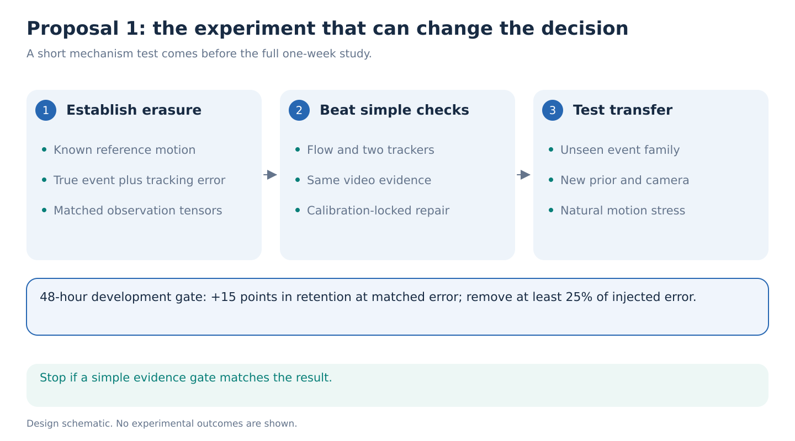

# 1. Preserve real movement while repairing tracking failures

**Decision:** A strong first experiment, with a demanding novelty gate. The aim is to improve what a pretrained motion model preserves, rather than to make its output look more typical.

**Research question:** Within seven days, can a small adapter around a frozen motion prior remove tracking errors while retaining unusual movement supported by the video, including a type of movement change absent from adapter training?

## The idea from first principles

A pose tracker estimates joint positions from video. A motion model can smooth those estimates and fill gaps. This is useful until the model removes a real movement because that movement differs from its training examples. A brief change in foot clearance can occupy very few frames. Deleting it might improve average reconstruction error while destroying the detail someone wanted to measure.

Consider two clips with the same apparent ankle excursion in their estimated skeletons. In the first, the ankle really moves. In the second, the tracker slips onto a shoe-shaped background object. The skeleton arrays can be identical. A skeleton-only method cannot know which explanation is correct. The additional evidence has to come from the video or another measurement.

The proposed adapter examines that additional evidence before accepting a repair. It returns a trajectory and an event-evidence probability. A threshold fixed on separate calibration people marks cases where it cannot decide whether the movement is real. Report errors together with the fraction of cases receiving a decision.

## What would be new

The proposed contribution is an **event-preservation test and a small adaptation method that improves its tradeoff**. At the same amount of tracking error removed, the method should preserve more true temporal events, including an unseen event type. The result should hold beyond the specific prior used to train the adapter.

This is a narrower and harder claim than “generative models hallucinate.” [Robust Prior Updates](https://arxiv.org/html/2606.02331v1) already addresses measurement-unsupported diffusion reconstruction. [CARE-PD](https://arxiv.org/html/2510.04312v1) already shows that generic motion models can miss clinical variation and benefit from clinical adaptation. [HTD-Refine](https://arxiv.org/html/2605.26879v1) directly addresses oversmoothing through video-derived velocity and acceleration. The remaining opportunity is to separate true events from matched tracker errors, then improve event retention at the same repair quality across unseen events and priors.

## Public starting point and exact bridge

Use released pretrained motion weights, with no foundation-model training. The preferred fast first pass is [MoMask's RVQ-VAE](https://github.com/EricGuo5513/momask-codes), which encodes and reconstructs motion. Its official download is published, but a successful model load remains a first-morning check. If that download fails, use the publicly released 50-step [Human Motion Diffusion Model](https://github.com/GuyTevet/motion-diffusion-model). The chosen model stays fixed throughout the primary experiment.

Convert existing AMASS body parameters to 22 body joints, including spine, shoulders, elbows and wrists. Resample to 20 Hz and use the released HumanML3D conversion to its 263-channel representation. Save the joint mapping, coordinate convention and inverse conversion, and check a round trip before fitting anything. The 11-landmark lower-body representation is a matched ablation; it is not the default input.

Render short RGB sequences from the same motion. The explicit measurement branch is frozen [SEA-RAFT](https://github.com/princeton-vl/SEA-RAFT), using the author-released [78.8 MB checkpoint](https://huggingface.co/MemorySlices/Tartan-C-T-TSKH-spring540x960-M/resolve/main/model.safetensors). It estimates how image locations move between two frames and supplies uncertainty estimates. The fallback is RAFT from its [official weight archive](https://raw.githubusercontent.com/princeton-vl/RAFT/master/download_models.sh). Public artifacts are listed; successful loading is a first-morning execution check.

For a candidate projected joint path q and flow u, compute `r[t] = q[t+1] - q[t] - u[t](q[t])`. This asks whether the proposed displacement agrees with nearby image motion. Use a robust neighborhood rather than trusting one pixel: sleeves and shoes can move differently from anatomical joint centers. Compare both the raw and repaired paths. Undo each crop's transform on both flow endpoints before comparing in full-image coordinates. Keep camera motion in both quantities, or compensate both identically. Missing, occluded or conflicting evidence must remain uncertain.

Flow and pose are additional representations of the same pixels, not statistically independent measurements. Forward-backward agreement, brightness consistency and the model's uncertainty are initially only diagnostics. Fit their event-evidence calibration on separate rendered people and conditions, then measure errors and decision coverage on held conditions. Do not interpret synthetic calibration as guaranteed calibration on GAVD.

A small temporal gate receives these transport checks, raw trajectories, the proposed repair and quality inputs. It predicts a weight between zero and one for retaining the raw-minus-repaired residual at each joint and time, plus the event-evidence probability. S-JEPA can supply the temporal adapter; compare an equally sized direct coordinate model. Local features from the existing frozen V-JEPA encoder are an additional tested input. They earn a role only if they improve upon the flow branch. Offline restoration may use the full declared clip; any forecasting variant must restrict flow pairs, tracking, cropping and feature context to the observed prefix.

Where raw coordinates are absent, use the prior and flag missing evidence. Project the mixed trajectory back onto the declared kinematic constraints, then score that final output, including any attenuation caused by projection. An oracle gate with access to reference truth gives the best attainable result from this raw/prior mixture. If that ceiling is inadequate, stop this gate design. On GAVD, [WHAM](https://github.com/yohanshin/WHAM) can supply estimated SMPL trajectories if its required body-model assets are available; these are not metric 3D ground truth.

## The experiment that makes the claim testable

Create two development event families on complete motion: a sustained change in arm-leg relative timing, and a brief smooth foot-clearance excursion. Reserve a separately constructed trunk-pelvis timing family for the final test, as specified in the common execution contract. Use joint-angle edits followed by forward kinematics so bone lengths remain valid. These are controlled movement changes, not synthetic diagnoses.

For each clean trajectory x and edited trajectory x_e, construct two cases with **exactly the same observed skeleton tensor z and metadata**. Case A shows rendered RGB of x_e and has reference truth x_e. Case B shows RGB of x and has reference truth x. Both videos use the same camera, background and body shape. Add the same declared coordinate noise to z in both cases if needed. Verify input-tensor identity directly. The pixels are the intended additional observation channel. They are not statistically independent ground truth.

Also cross event presence with independent tracking-noise presence, making four groups: neither, event only, noise only, and both. Include cases where event and noise overlap in joint and time. A method must preserve movement and repair noise within the same clip. Compare a simple clip-level switch between raw and repaired motion. Match duration, confidence, amplitude, velocity, frequency and boundary summaries across the relevant contrasts; reject a construction solved by those summaries alone.

Cross these with measurement failures: pose wrong but visible surface transport reliable; pose reliable but flow confused by texture, shadows or clothing; and both unreliable under occlusion. Hold out a camera or appearance condition. Exact mesh-derived flow verifies the synthetic measurement branch; flow predictions cannot serve as their own reference. A foreground-area or motion-magnitude summary must not identify which branch is trustworthy.

Fit on the first development event family and use the second for the 48-hour held-person development pilot. Both are development data once they influence the decision to continue. Keep the third, trunk-pelvis family unopened until the final test. Hold out people, motions, camera settings and a corruption mechanism before producing variants. Audit overlap with the prior's training data; adaptation holdout is not automatically pretraining holdout. Freeze the gate and its normalization before testing the second prior if claiming transfer across priors.

The primary plot measures **true event amplitude retained against tracking error removed**. Let d be the declared event descriptor and a = d(x_e) − d(x) its nonzero magnitude. For repaired output y, retention is 1 − |d(y) − d(x_e)| / |a|. Report signed error and overshoot, and do not clip negative retention. Fix descriptor definitions and minimum |a| on development data.

Choose each method's operating point on calibration people to target the same noise removal. Lock it before testing, then report both achieved removal and retention on test people. Measure noise relative to the correct underlying trajectory, including x_e when an event is present. A prespecified full strength curve may show the tradeoff, but its best test point cannot replace the locked primary comparison.

Required comparisons are raw pass-through, tuned smoothing, robust Kalman filtering, confidence gating, two-tracker disagreement, robust local flow propagation, calibrated SEA-RAFT checks, [MFTIQ's correspondence-quality method](https://arxiv.org/html/2411.09551v1), and the unmodified frozen prior. If the chosen base is diffusion, include a compatible robust-prior-update baseline. Include shuffled video and architecture-matched random features. Two trackers sharing systematic errors do not constitute independent ground truth.

[H-MoRe](https://arxiv.org/html/2504.10676v1) already learns flow using skeleton and boundary constraints. Compare that approach to separately pretrained flow, since training flow to follow a faulty skeleton could remove the disagreement needed here. Also compare HTD-Refine's derivative-guided refinement. Its [current official repository](https://github.com/ant-research/HTD-Refine) has released code and a checkpoint-folder link, although the older paper says release is forthcoming. Check the model download and its 30 FPS interface on day 1. If either comparator's exact weights are unavailable, implement and label a bounded adaptation of its published objective; report the missing exact comparison. Neither unreleased weights nor a full new HMR training run is a dependency.

An exactly observation-equivalent pair is a necessary negative control: duplicate every available input, including RGB, but balance the two hidden explanations within a controlled occlusion fixture. A probability of one half is appropriate for that balanced construction. Score probability error and decision coverage; confident answers should fail. This is calibration on the fixture's distribution, not a GAVD prevalence or clinical-calibration claim.

## First result and stop rules

**By 24 hours:** Load one prior and process a pilot of approximately 128 motion instances, grouped by person. Establish whether the prior actually removes supported events and whether simple confidence or optical-flow rules already solve the problem. These are proposed workload sizes, not verified available event counts.

**By 48 hours:** Train one small gate. On the held-person development pilot, require at least 15 percentage points more retention than the strongest baseline at calibration-locked operating points, with at least 25% of injected error removed and comparable achieved removal. These are practical thresholds, not predicted effects. A paired person bootstrap must support improvement, grouping all trials and variants. The final held-event test remains untouched; if identities are unknown, report only the weaker recording-level result.

Stop the method claim if the signal vanishes after shortcut matching or a simple calibrated flow gate matches the full preservation-versus-repair frontier. Drop only the optional V-JEPA branch if it adds nothing beyond flow; that does not invalidate a useful flow-supported adapter. Do not spend the rest of the week tuning around a failed mechanism.

## One-week allocation

| Work | Estimated H100 GPU-hours | Timing |
| --- | ---: | --- |
| Load, convert, render and cache pilot | 40 | Day 1 |
| Baselines and first gate | 40 | Day 2 |
| Expand passing method, three optimization seeds | 80 | Days 3 to 4 |
| Second prior family and natural-motion stress tests | 80 | Days 5 to 6 |
| Final verification and contingency | 40 | Day 7 |
| **Budget cap** | **280** | **One alternative study** |

These are unmeasured planning allowances. Benchmark throughput on day 1 and reduce sample counts before exceeding the cap. Rendering, storage and body-model access can dominate elapsed time. Use the eight GPUs for independent conditions and seeds; the experiment does not need eight-way training.

For external tests, use naturally unusual AMASS motions selected before looking at errors, then CARE-PD and GAVD. Evaluate only observable event preservation on GAVD. Any source-grouped presentation classification is secondary. A model-generated trajectory is never the clinical reference.

## What would justify an ICLR paper

A compelling result would show that standard reconstruction rankings systematically favor deletion of rare but supported motion, then demonstrate that a tiny adapter corrects that failure across unseen events and model families. The decisive figure is the improved preservation-versus-repair frontier, backed by real-motion transfer.

A useful null would show that cheap measurement checks already solve the problem, or that the assumed erasure does not occur. That would improve the repository's workflow, but would not establish the proposed ICLR contribution. Novelty and significant effect size remain hypotheses until these gates pass.
