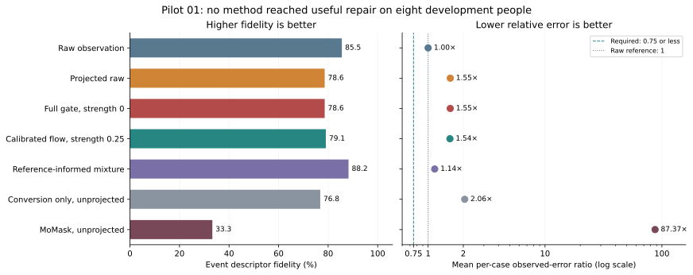
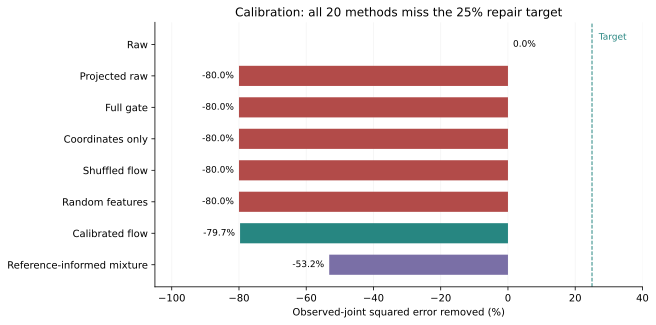

# Pilot 01: real execution succeeded, but the repair regime failed

Analysis date: 14 September 2026. Evidence: the five executed notebooks under `notebook_runs/motion-preservation/notebook_runs/run-00` through `run-04`. Cell references below count all notebook cells, starting at one.

**The pilot does not support the proposed preservation advantage. The saved decision is `development_stop`, and that decision is justified. Every method missed the calibration repair target. The learned gate was evaluated at zero global repair strength, where the shared bone-length projection largely determines its observed-joint result.**

This is a useful diagnosis for the next experiment. Real AMASS preparation, MoMask reconstruction, SEA-RAFT inference, training and development evaluation now run. The immediate research task is to establish a useful repair regime and isolate the projection penalty before spending more compute on the learned gate. Keep the final set reserved.

## 1. What actually ran

The saved notebooks all report completion with no error outputs. Their setup cells identify real mode; `config/default` in the later launch metadata means the runner deferred to configuration, not that it switched to a demo. The configuration records CUDA, but the notebook copies do not independently identify the allocated GPU model or memory use.

| Quantity | Recorded pilot value |
| --- | --- |
| Motion and image models | MoMask RVQ reconstruction and SEA-RAFT |
| Input | 3.2-second motions at 20 Hz; 128 × 128 rendered images |
| Training sample | 6 accepted motions from 6 people; 48 constructed cases |
| Calibration sample | 8 motions from 8 people; 64 cases |
| Development sample | 8 motions from 8 people; 64 cases |
| Total | 22 accepted motions, 176 constructed cases |
| Learned arms | Full features, coordinates only, shuffled flow, random features |
| Optimization | One seed, 17; 10 epochs; hidden width 64; batch size 16 |
| Evaluation target | At least 25% observed-joint squared-error removal; at least 15 percentage points of retention gain |
| Strength grid | 0, 0.25, 0.5, 0.75, 1 |
| Evaluated split | Development, with foot-height events |

Sources: [notebook 00](../../../../notebook_runs/motion-preservation/notebook_runs/run-00/00_data_and_question.ipynb), cells 3 and 12; [notebook 01](../../../../notebook_runs/motion-preservation/notebook_runs/run-01/01_make_controlled_pairs.ipynb), cells 6 and 7; [notebook 03](../../../../notebook_runs/motion-preservation/notebook_runs/run-03/03_train_and_calibrate.ipynb), cell 7.

There are only **eight independent development person-motion cases with both event and tracking noise**. Camera/label variants are not additional people. Two selected training motions did not produce cases; the current code suggests rejection by the event-descriptor margin, but the missing exclusion file prevents confirming their identities and reasons.

The displayed sources include both a walk with a handrail and a squat. Describe this as a controlled human-motion pilot, not an exclusively walking or clinical-gait cohort. The 8,854 AMASS manifest rows and 1,874 GAVD sequences displayed by notebook 00 are inventory counts, not the sample size of this experiment. No GAVD or final-test result is included.

## 2. The primary result is negative



*Source: notebook 04, cell 9. The error ratio is the person-weighted mean of per-case observed-joint MSE ratios, equal to one minus reported noise removal. It is not the ratio of two pooled MSE summaries. A ratio at or below 0.75 would meet the 25% repair target. The reference-informed mixture uses hidden truth and is a diagnostic.*

| Method at its reported operating point | Retention | Error removal | Mean error ratio to raw |
| --- | ---: | ---: | ---: |
| Raw observation | 85.54% | 0.00% | 1.000× |
| Projected raw | 78.61% | −54.70% | 1.547× |
| Full learned gate | 78.61% | −54.70% | 1.547× |
| Calibrated flow gate | 79.07% | −53.69% | 1.537× |
| Reference-informed mixture | 88.23% | −13.85% | 1.139× |
| Conversion only, unprojected | 76.81% | −105.66% | 2.057× |
| MoMask, unprojected | 33.26% | −8,636.52% | 87.365× |

Negative removal means that the method **increased** error. In particular, MoMask's reported fraction `-86.365216` means an approximately 87-fold mean error ratio, not an 86% increase.

The full gate retains **6.92 percentage points less than raw input**. Against the reported flow comparator, its retention difference is **−0.458 percentage points**, with a saved person-bootstrap 95% interval of **[−0.785, −0.098] percentage points**, based on eight people. This is a small negative comparison, far from the +15-point target. The interval describes these selected people and this configuration; it does not establish broad population performance.

`matched_achieved_repair: true` is not a success. The methods have similarly poor error removal, separated by about one percentage point. Both miss the minimum repair target. On event-plus-noise cases specifically, full-gate removal is −53.89% and flow-gate removal is −52.67%. The same-clip criterion also fails. Source: [notebook 04](../../../../notebook_runs/motion-preservation/notebook_runs/run-04/04_preservation_and_repair.ipynb), cells 9 and 14; [exact decision](pilot-01/development_decision.json).

## 3. Calibration mostly disabled the candidate repairs



**All 20 calibration entries have `feasible=False`.** All four learned feature arms select strength zero. Most other repairs also select zero. The `calibrated_flow_gate` selects 0.25 but still increases calibration error by 79.68%. The reference-informed mixture increases it by 53.16%.

Consequently, `calibrated_flow_gate` is the code's fallback comparator when no feasible comparator exists. It should not be described as the strongest successful repair baseline. These values come from notebook 03, cell 10, and are preserved in the [calibration table](pilot-01/calibration_points.csv).

The current strength operation is:

```text
mixed = raw + strength × (candidate − raw)
missing positions use candidate values
output = bone_length_projection(mixed)
```

At strength zero, observed positions return to raw **before projection**. If all relevant joints are observed, the final output is projected raw. Missing positions still use the candidate; a missing ancestor can also affect an observed descendant during projection. In this pilot the full, coordinate-only, shuffled-flow and random-feature arms have the same primary retention and observed-joint repair scores to displayed precision, while their completion errors differ. See [repair_models.py](../../../../src/gavd6_sjepa/research_directions/motion_preservation/repair_models.py), `mix_at_strength`.

This means the locked scores do not provide an informative comparison of the learned arms' restoration capabilities. They demonstrate that calibration rejects the candidate corrections and leaves a shared projection penalty. The penalty is already visible in the projected-raw baseline, before any neural correction is accepted.

## 4. The prior damages this input more than it repairs it

Notebook 02, cell 12, supplies the separate **full-strength** comparison. It must not be confused with the zero-strength `prior` row in notebook 04.

- Unprojected MoMask has retention 33.26% and an error ratio of 87.365× raw.
- Projected MoMask has retention 32.01% and an error ratio of 87.812× raw.
- Gaussian and median filtering retain 85.79% and 87.14%, but their error ratios are 3.939× and 4.547× raw. Their displayed versions include the common projection.
- No non-raw full-strength baseline achieves positive error removal.

The raw observed-joint MSE is approximately 0.000027 m²; the unprojected prior's is 0.002420 m². Taking square roots of these displayed aggregate MSE values gives approximately **5.2 mm versus 49.2 mm**. These are derived RMS distances, not mean joint-distance errors, and their ratio need not equal the mean per-case error ratio.

The configured corruption is localized to a small number of joints and frames. Most joint positions remain correct. A reconstruction that changes the whole body can therefore spend much more error than it removes. MoMask is being used as an RVQ reconstruction model; successful loading does not establish that it is a suitable denoiser for this particular corruption level and motion distribution.

**Low retention is evidence of descriptor distortion, not yet evidence of event erasure.** Retention uses an absolute descriptor error, so suppression and overshoot both reduce it. The saved summary does not show signed event errors or the relevant motion traces. The central premise still needs a direct demonstration that the prior suppresses supported events in a regime where repair is otherwise useful. Source: [notebook 02](../../../../notebook_runs/motion-preservation/notebook_runs/run-02/02_prior_flow_and_baselines.ipynb), cell 12; [full-strength table](pilot-01/full_strength_baselines.csv).

## 5. Projection is the first mechanism to isolate

The measured projection penalty is clear; its precise cause on development motions is not. Three explanations deserve separate checks:

1. **Biased length estimates.** Sustained tracking displacement can change the median observed segment length. Enforcing that estimate then spreads a local error to neighboring joints.
2. **The projection algorithm itself.** Sequentially preserving directions and enforcing lengths is not the same as finding the closest valid skeleton under total joint-position error. Even correct lengths need not make this particular operation improve a noisy trajectory.
3. **Time-varying reference lengths.** The official [BodyModel](https://raw.githubusercontent.com/nghorbani/human_body_prior/78c86eae5ed518ae22bf197fd74211bbfa45551a/human_body_prior/body_model/body_model.py) passes dynamic shape components into skinning. Its [skinning implementation](https://raw.githubusercontent.com/nghorbani/human_body_prior/master/human_body_prior/body_model/lbs.py) regresses joints from shaped vertices. Reference segment lengths can therefore depend on those components. Their variation in this pilot has not been measured.

The displayed bridge checks argue against immediately blaming a coordinate-convention failure. For the first two KIT training motions, clean conversion errors are about 0.16–0.53 micrometers, while corrupted-input errors are about 0.93–1.66 mm. Projected conversion and projected raw also agree to displayed precision, consistent with restoration of directions followed by the same median-length projection. These two training examples cannot settle the development diagnosis.

A separate local probe applied the same corruption mechanisms to the author's bundled HumanML3D example. Median-length projection worsened error in four of eight tested settings, including one increase of about 44.6%. Using reference-derived lengths did not guarantee improvement either. This demonstrates a possible projection failure without needing pilot-specific DMPL behavior. **It is a diagnostic on another motion, not a reanalysis of the HAIC cases or a new study result.** The [probe table](pilot-01/author_example_projection_probe.csv) records those outcomes.

Gap completion is also poor. Although only about 0.0541% of the development positions are missing, full-gate completion MSE is 0.002722 m² versus 0.000159 m² for raw interpolation, approximately 17 times higher. This remains separate from the observed-joint primary metric and is another reason zero strength cannot be called an identity operation.

## 6. The evidence head has not demonstrated useful discrimination

Training completes in 29.8 seconds. Final losses are 0.0916 for full features, 0.0917 for coordinates, 0.0893 for shuffled flow and 0.1737 for random features. The training plot shows the full and coordinate restoration curves nearly overlapping. This establishes optimization progress, not a benefit from image evidence.

On development data, all learned arms and the calibrated flow gate have **zero decision coverage**. Full-gate Brier score is 0.249971 on nonambiguous cases and 0.250001 on ambiguous cases, effectively the constant-0.5 baseline. Selective accuracy is undefined because no judgments pass the threshold. Abstaining on the ambiguous fixture is appropriate, but abstaining on everything does not demonstrate useful discrimination. Raw-logit rankings and AUROC are not saved, so these calibrated outputs do not establish that every possible ranking signal is absent.

Shuffled flow's ambiguous Brier score of 0.242725 does not establish recovery of an impossible hidden label. The control assigns shuffled evidence separately across cases, so paired inputs need not remain identical; finite-sample fluctuations are also possible. The nuisance-only probe obtains balanced accuracy 0.5 on eight people. That is reassuring for its listed scalar features, not proof that every shortcut is absent. Sources: notebook 03, cells 7–8; notebook 04, cells 9 and 14.

## 7. Flow runs, but its event evidence is still unverified

The displayed notebook-02 flow preview contains surface-reference endpoint errors of approximately **0.129–0.813 pixels**, over **34.6–92.8% of foreground pixels** and **0.27–3.48% of all pixels**. These are ranges from a displayed subset, not a full-sample summary. Fully occluded examples correctly have undefined reference error.

Low average surface error does not show that flow distinguishes the raw and prior trajectories at the event joint. The next check needs their transport-residual differences and validity near the foot event. At 128 × 128 resolution, the proposal's 2 mm descriptor eligibility margin does not itself establish visible image evidence. Actual projected event displacements and descriptor magnitudes were not included in the saved development summary.

The preview image shows broad mesh/overlay alignment. A single training frame cannot establish temporal event visibility, anatomical correspondence accuracy or development performance.

## 8. What to do next, in order

**First, diagnose with the existing development caches.** Retrieve the saved per-case scores, calibration strength curve, case index and prediction arrays. For each motion, compare raw, projected raw, conversion-only, and full prior. Separate clean/no-noise and event/noise cases. Report error on originally corrupted joints, error introduced elsewhere, signed event-descriptor error, segment-length variability and length-estimation bias. Keep all-joint observed error as the primary repair metric so damage to unaffected joints remains visible.

**Second, establish an interpretable repair family.** Compare unprojected simple filters with their projected versions and an exact no-change endpoint. If projection is harmful, test omitting it or using a softer constraint, consistently during fitting and evaluation. Handle gap completion separately. These are development changes and require new calibration; do not relax the target or omit damaged joints simply to obtain a pass.

**Third, locate a repair regime before adding a larger model.** Use a small, prespecified range of corruption magnitudes and matched observation baselines, including temporal settings appropriate to bursts versus oscillation. Check MoMask on clean and corrupted inputs and inspect its spatial and temporal reconstruction errors. The current five-point strength grid may miss useful small corrections, so inspect the saved curve and refine it near zero on calibration data only. If the prior still cannot contribute useful repair, replace the candidate repair mechanism rather than scale the same failed configuration.

**Fourth, test whether image evidence resolves the intended ambiguity.** Measure raw-versus-prior transport separation on the exactly skeleton-matched examples, with uncertainty by person. Inspect the complete temporal examples and event visibility. Only after a meaningful image-evidence signal and useful repair are present should another learned-gate fit be the priority.

Expand training people and add optimization seeds after those checks pass. The existing manifest has only nine calibration and ten development people, so adding clips from the same people gives limited new independent evidence. Preserve the final split; neither more seeds nor repeated clips can substitute for new people.

## 9. Runtime and evidence limits

| Stage | Notebook elapsed time | Main operation printed in notebook |
| --- | ---: | ---: |
| Inventory | 49.8 s | 2.6 s |
| Controlled pairs | 906.4 s | 893.3 s |
| Prior and flow cache | 241.2 s | 226.7 s |
| Train and calibrate | 102.2 s | 29.8 s for training alone |
| Development evaluation | 32.1 s | 10.3 s |

The sum of notebook elapsed times is about **22.2 minutes**. This excludes scheduling delays, gaps between invocations and any earlier setup attempts. Accepted motion-pair construction took 37.0–49.1 seconds per motion. The pilot suggests rapid diagnostic iteration is practical; it is not a measured full-scale throughput guarantee.

Only notebook copies are available in this local result bundle. Full summary and calibration tables are preserved in their HTML, but the per-case preview and 160-row grouped report are already truncated there. This prevents recomputing intervals, tracing individual outliers, or diagnosing the exact projection mechanism from the copied outputs alone. Several displayed configuration paths are truncated, and the execution metadata does not record the exact source revision.

The most useful existing files to bring alongside the notebooks are `results/development_scores.csv`, `calibration/strength_curve.csv`, `calibration/locked.json`, `cases.csv`, `excluded_motions.csv`, `models/training_history.csv`, `models/training.json`, `config.json`, and `predictions/momask/index.csv`. Geometry and temporal diagnoses additionally need the selected case/prediction arrays. These are existing experiment outputs, not a request for an additional tracking framework.

The [extracted evidence folder](pilot-01/README.md) preserves displayed values and two figures. No study implementation, fitted weights, calibration or held-out data were changed for this analysis.
