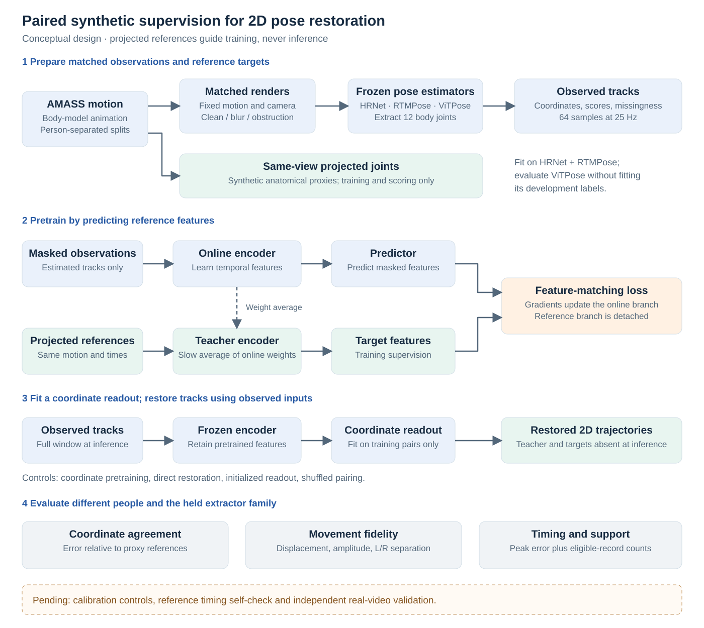

# Abstract version 07 — ICLR draft before diagnostics

**Historical draft:** this was recommended before the completed calibration and motion checks. Use [version 08: calibration and motion results](abstract-v08-calibration-motion.md) for the current abstract. The original text below is preserved.

19 September 2026. Follows [revision 06](abstract-v06-iclr.md), incorporating final independent reviews of evidence, laterality and ICLR positioning. This is the recommended wording for the evidence presently available, not a claim that the complete paper is ready for acceptance.

## Recommended title

**Paired Synthetic Pose Restoration: Testing Accuracy and Movement Preservation**

## Abstract

We investigate paired synthetic supervision for correcting 2D pose trajectories while preserving movement amplitude, timing and left–right relationships. Earlier reported motion-capture experiments with imposed joint-name swaps showed side-sensitive measurement errors, while setting naming probabilities to 50/50 matched the proposed laterality model’s gain. An audited synthetic-adaptation study found no added benefit from response-based lesson selection over a matched selector without that response. We pair image-estimator tracks from controlled renders with projected anatomical proxies. A joint-embedding predictive architecture (JEPA) predicts reference features, then uses a separately fitted coordinate readout on its frozen encoder. Controls include coordinate pretraining, direct restoration and shuffled pretraining pairs; development people and ViTPose are excluded from fitting. In a summary-reported pilot with two development people and one seed, paired JEPA improves coordinate error over coordinate pretraining by less than 1% on HRNet and ViTPose, with both reported 95% intervals including zero, and worsens RTMPose by 14.0%. A fitted temporal readout on an untrained frozen encoder yields similar or lower coordinate-error point estimates than paired JEPA. For signed horizontal image-plane ankle separation, amplitude is supported on 12 of 48 correlated records; no paired-JEPA record satisfies the joint reference-and-prediction peak-timing criteria. Planned calibration and reference self-checks will measure how much improvement simple corrections recover and how many records can support timing. Synthetic movement preservation remains unresolved, and real-video transfer is untested.

## What changed after the final reviews

- Restored the full objective: amplitude, timing and left–right relationships. The executed proxy is explicitly narrower: signed horizontal image-plane ankle separation.
- Identified the historical laterality setting as motion capture with imposed label swaps, so it cannot be mistaken for naturally occurring real-video errors.
- Named the original study’s matched selector without response information. The original full selector improved over replay; its absence of incremental benefit concerns the matched comparison.
- Described the initialized control as a fitted **temporal** readout on an untrained frozen encoder. Its point estimates challenge the value of encoder pretraining in this recipe without establishing equivalence or the absence of temporal learning.
- Separated unresolved preservation in the synthetic pilot from untested real-video transfer. Additional real video alone would not repair an unsupported synthetic endpoint.

## Fixed-rubric assessment

| Dimension | Weight | Score / 10 | Reason and remaining weakness |
| --- | ---: | ---: | --- |
| Conference relevance and contribution | 20% | 7.0 | Directly addresses paired supervision and measurement-relevant representations; the matched controls give a clear ICLR question but not an established broadly significant result. |
| Claim accuracy and evidence support | 20% | 9.0 | All comparative baselines, proxy targets, summary status, operational support and predecessor boundaries are explicit; independent prediction-level verification is still absent. |
| Evaluation and statistical rigor | 15% | 3.5 | No change in data: two development people, one seed, incomplete motion support and no independently referenced real transfer. |
| Scientific insight and related-work positioning | 15% | 7.5 | Distinguishes supervision, pretraining and readout explanations in light of primary prior work; their causal contributions remain unresolved. |
| Reproducibility | 10% | 5.5 | Audits and code are available, but missing laterality/restoration prediction artifacts prevent full reconstruction. Summary arithmetic is labeled exploratory. |
| Clarity and narrative | 10% | 8.5 | The scope and implemented endpoint are clear; the historical bridge remains information-dense because it connects genuinely different experiments. |
| Figures | 5% | 7.5 | Reviewed vector pipeline is clear and accurate; its print-scale typography and lack of empirical trajectory plots remain limitations. |
| Submission fit | 5% | 8.5 | Informative anonymous abstract and appropriate representation-learning scope; formal fit does not make the evidence sufficient for acceptance. |

**Weighted total: 70.50 / 100 — unchanged from revision 06.** All three independent reviewers recommended a plateau. The final changes improve precision within the existing score bands; no people, seeds, verified predictions or preserved-motion results have been added.

## Remaining critique and concrete next improvements

The strongest rejection argument is still substantive: the central result comes from two development people, does not establish a consistent latent-prediction advantage and cannot yet establish movement preservation. A careful small pilot is useful, but it is not automatically a general contribution. Changing the title cannot resolve this.

With existing caches, finish the [calibration, reference-self timing and trajectory checks](../../../../slurm/synthetic-training-v2/README.md#repair-extraction-status-verification), preserving the original run. A successful check must produce artifacts before its finding enters the abstract. Simple calibration recovering most coordinate improvement would support a bounded mechanism result; it would not prove a particular anatomical-mapping cause. Strong reference timing support with poor prediction coverage would locate a model-side limitation more clearly, while low reference support would motivate a newly declared measurement design.

A stronger paper then needs independent people and motions, repeated seeds and adequate optimization, plus independent anatomical references and dense real temporal evaluation for transfer. Recovering the original prediction artifacts would also improve reproducibility. These are evidence requirements, not promises of favorable outcomes before the deadline.

For the prose alone, an author could replace one predecessor sentence with a concise literature reference in the introduction if the abstract feels crowded. We retain both studies here because they explain the current question and the need for matched controls. No more abstract detail is likely to repair the principal weaknesses.

## Figure and source boundary

The same motion and camera yield rendered observations and projected reference joints. The temporal encoder predicts teacher features during pretraining; projected **training** references also supervise the separately fitted coordinate readout. Inference fixes the fitted model and receives only observed tracks. “L/R separation” denotes signed horizontal ankle separation. The diagram depicts method flow and planned evaluation, not achieved preservation. Pending calibration and real-video validation are marked explicitly. Use the SVG or [vector PDF](images/abstract-training-pipeline-20260919-v01.pdf) at a readable size; simplify labels before shrinking into a paper column.

The [evidence and scoring record](abstract-20260919-evidence-and-rubric.md) distinguishes source summaries, retained aggregates, adjacent real-video diagnostics, analytic fixtures and proposed work. The [laterality](abstract-laterality-audit-20260919-v01.md), [original-study](abstract-original-study-audit-20260919-v01.md), and [primary-literature](abstract-literature-positioning-20260919-v01.md) audits provide independent critiques and supporting links. No new training or real-video restoration experiment was performed for this manuscript revision.
