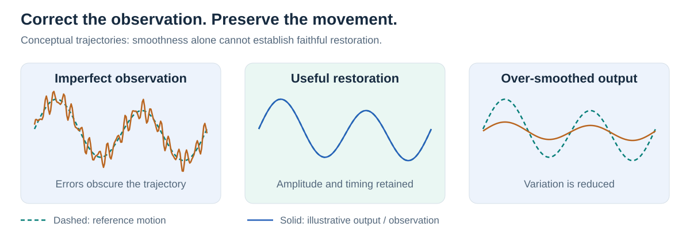
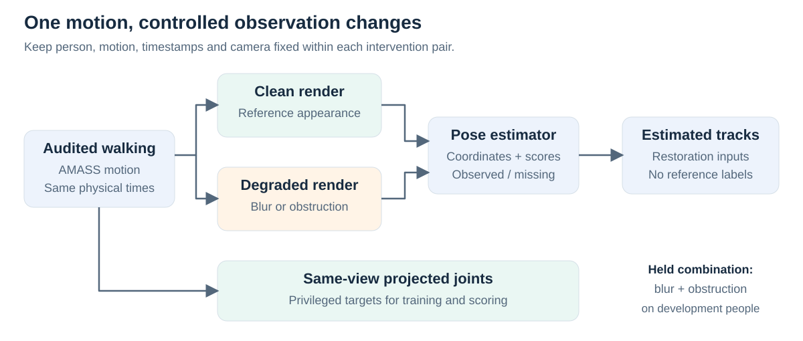
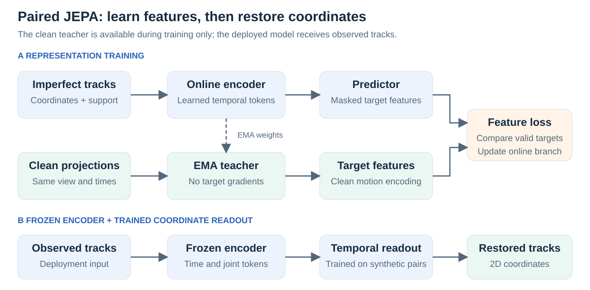
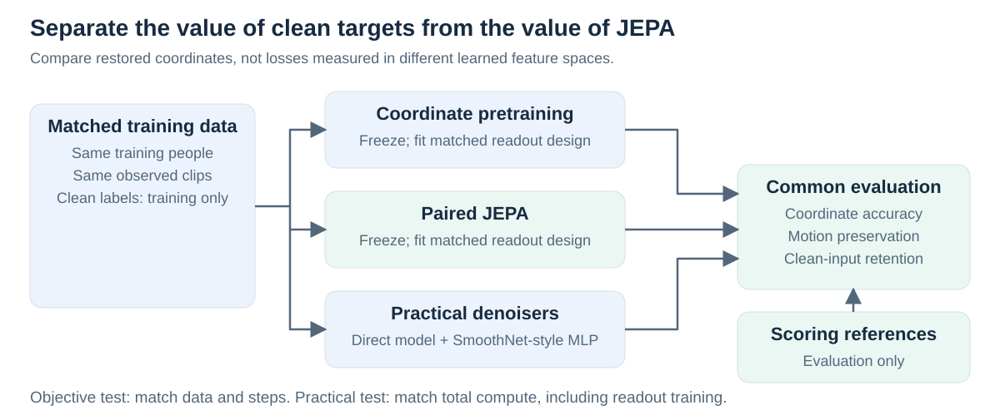
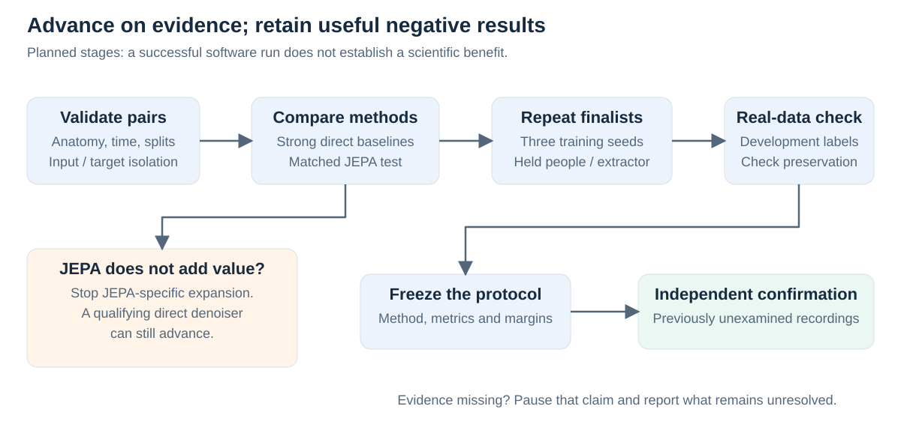

# Correct pose errors without erasing gait

*Short research proposal · 18 September 2026 · Prospective study; illustrations are conceptual, not results.*

## Introduction

Blur and obstruction can make a person appear to move differently. Temporal correction may improve estimated joint positions, yet also suppress real changes in timing, amplitude or left–right coordination. We ask: **can paired synthetic motion train a temporal skeleton JEPA to restore imperfect pose tracks while preserving movement better than direct denoising?**

The initial task is **offline 2D sequence restoration**: every method receives the same full observed clip. It is a measurement study, with clinical utility requiring separate evidence.

*Figure 1. A smoother trajectory can still be wrong. Restoration must retain reference movement amplitude and timing.*

## Motivation

The original synthetic-training pilot improved over replay in some settings, but its response-based lesson selector did not beat simpler scene selection. The extra retrospective oracle benefit of estimator-specific choices was only **0.0406%** on that small development panel. This motivates testing the quality of synthetic supervision before expanding personalization ([pilot audit](../artifact-audit.md)).

Temporal refinement and masked motion learning already have strong precedents: [SmoothNet](https://arxiv.org/abs/2112.13715), [PoseBERT](https://arxiv.org/abs/2208.10211) and [S-JEPA](https://www.ecva.net/papers/eccv_2024/papers_ECCV/html/4755_ECCV_2024_paper.php). Our proposed contribution is a controlled test of **restoration versus motion distortion**, including whether latent prediction adds value beyond equally informed coordinate learning.

## Methodology

**1. Construct matched observations.** Audit walking sequences from [AMASS](https://arxiv.org/abs/1904.03278). Render identical motion, timestamps and camera geometry under clean, blurred and obstructed conditions; hold blur-plus-obstruction out from fitting. Extract 12 common body joints, native estimator scores and missing-observation flags. Use 64 samples at 25 Hz, spanning 2.52 seconds. Keep projected synthetic targets separate from inference inputs, and audit their anatomical correspondence before interpreting real accuracy.

*Figure 2. Change observation conditions while holding movement fixed. All windows and render variants from a person remain grouped across splits.*

**2. Learn restoration representations.** An online temporal encoder processes imperfect tracks. A predictor matches masked features from an exponential-moving-average (EMA) teacher receiving same-view clean projections. This uses **privileged synthetic supervision**. After pretraining, freeze the encoder and fit a temporal coordinate readout on training pairs. Deployment uses observed tracks only; missing joints receive prediction queries without revealing target validity.

*Figure 3. The teacher guides training; it is absent at deployment. The candidate is a local S-JEPA-inspired adaptation, not a new official S-JEPA release.*

**3. Make the comparison decisive.** Compare paired JEPA with same-backbone coordinate pretraining, direct denoising, a SmoothNet-style temporal MLP, unchanged tracks and simple filters. Add initialized-encoder, ordinary masked-JEPA, shuffled-pair and non-temporal controls. Match clean-label access, encoder/readout capacity and tuning opportunities where isolating the objective. Separately compare practical methods at equal total compute, including pretraining and readout fitting.

*Figure 4. Ordinary JEPA tests the value of clean targets; matched coordinate pretraining tests the value of latent prediction.*

**4. Measure accuracy and preservation.** The primary endpoint is visible-landmark error normalized by an independent reference-box diagonal, with missing predictions penalized. Companion measurements assess fixed-time displacement, signed ankle separation, amplitude and supported event timing, plus retention on clean inputs. Synthetic hidden-joint scores remain separate from independently annotated real-visible scores. Use people or verified recording groups for paired uncertainty and report training-seed variability separately.

Run one-seed feasibility checks, then three-seed finalist comparisons and independent real development before freezing confirmation. Reserve people, nuisance combinations and an extractor family before selection. Begin dense-annotation feasibility early; sparse labeled frames cannot establish temporal preservation. Proposed 2% coordinate improvement, 5% displacement-error reduction and less than 1% clean degradation are planning targets requiring calibration, not clinical thresholds. The provisional 48 H100-hour development ceiling includes rendering and extraction; annotation effort is budgeted separately.

*Figure 5. JEPA failure stops that branch; a useful direct denoiser can still proceed. Missing references leave the affected claim unresolved.*

## Impact

Faithful restoration could make camera-based movement measurements more dependable under difficult observation conditions. The strongest outcome would be an accuracy gain that preserves independently measured motion and transfers across held people and pose extractors. A direct denoiser outperforming JEPA would also be useful evidence, identifying a simpler route to reliable measurement.

The study will distinguish cleaner-looking output from better observation. It will retain negative results and testable limits rather than infer clinical benefit from synthetic motion. Image-estimator adaptation is a separate supporting branch; personalized teaching and video-feature extensions remain conditional on new evidence.

*Study detail: [research plan](../../../../notes/prompts/03_improvement_plan.md) · [development protocol](../protocol.md) · [figure and workflow review](review.md).*
