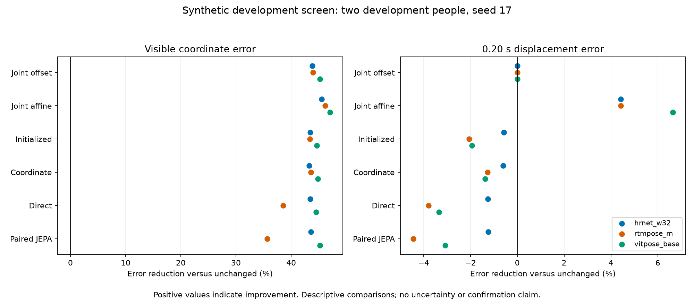

**Downloaded HAIC diagnostics: analysis of source-smoke-01, 19 September 2026**

The downloaded results support substantial correction of synthetic coordinate error with small spatial calibration models. They do not demonstrate a consistent advantage for paired JEPA, and the current evaluation panel cannot establish full motion preservation. Reference visibility, frame-varying normalization, and the distinction between coordinate and movement errors explain several results that were unresolved in the console report.

This analysis reads diagnostic attempt `20260919T083049222781Z-065a97` from completed CPU job `119615`. It creates separate analysis artifacts; downloaded evidence and scientific gates are unchanged. Percentages below use the full-precision CSV values, which slightly refine earlier estimates calculated from the rounded report.

**Evidence and independent checks.** The diagnostic tables contain seven evaluated methods, 48 correlated track records per method, two development people, two motions, four physical windows, four rendering conditions and three pose extractors. Training used two different people and HRNet/RTMPose; calibration provenance excludes ViTPose. There is one neural training seed, 17. Clean/blur versions of one window share a reference trajectory, and extractor copies are also repeated measurements.

I independently reaggregated all 168 overall metric cells and 672 condition-specific cells from the 336 saved per-window rows, preserving the original hierarchy and propagation of unsupported measurements. All 840 cells agree, including missing values; the maximum absolute numeric difference is approximately 7.46e-17. I also reconstructed the 24 timing-summary rows from per-window event counts and errors, verified all 3,000 training-history rows against the planned phases, and matched six local diagnostic code hashes to the recorded versions. Input files retain their hashes after analysis.

The downloaded folder contains calibration prediction arrays but no original source bundle, targets, or neural prediction arrays. Therefore this is an independent audit of the diagnostic tables and provenance, not a fresh inference run or full raw-prediction reconstruction. The successful HAIC reconstruction of all twelve source methods remains retained remote evidence in `analysis.json`. The full source outcomes for filtering, ordinary/shuffled JEPA, SmoothNet and the static control are not included in these seven-method diagnostic tables, although histories for all eight learned arms are present.

Reproduce the calculations from the `gavd6` checkout:

```bash
MPLCONFIGDIR=/private/tmp/stv2-analysis-matplotlib \
  /private/tmp/gavd6-stv2-cpu/bin/python \
  docs/studies/synthetic-training-v2/results/postrun-analysis-20260919/recompute.py
```

[Verification and input hashes](verification.json), [independent aggregation checks](aggregate-verification.csv), [recomputation script](recompute.py).

**Coordinate accuracy is dominated by inexpensive controls.** Lower normalized visible-landmark error is better; units are fractions of an independent reference-box diagonal.

| Extractor | Unchanged | Joint offset | Joint affine | Paired JEPA |
| --- | ---: | ---: | ---: | ---: |
| HRNet-W32 | 0.01733744 | 0.00973411 | **0.00944064** | 0.00978585 |
| RTMPose-M | 0.01571119 | 0.00880070 | **0.00845939** | 0.01011260 |
| ViTPose-Base | 0.01834947 | 0.01005707 | **0.00972228** | 0.01004712 |

The 24-parameter joint offset reduces error by 43.85%, 43.98% and 45.19%, respectively. The 72-parameter affine residual reduces error by 45.55%, 46.16% and 47.02%. Paired JEPA reduces it by 43.56%, 35.63% and 45.25%. These spatial models share the input-only window normalization used by the neural models; they do not require temporal pretraining. This demonstrates that gains of this size can occur without latent prediction. It does not identify which computations the neural networks learned.

Conditional joint residuals support a spatial-bias interpretation. Equal-row averages over finite joint errors show approximately 7-pixel horizontal hip biases and 9-pixel upward hip biases in the unchanged tracks. Offset correction brings the mean hip vertical residuals below one pixel. These are descriptive conditional pixel statistics, not the primary balanced normalized endpoint. Differences between synthetic joint-center projections and estimator landmark conventions are a plausible explanation, but no anatomical annotation or causal intervention establishes that mechanism.

[Method comparisons](method-comparisons.csv), [conditional joint residuals](conditional-joint-residuals.csv).

**The small aggregate JEPA gains do not hold consistently across conditions or people.** Paired JEPA's coordinate advantage over coordinate pretraining is 0.48% for HRNet and 0.72% for ViTPose; it is 14.04% worse for RTMPose. Both favorable aggregate comparisons reverse direction between the two development people. RTMPose is worse for both people.

| Extractor | Clean | Blur | Obstruction | Blur + obstruction |
| --- | ---: | ---: | ---: | ---: |
| HRNet-W32 | +8.25% | +1.01% | −2.25% | −5.07% |
| RTMPose-M | −1.39% | −11.12% | −17.53% | −26.47% |
| ViTPose-Base | +5.03% | −2.12% | +1.20% | −0.35% |

Values are reductions in coordinate error relative to coordinate pretraining; negative values mean paired JEPA is worse. The blur-plus-obstruction combination is excluded from training, and paired JEPA is worse in that condition for all three extractors. Affine calibration is the best of the seven reported methods in 11 of 12 extractor/condition cells; direct denoising is best for HRNet clean. This is a descriptive comparison over repeated observations, not twelve independent experiments.

Comparing absolute errors between clean and obstructed conditions requires care: the visible-reference population changes. Across four windows for one extractor, clean/blur scoring includes 3,058 visible joint-frame samples, whereas obstruction variants include 1,645. Lower-limb support falls from 1,522 to 109 and bilateral ankle support from 242 frames to zero. A lower visible error under obstruction does not establish accurate recovery of the hidden ankles. Within each condition, methods share the same reference mask.

[Condition comparisons](condition-comparisons.csv), [per-person balanced metrics](person-balanced-metrics.csv).

**Displacement accuracy worsens for the neural methods shown.** All four neural methods in the diagnostic comparison have higher aggregate 0.20-second displacement error than unchanged tracks for every extractor. For paired JEPA, the increase is 1.23% for HRNet, 4.44% for RTMPose and 3.08% for ViTPose. Affine calibration reduces these errors by 4.42%, 4.42% and 6.64%. The offset preserves displacement algebraically, with only negligible floating-point differences in the retained scores.



The affine control is consequently a strong practical comparator, but it is not established as a solution for motion preservation. In the support-only amplitude diagnostics for one person's fully visible window, its amplitude ratios range from about 0.806 to 0.847 across conditions/extractors: roughly 15–19% attenuation. These are individual supported cases, not a replacement for the unsupported full-panel amplitude endpoint. Paired JEPA also has uneven supported ratios, ranging from approximately 0.941 to 1.346 across its twelve supported track records.

**The reference-coverage failure now has a specific explanation.** Per extractor, twelve of sixteen track records are timing-ineligible, and every one has a reference visibility gap:

| Reference records per extractor | Both ankles visible | Timing eligibility |
| --- | --- | --- |
| Eight obstruction / blur-obstruction records | 0 of 64 frames | All ineligible |
| Two clean/blur copies of rub023 at 5.00–7.52 s | 53 of 64 frames | Both ineligible |
| Two clean/blur copies of rub044 at 8.00–10.52 s | 61 of 64 frames | Both ineligible; also fewer than two normalized peaks |
| Remaining four clean/blur records | 64 of 64 frames | Eligible |

All reference ankle coordinates are valid and finite over all 64 frames, and all reference amplitudes exceed the tiny numerical threshold. Thus absent geometry or zero reference amplitude is not the cause. Visibility requirements are the primary exclusion; one window also fails the peak-count criterion.

The four eligible records represent just two underlying physical windows, each rendered clean and blurred. Their twelve reference peaks are repeated measurements of six peak events across those two reference trajectories. Repeating the panel for three extractors creates no new people or motions.

Every method has exactly four supported amplitude records per extractor. The declared aggregation propagates unsupported windows, so overall and even clean-only amplitude aggregates remain unsupported. Signed ankle-separation error also lacks a full-panel aggregate because obstructed variants have no visible bilateral ankle references. Filling these cells with zeros or silently averaging only supported windows would change the endpoint.

[Reference coverage](reference-coverage.csv), [explicitly support-only amplitude records](supported-amplitudes.csv).

**Timing precision is poor despite small conditional timing errors.** On the reference-eligible records, paired JEPA has complete predictions but mismatched peak counts in every record.

| Extractor | Matched / reference peaks | Extra peaks | Event precision | Conditional error |
| --- | ---: | ---: | ---: | ---: |
| HRNet-W32 | 12 / 12 | 32 | 27.3% | 33.3 ms |
| RTMPose-M | 11 / 12 | 15 | 42.3% | 21.8 ms |
| ViTPose-Base | 11 / 12 | 10 | 52.4% | 21.8 ms |

Precision is matched divided by all predicted peaks. Unchanged-track precision is 35.5%, 60.0% and 61.1%, respectively. The matcher finds ordered one-to-one matches within 0.12 seconds; extra maxima offer more opportunities to obtain a nearby match. These low conditional errors therefore do not establish faithful event sequences. Counts are correlated operational 2D maxima, not independent gait events or clinical heel strikes.

Framewise reference-box normalization also affects the endpoint itself. For rub044's 5.00–7.52 s window, raw ankle separation has two peaks and normalized separation has three. For its 8.00–10.52 s window, raw separation has two peaks and normalized separation has one. These changes occur with box-scale coefficients of variation around 0.9%; the other person's scales vary around 1.3%. The effect follows from dividing a signal with a nonzero mean separation by a time-varying denominator. A constant per-joint pixel offset can therefore alter normalized peaks while preserving raw displacement. Comparing raw or constant-scale signals is an appropriate additional development sensitivity analysis; the registered scores must remain unchanged.

[Timing reconstruction](timing-verification.csv).

**The histories show completed optimization without evidence of constant-feature collapse.** All eight learned fits complete their planned updates: 3,000 updates across twelve phases, with finite losses and finite recorded gradient norms. The paired-JEPA pretraining loss falls from 12.605 to 1.410 and its readout loss from 0.000715 to 0.000238. Its last 25 pretraining updates improve mean loss by about 0.38% versus the preceding 25; its readout mean is effectively flat. The learning rate decays to approximately 2.05e-8, so flat late curves do not prove convergence under another schedule or on fresh data.

Paired JEPA's reported online feature standard deviation is about 0.782 with effective rank 29.0, compared with initialized values near 0.611 and 24.8. Its teacher rank is about 26.6. Zeroing coordinate inputs changes encoder tokens by RMS approximately 0.0705 on the diagnostic batch. These checks argue against constant outputs in the inspected batch. They do not prove that the varying features encode useful temporal information; anatomy, support and other inputs also vary.

At 200 pretraining updates, the EMA teacher retains approximately 33.15% direct initialization weight and has a recorded mean parameter age of 145.2 updates. The recomputation independently verifies the initialization coefficient as the product of the recorded EMA momenta. This is a short, slowly adapting teacher experiment. It is a reason to inspect the schedule before a future declared comparison, not proof that a longer run would fix the result.

Ordinary, paired and shuffled JEPA have similar final readout losses around 0.000238–0.000239. Training loss alone cannot rank their development performance. Their own latent spaces and objective components also make direct comparisons of scalar pretraining losses insufficient. SmoothNet and static histories contain finite completed fits, but their development outcome tables are absent from this downloaded diagnostic subset.

[Training verification](training-verification.csv). All recorded examples/targets are supported; large early pretraining gradient norms are measured before the configured clipping operation. No skipped-update or nonfinite-loss failure was found.

**Trajectory inspection is consistent with the tables.** I inspected the paired-JEPA learning curve and three existing, metadata-selected trajectory figures: rub023/HRNet clean at 8 s, rub044/ViTPose clean at 5 s, and rub044/RTMPose obstruction at 8 s. The clean examples show strong spatial shifts and closely overlapping neural predictions, with residual local jitter. In the obstructed example, all displayed methods largely retain the input's reduced vertical ankle excursions and miss substantial parts of the synthetic reference motion. Those hidden-reference curves are qualitative synthetic-proxy evidence; the visible-only ankle endpoint does not score them.

The downloaded calibration arrays are finite at every joint/frame, and all reported visible/displacement missing-prediction counts are zero. This panel exercises incorrect finite estimates under visual corruption but does not provide an observed test of restoring truly absent input coordinates.

**Next work should address the experiment's measurement limits before expanding JEPA training.** Preserve this run and its original endpoint results. Use the existing source bundle to compare fixed-scale versus framewise-scale ankle signals and to calculate a separately labeled synthetic-valid-joint preservation endpoint, keeping occluded synthetic targets distinct from real anatomical evidence. Establish a visible temporal panel whose reference coverage is adequate before fitting or selecting methods. Retain offset and affine controls alongside initialized, coordinate, static, filtering and direct methods, and retrieve the full source outcome table for the comparators omitted from these diagnostics. Inspect joint mappings and rendered overlays to investigate the observed spatial offsets. Only after these checks should a new development recipe and repeated-seed comparison be specified.

The defensible claim from this run is that large synthetic coordinate gains can coexist with weak or worse movement measurements, and that small spatial corrections can match or exceed the reported neural gains. The evidence does not establish JEPA superiority, failure of JEPA in general, real-video transfer, anatomical correctness or clinical gait preservation.
