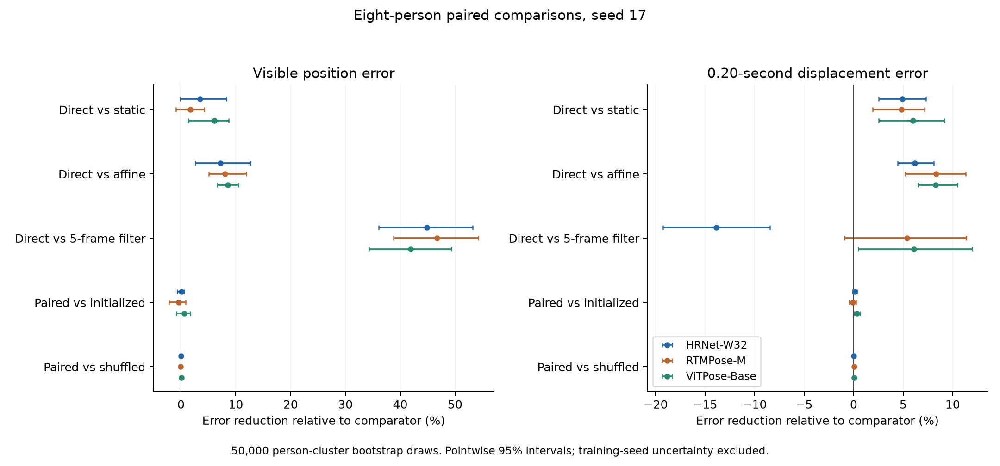
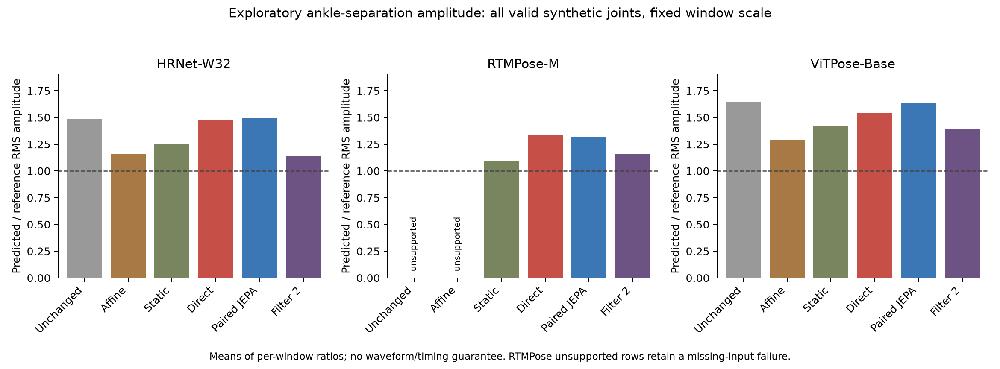

**Synthetic training v2: complete seed-17 diagnostic analysis**

The full diagnostic download supports a more specific conclusion than the earlier Markdown report. Direct supervised restoration produces the best average visible-coordinate accuracy among all 14 methods, and improves displacement accuracy over unchanged tracks, affine calibration and the static network. However, a simple temporal filter has lower displacement error for HRNet, and several coordinate advantages over the static network remain uncertain across people. Paired JEPA provides no convincing practical advantage over initialized features or shuffled-target pretraining in this experiment. Its training completed, and the available feature diagnostics do not show constant-feature collapse.

The additional movement diagnostics establish that reference visibility caused the original timing coverage failure. Scoring all valid synthetic references restores coverage, but reveals substantial amplitude distortion and unmatched predicted peaks. The study therefore supports synthetic coordinate restoration and limited movement-error improvements; it has not established faithful gait dynamics, a benefit specific to paired JEPA, or real-video transfer.

**Evidence and verification.** This analysis uses [the downloaded directory](../../../../../outputs/full-updates-2000-seed-17/updates-2000-seed-17/). It contains the complete diagnostics for the 2,000-update-per-phase, seed-17 run, including the previously omitted methods in `exploratory-per-window.csv`. It contains neither the original neural prediction arrays nor the original source track bundle. The two retained prediction arrays are the spatial calibration outputs. Accordingly, local verification reconstructs aggregates and timing summaries from the saved detailed tables; the original raw-prediction reconstruction remains recorded HAIC evidence in `analysis.json`.

I verified all 134 files listed in the retained expansion manifest and all eight recorded diagnostic code hashes. I independently reproduced 10,080 aggregate metric cells, including unsupported values, and 924 timing-summary rows. The maximum aggregate numerical difference was 8.88e-16. All 21,504 metric values shared between the standard and expanded primary tables agree exactly. Evaluation identities and reference support match across methods. All source file hashes are unchanged after this analysis.

Training histories contain all 30,000 planned updates across eight learned methods and twelve phases, with finite recorded losses and gradient norms. Fit reports mark each method complete. The retained verification reports 24 training people and eight development people, and calibration provenance confirms 24 training identities, disjoint development identities, HRNet/RTMPose fitting and exclusion of the ViTPose family. The download does not include final Slurm accounting, the other training seeds or the expanded 200-update comparisons, so it cannot certify completion of the entire six-comparison suite.

The development panel contains eight different people, each represented by one normal treadmill recording and four 64-frame windows. There are 32 physical windows, four rendering conditions and three extractors, producing 384 correlated track records per method. All eight people come from the BioMotionLab_NTroje AMASS corpus. These are eight independent person groups, not 384 independent examples. This panel does not test abnormal gait or a broad range of cameras and activities.

[Verification record](verification.json), [independent table checks](table-verification.csv).

**Direct supervision has a reproducible advantage over unchanged predictions and calibration within this panel.** The original visible-reference endpoint remains the primary comparison. All errors below are fractions of a reference bounding-box diagonal; lower is better. Displacement measures the error in a joint's change in position over 0.20 seconds.

| Method | HRNet position | RTMPose position | ViTPose position | HRNet displacement | RTMPose displacement | ViTPose displacement |
| --- | ---: | ---: | ---: | ---: | ---: | ---: |
| Unchanged | 0.020696 | 0.019378 | 0.023275 | 0.009659 | 0.007534 | 0.008067 |
| Affine calibration | 0.012124 | 0.011188 | 0.014787 | 0.009572 | 0.007531 | 0.007984 |
| Initialized encoder | 0.012008 | 0.010985 | 0.014906 | 0.009682 | 0.007467 | 0.008143 |
| Coordinate pretraining | 0.012086 | 0.011199 | 0.014716 | 0.009690 | 0.007527 | 0.008042 |
| Ordinary JEPA | 0.012015 | 0.010917 | 0.014962 | 0.009670 | 0.007443 | 0.008129 |
| Paired JEPA | 0.011997 | 0.011033 | 0.014824 | 0.009671 | 0.007474 | 0.008118 |
| Shuffled JEPA | 0.011993 | 0.011027 | 0.014832 | 0.009674 | 0.007478 | 0.008122 |
| Static network | 0.011661 | 0.010466 | 0.014399 | 0.009444 | 0.007253 | 0.007788 |
| SmoothNet-style network | 0.013651 | 0.012848 | 0.016330 | 0.009649 | 0.007551 | 0.008104 |
| Three-frame filter | 0.020436 | 0.019290 | 0.023230 | 0.008299 | 0.007234 | 0.007758 |
| Five-frame filter | 0.020409 | 0.019305 | 0.023274 | **0.007886** | 0.007299 | 0.007797 |
| Direct supervision | **0.011257** | **0.010287** | **0.013529** | 0.008981 | **0.006905** | **0.007322** |

The complete [method table](all-method-results.csv) also retains the offset and interpolation-only controls, condition-specific results and the separate exploratory endpoints. The filters use centered triangular kernels after interpolation of missing observations. The SmoothNet-style model is this study's adaptation, not an evaluation of official pretrained weights.

Direct supervision reduces coordinate error by 45.61%, 46.91% and 41.87% relative to unchanged tracks, with improvement for all eight people for every extractor. Its displacement reductions are 7.02%, 8.35% and 9.23%, with improvement for eight, seven and eight people, respectively. Full-precision CSV calculations slightly refine the earlier rounded-report percentages.

I calculated paired percentile intervals by resampling the eight people 50,000 times, retaining each person's windows and rendering conditions together. Effects are ratios of person-balanced means. These are exploratory, pointwise 95% intervals conditional on this fitted seed, without adjustment for multiple comparisons or uncertainty from model selection/training. They should not be reported as confirmatory population guarantees.

| Extractor | Direct position reduction vs affine, 95% interval | People improved | Direct displacement reduction vs affine, 95% interval | People improved |
| --- | ---: | ---: | ---: | ---: |
| HRNet | 7.15% [2.59, 12.65] | 7/8 | 6.17% [4.42, 8.10] | 8/8 |
| RTMPose | 8.05% [5.04, 11.90] | 7/8 | 8.31% [5.18, 11.32] | 7/8 |
| ViTPose | 8.51% [6.57, 10.46] | 8/8 | 8.30% [6.50, 10.49] | 8/8 |

These results strengthen the case that learned restoration adds value beyond the tested spatial calibration on this panel. They also support transfer to the held-out pose-extractor family within synthetic imagery, given the retained fitting/exclusion evidence. They do not establish transfer to real videos.

**The static and filtering controls limit stronger claims about temporal modeling.** Direct supervision reduces coordinate error relative to the static network by 3.47% for HRNet, 1.71% for RTMPose and 6.04% for ViTPose. The corresponding intervals are [-0.19, 8.29], [-0.94, 4.19] and [1.34, 8.71] percent; the first two include zero. Its displacement advantages are more consistent: 4.91% [2.51, 7.28], 4.80% [1.93, 7.14] and 5.99% [2.51, 9.17].

The static control removes neighboring frames' joint coordinates, but retains shared whole-window normalization and auxiliary confidence/support/time information. It also differs in architecture and parameter count. The displacement contrast is useful evidence for the direct temporal model as implemented; it does not isolate temporal coordinate access from every capacity or optimization difference.

For HRNet, the five-frame filter reduces displacement error by 18.36% relative to unchanged tracks, compared with direct supervision's 7.02%. Direct has 13.88% higher displacement error than this filter, and loses that comparison for all eight people. The filter makes much smaller coordinate corrections, so it is not a superior method on every endpoint. For RTMPose, direct's displacement advantage over this filter has an interval crossing zero; the ViTPose interval remains positive.

The condition-specific tables show why overall ranking is insufficient. Direct has the best coordinate mean in nine of the twelve extractor/condition cells, while affine calibration wins HRNet and ViTPose under obstruction alone and the static network wins RTMPose under obstruction alone. For displacement, the five-frame filter is best for all three extractors under combined blur and obstruction, the corruption combination excluded from training. These repeated measurements are not twelve independent replications. Within-condition comparisons use identical masks across methods; comparing error levels across conditions also changes which joints are visible.

[Paired comparisons and intervals](paired-comparisons.csv), [individual-person effects](person-effects.csv), [balanced per-person metrics](per-person-metrics.csv).

**Paired JEPA lacks a meaningful incremental advantage in the retained controls.** Relative to the initialized encoder, paired JEPA changes coordinate error by +0.085%, -0.435% and +0.553%, where positive denotes improvement. All three person-bootstrap intervals cross zero. Its coordinate changes relative to shuffled-target JEPA are -0.039%, -0.053% and +0.057%, again with intervals crossing zero. Displacement differences from shuffled JEPA are only about 0.02–0.06%.

There are small favorable contrasts against coordinate pretraining for HRNet and RTMPose, with mean coordinate improvements of 0.73% and 1.48%. ViTPose instead worsens by 0.74%. Ordinary JEPA also matches or exceeds paired JEPA in several comparisons. Selecting only the favorable coordinate-pretraining contrasts would omit the initialized, shuffled and held-extractor evidence.

The shuffled control changes reference windows within matched training person/nuisance strata. With repeated treadmill gait, those donors can remain similar; this is a test of the implemented pairing intervention, not proof that all temporal correspondence is irrelevant. Nevertheless, the current results do not support a practically important benefit from the particular paired pretraining recipe. Small pointwise differences should not be promoted to such a claim.

**The unsupported primary motion measurements have an identified cause.** For each extractor, only 32 of 128 original timing records are eligible. Every one of the other 96 has a reference visibility gap. All 64 obstruction/combined-obstruction records are ineligible, along with 16 clean and 16 blurred records. The underlying reference ankle coordinates remain valid and finite. In the separate all-valid-synthetic endpoint, every one of the 128 records becomes reference-eligible under both scale policies.

Thus the coverage failure follows from the original full-window visible-reference rule applied to this rendered panel. It is not evidence that AMASS lacks motion trajectories or that these windows lack the required reference peaks. Scoring occluded synthetic references provides a useful development diagnostic, while the original visible-reference measurements and their unsupported aggregates must remain intact.

Framewise box normalization also changes the reference peak count in 12 of the 32 physical windows, despite box-scale coefficients of variation of only 0.84–1.74%. The fixed-window-scale analysis avoids this particular variation. All-valid timing has 580 reference-peak observations per extractor under fixed scaling, representing repeated renderings of 145 peaks over the 32 physical windows. These are operational ankle-separation maxima, not heel strikes.

**Better coordinate and displacement scores coexist with amplitude and event-sequence distortion.** On all valid synthetic references with fixed window scale, direct supervision reduces overall coordinate error by approximately 38.0–42.1% and displacement error by 12.2–13.4% relative to unchanged tracks. This preserves the useful direction of its results when hidden synthetic joints enter scoring. However, mean per-window ankle-separation RMS amplitude ratios remain far from one:

| Method | HRNet | RTMPose | ViTPose |
| --- | ---: | ---: | ---: |
| Direct | 1.476 | 1.335 | 1.539 |
| Paired JEPA | 1.493 | 1.317 | 1.635 |
| Static network | 1.256 | 1.089 | 1.419 |
| Five-frame filter | 1.140 | 1.162 | 1.392 |

These are averages of individual ratios, not the ratio of pooled amplitudes. Values above one indicate average excess predicted amplitude; they do not imply every window is amplified. Ratios nearer one also do not establish waveform or event fidelity.

With all-valid references and fixed scale, direct supervision's matched-event precision is 37.2%, 47.8% and 48.1%, while recall is 93.3%, 87.9% and 89.3%. Its unmatched predicted-peak counts are 913, 556 and 560 against 580 reference observations per extractor. The five-frame filter improves precision to 68.5–74.6%, but its recall falls to 60.2–65.2%, so smoothing also removes reference events. Neither pattern establishes preserved gait timing. Conditional timing errors around 30–40 ms must be read alongside those missed and extra events.

One RTMPose combined-corruption record for `rub072` contains one missing joint-frame prediction in the unchanged and calibration outputs. It is outside visible-reference scoring, explaining why primary missing-prediction counts remain zero. It makes their all-valid amplitude aggregate unsupported. Interpolation and learned predictions supply values there; the all-valid coordinate and displacement metrics retain missingness penalties for methods that do not. I did not drop this record or replace its unsupported amplitude with zero.

[Reference coverage](reference-coverage-summary.csv), [per-window reference diagnostics](reference-coverage.csv), [reconstructed timing results](timing-results.csv).

**The left/right and hidden-joint results are useful geometric evidence with limited scope.** Direct supervision lowers the all-valid, fixed-scale ankle left–right vector error to 0.03963, 0.03733 and 0.04368, compared with paired JEPA's 0.05629, 0.05488 and 0.06104. This measures the error in the vector between left and right ankle positions, not whether a model recognizes anatomical side or preserves pathological asymmetry. The panel contains normal treadmill recordings, so it cannot establish a clinical laterality result.

Under combined blur and obstruction, direct supervision's hidden-joint coordinate errors are 0.03794, 0.03356 and 0.04364; paired JEPA's are 0.04556, 0.03903 and 0.05545. Direct also improves the obstruction-only hidden-joint endpoint over paired JEPA, although the static network is better than direct for RTMPose in that condition. These comparisons use available synthetic references for hidden joints. The full all-condition hidden-only aggregate remains unsupported because some clean windows contain no hidden-reference samples; condition-specific values retain their explicit populations.

[Hidden-coordinate results by condition](synthetic-hidden-coordinate-results.csv), [per-person left/right geometry](per-person-left-right.csv).

**The longer run completed without an obvious numerical training failure.** Direct training completed 4,000 supervised updates. Coordinate pretraining and each JEPA arm completed 2,000 pretraining plus 2,000 readout updates, with the encoder frozen during readout fitting. The initialized control completed 2,000 readout updates. These are matched total update counts for direct versus the pretraining arms, not equal compute or equal numbers of updates optimizing the final coordinate objective.

Paired JEPA's pretraining loss falls from 12.60 to 1.153 and its readout loss from approximately 0.000727 to 0.000347. Its sampled online feature standard deviation is 0.871 and effective rank about 31, with teacher rank about 31 as well. These values argue against constant embeddings on the inspected batch; they do not show that those features encode useful motion. Its teacher's direct initialization weight has fallen to 0.00160%, compared with the earlier short pilot's substantial retained initialization weight. The old explanation that the teacher had barely moved is therefore inadequate for this run.

Paired pretraining and readout mean losses change by only about 0.27% and 0.22%, respectively, between the last two 100-update blocks. Minibatch variation and the decayed learning rate prevent treating that plateau as proof of global convergence. Paired and shuffled JEPA also have almost identical readout losses and feature summaries. Nothing in these diagnostics identifies a confirmed implementation bug that explains the weak paired-pretraining effect.

I inspected the retained paired-JEPA learning curve and the metadata-selected `rub053` HRNet clean and ViTPose combined-corruption trajectory figures. The clean example shows positional shifts corrected while residual local irregularity remains. The corrupted example contains large ankle excursions in the inputs that persist in the initialized and paired-JEPA outputs; direct training changes those excursions substantially but still distorts the reference trajectory. These examples illustrate the numerical findings and are not additional statistical evidence.

[Training verification](training-verification.csv). The raw source model files and final scheduler state remain outside this download.

**Implications for the study.** The current evidence supports a focused result about the distinction between correcting pose positions and preserving movement. Direct supervised restoration has a consistent advantage over calibration and useful displacement gains over the static control. The filter comparison and expanded amplitude/timing analysis show that those gains do not establish faithful motion. Paired JEPA has not supplied the intended additional benefit, despite completed training and a broader development panel.

The remaining planned seeds and the 200-update comparison should establish whether these findings persist across training variation and budget. They use the same people, so they do not increase the independent subject count. Before a confirmation claim, the evaluation also needs independently reviewed reference conventions and a suitable held panel; real-video or clinical claims require their own annotations and evidence. A new JEPA intervention should address a specific diagnosed weakness, rather than assume that more updates alone will produce a useful representation.

This report supersedes the limitations of the earlier [summary-only analysis](../seed17-full-analysis-20260919/README.md) while preserving it as a record of what was knowable from the initial Markdown file. All calculations are reproduced by `recompute.py` in this directory using NumPy, pandas and matplotlib. Downloaded evidence and scientific gates were not changed.
