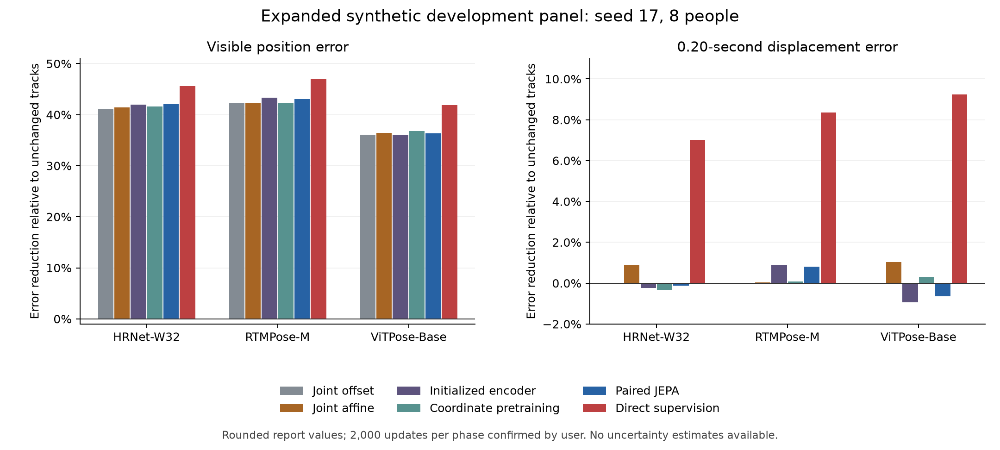

**Expanded synthetic training v2: seed 17, 2,000 updates per phase**

The strongest finding in this report is that direct supervised restoration improves both visible joint positions and 0.20-second displacements across all three pose extractors. It outperforms the spatial calibration controls and paired JEPA on those aggregate endpoints. Paired JEPA remains close to a frozen, randomly initialized encoder with a trained coordinate readout, so these results provide little evidence of an incremental benefit from its feature-prediction pretraining. Amplitude and event-sequence preservation remain unresolved.

This revises the interpretation of the earlier two-person pilot, where affine calibration led the displayed methods and the neural methods worsened displacement error. The current result deserves follow-up, but does not establish a statistically reliable advantage or the best method among every comparator in the experiment.

**Evidence available for this investigation.** The source is the downloaded [seed-17 report](../../../../../outputs/synthetic-training-v2/updates-2000-seed-17/report.md), originally supplied as `outputs/synthetic-training-v2/report.md` and moved into its budget-specific folder during this investigation. Its content hash is unchanged:

```text
20256edaa8f04c0e909a980cf65a258c4f8f49e8ad39d09eb21bdc51927c8f55
```

The user confirmed that it came from `diagnostics/updates-2000-seed-17/`. It reports eight development people, seed 17, seven methods, three extractors, and 128 development track records per extractor. Its evidence label remains `automated-source-screen`. The [expansion guide](../../../../../slurm/synthetic-training-v2/README.md) specifies 24 training people and eight development people, four windows per person and four development rendering conditions, with ViTPose excluded from fitting. These are the intended settings; the downloaded report alone cannot independently verify the training identities, exclusions or effective configuration.

Only this Markdown file is present for the new run. The nearby `source-smoke-01` tables belong to the earlier two-person pilot and cannot supply the missing eight-person measurements. I checked the new report's 42 position/displacement values, all 21 timing rows and three reference-eligibility rows, calculated comparative effects, and traced the current local evaluation and training implementations. The tables have complete, unique method/extractor identities; timing denominators are internally consistent; and offset calibration preserves the reported displacement values. The local source review is conditional on HAIC having used the same code, because this run's recorded code hashes have not been downloaded.

These checks do not reconstruct the values from raw predictions, establish per-person consistency, verify optimizer completion or certify final Slurm status. No confidence intervals can be calculated from the aggregate report. The calculations below use rounded Markdown values, including displacement values printed to six decimals.

**Direct supervision improves both reported endpoints.** Position error measures the distance between a predicted joint and its synthetic reference, divided by the reference bounding-box diagonal. Displacement error measures how accurately a joint's change in position over 0.20 seconds matches its reference change, in the same diagonal units. A constant positional offset cancels from displacement, which makes the second endpoint useful for separating positional correction from changes in motion accuracy.

| Extractor | Unchanged position error | Direct position error | Position reduction | Unchanged displacement error | Direct displacement error | Displacement reduction |
| --- | ---: | ---: | ---: | ---: | ---: | ---: |
| HRNet-W32 | 0.02069648 | 0.01125687 | 45.61% | 0.009659 | 0.008981 | 7.02% |
| RTMPose-M | 0.01937844 | 0.01028736 | 46.91% | 0.007534 | 0.006905 | 8.35% |
| ViTPose-Base | 0.02327473 | 0.01352905 | 41.87% | 0.008067 | 0.007322 | 9.24% |

All reductions use `(comparator error − candidate error) / comparator error`. They are ratios of reported person-balanced means, not averages of individual people's percentage improvements.

Relative to affine calibration, direct supervision reduces position error by 7.15%, 8.05% and 8.51%, and displacement error by 6.17%, 8.31% and 8.29%, respectively. Thus direct restoration's aggregate benefit extends beyond the two fitted spatial corrections tested here. Relative to paired JEPA, direct supervision reduces position error by 6.17–8.74% and displacement error by 7.13–9.81%.



The held-extractor design makes the ViTPose result interesting: if the saved configuration confirms its exclusion, the learned correction also helps predictions from an estimator absent from fitting. That is transfer across pose extractors within this synthetic development setting. Real-video transfer and anatomical correctness require separate evidence.

**The pretraining controls do not yet favor paired JEPA.** The initialized control fits a nonlinear coordinate readout on top of a frozen encoder whose weights were never trained. Coordinate pretraining trains the encoder to reconstruct masked reference coordinates, then freezes it and fits a fresh readout. Paired JEPA instead predicts features of aligned synthetic reference tracks during pretraining, then freezes its encoder and fits the same type of coordinate readout.

| Extractor | Paired JEPA position reduction vs coordinate pretraining | Position reduction vs initialized encoder | Displacement reduction vs initialized encoder |
| --- | ---: | ---: | ---: |
| HRNet-W32 | +0.73% | +0.085% | +0.114% |
| RTMPose-M | +1.48% | −0.435% | −0.094% |
| ViTPose-Base | −0.74% | +0.553% | +0.307% |

Positive values favor paired JEPA; negative values favor its comparator. Paired JEPA reduces position error substantially relative to unchanged tracks, but this weaker comparison does not establish a pretraining benefit: offset calibration alone already reduces position error by 36.04–42.19%, and the initialized control is close to paired JEPA. Paired JEPA changes displacement error relative to unchanged tracks by −0.12% for HRNet, +0.80% for RTMPose and −0.63% for ViTPose, where positive again denotes improvement. The cross-extractor pattern remains mixed.

The current [training implementation](../../../../../src/gavd6_sjepa/research_directions/synthetic_training_v2/training.py) allocates 4,000 end-to-end supervised updates to `direct`, 2,000 pretraining plus 2,000 readout updates to `coordinate` and paired JEPA, and 2,000 readout updates to `initialized`. Direct and the representation-based arms use the same encoder/readout architecture, while their objectives and which weights are trainable differ. Total update matching does not equalize compute or the number of updates directly optimizing the final coordinate objective. The comparison supports the practical effectiveness of direct training under this recipe; it does not isolate a universal failure of feature prediction. The missing histories are needed to assess feature collapse, teacher adaptation, optimization or underfitting in this longer run.

The diagnostic report deliberately selects five original methods and adds two calibrations. Ordinary JEPA, shuffled-target JEPA, the static network, the SmoothNet-style network and three fixed filters are absent. Consequently, “direct is best” must be restricted to the seven displayed methods. A temporal-learning claim also needs the static and filtering comparisons; aggregate displacement improvement alone does not identify which temporal computations the network learned.

**Timing coverage and amplitude prevent a broad preservation claim.** The reference oracle itself is eligible on only 32 of 128 records per extractor: 25% coverage. A model cannot resolve the original metric's reference ineligibility on the other 96 records. The same coverage proportion appeared in the pilot, although the new report does not include the per-window reasons needed to establish whether the causes are the same.

The current metric requires both ankles to have valid, visible references throughout the window and at least two positive ankle-separation peaks for timing. Visibility gaps, insufficient peaks and other reference failures are recorded separately in `timing-per-window.csv`. Every displayed amplitude aggregate is unsupported because the aggregation retains unsupported windows rather than discarding them. This does not mean every window lacks an amplitude measurement, nor does it imply zero amplitude error or universal model failure.

Even on eligible records, direct restoration's event sequence remains imperfect:

| Extractor | Direct matched / reference peaks | Unmatched predicted peaks | Event recall | Event precision | Unchanged precision | Conditional timing error |
| --- | ---: | ---: | ---: | ---: | ---: | ---: |
| HRNet-W32 | 152 / 158 | 210 | 96.20% | 41.99% | 44.44% | 32.6 ms |
| RTMPose-M | 148 / 158 | 111 | 93.67% | 57.14% | 59.60% | 30.0 ms |
| ViTPose-Base | 147 / 158 | 107 | 93.04% | 57.87% | 63.48% | 26.4 ms |

Recall is matched/reference peaks; precision is matched/(matched + unmatched predicted peaks). All eligible predictions in this table are complete, so no unknown extra-peak counts enter these calculations. They are descriptive, event-pooled quantities for correlated records, not person-balanced estimates or independent clinical gait events. The configured matching tolerance is 0.12 seconds, subject to confirmation from this run's `analysis.json`.

Direct supervision has lower event precision than unchanged tracks for every extractor. Its original equal-peak-count timing support is only 0/32, 2/32 and 3/32 eligible records. Paired JEPA's corresponding support is 0/32, 0/32 and 7/32. The ViTPose increase to seven supported records is worth examining, but paired JEPA also misses 15 reference peaks versus 12 for unchanged tracks, and its event precision is approximately unchanged. Equal peak counts and a low error conditional on matched peaks do not establish faithful event sequences.

These are peaks in normalized horizontal ankle separation, not annotated heel strikes. Framewise reference-box scaling can alter that signal even when pixel displacement is preserved. The expansion already computes separate all-valid-synthetic and fixed-window-scale diagnostics; they should help distinguish reference visibility and normalization effects without replacing the original endpoints. Their results are absent from this copied report.

**What changed from the pilot remains an open causal question.** The expanded panel changes training people, development people, window count and training budget together. The direct method's reversal from worsening displacement to improving it could reflect data coverage, optimization, the new evaluation panel or their combination. Comparing the expanded 200-update and 2,000-update runs on the same people will address the training-budget question more directly. Those fits start from scratch with different cosine schedules, so even that comparison is not a continuation of one learning curve. Comparing the old and new absolute error levels does not establish that either dataset is intrinsically better or worse.

**The next analysis should use the outputs already produced.** Retrieve both budget-specific diagnostic folders and their corresponding source evaluation/configuration records before changing the training recipe. The most useful missing files are:

| Files in the HAIC expansion directory | Question they resolve |
| --- | --- |
| `request.json`, `status.json`, `completed-scopes.json`, `panel-verification.json`; each run's `effective-config.json` | Which comparisons completed, achieved panel sizes, settings and budget |
| `diagnostics/updates-2000-seed-17/analysis.json`, `expansion-analysis.json`, `training-summary.csv`, `training-history.csv` | Source verification, code provenance, completed optimization and longer-run feature diagnostics |
| That diagnostic folder's `per-window.csv`, `by-condition.csv`, `timing-per-window.csv`, `timing-support.csv`, `images/` | Paired person-level effects, clean/corrupted trade-offs, support failure reasons and trajectories |
| That diagnostic folder's `exploratory-balanced.csv`, `exploratory-left-right-balanced.csv`, `exploratory-timing-summary.csv`, `exploratory-per-window.csv` | Fixed-scale and all-valid-synthetic sensitivity analyses, left/right geometry and condition-specific movement |
| `runs/updates-2000-seed-17/evaluation/` and corresponding 200-update / seed-29 / seed-43 outputs | Every comparator, repeated training seeds and budget comparisons |

Use paired differences within each development person, keeping all that person's windows, renderings and extractor observations together for uncertainty analysis. Report training-seed variability separately; repeated seeds and extractors do not create additional independent people. Eight people can support an exploratory paired analysis, but the aggregate report alone supplies no variance or evidence of consistency across them. The development panel also remains a selection set, so any later confirmation needs an appropriately held evaluation panel.

First compare direct, affine and paired JEPA by clean versus corrupted condition, then include all omitted baselines. Inspect whether the direct displacement gain is accompanied by acceptable amplitude and timing on a reference-supported panel. Complete the already planned budget/seed comparisons and inspect their logs before deciding whether another training intervention is justified. A proposed change to masking, teacher scheduling or loss weights should follow evidence from those diagnostics, rather than an assumption that a longer JEPA run must eventually succeed.

For a paper, the present report supports this limited description: **On an eight-person synthetic development panel with one training seed, direct supervised restoration reduced visible coordinate error by 41.9–46.9% and displacement error by 7.0–9.2% relative to unchanged estimator tracks, outperforming the displayed spatial calibration and representation-pretraining controls. Paired JEPA showed little incremental benefit over initialized features, while restricted reference coverage and unmatched predicted peaks left amplitude and event-sequence preservation unresolved.** Statistical reliability, the full comparator ranking and real-video transfer remain to be established.

All derived numbers, rankings, timing calculations and evidence limits are retained in [calculations.json](calculations.json). [recompute.py](recompute.py) checks the report hash and reproduces them with `python3 docs/studies/synthetic-training-v2/results/seed17-full-analysis-20260919/recompute.py`. Add `--plot` in an environment with matplotlib to regenerate the PNG and [SVG figure](coordinate-and-displacement.svg). The original downloaded report and experiment outputs were not edited.
