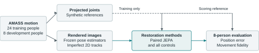
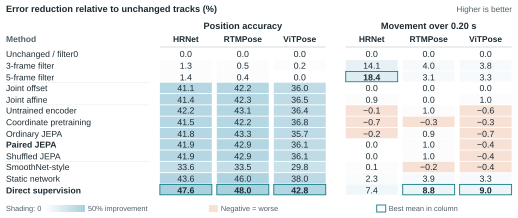

# Synthetic pose restoration: better positions, unresolved motion fidelity

*Research results through 20 September 2026 · Three 2,000-update runs · Synthetic development evidence*

## Why these experiments

Pose tracks extracted from video can shift or jitter when images blur or limbs become obscured. A correction that improves joint positions can also alter the movement one hopes to measure. Synthetic training v2 examines this tension using matched rendered images and projected body-model joints, asking whether learning to predict internal motion representations helps more than learning corrected coordinates directly. An earlier two-person development pilot found that small spatial corrections explained much of the apparent improvement. The expanded study tests that observation on more people and repeats training from different random initializations. The three long runs now support a stronger result for direct supervision, while the intended benefit of paired pretraining remains elusive.

## Design and evidence

AMASS body-motion recordings provide four nonoverlapping 64-frame windows per person at 25 Hz, each spanning 2.52 seconds. A frontal camera renders clean, blurred and obstructed views; combined blur and obstruction is withheld from fitting. Training uses 24 people and two pose estimators whose weights stay fixed, HRNet-W32 and RTMPose-M. Evaluation uses eight different people with normal treadmill recordings, adding ViTPose-Base as an estimator excluded from fitting. The 576 training and 384 evaluation tracks share underlying motions: the independent evaluation sample remains eight people. Reference joints are model projections whose anatomical correspondence still needs review.

*Figure 1. Estimated tracks supply the inputs; projected joints supply synthetic reference positions. Clean targets guide training and scoring, but are unavailable to a deployed restorer.*

Paired JEPA, a joint-embedding predictive architecture, learns to predict hidden features of clean projected tracks from imperfect observations. A slowly updated copy of the network supplies those features as a teacher. Afterward, the feature-producing network, or encoder, is held fixed while a separate readout learns to convert its features into coordinates. Coordinate pretraining instead learns clean coordinates before fitting that readout; the untrained-encoder control fits only the readout. Ordinary JEPA uses observed-track targets, whereas shuffled JEPA breaks the aligned pretraining pairs. Direct supervision trains the coordinate restorer end to end. Calibration fits constant offsets or small linear corrections to each joint. Temporal filters, a static network without neighboring coordinates, and a SmoothNet-style learned smoother provide further comparisons.

Seeds 17, 29 and 43 each use 2,000 pretraining and 2,000 readout updates, or 4,000 end-to-end updates; the untrained encoder uses 2,000 readout updates. These budgets match update counts, not computation. All 24 learned fits completed their recorded budgets with finite losses. Seeds 29/43 permit reconstruction of 9,216 saved evaluation rows from predictions; seed 17 supplies verified diagnostic tables. Their source-bundle hashes agree. The planned 200-update runs and final scheduler accounting are absent locally, so this account cannot establish a budget effect or completion of the six-run suite.

Position error is joint distance divided by the reference bounding-box diagonal; displacement error measures the discrepancy in movement over 0.20 seconds on the same scale. Both use visible reference joints. Ankle amplitude describes the typical fluctuation in horizontal ankle separation around its window mean, measured as root-mean-square variation. We balance conditions within windows and windows within people, then average the three fitted seeds. Exploratory 95% intervals resample the eight people 50,000 times after seed averaging; they describe uncertainty across this panel, conditional on these fits, without correcting for multiple comparisons.

<!-- PAGEBREAK -->

## What the repeated runs show

*Figure 2. Three-seed mean error reductions (%), with extractors in separate columns. Outlined bold values mark each column's best mean. Calibration is shared; filter0 equals unchanged. The [detailed figure](images/03-seed-ranges.svg) retains every seed range.*

Direct supervision has the lowest overall position error for every extractor in every seed. In HRNet, RTMPose and ViTPose order, its mean reductions from unchanged tracks are **47.6%, 48.0% and 42.8%**. It also improves on affine calibration, the linear correction, by 10.5%, 9.9% and 9.9%; the person-bootstrap intervals are [7.4, 14.6], [7.0, 13.4] and [7.6, 12.7] percent. All eight people improve after seed averaging. Differences in panel size and training duration prevent attributing the change from the pilot to either alone.

Paired JEPA improves position error over coordinate pretraining by only 0.75% and 1.19% on HRNet and RTMPose, and worsens it by 1.09% on ViTPose. Its means are slightly worse than the untrained encoder for all three estimators and within 0.07% of shuffled JEPA. Training completed, and recorded features vary across inputs rather than collapsing to a constant. These checks do not explain the weak contribution of aligned pretraining, but the comparisons offer little reason to prefer its added training stage under this recipe.

Direct training reduces displacement error by 7.4–9.0% versus unchanged tracks and 5.2–5.9% versus the static network. This suggests useful temporal processing, although the static control retains shared normalization and confidence information and differs in architecture. A five-frame filter nevertheless achieves an 18.4% HRNet displacement reduction and wins under combined corruption for all three estimators. Direct training has the best seed-averaged position result in every extractor/condition cell; on hidden synthetic joints under combined corruption, its position errors are 20–24% below paired JEPA.

## Discussion

The timing analysis explains why these gains cannot yet support gait-preservation claims. Only 32 of 128 records per extractor have sufficient visible-reference ankle coverage and peaks. Scoring all valid synthetic joints with a fixed scale within each window makes all 128 eligible, but direct restoration still produces mean ankle-separation amplitude ratios of **1.28–1.54** across seeds and extractors; one would indicate a matched amplitude. With a 0.12-second peak-matching tolerance, it recovers 88–95% of reference peaks, while only 37–50% of predicted peaks match. The five-frame filter raises that precision to 69–75% but recovers only 60–65% of reference peaks. These are peaks in image-plane ankle separation, not heel strikes.

The most useful next experiment would examine this disagreement between spatial accuracy and movement fidelity. Small calibration models already remove much of the position error, plausibly reflecting systematic landmark offsets, although anatomical review is needed to test that explanation. Direct supervision adds reproducible improvements across the fitted seeds, including on the excluded estimator, while leaving substantial amplitude and event distortion. Longer reviewed motion sequences, a more informative camera view and independently checked joint correspondence would make a subsequent temporal comparison easier to interpret. Any revised endpoint should be specified before that comparison. The present evidence remains limited to machine-screened synthetic normal walking—neither estimator transfer within rendered imagery nor three training seeds establish performance on real or pathological gait.

*Sources: [protocol](../protocol.md) · [pilot](../results/postrun-analysis-20260919/README.md) · [full runs](../../../../outputs/full-runs/) · [audit and tables](analysis/README.md). Reproduce: [analysis script](analyze_runs.py) · [figure/PDF builder](build_writeup.py).*
