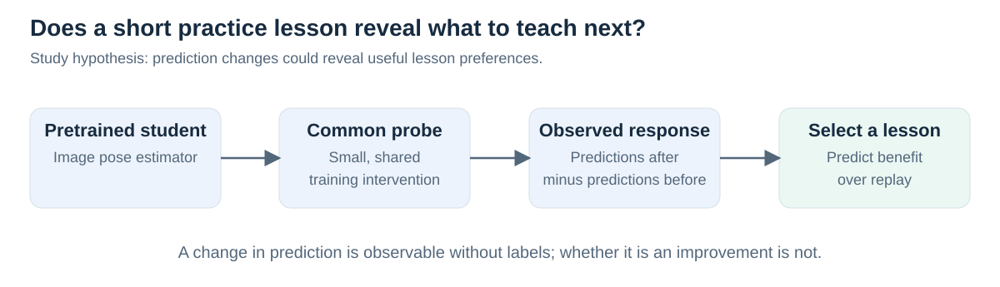
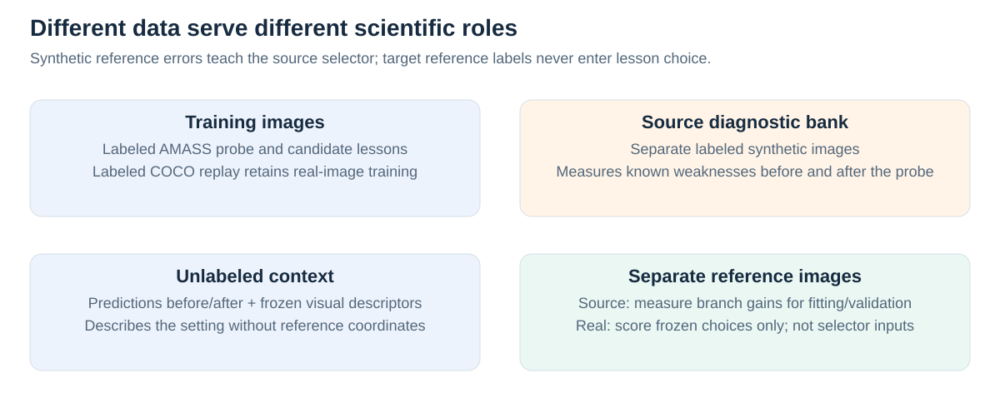
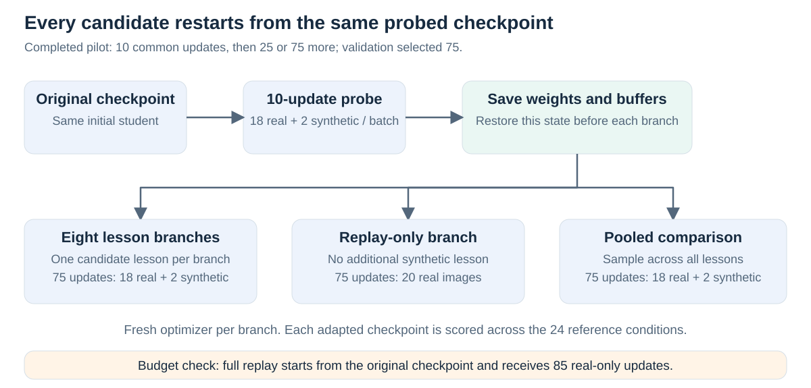
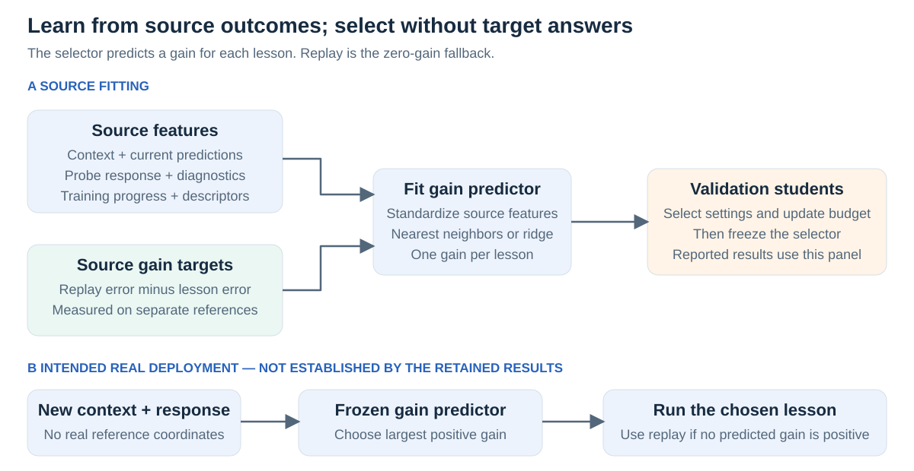
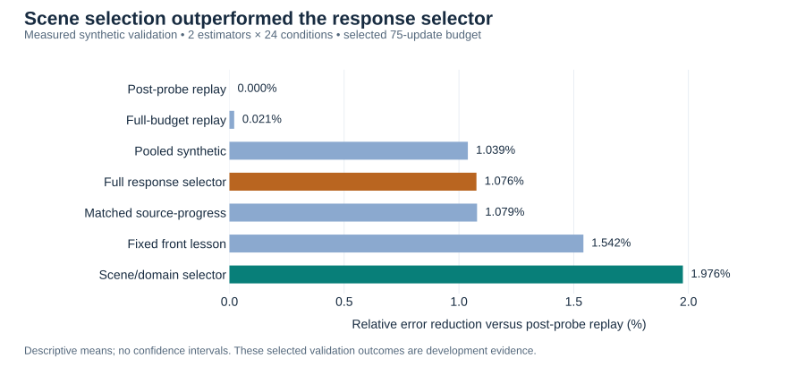
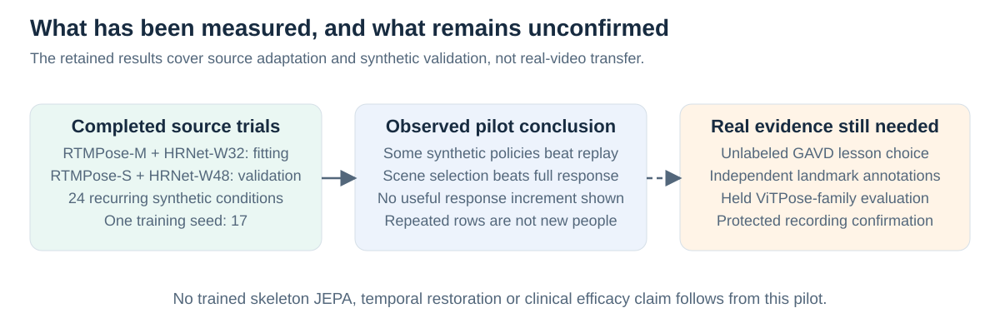

# Teaching pose estimators with synthetic lessons

*Illustrated study and pilot results · 18 September 2026 · Completed synthetic development experiments; real-video transfer remains unconfirmed.*

## Introduction

A pose estimator predicts body landmarks in an image. Additional training on rendered people might improve its performance, but **which synthetic examples should it receive?** The original study tested whether an estimator's response to a short practice lesson helps choose its next lesson, beyond what its current predictions, source errors and scene conditions already reveal.

Here, the **student** is a pretrained pose estimator; a **lesson** is labeled synthetic training data; the **teacher** is a learned lesson selector. The completed pilot found modest synthetic-adaptation benefits, but did not establish an added benefit from response-based personalization.

*Figure 1. The hypothesis concerns what prediction changes reveal about learning. A large change need not be a useful change.*

## Motivation

Two estimators can make similar errors yet react differently to additional training. One might benefit from blurred examples and another from obstruction. A common probe tests their behavior under a controlled update. A successful selector would use that response to choose helpful training before seeing real reference errors.

This requires more than synthetic training working: lesson preferences must differ, the response must predict those preferences, and the rule must transfer. The study therefore included fixed lessons, pooled training, replay, scene selection and response-removed controls. It adapted image-model pose heads and used frozen V-JEPA context features; **it did not train an S-JEPA model**.

## Methodology

**1. Separate training, context and reference data.** Motion-capture sequences from AMASS animated textured 3D human bodies, rendered against image backgrounds. Projecting the known 3D joints through the rendering camera supplied image coordinates for six left–right pairs: shoulders, elbows, wrists, hips, knees and ankles. Eight lessons covered balanced examples, front/oblique/side views, blur, low resolution, obstruction and combined low-resolution obstruction. COCO replay supplied labeled real images during adaptation. Probe, lesson, diagnostic, context and reference roles were kept separate by construction; retained manifests are insufficient to re-audit every realized identity here. The library was not an audited walking-only subset, and lessons could use different motions.

Context clips represent the observation setting. Their reference coordinates are withheld from selector inputs; person crops and coarse viewing metadata are supplied. A separate labeled synthetic diagnostic bank measures known weaknesses; separate reference images measure actual adaptation benefit. The 24 recurring conditions combine three views, two resolution levels, two visibility settings and two blur settings. They recur across fitting and validation students, so this is not a holdout of scene combinations.

*Figure 2. Source reference errors are supervised gain targets during selector fitting. Real reference coordinates are reserved for evaluation.*

**2. Measure the response to one common probe.** Record predictions on the same context before and after **10 probe updates**. Each batch contains 18 COCO images and two synthetic probe images. Training compares predictions with known training labels and updates only the final pose-prediction head; the image feature extractor stays fixed. The response records mean signed changes, mean absolute changes, root-mean-square changes and valid-prediction fractions by joint, relative to fixed person boxes. These summaries aggregate frames; they do not retain a joint-by-time trajectory. Source diagnostic errors and training losses are also recorded. Prediction changes reveal behavior, not whether unknown target coordinates became more accurate.

**3. Build an outcome table with matched training branches.** Save the post-probe weights and buffers. Restore that state before each candidate lesson, replay-only branch or pooled-synthetic comparison, using a fresh optimizer. Test 25 and 75 additional updates. Mixed branches use 18 real and two synthetic images per update; replay uses 20 real images. Thus update counts match, while real-image exposure differs. A separate full-budget replay control starts from the original checkpoint for 10 + 75 = **85 updates** at the selected budget. Each adapted checkpoint is evaluated across the 24 reference conditions; these are not 24 independently adapted models.

*Figure 3. Independent branch resets prevent one lesson from inheriting another's training. Pooled and full-budget replay are comparators, not selector actions.*

**4. Learn which lessons improve on replay.** For each source student, condition and budget, compute **lesson gain = replay reference error − lesson reference error**. Positive gain means the lesson helped. For example, hypothetical errors of 0.030 under replay and 0.028 under blur give the blur lesson a gain of 0.002. The selector learns these outcome differences, rather than assuming the largest prediction change is best.

Standardize each input feature using the fitting data. Fit either a nearest-neighbor regressor, which averages gains from similar source cases, or a ridge regressor, a regularized linear predictor of gains. Predict all eight lesson gains; choose the largest positive prediction, otherwise replay. The selector chooses training data; it does not directly output corrected poses. Fit on RTMPose-M and HRNet-W32; select settings on RTMPose-S and HRNet-W48, other checkpoints from the same two families. All four trials used seed 17.

The **full selector** uses context, post-probe predictions, prediction changes, diagnostic errors, loss history and model/budget descriptors. Its **matched source-progress control** removes only the prediction-change feature block while matching the regressor settings. The **scene/domain selector** uses simple context features, including coarse view metadata, and budget. Frozen visual descriptors do not make this a trained JEPA comparison.

*Figure 4. The retained full selector used one nearest neighbor; the scene selector used three. The intended real route uses a frozen selector and independently annotated evaluation recordings.*

## Results and interpretation

The saved artifacts contain **2,304 source outcome rows**, **6,912 selector decisions** and **144 evaluated configurations**. Recomputed means and joined decisions agree within numerical tolerance. Validation selected 75 additional updates; each reported policy mean averages 48 student–condition outcomes from two validation estimators. These settings were selected on this panel, so the results are **development evidence**, not an untouched test.

The metric is mean visible-joint Euclidean error divided by the reference person-box diagonal; lower is better. Missing predictions receive a one-diagonal penalty. An error near 0.027 is about 2.7% of that diagonal, not a classification error rate.

| Policy | Mean normalized error |
|---|---:|
| Replay after the common probe | 0.02732054 |
| Full-budget replay from the original checkpoint | 0.02731485 |
| Pooled synthetic lessons | 0.02703672 |
| Full response selector | 0.02702648 |
| Matched source-progress selector | 0.02702576 |
| Fixed `front` lesson, selected on training outcomes | 0.02689916 |
| Scene/domain selector | **0.02678074** |

*Figure 5. Computed directly from saved aggregate outcomes; higher reduction is better. This is the only empirical plot in this writeup. No confidence intervals are implied.*

**Synthetic adaptation helped modestly; the response feature did not add demonstrated value.** The full selector reduced mean error by **1.076%** relative to replay, but essentially matched source-progress and lost to fixed `front` and scene selection. It changed only **3 of 48** choices relative to its matched control: one helped, one harmed and one tied in error. Against replay, its choices helped 37 cases, harmed ten and tied one; it never selected the replay fallback.

A retrospective oracle asks what could have been chosen *after seeing all outcomes*. Choosing separately for each student improves on the best shared scene choice by only **0.0406% relative error** (0.02667588 versus 0.02666506). This suggests limited personalization opportunity in this particular panel and action library. It is neither an achieved deployment policy nor a universal bound.

The limitations matter: two validation checkpoints, one seed, few reference motions repeatedly rendered, and selected settings cannot establish broad transfer or statistical significance. Per-frame predictions and adapted checkpoints are absent from the retained bundle, so this writeup reconstructs aggregate arithmetic rather than rerunning inference or diagnosing why individual models adapted weakly.

*Figure 6. Thousands of repeated measurements do not create thousands of independent people or learning behaviors.*

## Impact

The study provides a concrete way to test whether a training intervention reveals useful teaching information. Its pilot also identifies a simpler explanation for the observed benefit: scene-conditioned synthetic choices worked well without the full response mechanism. Real GAVD transfer, held ViTPose-family performance and protected confirmation are not established by these results.

The practical next step is to improve and test synthetic supervision itself before enlarging the selector. This motivates the [revised paired-restoration study](../../synthetic-training-v2/proposal/README.md), while preserving the original negative personalization result. Better visible pose accuracy alone does not demonstrate preserved gait timing, hidden-joint accuracy or clinical benefit.

*Evidence: [recomputed audit](evidence/pilot-audit.json) · [reported numbers](evidence/reported-results.csv) · [detailed audit](../../synthetic-training-v2/artifact-audit.md) · [original research proposal](../../../../notes/research-agenda/proposals/synthetic-training-selection.md) · [figure and workflow review](review.md).*
