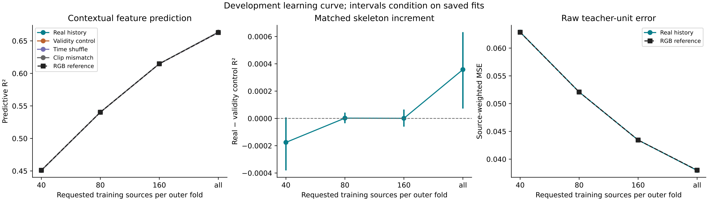

**Analysis of `haic-run-02`: source learning curve, protocol `source-learning-curve-v1`**

The saved result is a completed development **STOP**. Increasing training recordings substantially improves prediction of the contextual teacher target. Skeleton history adds a small positive increment at the largest endpoint, but the real-minus-RGB gain is approximately **140 times smaller than the prespecified 0.05 R² requirement**. The evidence supports a small development scaling trend; it does not support advancing this formulation to confirmation or student training.

This analysis uses the saved outputs of [notebook 23](23_source_learning_curves.ipynb), its embedded figure and execution metadata, the [numerical protocol](../../docs/studies/future-innovation/source-learning-curve-protocol.md), the [available-cohort amendment](../../docs/studies/future-innovation/source-learning-curve-available-cohort-protocol.md), and the current local scoring/training implementation. The source notebook is unchanged. [Extracted evidence and calculations](analysis/evidence.json) and an [extraction script](analysis/extract_evidence.py) accompany this report. Table values have the notebook's display precision; raw MSE values below are approximate values recovered from SVG coordinates.

The left panel shows nearly overlapping RGB and augmented models. The middle panel magnifies a very small matched increment. Its apparent size should be read against the numerical axis and the prospective effect threshold. The right panel confirms that the overall prediction improvement also appears in raw teacher units.

**Execution and provenance.** The local run directory initially contained only the executed notebook, not the original configuration, model, prediction, or report files. The notebook records a nonsynthetic `available-development-v1` study with frozen run ID `learning-curve`, inspected on HAIC under job 115309. Its original run root was `/hai/scratch/tedmui/alexpose/experiments/sjepa/gavd6/outputs/future-innovation/learning-curve`. The folder name `haic-run-02` is the local copy's label.

All five code cells completed without saved exceptions. All 12 displayed stage attempts passed with return code zero, including preparation, cache, teacher audit, planning, five outer-fold jobs, reporting, and verification. The notebook reports 50/50 selected-model completion receipts and `measurement_complete=True`. Its 76 before/after snapshot entries are identical. The plan's `planned` labels are frozen planning metadata, not evidence of unfinished fitting.

The notebook also records a successful numerical-verification job finishing at **2026-09-13 02:55:53 UTC**, matched to the displayed study/plan/report hashes. This is stronger evidence than file presence alone. However, the inspection itself explicitly sets `artifact_integrity_verified=False` and `numerical_verification_performed=False`; neither the notebook nor this analysis freshly reconstructs the absent models. These statements describe different operations and are consistent. The [current verifier](../../src/gavd6_sjepa/research_directions/source_scaling/learning_curve.py) reconstructs selected coefficients and predictions, preprocessing, selection arithmetic, and report arithmetic; it does not refit every rejected candidate's coefficients. The remote frozen implementation was not supplied, so local source interpretation is not a byte-identity audit of that implementation.

**Population and exclusions.** Notebook cell 3 gives the following accounting:

| Stage | Recordings | Sequences/windows | Interpretation |
| --- | ---: | ---: | --- |
| Full annotation inventory | 348 | 1,874 | Starting inventory |
| Reserved confirmation | 43 | 176 | Excluded before expanded processing |
| Planned development | 305 | 1,698 | Remaining development population |
| Available development | 293 | 1,633 | Twelve missing recordings exclude 65 sequences |
| Final eligible development | 290 | 1,403 | Actual evaluation population |
| Saved pose/decoding eligibility failures | — | 106 | Reported as `failed_pose_windows` |

The 230-window difference between available annotation sequences and eligible windows cannot all be attributed to pose failure. Subtracting the 106 saved failures leaves **124 sequences unaccounted for by those two displayed categories**. Under the current preparation pipeline, this is consistent with exclusion before pose processing, during candidate/alignment construction. Exact reasons require `data/manifests/exclusions.csv` and `pose-exclusions.json`; they are not embedded. Likewise, three available development recordings yield no eligible windows, but their individual reasons are unavailable here.

The saved inventory contains 334 available recordings overall. Combined with 293 available development recordings and the exhaustive reservation, this implies 41 available confirmation recordings and two unavailable confirmation recordings. Availability does not establish their pose eligibility; the notebook reports `confirmation_processed=False`.

The final cohort combines **1,353 newly processed windows and 50 reused parent windows**. The origin table counts 287 recordings with new windows and 43 with parent windows; these categories overlap. Their union of 290 implies 40 recordings with both origins, not 330 independent recordings.

Participant identity is unknown: zero participants were explicitly identified, and total participant count is not recorded. The result supports recording-disjoint evaluation, not verified participant-disjoint evaluation or population representativeness. Missing-media and eligibility exclusions can also affect generalization.

**What increases along the curve.** There are five fixed outer folds, three inner folds, and three training-subset orders, with seeds 261201, 261202, and 261203. Evaluation uses the same 290 recordings/1,403 windows across sizes. Outer test folds contain 57–59 recordings and 213–336 windows. All clips in a source remain together; each recording receives equal total weight.

| Requested training sources | Actual sources per outer fit | Training windows per outer fit | Mean training windows | Distinct subset fits |
| --- | ---: | ---: | ---: | ---: |
| 40 | 40 | 154–261 | 195.9 | 15 |
| 80 | 80 | 306–524 | 380.5 | 15 |
| 160 | 160 | 670–888 | 776.9 | 15 |
| all | 231–233 | 1,067–1,190 | 1,122.4 | 5 |

All requested sizes are feasible. “All” means all **outer-training** sources, not training on all 290 evaluation recordings. The 60 logical plan entries resolve to 50 distinct fitted subsets: the same five all-source endpoint fits are referenced by all three seed labels. Identical endpoint rows therefore do not constitute three independent replications or evidence of optimization stability.

This is a source-count intervention that also increases the number of windows. It does not separately identify the causal advantage of recording diversity versus more training examples. The 40-source point averages about 196 training windows and is not a rerun of the historical 50-window gate.

The protocol retains 2,382 RGB/nuisance inputs, 924 skeleton summaries, a 256-column target projection, training-only transformations, and nested regularization selection. Penalties scale as `lambda = n_windows * rho`, preserving their scale relative to average weighted loss. The deterministic solver and exact RGB fallback remove an optimizer-seed interpretation of the three repetitions.

**Overall prediction improves substantially.** Notebook cell 9 reports these source-weighted predictive scores:

| Training sources | RGB reference R² | Real skeleton R² | Real − RGB | Real − validity control |
| --- | ---: | ---: | ---: | ---: |
| 40 | 0.451045 | 0.450867 | −0.000178227 | −0.000175541 |
| 80 | 0.540281 | 0.540283 | +0.000002105 | +0.000002105 |
| 160 | 0.614752 | 0.614749 | −0.000002544 | +0.000000771 |
| all | 0.662830 | 0.663188 | +0.000357099 | +0.000357856 |

The RGB improvement is approximately **+0.211785 R²**. This is prediction of teacher features, not classification accuracy. Because the metric uses each outer fit's training mean and training-standardized target units, its denominator changes with training size. Raw teacher-unit error is therefore the stronger check on absolute improvement across sizes.

The embedded figure preserves the raw-error curves, although the notebook does not print `raw_error_means`. Applying its linear y-axis transformation to the SVG paths gives:

| Training sources | Approximate RGB raw MSE | Approximate real-skeleton raw MSE |
| --- | ---: | ---: |
| 40 | 0.062856 | 0.062878 |
| 80 | 0.052093 | 0.052093 |
| 160 | 0.043445 | 0.043445 |
| all | 0.038013 | 0.037973 |

RGB raw error decreases by approximately **39.5%** from 40 sources to all sources. Real skeletons reduce endpoint raw error by only approximately **0.105% relative to RGB**. These approximations establish scale and direction; exact tabular values and paired uncertainty should be obtained from the original report/predictions. Tiny differences in raw MSE and R² can have different signs because their target-dimension and standardization weights differ.

**The endpoint signal is positive but very small.** The paired bootstrap resamples whole recordings 2,000 times and preserves alignment across arms, sizes, and subset repetitions.

| Training sources | Matched increment | Saved 95% interval | Fraction of draws positive |
| --- | ---: | --- | ---: |
| 40 | −0.000175541 | [−0.000380934, +0.000007645] | 3.05% |
| 80 | +0.000002105 | [−0.000035342, +0.000042687] | 54.05% |
| 160 | +0.000000771 | [−0.000060292, +0.000065098] | 50.20% |
| all | +0.000357856 | [+0.000072214, +0.000632156] | 99.45% |

At all sources, real-minus-RGB is **+0.000357099**, with saved 95% interval **[+0.000041374, +0.000669686]** and **98.55% positive draws**. Real-minus-shuffle is **+0.000352737**, with interval **[+0.000032460, +0.000667882]** and **98.50% positive draws**. Calling the endpoint exactly zero would discard evidence. Calling it a useful effect under the frozen gate would ignore its magnitude: even the upper endpoint of the real-gain interval is only about 1.34% of the required 0.05 gain.

These are conditional bootstrap intervals for the saved fitted models. Positive-draw fractions are not posterior probabilities of a hypothesis. They omit retraining uncertainty and adaptive development choices; unknown cross-recording participant overlap also limits their interpretation.

**There is evidence of a small endpoint-to-start trend, not monotonic scaling.** The all-minus-40 matched-increment estimate is approximately **+0.000533397 R²**. The exact saved growth interval and positive fraction are not displayed. However, a conservative bound is recoverable from the displayed bootstrap marginals: 99.45% of all-endpoint matched increments are positive, while only 3.05% of 40-source increments are positive. At least **99.45% − 3.05% = 96.40%** of paired draws must therefore have a positive all-minus-40 change. Equivalently, at least 1,928 of 2,000 draws pair a positive endpoint with a nonpositive starting increment.

Under the stated common-draw protocol, this bound already exceeds the 90% development-trend criterion. It does not reconstruct the exact growth interval or prove its 95% interval excludes zero. Nor does it establish monotonicity: the matched point estimate falls slightly from 80 to 160, and both middle points are effectively flat. Part of the endpoint-to-start improvement is recovery from the negative small-sample result.

The individual subset results reinforce this reading. Real-minus-RGB is negative for all three 40-source subsets, with seed 261203 much worse (−0.000457544) than the other two (−0.000052039 and −0.000025097). At 80 and 160 sources the real-gain sign varies by subset. Composition sensitivity is therefore visible at smaller sizes. The duplicated all-source rows cannot assess that sensitivity at the endpoint.

**Controls limit the motion-specific interpretation.** At all sources:

| Added input/control | Gain over shared RGB reference |
| --- | ---: |
| Real skeleton | +0.000357099 |
| Validity-only (`no-skeleton`) | −0.000000756 |
| Time shuffle | +0.000004362 |
| Clip mismatch | +0.000602912 |

Clip mismatch has approximately **1.69 times the real-skeleton point gain**, exceeding it by **0.000245812 R²**. This weakens a claim that correct skeleton–clip correspondence explains the small gain. The notebook does not provide a paired real-minus-mismatch interval, so it cannot establish that mismatch is reliably better. It also does not establish leakage: donors are matched on context metadata within partitions, and joint models can select different RGB/skeleton penalties. Shared nuisance information, selection differences, and sampling variation remain possible explanations requiring model-level evidence.

The [control implementation](../../src/gavd6_sjepa/research_directions/future_prediction/controls.py) zeros coordinates **and confidence** for `no-skeleton`, retaining validity flags. The matched contrast consequently tests coordinate/confidence history beyond retained support information, not coordinate motion alone. Time shuffle rearranges four-frame blocks, so it is a coarse temporal-order control, not removal of every form of motion information. Slightly negative held-out increments are compatible with valid nested selection: the exact fallback is selected on inner data, not guaranteed to win on outer test data. Fallback frequency cannot be inferred from rounded equal scores.

**The frozen STOP decision is reproducible from the displayed values.** Applying the checks in [compute_curve](../../src/gavd6_sjepa/research_directions/source_scaling/learning_curve.py):

| Criterion at all sources | Observed | Outcome |
| --- | ---: | --- |
| Real gain ≥ 0.05 | 0.000357099 | **Fail** |
| Real gain ≥ twice positive shuffle gain | 0.000357099 ≥ 0.000008724 | Pass |
| Mismatch gain ≤ 0.01 | 0.000602912 | Pass |
| Matched increment > 0 | 0.000357856 | Pass |
| Real-gain positive draws ≥ 90% | 98.55% | Pass |
| Matched-increment positive draws ≥ 90% | 99.45% | Pass |

The failed effect-size condition explains `development_stop`; there is no need to attribute the outcome to incomplete execution or bootstrap instability. The mismatch criterion is an absolute cap, not a requirement that real skeletons beat mismatch. This explains why that check passes despite mismatch's larger point gain. A development trend and a STOP decision can both be correct because they answer different questions.

**Scientific scope.** Inputs use frames 0–31, but the person target at frames 38–39 is encoded with all 64 frames. It is a contextual teacher representation, not an isolated future state. Improved prediction can reflect persistence, appearance, context, or motion; this experiment does not separate those mechanisms. The result is neither a gait-diagnosis result nor evidence that S-JEPA/distillation helps. It also does not prove that skeletons are useless for different targets or model families. It shows that this specified representation, predictor, and available development cohort fail the prospective utility requirement despite much more training data.

**Useful next work follows from the unresolved evidence.** Preserve this STOP and the confirmation reservation. The first follow-up is to archive the original `reports/learning-curve.json`, `per-subset.csv`, `raw-errors.csv`, `source-bootstrap.parquet`, model selection/diagnostic records, predictions, and frozen implementation manifest alongside the notebook. Those artifacts would resolve the exact growth statistics, fallback counts, selected penalties, supported-feature counts, per-source influence, and real-versus-mismatch uncertainty. Their contents cannot be recovered from hashes alone.

Then inspect endpoint gains by outer fold and source, compare paired real-minus-mismatch errors, and audit whether supported skeleton inputs and chosen penalties explain the tiny additions. Examine the missing candidate/pose exclusion reasons to close the cohort accounting. These are diagnostic analyses of the completed development run, not changes to its threshold. A separately frozen target/representation study is justified by the strong RGB learning curve and very small skeleton increment; this run alone does not identify the mechanism or justify launching student training.

To reproduce the extraction and arithmetic checks, run `.venv/bin/python notebook_runs/haic-run-02/analysis/extract_evidence.py` from the repository root. It checks fold totals, plan identities, endpoint reuse, stage status, unchanged inspection snapshots, exclusion totals, SVG axis calibration, and the six decision conditions. It does not execute notebook cells or reconstruct scientific predictions. The analyzed notebook SHA-256 is `7863962ae721281254aaaffab08fe92ad404c22990e82221d2a71b98b95dd2d0`.
