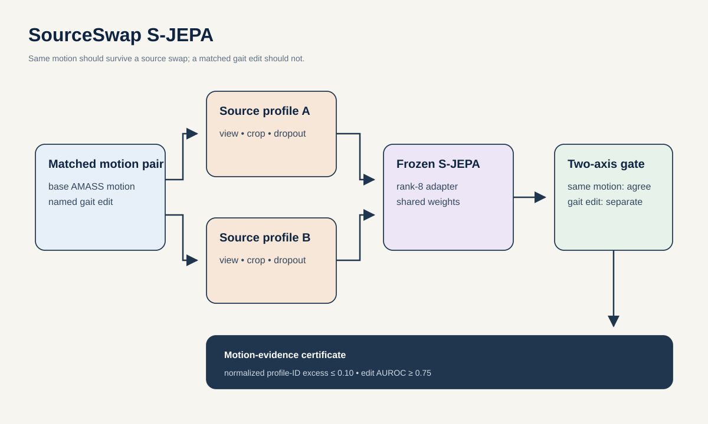

# Proposal 1: SourceSwap S-JEPA

## The idea in one sentence

If two skeleton videos show exactly the same walk, changing only the camera and pose-extraction process should barely change S-JEPA's internal summary. If the walk itself changes, the summary should change.

SourceSwap tests both requirements at the same time.

## Why this study is needed

GAVD contains 1,874 gait sequences taken from 348 source videos. In the checked manifest, 347 of the 348 source videos contain only one gait-pattern label. This creates a serious ambiguity. A model may appear to recognize gait while actually using clues from the recording, such as camera view, image quality, cropping, or missing joints.

Holding out whole source videos prevents direct duplication between training and testing. It does not solve the deeper problem. If Parkinsonian examples tend to come from one kind of video and normal examples from another, a model can still learn the difference between recording styles.

The repository already shows that this risk is real. A classifier using only missing-joint patterns reached macro-F1 0.388 on the historical five-class split. Macro-F1 gives every class equal importance. In the stricter current experiment, trained frozen S-JEPA encoders did not beat raw skeleton features or untrained random encoders. A higher GAVD classification score alone would therefore not prove that S-JEPA learned gait.

SourceSwap creates the missing controlled test. It keeps the walk fixed and changes only how that walk is observed.

## Research question

> Within two weeks, can a small trainable add-on make a frozen S-JEPA model ignore changes caused only by the recording process while keeping at least 90 percent of its response to controlled gait changes? If it can, does the improved representation add useful information on unseen GAVD source videos beyond raw skeleton motion and obvious recording clues?

This is not mainly a classification experiment. The main result is evidence that the model follows motion rather than the recording process.

## The core test

The 2D skeleton seen by the model is not the person's motion itself. It is the result of passing that motion through a recording and pose-extraction process:

$$
x_s = R_s(m) + e_s
$$

Here:

- $m$ is the underlying 3D motion;
- $R_s$ is recording process $s$, including camera view, crop, blur, compression, and pose extraction;
- $e_s$ is the remaining measurement error;
- $x_s$ is the 2D skeleton sequence given to S-JEPA.

Let $f$ be the internal summary produced by S-JEPA. For the same motion seen through two recording processes, the summaries should be close:

$$
d\bigl(f(R_a(m)), f(R_b(m))\bigr) \approx 0
$$

For the same recording process applied to an original and edited motion, the summaries should remain different:

$$
d\bigl(f(R_s(m)), f(R_s(m + \Delta m))\bigr) > 0
$$

The first requirement removes recording clues. The second protects real gait information. Both are necessary because a model that outputs the same value for every video would satisfy the first requirement but would be useless.

## Study design

### 1. Split GAVD before measuring recording styles

Divide GAVD into five fixed groups of source videos. In each run, four groups are used for development and the fifth is kept untouched for testing. Every gait-pattern class must have at least two held-out source videos.

Build recording profiles only from the development sources in that run. Nothing measured from the held-out sources may be used to train the add-on, choose settings, or normalize features.

This order matters. Measuring all sources first would allow information from the test set to leak into training.

### 2. Describe the recording process without describing the gait

Each recording profile describes how a video turns motion into an observed skeleton. It may include:

- camera view and approximate projection;
- image resolution and frame rate;
- cropping and temporal sampling;
- blur, compression, and camera movement;
- how stable the pose detector is when the same frame is cropped, blurred, scaled, or reflected;
- which joints the detector tends to miss under those changes.

The profile must not include cadence, walking speed, joint displacement, step width, or other measurements of the gait itself. GAVD labels are never used to build profiles. A separate audit reports how well the allowed profile features alone predict the GAVD labels.

### 3. Make controlled copies of the same walk

Use AMASS walking sequences because their underlying 3D motion is known. Pass each walk through at least two simulated recording profiles. The resulting skeletons look different, but the motion is exactly the same.

For each walk, also create controlled motion edits while keeping the recording profile fixed:

- delay one lower leg during the gait cycle;
- reduce foot clearance during swing;
- reduce knee bending while preserving path and cadence;
- change step width while preserving path and cadence.

These edits are not simulations of disease. They are measurement tools. They answer a narrower question: after removing recording information, can S-JEPA still notice a known change in gait?

Implement every edit in two different ways and reserve one implementation for testing. This makes it harder for the model to memorize an editing artifact.

### 4. Train only a small add-on

Keep the existing S-JEPA model frozen. Add small rank-8 modules to the two parts that encode visible motion and predict hidden motion. Rank 8 is a lightweight setting that changes only a small number of weights. The new modules start at zero, so the first version behaves exactly like the original frozen model.

Train the add-on with three goals:

1. preserve the original masked-prediction task;
2. bring together summaries of the same motion recorded in different ways;
3. keep an original motion separate from its controlled gait edit.

No GAVD gait label is used during this training. The model is told only which AMASS examples contain the same motion and which contain a known edit.

### 5. Test the mechanism before testing GAVD labels

First test on AMASS people and recording-profile families that were not used to train the add-on.

Train a small classifier to guess which simulated recording profile produced each S-JEPA summary. If the classifier guesses well, recording information remains in the representation. If it performs near chance while the model still detects the controlled gait edits, SourceSwap has passed its central test.

For $K$ possible recording profiles, let $p$ be balanced profile-guessing accuracy. Chance accuracy is $1/K$. Define the profile-leakage score as:

$$
D_{\mathrm{profile}} = \frac{p - 1/K}{1 - 1/K}
$$

Set negative values to zero. A score of zero means chance-level profile guessing. A score of one means perfect guessing. For example, with five profiles, an accuracy of 0.28 gives a leakage score of 0.10.

### 6. Test whether it helps on real GAVD videos

Only after the controlled AMASS tests pass, apply the trained add-on to the held-out GAVD sources.

Compare two otherwise identical models:

1. recording clues plus raw motion from the 11 main body joints, called Core11;
2. the same inputs plus SourceSwap features.

Give every source video equal weight, no matter how many clips it contains. Combine predictions from all five held-out groups and compute one macro average precision across the six observed gait-pattern labels. This score gives every label equal importance.

The question is not whether SourceSwap works by itself. The question is whether it adds information after raw motion and obvious recording clues are already known.

## What counts as success

| Plain-language question | Measurement | Required result |
| --- | --- | --- |
| Can the model ignore the recording process? | Profile-leakage score on unseen AMASS people and unseen profile families | At most 0.10 and at least 50 percent lower than frozen S-JEPA |
| Can it still detect a real motion change? | Edit-detection AUROC, where 0.5 is random and 1.0 is perfect | At least 0.75 |
| Does its response grow with edit size? | Spearman rank correlation between edit size and model response | At least 0.70 |
| Did it preserve the original model's sensitivity? | Response to edits before and after SourceSwap | Retain at least 90 percent |
| Did all features collapse to one value? | Feature variation and number of independent feature directions | Retain at least 80 percent of the frozen model's feature diversity |
| Does it help on real videos? | Macro average precision on unseen GAVD sources | Positive improvement beyond raw motion and the complete recording-clue model |
| Is the improvement reliable? | Repeated resampling of held-out AMASS identities and GAVD sources | The 95 percent interval for improvement stays above zero |

The proposal advances only if the controlled recording test and the controlled gait-edit test both pass. A GAVD score increase cannot rescue a failed mechanism test.

## Comparisons that could disprove the idea

SourceSwap must be compared with simpler explanations and methods:

- the unchanged frozen S-JEPA model;
- raw coordinates from the 11 main body joints and handcrafted gait features;
- normalization using pose confidence alone;
- a random encoder with add-ons of the same size;
- ordinary augmentation without matched same-motion pairs;
- a model trained to make source identity difficult to guess, with the same number of trainable weights;
- simple linear alignment between recording profiles;
- a restricted per-video alignment of timing and left-right convention;
- shuffled time, shuffled joints, and incorrectly matched profiles;
- a version trained without the gait-edit separation goal.

If a simpler method matches SourceSwap within statistical uncertainty, the add-on is unnecessary. If profile guessing remains easy on unseen AMASS people, SourceSwap has not removed recording information. If edit detection falls sharply, it has removed useful gait information along with the recording clues.

## Best two-week experiment and compute

Use at least 100 AMASS walking sequences, four edit families, two implementations of each edit, all usable recording-profile families, five GAVD folds, and three random seeds.

Train two learned methods for 25 epochs in every fold, using the same update budget as 25 standard S-JEPA epochs:

1. SourceSwap;
2. an equally sized model trained with ordinary unpaired augmentation.

The schedule is:

- Days 1 to 3: lock the folds, build recording profiles, render the paired AMASS examples, and check that profile features contain no direct gait measurements.
- Days 4 to 7: train SourceSwap and the matched augmentation baseline.
- Days 8 to 10: test unseen AMASS people, unseen profile families, controlled edits, and feature collapse.
- Days 11 to 13: run the locked models on held-out GAVD sources and test whether SourceSwap adds information beyond raw motion and recording clues.
- Day 14: compute source-level uncertainty intervals, run label-shuffling tests, and review the results without changing any thresholds.

The two learned methods require about 22.5 H100-hours in total using the repository's existing compute estimate. Folds and seeds can run in parallel across eight GPUs. No large video model needs to be trained.

## How this differs from prior work

[ControlNet](https://arxiv.org/html/2302.05543v3) motivates adding a zero-initialized trainable path to a frozen model. [ViA](https://arxiv.org/abs/2209.00065) learns skeleton features that are less sensitive to camera view. [RobustGait](https://arxiv.org/abs/2511.13065) studies how image corruption and silhouette extraction affect gait recognition. [Drenkow and colleagues](https://openaccess.thecvf.com/content/WACV2026/html/Drenkow_Causality-Driven_Audits_of_Model_Robustness_WACV_2026_paper.html) use explicit imaging factors to test robustness. These works establish that view changes, recording corruption, and controlled imaging tests matter.

SourceSwap makes a narrower contribution for predictive skeleton models. It requires one model to pass two controlled tests at once:

1. the same underlying motion must produce similar evidence across unseen recording processes;
2. a real controlled change in that motion must remain measurable.

Ordinary augmentation does not provide this evidence. It changes an input and assumes the important content stayed the same. SourceSwap knows that the paired AMASS examples contain exactly the same underlying motion. It then checks gait sensitivity with a separate set of known motion edits.

## Contribution and limits

If the tests pass, the machine learning contribution is a paired test and small adaptation method for separating motion evidence from recording evidence.

The gait contribution is stronger evidence that an S-JEPA measurement follows how a person moves rather than how the video was recorded.

The study still cannot claim diagnosis, clinical severity, or generalization to unseen people. GAVD has no participant identifier, so the real-data claim is limited to unseen source videos. Passing SourceSwap would establish a useful measurement property, not clinical validity.
