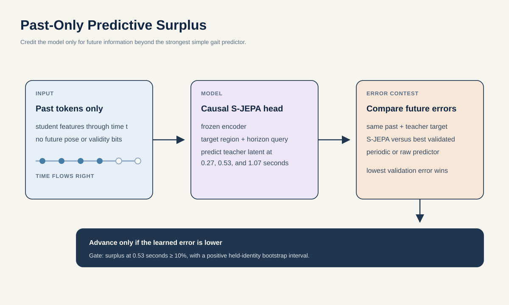

# Proposal 2: Past-Only Predictive Surplus

## Claim

Before S-JEPA is treated as a gait world model, it should prove that the past contains learned information about the future. Past-Only Predictive Surplus measures how much better a frozen S-JEPA representation predicts future latent motion than the best simple periodic or kinematic predictor.

The word **surplus** is important. Walking is repetitive. Copying the previous cycle, fitting a sinusoid, or extrapolating velocity can look impressive without learning a useful gait state. This proposal gives S-JEPA credit only for the prediction left after the strongest simple baseline.

## Research question

> Within two weeks, can a small causal predictor on frozen S-JEPA features reduce held-identity contextual future-latent error by at least 10 percent beyond the best periodic, spline, equal-capacity raw-past, or autoregressive baseline at a 0.53-second horizon, with a positive identity-bootstrap interval? Does the anatomy-by-horizon surplus then add source-held GAVD presentation information beyond raw Core11 and the full shortcut model?

This is a mechanism test first and a GAVD characterization test second. A failed mechanism test ends the proposal even if a label head happens to score well.

## Why the current loss does not answer the question

The local S-JEPA hides selected joint-time tokens inside one window. Visible tokens may occur before and after a hidden token. The predictor can therefore interpolate between two observed moments. Interpolation is useful representation learning, but it is not evidence that the model can predict what comes next.

The test imposes a strict arrow of time:

\[
z_{\le t} \longrightarrow \widehat z_{t+h}, \qquad h \in \{0.27, 0.53, 1.07\}\text{ seconds}.
\]

The 64-frame window is divided into sixteen four-frame patches. The student sees only the first eight patches. Target blocks are centered 8, 16, or 32 frames later, which gives patch-aligned horizons of approximately 0.27, 0.53, and 1.07 seconds at 30 Hz. No future token, future validity flag, or centered statistic may enter the context.

The frozen EMA target encoder was trained with bidirectional context. Its target is therefore a contextual representation of the later block, not a literal physical state variable. Passing this assay is necessary evidence of forward information, but it is not sufficient by itself to call the representation a physical world model.

Define the normalized surplus at horizon \(h\) as

\[
S(h)=1-\frac{L_{\mathrm{SJEPA}}(h)}{\min_b L_b(h)},
\]

where \(L_b\) is the loss of each preregistered simple baseline. Positive surplus means S-JEPA beats the best baseline. Zero means it adds nothing. Negative values mean a simple model is better.

## Method

### 1. Freeze the representation

Freeze `outputs/repaired-jepa-seed7-v2/seed-7_standard_sjepa_best.pt`, including its student and EMA target encoders. Add one small horizon-conditioned predictor with rank-8 residual projections. It reads past-only student tokens and predicts future teacher tokens for six nonzero Core11 regions: left and right hip, knee, and foot complexes.

The predictor shares parameters across horizons. Horizon and target-region embeddings state what it must predict. Only this small module trains. A second arm uses an architecture-matched random encoder, a third pairs contexts with the wrong teacher future, and a fourth uses an equal-capacity rank-8 head directly on raw past Core11 patches with the same region and horizon queries.

### 2. Use four information patterns

Evaluate the same target under four fixed masks:

| Query | Visible information | Purpose |
| --- | --- | --- |
| past-only | tokens no later than \(t\) | the actual predictive test |
| future-only | tokens no earlier than \(t+h\) | time-reversal control |
| bidirectional | matched token count on both sides | quantifies the interpolation advantage |
| phase-only | phase, mean pose, and one prior cycle | strong periodic baseline |

These are reported separately. A low bidirectional loss cannot rescue a failed past-only test.

### 3. Make the baseline hard to beat

Fit every baseline inside the AMASS training identities and score untouched identities:

- last pose and last velocity;
- cubic joint-wise extrapolation;
- phase-matched copy of the previous cycle;
- a harmonic regression with fold-selected frequencies;
- a raw-coordinate vector autoregression with the same history length;
- an equal-capacity raw-past-to-teacher-latent head with the same region and horizon embeddings;
- cadence, phase, and mean-pose prediction without learned features.

All baselines receive the same valid past and are scored against the same frozen teacher target. A coordinate baseline first predicts the future skeleton block. That predicted block is joined to the observed past and passed through the frozen teacher, so its error is measured in the same latent units as the S-JEPA head. The best baseline is selected on validation identities, never on the test identities.

### 4. Separate motion failure from observation failure

Project each held-out AMASS motion through source profiles learned from outer-training GAVD sources. Score clean and corrupted copies with identical masks. Add persistent motion edits that begin in the visible past and continue into the target: reduced knee excursion, lower swing clearance, and inter-limb phase lag. Add a separate unexpected-onset edit only after \(t\). A model may predict a persistent edit, but it should be surprised by an unseen onset.

The result is a region-by-horizon table with three interpretable quantities: predictable continuation, unexpected-change residual, and observation-profile sensitivity.

## Decisive experiment

| Test | Metric | Advance rule |
| --- | --- | --- |
| Learned future information | \(S(0.53)\) against the validation-selected best baseline | At least 0.10, with the 95 percent held-identity bootstrap interval above zero |
| Longer horizon | \(S(1.07)\) | Positive in every seed, even if smaller than at 0.53 seconds |
| Pretraining value | Paired error versus random-encoder and teacher-shuffled placebos | Positive bootstrap interval against both |
| Arrow of time | Past-only versus bidirectional loss | Report the gap; never use bidirectional performance as future prediction |
| Semantic retention | Persistent-edit prediction and unexpected-onset detection | Edit AUROC at least 0.75 and at least 90 percent of clean-profile contrast |
| Source robustness | Surplus variance across unseen profiles | At least 50 percent lower after the SourceSwap adapter, if proposal 1 passes |

Stop if the phase-copy baseline matches S-JEPA, if surplus disappears on held-out identities, or if pose confidence predicts surplus as well as motion does. A useful null would show that the present S-JEPA is an interpolator rather than a forward model.

## GAVD experiment

Require one contiguous 64-frame window with valid first-eight-patch context and valid queried target regions, without temporal padding. Preserve the original 30 Hz time base and compute surplus at the three fixed patch-aligned horizons before any window-length normalization. Pool region-by-horizon summaries over a fixed number of windows per source.

Inside each source fold, compare these nested heads:

1. shortcuts only;
2. shortcuts plus raw Core11;
3. shortcuts plus raw Core11 plus past-only surplus;
4. the same head with random-encoder or teacher-shuffled surplus.

The main label metric is one source-pooled out-of-fold macro average precision. The scientific result is the conditional increment and the surplus map, not a claim that future error diagnoses a disease.

## Best two-week experiment and compute

Use the full eligible held-identity AMASS locomotion pool, capped at 200 motions per split only if inference becomes the bottleneck. Train the S-JEPA, equal-capacity raw-past, random-encoder, and teacher-shuffled heads for 25 epochs over three seeds. Test all horizons under clean motion, persistent edits, unexpected onsets, and held observation operators. Only then extract fold-locked GAVD windows.

- Days 1 to 3: implement patch-index assertions, causal information-flow tests, and every periodic or raw baseline.
- Days 4 to 6: train four capacity-controlled heads over three seeds.
- Days 7 to 9: evaluate held identities, held observation operators, persistent edits, and unexpected onsets.
- Days 10 to 12: compute fold-locked GAVD surplus and fit nested source-weighted heads.
- Days 13 to 14: identity and source bootstraps, teacher-target caveat audit, shortcut conditioning, and claim review.

Using the repository calibration, four learned arms cost at most `4 arms x 3 seeds x 25/100 x 3 H100-hours = 9 H100-hours`. Independent arms and seeds run across the eight GPUs. Classical baselines train on CPU.

## Relation to prior work

[Contrastive Predictive Coding](https://arxiv.org/abs/1807.03748) and [Dense Predictive Coding](https://openaccess.thecvf.com/content_ICCVW_2019/html/HVU/Han_Video_Representation_Learning_by_Dense_Predictive_Coding_ICCVW_2019_paper.html) learn representations by forecasting future latents. [CF-JEPA](https://arxiv.org/abs/2606.07031) explicitly trains multi-horizon forward time-series prediction, and [Latent Video Prediction Learns Better World Models](https://arxiv.org/abs/2605.15618) audits temporal-direction sensitivity in latent video models. [S-JEPA](https://www.ecva.net/papers/eccv_2024/papers_ECCV/papers/04755.pdf) instead masks skeletal tokens using geometric and motion-aware strategies. This proposal does not claim that future prediction or arrow-of-time evaluation is new. Its contribution is a gait-specific surplus test that asks whether a bidirectionally trained skeleton representation contains contextual future information beyond strong periodic structure and an equal-capacity raw-past head.

## Contribution and limits

**Machine learning contribution:** an architecture-placebo-controlled measure of genuinely forward information in a masked gait representation.

**Gait contribution:** an anatomy-by-horizon map showing which parts of a walk are predictable from their past after periodic and observation effects are removed.

Past-only prediction is not a clinical forecast. GAVD has no future health outcome. The output describes short-term motion continuation inside a video.
