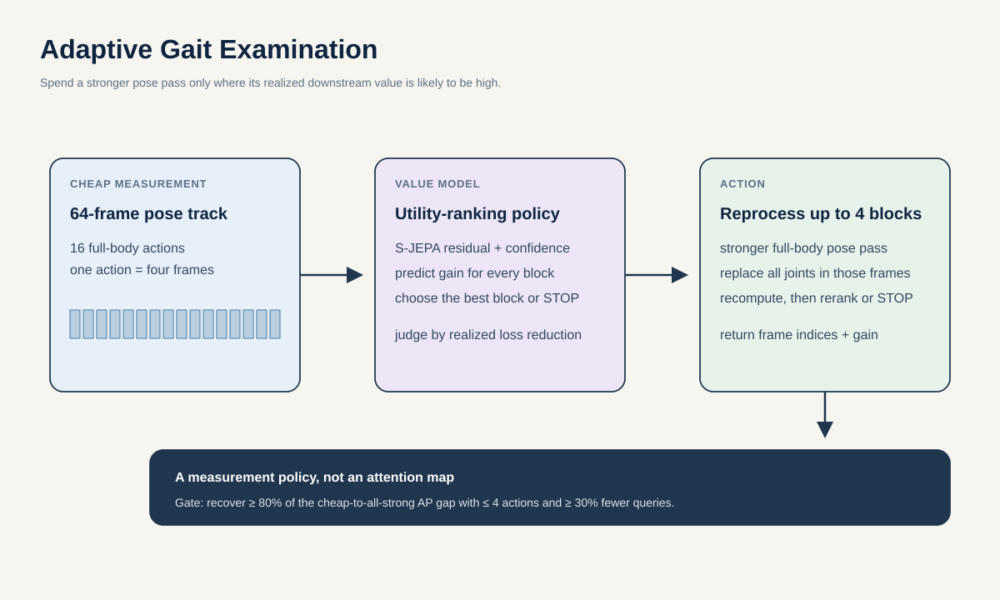

# Proposal 3: Adaptive Gait Examination

## Claim

When pose evidence is weak, the system should choose which short time block to process more carefully instead of silently trusting every frame. Adaptive Gait Examination uses frozen S-JEPA evidence to select the next four-frame, full-body pose remeasurement. Its output is an action such as `reprocess frames 25 to 28`, the automatically estimated gait phase for context, and the improvement actually obtained.

This is not an attention heatmap and not a minimal explanation. It is a cost-aware measurement policy with a verifiable consequence.

## Research question

> Within two weeks, can an S-JEPA policy recover at least 80 percent of the macro average precision gap between the cheap pose route and full RTMPose processing on held-identity rendered RGB by reprocessing at most 4 of 16 full-body time blocks, while using at least 30 percent fewer queries than confidence-first selection? Does the locked policy then improve source-held GAVD accuracy versus measured pose-processing cost and learn when another pass is not useful?

The controlled benchmark uses rendered AMASS RGB and actual weak-versus-strong detector outputs. Exact projected joints evaluate detector error and define an ideal ceiling, but they are never returned by an action. On GAVD, the stronger pose pass remains an additional fallible measurement rather than ground truth.

## First principles

A 64-frame Core11 window contains 16 four-frame token blocks. One action reruns a locked, expensive full-body pose route on the original RGB frames for one block. Every joint returned by those frame passes is charged once and becomes available together. This matches the real cost of pose estimation. It does not pretend that a standard full-body detector can price one knee separately from the rest of the frame.

For action \(q\), define per-example realized utility with multiclass Brier loss:

\[
U(q)=B(y,p_{\mathrm{before}})-B(y,p_{\mathrm{after}\ q}).
\]

The conclusion head and label \(y\) are fixed before actions are scored. The oracle knows all 16 detector outcomes and chooses the largest utility. The learned policy sees only the current cheap track. Normalized first-action regret is reported only when oracle gain is at least 0.02 Brier units, with the eligible fraction shown separately.

For macro average precision \(A\), define the fraction of recoverable performance gap after \(k\) actions as

\[
R(k)=\frac{A_k-A_{\mathrm{cheap}}}{A_{\mathrm{all\ strong}}-A_{\mathrm{cheap}}}.
\]

This measures recovered value rather than closeness to a possibly weak full-information score.

## Method

### 1. Create a complete action table

Use held-identity AMASS locomotion in four states: clean, reduced knee excursion, lower swing clearance, and inter-limb phase lag. Render the underlying body into RGB under camera, crop, lighting, compression, background, and occlusion conditions derived only from outer-training source profiles. Preserve exact projected joints as evaluation geometry.

Run both MediaPipe and the locked RTMPose route on every rendered frame. The cheap track is MediaPipe Core11. Action \(q\) replaces all Core11 joints in four frames with the actual RTMPose output for those frames. Exact clean projection is used only to measure normalized joint error and an unattainable ideal ceiling. Since all 16 real detector outcomes are cached, every first action has measured utility without rerunning a detector during policy training.

Before training the policy, require RTMPose to reduce held-condition normalized joint error by at least 20 percent and require full RTMPose processing to improve edit macro average precision by at least 0.05 over the cheap track. Otherwise there is no useful acquisition problem.

### 2. Fix the conclusion before choosing evidence

Train a small four-state edit head on disjoint AMASS identities. Freeze it before generating utilities. The policy cannot change the question to make its action appear useful.

For GAVD, fit the six-presentation head inside each outer source fold and freeze it before policy training. An inner source split selects the cost penalty and stopping rule. No outer-test label influences an action.

### 3. Let S-JEPA estimate value

For each not-yet-queried block, the policy receives only currently available information:

- frozen S-JEPA residual over all nonzero Core11 joints in that block;
- dispersion over a fixed bank of valid masks;
- detector confidence and validity;
- the current edit or presentation posterior;
- the number and cost of frame passes.

An order-invariant two-layer ranking head predicts candidate utility. It imitates the greedy oracle on training tables and includes a `STOP` action. After a query, the pose, S-JEPA answers, and conclusion are recomputed before choosing again.

The policy must beat confidence, raw motion magnitude, classifier gradients, and a random encoder. Otherwise S-JEPA is unnecessary.

### 4. Translate actions to GAVD honestly

Run the existing MediaPipe route as the cheap pass. A selected action returns to the four corresponding RGB frames, expands the full-person crop, and runs the official [RTMPose-L COCO-WholeBody 384 by 288 checkpoint](https://github.com/open-mmlab/mmpose/blob/main/configs/wholebody_2d_keypoint/rtmpose/coco-wholebody/rtmpose_coco-wholebody.yml), which includes foot keypoints. Pin MMPose 1.3.2 at release commit `5408bc7`, record the downloaded checkpoint's SHA-256 before inference, and abort if the official weight URL does not match the model index. Use locked flip and scale agreement, and map ankle, heel, and toe landmarks to Core11 with one fixed rule. All returned joints are charged once. Full expensive processing of all 16 blocks is the compute upper bound.

Automatically estimated phase may translate a selected block into a phrase such as `late swing`, but phase is descriptive only. GAVD event labels cover just 758 frames. Report phase-confidence failures and always retain the original frame indices.

## Decisive experiment

| Question | Metric | Advance rule |
| --- | --- | --- |
| Is the real strong route useful? | RTMPose joint error and all-strong edit AP versus MediaPipe | At least 20% lower joint error and at least 0.05 absolute AP headroom |
| Does the policy spend actions well? | Area under macro AP versus queried blocks | Higher than every baseline in all three seeds |
| How close is it to the oracle? | Normalized first-query regret when oracle gain is at least 0.02 Brier units | At most 0.20, with eligible coverage reported |
| Is it efficient? | Fraction of cheap-to-all-strong AP gap recovered | At least 0.80 with at most 4 of 16 blocks and at least 30% fewer queries than confidence-first |
| Does it transfer? | Improvement on a held-out corruption family | Positive over no query, random, and static top-four |
| Is S-JEPA necessary? | Paired comparison with random-encoder and raw policies | Held-identity bootstrap 95 percent interval above zero |
| Does it stop honestly? | Predicted versus realized utility | Low expected gain causes earlier stops on clean and unrepairable tracks |

Stop if the strong detector lacks the prespecified rendered-RGB headroom, if confidence and validity alone come within 0.03 macro AP, if phase or edit-template shortcuts determine the action order, or if the expensive GAVD pass harms as many clips as it helps.

## Baselines and falsifiers

- no reprocessing;
- random block order;
- one global top-four order for every clip;
- lowest mean confidence first;
- largest raw velocity or acceleration first;
- largest frozen S-JEPA residual first, without a learned policy;
- largest classifier-gradient block first;
- an equal-capacity policy on a random encoder;
- exhaustive processing of all blocks;
- the oracle that knows every action outcome;
- action utilities shuffled within corruption family.

Report both number of queried frames and measured GPU time. A method that processes the whole clip has not solved the cost problem.

## Best two-week experiment and compute

Use 80 identity-held AMASS motions, six rendered source profiles, four motion states, and all 16 cached RTMPose actions. This requires about 1,920 rendered 64-frame clips and runs each pose estimator once per frame, rather than once per candidate action. Train three policy seeds only after the real detector-headroom gate passes.

- Days 1 to 3: render RGB with exact projected joints, pin both pose routes, and measure weak-versus-strong detector headroom.
- Days 4 to 6: build complete actual-action tables and freeze the edit conclusion head.
- Days 7 to 9: train policy seeds, run sequential rollouts, and compare regret, stopping, and gap recovery.
- Days 10 to 12: cache both pose routes on GAVD training sources and train fold-local policies.
- Days 13 to 14: source-pooled accuracy-cost curves, wall-time accounting, calibration, and blinded action review.

Cap pose inference at 20 H100-hours and frozen S-JEPA extraction at 120,000 queries or 8 H100-hours, whichever comes first. Three small 25-epoch policy heads add at most 2.25 H100-hours by the repository anchor. Independent rendering and folds run across the eight GPUs.

## Relation to prior work

[EDDI](https://proceedings.mlr.press/v97/ma19c.html) and later [active feature acquisition](https://proceedings.mlr.press/v267/guney25a.html) choose costly variables for individual predictions. Active high-resolution human-pose refinement and region selection also exist ([Manousis et al.](https://doi.org/10.1016/j.eswa.2025.126550)). Adaptive Gait Examination does not claim that active acquisition or pose refinement is new.

Its proposed object is downstream-loss utility for a physically priced full-body frame-block action, learned from a complete counterfactual gait table and evaluated by oracle regret. It also differs from sufficient-input explanations. An explanation removes evidence while trying to preserve a decision. This policy acquires a more expensive measurement and is judged by the improvement that actually follows.

## Contribution and limits

**Machine learning contribution:** a world-model-guided pose-processing policy with exact synthetic action utilities and oracle-regret evaluation.

**Gait contribution:** a short request for when in an already recorded walk a better pose measurement is expected to help characterization.

The selected time block is not a clinical finding. On real GAVD, the expensive detector is still fallible, and a phase name is only an automatically estimated description.
