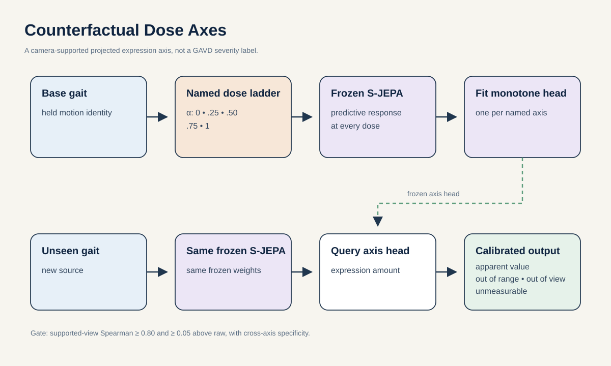

# Proposal 4: Counterfactual Dose Axes

## Claim

Learn continuous, named projected-motion axes from controlled counterfactual doses, then measure how strongly each supported axis appears in an unseen clip. Each axis must first prove that its dose is identifiable from pelvis-centered 2D Core11 within a declared camera-view range. The output is an apparent motion-expression profile, not a view-invariant physical quantity. It is not called clinical severity unless an independent dataset with real severity labels validates that interpretation.

## Research question

> Within two weeks, can frozen S-JEPA response features recover the order of projection-identifiable synthetic motion doses with Spearman correlation of at least 0.80 across unseen AMASS identities, supported camera views, and source profiles, while improving on raw kinematics by at least 0.05 Spearman or 10 percent normalized error? Do any qualified apparent-expression axes then add source-held characterization information on GAVD beyond raw coordinates, cadence, and the full shortcut model?

## Why a new target is needed

GAVD provides clip labels but no continuous severity field. Turning model confidence or distance from normal into a severity score would invent ground truth. A defensible route starts with quantities that can be changed exactly and measured exactly.

For a clean motion \(m\), define a controlled edit \(T_k(m,d)\). The axis name \(k\) states what changes, and dose \(d\) states how much. For example, a foot-clearance edit changes the minimum swing-foot height by a known amount while preserving the global route. The model is asked to recover the order of \(d\), not to guess a disease.

## Initial axis library

Start with three candidate axes that are understandable, dimensionless after Core11 conversion, and controllable. Their displayed values remain apparent 2D expressions unless the projection test below supports a stronger interpretation:

| Axis | Controlled change | Variables held approximately fixed |
| --- | --- | --- |
| Apparent swing clearance | Lower one foot during swing | cadence, path, stance foot |
| Apparent knee excursion | Reduce flexion range during swing | step timing, global speed |
| Projected phase lag | Delay one lower-leg trajectory | amplitude, average cadence |

Express clearance and excursion relative to robust leg length, and express lag as a fraction of the estimated cycle. These are motion primitives, not simulated diagnoses. A stroke clip may express several primitives, and the same primitive may occur in several presentations. Stance balance and hip-line obliquity remain reserved extensions because contact and view errors make their interpretation harder.

## Method

### 1. Prove projection identifiability, then generate dose ladders

Render each 3D edit ladder through nine held camera poses before adding detector corruption. Using exact projected Core11, require true-dose Spearman correlation of at least 0.90 within a candidate view stratum and at least 90 percent pair ordering across held cameras after a view-conditioned calibration learned on training cameras. If the 2D oracle cannot recover a dose, that axis is not observable and is removed. If it works only in a narrow stratum, the estimator runs only there and abstains elsewhere.

Select AMASS locomotion clips by identity-held split. Apply five to seven doses per edit, including zero. Reject edited clips that violate joint-length, velocity, or contact plausibility bounds. Implement every edit in two independent ways and reserve one implementation for test, so a head cannot memorize one editing artifact. Include compound two-axis edits. For each GAVD outer fold, project accepted ladders only through profiles learned from that fold's outer-training sources.

### 2. Query the frozen predictor

Measure how the frozen S-JEPA same-window infilling residual changes over joint region, phase, and context-to-target temporal separation. Pool these responses into a compact vector. Fit one monotone spline or ordinal head per axis. The head sees the known dose order but no GAVD label.

The monotonic constraint is important. A score that rises, falls, and rises again over a known dose ladder is not a useful amount scale.

### 3. Calibrate an honest range

For each axis, define the interval over which held-out dose recovery remains reliable. A real clip outside that interval receives `outside calibrated range`, not an extrapolated number. Clips with failed phase estimation or insufficient visibility receive `unmeasurable` for that axis.

### 4. Test association without renaming it severity

Apply each fold-specific locked axis estimator to held-out GAVD source videos. Compare distributions across the six presentation labels and test whether the axes improve source-pooled macro average precision when added to raw Core11 and the full shortcut model. No held-out source profile, clip, or label may fit the axis. Report the continuous profile even when it does not improve classification.

If a public dataset such as [CARE-PD](https://arxiv.org/abs/2510.04312) supplies compatible clinician-rated severity, use it only as an external validation set. An axis may be described as severity-related only after preregistered association, calibration, and subgroup checks pass there.

## Decisive experiment

| Question | Metric | Advance rule |
| --- | --- | --- |
| Is the dose observable in 2D? | Exact-projection dose recovery over held cameras | Within-stratum Spearman at least 0.90 and at least 90% held-camera pair ordering, otherwise restrict or remove the axis |
| Does an axis measure its intended dose? | Identity-held and profile-held Spearman correlation | Median at least 0.80 and positive in every seed |
| Is its scale accurate? | Normalized mean absolute error | At most 0.20 of the calibrated dose range |
| Is it specific? | Cross-axis response matrix | Every off-axis response is at most 20% of the intended response |
| Does it transfer beyond an editing artifact? | Held-out implementation and compound edits | Ordering and specificity gates still pass |
| Is it more than geometry? | Comparison with raw coordinates and handcrafted kinematics | At least 0.05 higher Spearman or 10% lower normalized error, with a positive held-identity bootstrap interval |
| Does it survive observation changes? | Dose rank consistency across source profiles | At least 90% pair-order agreement |
| Is the real output honest? | Out-of-range and unmeasurable rates | Both reported by label and source, never silently imputed |

The proposal fails if cadence, duration, centroid drift, or foreground area recovers the dose just as well. It also fails if an axis responds equally to detector dropout or an unrelated edit.

## Baselines and falsifiers

- exact edit parameter from clean 3D motion, as an upper bound;
- raw Core11 coordinates and velocities;
- the 82-feature handcrafted representation;
- cadence, duration, box area, and centroid drift alone;
- random encoder with the same monotone head;
- frozen standard S-JEPA and the SourceSwap adapter;
- dose labels shuffled within an identity;
- source profiles shuffled across a ladder;
- a global speed change matched to each edit's easiest shortcut;
- detector dropout and confidence decay with motion unchanged.

## Best two-week experiment and compute

Use 100 identity-held AMASS motions, three candidate axes, five doses, nine camera poses, two independent edit implementations, held source profiles, eight fixed masks, and three head seeds. This creates a demanding projection-identifiability test before any S-JEPA claim and enough held combinations to estimate honest calibrated ranges.

- Days 1 to 3: build exact 3D ladders, render held cameras, and remove or view-restrict unidentifiable axes.
- Days 4 to 6: extract raw, handcrafted, random-encoder, frozen-S-JEPA, and SourceSwap responses.
- Days 7 to 9: fit monotone heads, test held edit implementations and compound doses, and lock calibrated ranges.
- Days 10 to 12: apply only supported axes to held GAVD sources with explicit out-of-view and unmeasurable outputs.
- Days 13 to 14: source bootstraps, shortcut conditioning, replication, and external severity association only if compatible public labels are ready.

At full factorial size this is at most 216,000 masked forward evaluations. Benchmark the first 1,000 queries and cap frozen extraction at 12 H100-hours. Monotone heads and view calibrators train on CPU. It is acceptable for one axis to survive and two to be removed.

## Relation to prior work

[GaitForeMer](https://arxiv.org/abs/2207.00106) studies few-shot clinical severity prediction, while [GAITGen](https://openaccess.thecvf.com/content/WACV2026/html/Adeli_GAITGen_Disentangled_Motion-Pathology_Impaired_Gait_Generative_Model_--_Bringing_Motion_WACV_2026_paper.html) uses severity-conditioned motion generation. This proposal takes a different evidentiary route. It learns amount scales from known interventions first and only then asks what those scales mean in clinical video.

It also differs from the intervention-response proposal in `proposals-01`. That proposal asks whether a representation reacts correctly to an edit. Counterfactual Dose Axes require a reusable, monotone, calibrated quantity that transfers across identities and source profiles.

## Contribution and limits

**Machine learning contribution:** a method for deriving continuous, calibrated, view-supported representation measurements from controlled counterfactual ladders when the target dataset has only coarse labels.

**Gait contribution:** an interpretable vector of apparent motion-expression amounts with explicit camera support, measurement ranges, and abstention.

The result does not create GAVD severity labels. Clinical severity remains an external validation claim.
