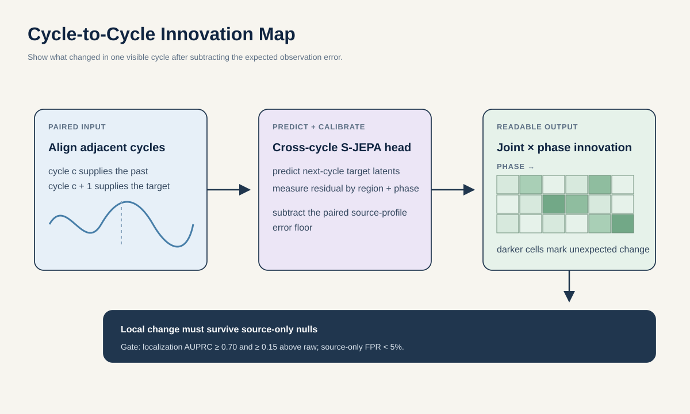

# Proposal 5: Cycle-to-Cycle Innovation Map

## Claim

Do not describe a walk only by its average cycle. Measure what changes unexpectedly from one cycle to the next. A Cycle-to-Cycle Innovation Map uses one phase-aligned gait cycle to predict the next, then shows the remaining error by joint region and phase after subtracting the error expected from the observation pipeline.

Here, **innovation** means new information relative to the immediately preceding cycle. It does not mean improvement, decline, or disease progression.

The comparison is self-referenced: cycle \(c\) predicts cycle \(c+1\) from the same visible walk. This is not a normative anomaly score or a reconstruction of how a patient should walk.

## Research question

> Within two weeks, can a frozen-S-JEPA cross-cycle head localize a one-cycle motion onset with AUPRC of at least 0.70 on held-out AMASS identities and unseen source profiles, at least 0.15 above raw differencing and matched-jerk baselines, while keeping false innovation below 5 percent for source-only changes? Do source-level innovation summaries then add source-held GAVD presentation information beyond ordinary gait variability, raw Core11, and the full shortcut model?

This proposal is intentionally about nonpersistent change. A stable difference present in every cycle belongs in proposal 4, not here.

## Why consecutive cycles matter

Two walks can have the same mean range of motion and the same average cadence but differ in how one step departs from the last. Clinical gait research has long found information in stride-to-stride fluctuations, especially in neurological gait. Simple coefficients of variation summarize their size but lose anatomy and phase.

Let \(C_c(r,p)\) be the frozen target latent for region \(r\) and phase bin \(p\) in cycle \(c\). A small head predicts cycle \(c+1\) from cycle \(c\):

\[
\widehat C_{c+1}=F(C_c).
\]

For each cell, subtract the expected residual caused by processing the same underlying motion through different source profiles:

\[
I(r,p)=\frac{\lVert C_{c+1}(r,p)-\widehat C_{c+1}(r,p)\rVert-\mu_{\mathrm{profile}}(r,p)}{\sigma_{\mathrm{profile}}(r,p)+\epsilon}.
\]

The result is a small joint-by-phase map. Positive cells mark changes larger than the calibrated observation floor.

## Method

### 1. Build cycle pairs without using GAVD event labels

Select manually verified AMASS locomotion sequences with at least four cycles. Use exact 3D contacts or kinematic events to define phase before projection. Resample each accepted cycle separately to 32 phase-aligned frames, then concatenate cycles \(c\) and \(c+1\) into the fixed 64-frame encoder input. The causal cross-cycle head sees only the first 32 frames. Project motions through fold-local GAVD observation profiles, then estimate phase again from the noisy Core11 track.

Train a separate confidence model to predict phase error. Accept an estimated cycle only if held-profile AMASS tests place its expected boundary error below one eighth of a cycle. This matters because GAVD provides gait-event labels on only 758 of 458,116 frames. Those sparse labels cannot validate a full phase-localization claim.

### 2. Train a small cross-cycle predictor

Freeze the standard S-JEPA student and EMA target encoders. Train one rank-8 phase-conditioned head on AMASS training identities. The head receives cycle \(c\) and predicts target latents for cycle \(c+1\). A random-encoder arm uses the same head and data.

The model does not segment recurring motifs or learn a vocabulary. Every comparison is between two adjacent, explicitly phase-aligned cycles.

### 3. Calibrate the observation floor

For each clean AMASS pair, create replicas through several outer-training observation profiles. Estimate \(\mu_{\mathrm{profile}}\) and \(\sigma_{\mathrm{profile}}\) only from differences among replicas of the same motion. Hold out both identities and profile operators when testing.

Also fit a simpler floor using detector confidence, missingness, blur, view, and crop statistics. If that shortcut floor works as well as the S-JEPA calibration, use the simpler method and reject the model claim.

### 4. Inject changes with known support

Apply an edit only to cycle \(c+1\), with exact region-phase support:

- one swing-phase foot-clearance reduction;
- one-cycle knee-excursion reduction;
- a localized lower-leg phase slip;
- a brief cross-leg timing reset.

Use five doses plus a zero-dose control. Every edit envelope has zero displacement, velocity, and acceleration at both cycle boundaries, so a splice cannot reveal the target. Add a null with matched jerk energy and temporal support but no semantic joint-phase change. Separately inject detector dropout, joint jitter, blur-derived confidence loss, and a left-right swap. These are observation failures, not motion innovations. Compound motion-plus-observation cases test whether calibration survives both at once.

## Decisive experiment

| Question | Metric | Advance rule |
| --- | --- | --- |
| Is the changed cell found? | Region-phase localization AUPRC | At least 0.70 and at least 0.15 above every raw-magnitude or confidence baseline |
| Does the map scale with change? | Spearman correlation between local innovation and edit dose | At least 0.75 in every seed |
| Are source changes rejected? | False-positive rate at the locked detection threshold | Below 5 percent on unseen profile operators |
| Does pretraining matter? | Paired AUPRC gain over random encoder and teacher-shuffled head | Positive held-identity bootstrap interval |
| Is phase doing real work? | Correct phase versus random offset and cycle-order shuffle | Both controls reduce localization by a preregistered margin |
| Can persistent motion be distinguished? | One-cycle edit versus the same edit in both cycles | Innovation is larger for the one-cycle onset |

Stop if velocity, acceleration, confidence, or missingness alone draws the same map. Stop the GAVD phase claim if fewer than half of primary-cohort sources contain two accepted consecutive cycles after fixed-window sampling.

## GAVD experiment

Run only on sequences with at least two accepted complete cycles. Pool a fixed number of adjacent pairs per source, then summarize:

- innovation magnitude by region and phase;
- frequency of large innovations;
- direction and persistence across adjacent pairs;
- accepted-cycle coverage and phase confidence.

Compare `shortcut + raw Core11` with `shortcut + raw Core11 + innovation` in the fixed six-presentation source folds. The label result is secondary. The primary scientific question is whether the map responds to known cycle-local changes but not known source changes.

Do not infer that a high map indicates deterioration, falls, or a specific pathology. A short internet video cannot estimate the long-range gait variability measures used in instrumented studies.

## Baselines and falsifiers

- cycle-to-cycle differences in raw coordinates, velocity, and acceleration;
- boundary-matched random edits with identical jerk energy;
- coefficient of variation of phase duration and joint range;
- phase-matched copy of cycle \(c\);
- harmonic and vector-autoregressive predictors;
- confidence and missingness maps;
- frozen random encoder with the same cross-cycle head;
- teacher targets shuffled across cycles;
- cycle order shuffled within a motion;
- source-profile replicas without any motion edit;
- identical edits applied to both cycles.

## Best two-week experiment and compute

Use 80 manually verified multi-cycle AMASS motions, four localized edit families, five doses, two boundary-matched implementations, eight held observation operators, and three head seeds. Train the S-JEPA and random-encoder cross-cycle heads only after phase recovery meets its declared error limit.

- Days 1 to 3: verify cycles, implement 32-plus-32 resampling, and validate phase confidence under held profiles.
- Days 4 to 6: construct endpoint-matched semantic edits, matched-jerk nulls, source-only nulls, and compound cases.
- Days 7 to 9: train both cross-cycle heads and evaluate localization, dose ordering, persistent-edit controls, and raw baselines.
- Days 10 to 11: census GAVD for two accepted consecutive cycles and lock measurable coverage.
- Days 12 to 14: extract fold-local maps, pool sources, run shortcut comparisons, bootstrap, and audit high-innovation cells blind to labels.

Two learned arms cost at most `2 arms x 3 seeds x 25/100 x 3 H100-hours = 4.5 H100-hours`. Frozen feature extraction, phase stress tests, and edit generation are capped at another 8 H100-hours.

## Relation to prior work

Clinical studies distinguish the amount and temporal organization of [gait variability](https://pmc.ncbi.nlm.nih.gov/articles/PMC1185560/), and a meta-analysis reports that several variability measures differ in Parkinsonian gait ([König et al.](https://pubmed.ncbi.nlm.nih.gov/27445759/)). Those studies motivate cycle-to-cycle measurement, but they generally summarize stride parameters rather than a predictive joint-phase residual.

[Action Motifs](https://openaccess.thecvf.com/content/CVPR2026/html/Kinoshita_Action_Motifs_Self-Supervised_Hierarchical_Representation_of_Human_Body_Movements_CVPR_2026_paper.html) already learns recurring motion atoms and motifs with masked latent prediction. [GenGait](https://arxiv.org/abs/2604.01997) already masks individual joints against a normative Transformer prior to localize gait anomalies and generate corrected kinematics. This proposal therefore claims neither joint-level anomaly localization nor normative reconstruction.

Its narrower object is the unexpected onset between two already aligned adjacent cycles from the same walk, corrected by a paired observation-error floor and tested against boundary-matched raw differencing. It discovers no segments, vocabulary, normative twin, or disease deviation.

## Contribution and limits

**Machine learning contribution:** a source-corrected, phase-local predictive innovation map with exact synthetic support tests.

**Gait contribution:** an anatomical description of what changed from one visible cycle to the next.

The map needs multiple usable cycles and reliable phase. It will not characterize stable abnormalities that repeat unchanged, and it cannot estimate long-range stride dynamics from short clips.
