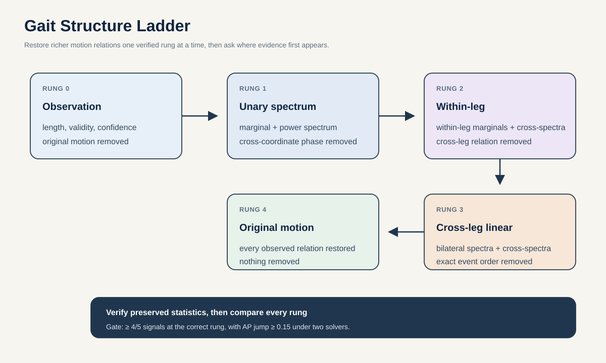

# Proposal 7: Gait Structure Ladder

## Claim

Measure exactly which order of motion structure carries a result. The Gait Structure Ladder creates nested surrogate skeletons that preserve progressively richer information: observation quality, single-joint dynamics, within-leg coordination, cross-leg linear coordination, and finally the original motion.

The central output is not another accuracy number. It is a curve showing where label evidence first appears and whether S-JEPA uses that evidence beyond raw geometry.

## Research question

> Within two weeks, can a five-rung, two-solver surrogate ladder place at least four of five controlled AMASS signals at the first rung that mathematically preserves them, with an average precision jump of at least 0.15 and artifact-only AUROC no greater than 0.55? At which rung does source-held six-presentation GAVD information appear, and does frozen S-JEPA add high-order structure beyond raw Core11 and shortcut features?

This is an information audit under a declared surrogate family. It does not claim that a surrogate is a realistic patient motion or that a rung identifies biological causation.

## First principles

A classifier can succeed for very different reasons. It may read missing joints. It may read the amplitude spectrum of one knee. It may need the timing relation between knee and ankle. It may need coordination between the two legs. Ordinary feature ablation changes many of these properties at once, so the result is hard to interpret.

A surrogate time series keeps selected statistics while randomizing others. By arranging surrogates from weak to strong, the experiment asks a sequence of sharper questions:

\[
\text{observation} \subset \text{unary dynamics} \subset \text{within-leg} \subset \text{cross-leg linear} \subset \text{original}.
\]

If performance is already high on the observation rung, source or detector behavior is enough. If it rises only when cross-leg relations return, bilateral timing is required. If raw Core11 rises at that rung but S-JEPA does not, predictive pretraining failed to capture the available relation.

## The five rungs

All transformations exclude the identically zero pelvis coordinates. They preserve clip length and reapply the exact original validity and confidence sidecars after coordinate transformation.

| Rung | What is preserved | What is deliberately removed |
| --- | --- | --- |
| 0. Observation | duration, validity, confidence, view, source metadata, and recipient profile applied to a class-agnostic AMASS donor | the original gait coordinates |
| 1. Unary spectrum | each coordinate's empirical value distribution and approximate power spectrum | phase relations between coordinates and joints |
| 2. Within-leg | rung 1 plus cross-spectra among hip, knee, and foot channels within each leg | relations between the two legs |
| 3. Cross-leg linear | rung 2 plus the full bilateral cross-spectrum | nonlinear waveform organization and exact event order |
| 4. Original | every observed coordinate and relation | nothing |

The rung-3 to rung-4 increment is residual information beyond pairwise linear cross-spectra, including cross-frequency, higher-order, nonstationary, and exact event-order structure. It is not labeled “full coordination,” because many different mechanisms can create that residual.

Rung 1 uses iterated amplitude-adjusted Fourier surrogates independently by coordinate. Rung 2 uses multivariate IAAFT separately within each leg to preserve univariate marginals, power spectra, and within-leg cross-spectra together. Rung 3 runs multivariate IAAFT across both legs to preserve all pairwise linear cross-spectra. Multiple random surrogate seeds estimate how much any result depends on one randomization.

These operations can produce kinematically implausible traces at lower rungs. That is acceptable for a statistical null, but it prevents treating their outputs as generated gait. Bone-length error and velocity tails are reported so that a model's reaction to artifacts is visible. Repeat the ladder on bone-vector or joint-angle channels as an off-manifold sensitivity analysis, then map accepted surrogates back to Core11.

## Method

### 1. Prove that every rung does what it says

For every clip, solver, and surrogate seed, audit:

- empirical coordinate quantiles;
- power spectra and autocorrelation;
- within-leg and cross-leg cross-spectra;
- exact validity and confidence masks;
- every declared statistic on the final model-visible tensor after validity masking, fold-local imputation, normalization, and patching;
- residual phase dependence;
- bone-length and velocity artifact size.

Iterate the surrogate solver until every declared preserved statistic is within 1 percent normalized error on both the generated coordinates and final model-visible tensor, or mark that clip and rung invalid. Solver A is multivariate IAAFT. Solver B uses constrained multivariate Fourier phase randomization followed by iterative joint rank remapping and covariance correction. The main rung jump must reproduce with both accepted solvers.

Fit artifact-only probes and condition rung comparisons on bone and velocity artifact summaries. Require artifact-only AUROC at most 0.55 for each controlled task. The ladder cannot support an information claim if its transformations are not verified or if artifacts explain the jump.

### 2. Build signals with known required structure

Use held-identity AMASS projections to program five binary tasks:

1. an observation-profile corruption, available at rung 0;
2. reduced knee excursion, available from unary dynamics at rung 1;
3. a knee-to-foot delay within one leg, first preserved at rung 2;
4. an inter-limb phase change, first preserved at rung 3;
5. a one-cycle event-order change with matched linear spectra, available only in the original at rung 4.

Match coordinate energy, duration, cadence, and missingness across positive and negative examples. The largest performance increase should occur exactly when the needed relation is restored.

### 3. Compare representations rather than one classifier

At every rung, evaluate the same capacity-matched readouts on:

- shortcut and sidecar features;
- raw Core11;
- handcrafted kinematics;
- random-encoder features;
- frozen standard S-JEPA features;
- SourceSwap features, if proposal 1 passes.

Each readout trains and tests on the same rung. This prevents a distribution mismatch from masquerading as lost information.

### 4. Apply the locked ladder to GAVD

Generate rung-specific surrogates separately inside each fixed source fold. The transformations use no presentation label, and any donor or solver hyperparameter comes from outer-training sources only. Weight each source equally and pool a fixed number of windows per source.

For each representation, plot one out-of-fold source-pooled macro average precision at each rung. Also plot the conditional increment beyond the full shortcut model. Treat solver seeds as repeated draws nested within their original motion, never as independent samples. Cluster-bootstrap sources for GAVD differences and motions for controlled differences between adjacent rungs.

## Decisive experiment

| Question | Metric | Advance rule |
| --- | --- | --- |
| Are preservation claims true? | Normalized error of every declared statistic | At most 0.01 for accepted surrogates |
| Does the ladder order known signals correctly? | Rung containing the largest AP jump | Correct for at least four of five AMASS tasks |
| Is the jump meaningful? | AP increase at the intended rung | At least 0.15, with no earlier jump above 0.05 over chance |
| Does S-JEPA use restored structure? | S-JEPA increment versus random encoder at each rung | Positive held-identity bootstrap interval for the intended predictive tasks |
| Are artifacts the answer? | Artifact-only probe and matched-artifact controls | AUROC at most 0.55 and cannot explain the rung jump |
| Does the result depend on one solver? | Adjacent-rung jump under two accepted surrogate solvers | Same intended rung and positive motion-bootstrap interval for both |
| Does GAVD contain conditional motion evidence? | Adjacent-rung source-bootstrap AP increment after shortcuts | Positive only at a rung whose preserved relation can be named |

A high GAVD score at rung 0 is a strong negative result for semantic interpretation. A flat S-JEPA curve with a rising raw-motion curve is a negative result for the current representation. Both outcomes are more informative than an unexplained end-to-end score.

## Baselines and falsifiers

- simple time shuffle and joint shuffle;
- phase-matched cycle permutation;
- independent Fourier-phase randomization without amplitude adjustment;
- multivariate linear autoregression surrogates;
- raw and handcrafted readouts with identical capacity;
- random encoders with identical pooling;
- a classifier using only surrogate artifact statistics;
- surrogate seed decoded as a target;
- source labels and presentation labels shuffled independently;
- fully original motion with matched added artifact energy.

## Best two-week experiment and compute

Use 80 held-identity AMASS motions, five programmed tasks, five rungs, two independent surrogate solvers, and eight seeds nested within each original motion. Generate fold-local GAVD surrogates only after both solvers pass the preservation and artifact gates. No representation is trained.

- Days 1 to 3: implement both solvers and verify every preserved statistic on coordinates and final model-visible tensors.
- Days 4 to 6: build controlled tasks, match artifacts, and run artifact-only probes.
- Days 7 to 9: extract raw, handcrafted, random-encoder, standard-S-JEPA, and SourceSwap features across both ladders.
- Days 10 to 12: generate fold-local GAVD ladders and fit capacity-matched nested readouts.
- Days 13 to 14: hierarchical bootstraps, exact label permutations where feasible, cross-solver replication, and the final information-accounting figure.

The controlled study contains at most `80 motions x 5 tasks x 5 rungs x 2 solvers x 8 seeds = 32,000` transformed examples. Cap S-JEPA extraction at 8 H100-hours. Surrogate solvers and readouts run on CPU.

## Relation to prior work

[Schreiber and Schmitz](https://arxiv.org/abs/chao-dyn/9909041) introduced an iterative method for surrogates that approximately preserve a signal's distribution and autocorrelation. [Prichard and Theiler](https://doi.org/10.1103/PhysRevLett.73.951) developed multivariate phase-randomized surrogates, and [Keylock](https://doi.org/10.1029/2012WR011923) describes multivariate IAAFT that retains cross-correlation structure. In gait, [Dingwell and Cusumano](https://pubmed.ncbi.nlm.nih.gov/20605097/) compare several surrogate families, including cross-correlated stride-length and stride-time surrogates, to test interpretations of stride variability. [Liégeois, Yeo, and Van De Ville](https://doi.org/10.1016/j.neuroimage.2021.118518) explain how different time-series nulls preserve progressively richer temporal properties. Recent work also combines phase, IAAFT, and block-shuffle surrogates to attribute neural time-series predictability ([Ostadsharif Memar and Dehghani](https://arxiv.org/abs/2606.11415)). Progressive surrogate attribution is therefore not new. Skeleton-recognition work such as [STC-Net](https://openaccess.thecvf.com/content/ICCV2023/papers/Lee_Leveraging_Spatio-Temporal_Dependency_for_Skeleton-Based_Action_Recognition_ICCV_2023_paper.pdf) builds models to exploit joint dependencies.

This proposal does not claim the surrogate techniques or the progressive-null logic as new. Its contribution is the specific anatomy-nested, preservation-audited ladder for a predictive clinical gait representation, with source-only evidence as the bottom rung, within-leg and cross-leg rungs, controlled relation-specific tasks, and architecture placebos. It asks what information was accessible under the tested surrogate and readout family, not which network component improved a benchmark.

## Contribution and limits

**Machine learning contribution:** a falsifiable hierarchy for assigning predictive performance to observation, unary, limb-local, bilateral-linear, or higher-order temporal information.

**Gait contribution:** a readable account of the first relation made accessible by this tested surrogate family and readout at which each supported GAVD result appears.

The ladder does not identify biological causation. Lower rungs are statistical nulls, not plausible patient counterfactuals. The final inference is about information present in these videos and used by these models.
