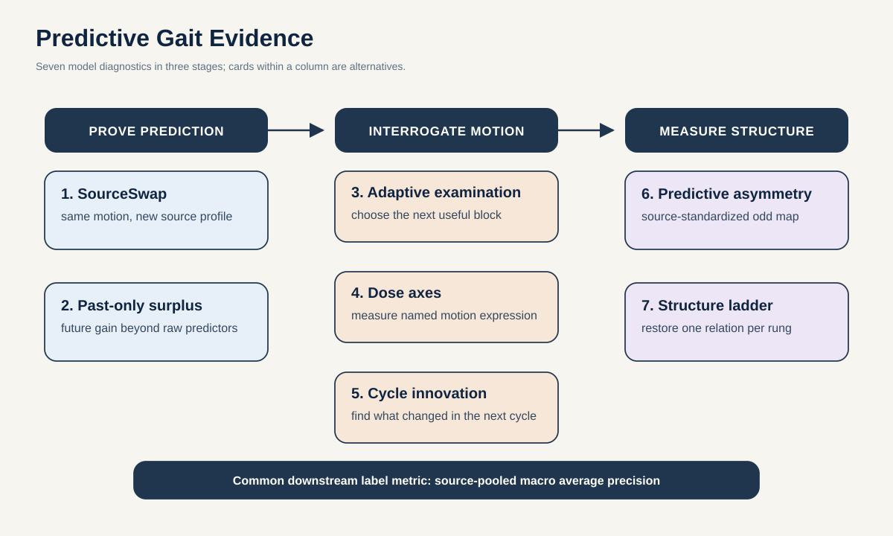

# Predictive gait evidence: seven decision-ready proposals

**Research agenda, 3 September 2026**

This portfolio asks one hard question: can Skeleton JEPA produce evidence about *how a person walks* that survives recording source, pose failure, trivial periodicity, and uncertain side naming? It does not seek another normal-versus-abnormal score. It does not treat a GAVD presentation label as a verified diagnosis.

The first recommendation is **SourceSwap S-JEPA**. GAVD has 1,874 sequences from 348 source videos, and 347 of those 348 videos contain only one `gait_pat` value. A source-held split blocks direct clip leakage, but it cannot prove that evidence follows motion rather than recurring acquisition style. SourceSwap creates the missing test: send identical motion through different simulated observation profiles, then require the representation to ignore the profile while retaining controlled gait edits.

The first companion is **Past-Only Predictive Surplus**. The present S-JEPA can see tokens on both sides of a masked target. It may be a good interpolator without containing useful forward information. This proposal gives it credit only for contextual future prediction beyond the best periodic, spline, autoregressive, and equal-capacity raw-past baseline.

## Executive decision

| Rank | Proposal | Decisive object | Decision gate | Readable output |
| ---: | --- | --- | --- | --- |
| 1 | [SourceSwap S-JEPA](01-sourceswap-sjepa.md) | Same motion under a different simulated source pipeline | Normalized excess profile decodability at most 0.10, edit AUROC at least 0.75, and positive conditional GAVD value | Motion-following evidence certificate |
| 2 | [Past-Only Predictive Surplus](02-past-only-predictive-surplus.md) | Contextual future information beyond strong gait predictors | At least 10% surplus at 0.53 seconds over the best validated baseline, with a positive identity-bootstrap interval | Region-by-horizon surplus map |
| 3 | [Adaptive Gait Examination](03-adaptive-gait-examination.md) | Realized value of one full-body frame-block remeasurement | Recover at least 80% of the cheap-to-all-strong AP gap with at most 4 of 16 actions and 30% fewer queries than confidence-first | `Reprocess these frames`, plus realized gain |
| 4 | [Counterfactual Dose Axes](04-counterfactual-dose-axes.md) | Continuous amount along projection-identifiable motion edits | Held-profile dose Spearman at least 0.80 and a prespecified gain over raw kinematics inside declared camera support | Calibrated apparent-expression vector |
| 5 | [Cycle-to-Cycle Innovation Map](05-cycle-to-cycle-innovation-map.md) | New joint-phase error from one cycle to the next | Localization AUPRC at least 0.70 and 0.15 above boundary-matched raw baselines, with source-only false positives below 5% | What changed between adjacent cycles |
| 6 | [Side-Anonymous Predictive Asymmetry](06-side-anonymous-predictive-asymmetry.md) | Unsigned glide-odd prediction error after a failed laterality mechanism | Localize the counterpart orbit of unilateral edits at AUPRC at least 0.70 and beat raw symmetry by at least 0.15 | `One side differs here`, without an unsupported side name |
| 7 | [Gait Structure Ladder](07-gait-structure-ladder.md) | Evidence unlocked as progressively richer relations are restored | Place at least four of five signals at the correct rung with an AP jump of at least 0.15 under two solvers and artifact AUROC at most 0.55 | Information-accounting curve |

Proposal 1 is the strongest paper bet. Proposal 2 is a necessary, but not sufficient, prerequisite for calling the local model predictive. Proposal 3 has the most actionable output. Proposal 4 is the best path to continuous characterization without inventing severity, but only as a view-supported projected quantity. Proposals 5 and 6 are higher-risk because GAVD lacks dense phase and affected-side labels. Proposal 6 is explicitly a closure assay, not a new equivariance method. Proposal 7 is the cleanest rigorous information audit and can produce a valuable negative result.

## Why the portfolio changed after adversarial review

The first draft contained four attractive but collision-prone ideas. They were removed rather than cosmetically renamed:

- A smallest sufficient-and-necessary witness overlaps Sufficient Input Subsets and 2026 TimePNS.
- A predictive motif dictionary directly overlaps 2026 Action Motifs, which already combines motion atoms, motifs, and masked latent prediction.
- Transformation-stable conformal sets overlap robust, augmented, canonicalized, and equivariant conformal prediction. They remain an evaluation option, not a headline.
- Generic RGB, 2D, and 3D triangulation repeated earlier repository ideas and could not diagnose lift failure without running a real renderer, detector, and lifter.

A proposed future effective-rank score was also cut during revision. The first benchmark gave the head identical pasts paired with different target ranks, so the desired output was not identifiable. Recent work also already studies gait dimensionality and future-feature effective rank. This is exactly the kind of elegant but invalid idea that an adversarial mechanism gate should remove.

## What the repository actually establishes

The foundation notebooks built a working 96-sequence, 18-video GAVD pipeline with MediaPipe poses, restricted lower-body masking, a label-aware staged curriculum, latent inspection, and Random Forest readouts. The all-96 readout reached macro-F1 0.754, while a missingness-only model reached 0.388. These are descriptions of an exposed corpus, not unseen-source representation learning. The final encoder saw every evaluated sequence and used condition labels after Stage 0. Its feature geometry remained weak, with cosine silhouette 0.028 and minimum centroid distance 0.027.

The active AMASS-to-GAVD results are more sobering. On a strict 90-frame cohort, raw Core11 reached mean macro-F1 0.423. Two trained EMA encoders reached 0.234 and 0.245, while random encoders ranged from 0.334 to 0.537. The current evidence does not show that frozen S-JEPA improves GAVD classification. The laterality study's probability-aware mechanism was matched by a fixed 50/50 uncertainty control. All 24 StrokePIG frozen-feature probes had negative held-out R-squared.

These results are not background noise. They explain why every proposal has an architecture placebo, a raw-motion ceiling, and a mechanism stop rule. The full notebook and repository synthesis is in [the evidence and common protocol](00-evidence-and-common-protocol.md).

## Fixed GAVD task

The primary target uses six observed `gait_pat` presentations after excluding nine sources with incompatible annotation geometries:

| Observed presentation | Sequences | Source videos |
| --- | ---: | ---: |
| normal | 291 | 32 |
| myopathic | 155 | 28 |
| stroke | 76 | 19 |
| cerebral palsy | 56 | 10 |
| parkinsons | 47 | 11 |
| antalgic | 35 | 10 |

Five fixed folds can hold out at least two sources per class. The target comes from `gait_pat`, which takes precedence over the binary field. A sensitivity analysis removes all five sources containing the 37 rows marked `gait_pat=normal` inside the binary abnormal partition.

`abnormal` is too generic for a pathology claim. `exercise` and `style` are not clinical presentations. `prosthetic`, `inebriated`, and `pregnant` have too few independent sources for this primary six-class test. They remain stress sets.

Every result groups source videos, weights sources equally during fitting, pools a fixed number of windows per source, and computes one macro average precision over all out-of-fold source predictions. Confidence intervals resample sources. The claim is unseen-source generalization, never unseen-person generalization, because GAVD exposes no participant identifier.

## Non-negotiable controls

Every proposal must beat or explain:

- duration, first and last frame, bounding-box area, foreground area, centroid drift, source resolution, view, and static background;
- pose confidence, missingness, cadence estimate, camera-motion estimate, and phase-confidence estimate;
- raw Core11, handcrafted kinematics, validity-only features, and architecture-matched random encoders;
- time-shuffled, phase-shuffled, joint-shuffled, or teacher-shuffled placebos appropriate to the mechanism;
- held-identity AMASS projections with known semantic edits and known observation corruptions;
- fold-local observation profiles built only after outer source folds are locked;
- conditional improvement over `shortcut + raw Core11`, not just a stand-alone class score.

Real GAVD source-ID decoding is not a clean shortcut test because a source may contain a distinctive person's legitimate gait. Profile-ID decoding therefore uses paired same-motion AMASS copies. GAVD audits decode explicit nuisance attributes conditional on raw kinematics.

## Best direction for each study

Each proposal is scoped as a complete two-week study with one strongest direction:

1. **SourceSwap:** run all five fold-specific adapters and demand both an absolute low profile-ID ceiling and retained controlled-edit sensitivity.
2. **Past-only surplus:** use legal 64-frame patch geometry, an equal-capacity raw-past head, and contextual-target language.
3. **Adaptive examination:** train on actual MediaPipe-versus-RTMPose actions from rendered RGB before attempting GAVD transfer.
4. **Dose axes:** test projection identifiability first, restrict each axis to supported camera views, and require a numerical gain over raw kinematics.
5. **Cycle innovation:** concatenate two 32-frame cycles and isolate a boundary-matched adjacent-cycle onset rather than a normative anomaly.
6. **Predictive asymmetry:** run a strong controlled closure test against raw symmetry and mirrored processing, without claiming laterality recovery.
7. **Structure ladder:** reproduce the rung result with two surrogate solvers, verify the final model-visible tensor, and treat surrogate seeds as nested draws.

Do not execute all seven in one sprint. If only one study can be run, choose SourceSwap. Past-Only Predictive Surplus and the Gait Structure Ladder are its strongest qualification audits, not excuses to shrink the flagship. The remaining four are alternative full studies with their own best two-week plans.

Interpretation rules remain strict:

- If SourceSwap passes and past-only surplus is positive, the flagship may claim source-robust predictive gait evidence.
- If SourceSwap passes but surplus fails, describe the model as a masked representation learner, not a forward world model.
- If raw or random encoders match the learned mechanisms, stop the S-JEPA claim.
- If the structure ladder shows that observation or unary signals explain the task, do not make a coordination claim.

## What not to claim

- GAVD labels are observed presentation labels, not independently verified diagnoses.
- The release has no participant IDs, severity scores, affected-side labels, or clinic-versus-wild field.
- A normal-prior residual is not severity.
- A phase name is estimated, not densely annotated in GAVD.
- A selected pose block is a model action, not a clinical finding.
- An innovation map describes adjacent visible cycles, not long-range gait variability or deterioration.
- Unsigned predictive asymmetry does not identify the affected side.
- A statistical surrogate is not a plausible patient counterfactual.

## Final recommendation

Start with **SourceSwap S-JEPA**. Treat **Past-Only Predictive Surplus** as necessary but not sufficient evidence before using world-model language. Use the **Gait Structure Ladder** as the strongest information audit because it can reveal whether the result is actually carried by observation quality or low-order spectra.

If those gates pass, choose one companion. Prefer **Adaptive Gait Examination** when the expensive pose pass changes decisions, or **Counterfactual Dose Axes** when continuous amount recovery clearly beats raw kinematics. Do not select a companion from label score alone.

The strongest attainable paper claim is:

> Predictive gait evidence should follow identical motion across recording pipelines, improve on periodic and raw-motion prediction, and reveal the information or measurement needed for each conclusion.

That claim is falsifiable, grounded in GAVD's actual confounds, and reachable without training a large video model.
