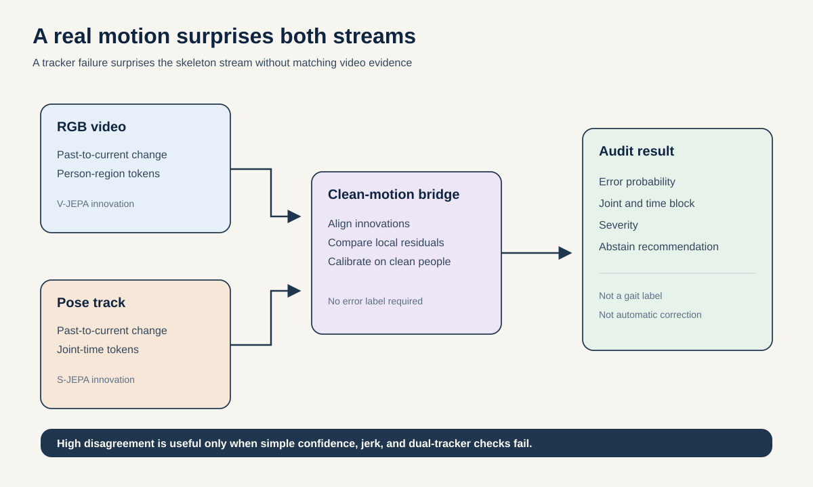
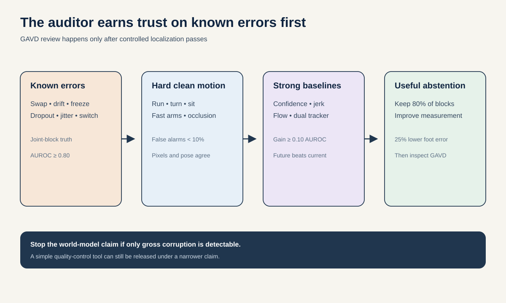

# Proposal 3: Predictive Pose-Tracker Auditor

## The idea in one sentence

When video motion remains coherent but the extracted skeleton makes an impossible predictive jump, mark the exact joint and time block as unreliable before using it for gait analysis.

## Why this matters

Every skeleton model is downstream of a pose tracker. The foundation notebooks show high average MediaPipe coverage, but one stroke clip falls near 57%, and a missingness-only classifier recovers substantial presentation information. A representation can therefore look clinically informative because the pose extractor fails differently across sources.

Existing robust skeleton methods such as [MaskCLR](https://openaccess.thecvf.com/content/CVPR2024/papers/Abdelfattah_MaskCLR_Attention-Guided_Contrastive_Learning_for_Robust_Action_Representation_Learning_CVPR_2024_paper.pdf) try to keep classification accurate under corruptions. That is not enough. A scientist also needs to know **when and where the measurement is untrustworthy**.

The proposed auditor compares two predictive errors from the same moment:

- the surprise seen by a frozen video model;
- the surprise seen by a frozen skeleton model.

A real unexpected movement should surprise both. A tracker failure should surprise the skeleton model without a matching person-region change in the video model.

## Research question

> Within two weeks, can cross-modal predictive disagreement detect and localize realistic pose-tracker errors on unseen people at joint-by-four-frame-block AUROC at least 0.80 and at least 0.10 above detector confidence, jerk, bone length, optical flow, and dual-tracker disagreement, while maintaining calibrated false-alarm rates on clean unusual motion?

The central evidence comes from motion with known ground-truth pose or known injected errors. GAVD is a transfer stress test, not the source of accuracy labels.

## First-principles signal

For block $t$, define a video innovation:

$$
r_t^v = z_t^v - P_v\!\left(z_{<t}^v\right)
$$

and a skeleton innovation:

$$
r_t^s = z_t^s - P_s\!\left(z_{<t}^s\right)
$$

$z_t^v$ is the frozen V-JEPA 2.1 person-region representation. $P_v$ is its past-to-future predictor. $z_t^s$ is the skeleton latent from local S-JEPA, and $P_s$ predicts it from earlier skeleton blocks.

On clean training motion, fit a small bridge $A$ from skeleton innovation to video innovation. The disagreement score is:

$$
D_t = \left\lVert r_t^v - A r_t^s \right\rVert_{\Sigma^{-1}}
$$

where $\Sigma$ is clean training-fold covariance. A joint-specific head predicts each joint's contribution to $r_t^s$, producing $D_{t,j}$ for joint $j$. Thresholds are calibrated only on clean training people.

The key idea is not that smooth motion is good. A jump, stumble, or fast arm swing may be real. If the pixels and skeleton agree, the auditor should remain quiet.

## Data construction

### Controlled benchmark

Use held-identity AMASS motion rendered with a documented SMPL pipeline. Include walking, running, turning, sitting, and nonperiodic actions. Render each motion through multiple cameras, body scales, clothing textures, backgrounds, compression levels, and partial occluders. Retain exact projected joint locations.

Run two real pose trackers on the rendered RGB. These outputs provide natural detector failures. Add six controlled failure families to otherwise correct tracks:

1. short joint dropout with interpolation;
2. smooth left-right identity exchange;
3. limb drift that preserves approximate bone length;
4. frozen joint or frozen limb;
5. temporally correlated jitter;
6. person-track switch when a second rendered walker crosses.

Each family has held-out severity levels and an implementation reserved for test. Smooth corruptions are essential because the local swap benchmark was perfectly solved by continuity.

### Real transfer

After the controlled benchmark is fixed, score GAVD. Compare MediaPipe and RTMPose outputs and manually review a source-balanced sample of the highest, middle, and lowest disagreement blocks. This review describes face-valid transfer only. It does not supply the headline AUROC.

## Method

### 1. Keep the large models frozen

Use the official V-JEPA 2.1 ViT-B checkpoint and a fixed local S-JEPA checkpoint. Train only:

- a low-rank cross-modal bridge on clean rendered clips;
- a joint-attribution head;
- a monotone calibration map from score to probability of error.

No corruption label is used to learn the shared representation. A secondary supervised auditor may train on five corruption families and test the sixth, but the clean-trained score remains primary.

### 2. Separate person motion from background motion

Compute video tokens inside an expanded person box and outside it. Give the auditor both streams. A camera pan or moving background that affects both regions should not be confused with pose failure. Include camera-motion estimates and scene-cut flags as nuisance inputs.

### 3. Return an actionable output

For every four-frame block, produce:

- probability that the pose is unreliable;
- top two suspect joints or limb regions;
- error-family-agnostic severity;
- an abstain recommendation when calibrated probability exceeds a locked threshold.

Do not automatically correct the skeleton in the main study. Detection and localization can be evaluated cleanly. Correction would introduce another model and another failure mode.

## 48-hour gate

Render 100 AMASS clips from held identities, run both trackers, and inject the six failure families. Cache V-JEPA and S-JEPA innovations. Fit the bridge on clean clips only.

Advance only if:

- joint-block localization AUROC is at least 0.80;
- the gain over the best single baseline is at least 0.10;
- smooth swap and drift errors remain detectable;
- clean fast motions have false-positive rate below 10% at the selected operating point;
- video-only background replacements do not cause skeleton-error alarms.

If only gross dropout or jitter is detectable, reframe the output as simple quality control and stop the world-model claim.

## Full evaluation

| Question | Primary measurement | Pass condition |
| --- | --- | --- |
| Is any error present? | Block-level AUROC and average precision | AUROC at least 0.80 on held people and severities. |
| Where is the error? | Joint-block average precision | At least 0.10 above the strongest baseline. |
| Is confidence meaningful? | Expected calibration error and risk-coverage curve | ECE at most 0.05 after clean-fold calibration. |
| Does abstention help? | Downstream foot-placement error versus retained coverage | At 80% coverage, at least 25% lower error than confidence-only abstention. |
| Does it confuse unusual motion with failure? | False alarm on clean running, turning, and rapid actions | Below 10% at the locked operating point. |
| Does it transfer? | Source-balanced blinded review on GAVD | High-score blocks show visibly poorer tracking than matched low-score blocks. |

The downstream abstention task predicts 0.5-second foot placement. It is not a gait label. The auditor succeeds when removing flagged blocks improves a real measurement while retaining most data.

## Baselines that can disprove the contribution

- pose-detector confidence and missingness;
- joint jerk, acceleration, bone-length change, and bilateral continuity;
- optical-flow versus joint-motion residual;
- disagreement between MediaPipe and RTMPose;
- GaitDynamics denoising or likelihood score after retargeting;
- MotionBERT reconstruction error;
- a temporal autoencoder trained on clean skeletons;
- video innovation alone and skeleton innovation alone;
- random video and random skeleton encoders with identical bridges;
- cross-modal current-state disagreement without future prediction;
- scene-cut, camera-motion, foreground-area, and occlusion-only classifiers.

The predictive disagreement must beat **current-state cross-modal disagreement**. Otherwise future prediction is unnecessary.

## Two-week schedule and compute

- Days 1 to 2: render 100 clips, run trackers, implement corruptions, execute the gate.
- Days 3 to 5: scale to at least 1,000 clips and lock identity, camera, background, and corruption splits.
- Days 6 to 8: train clean bridges, run leave-one-corruption-family-out tests, and calibrate.
- Days 9 to 10: compare biomechanics and dual-tracker baselines.
- Days 11 to 12: downstream abstention and GAVD transfer review.
- Days 13 to 14: three seeds, identity bootstrap, error atlas, and final claim audit.

The frozen encoders dominate compute. Cache every latent once. Cap teacher inference at 2,000 clips and trainable work at 16 H100-hours.

## Novelty boundary

Pose smoothing, physical plausibility, motion-prior refinement, and test-time pose adaptation already exist. MaskCLR already studies robust action recognition under pose corruption. The repository's Adaptive Gait Examination already asks which blocks deserve expensive reprocessing.

This proposal makes a different contribution: a calibrated **cross-modal predictive failure signal** that detects and localizes tracker error, with known-error ground truth and an abstention curve. It says nothing about gait presentation unless the measurement first passes this audit.

## What success and failure would mean

A successful result would provide a reusable safety layer for any skeleton world model. It would also turn pose quality from a hidden confound into an explicit, local, testable quantity. A failure would show that V-JEPA and S-JEPA innovations are not aligned enough for auditing, or that simple kinematic rules already solve the problem. Either result directly changes how later GAVD evidence should be trusted.
