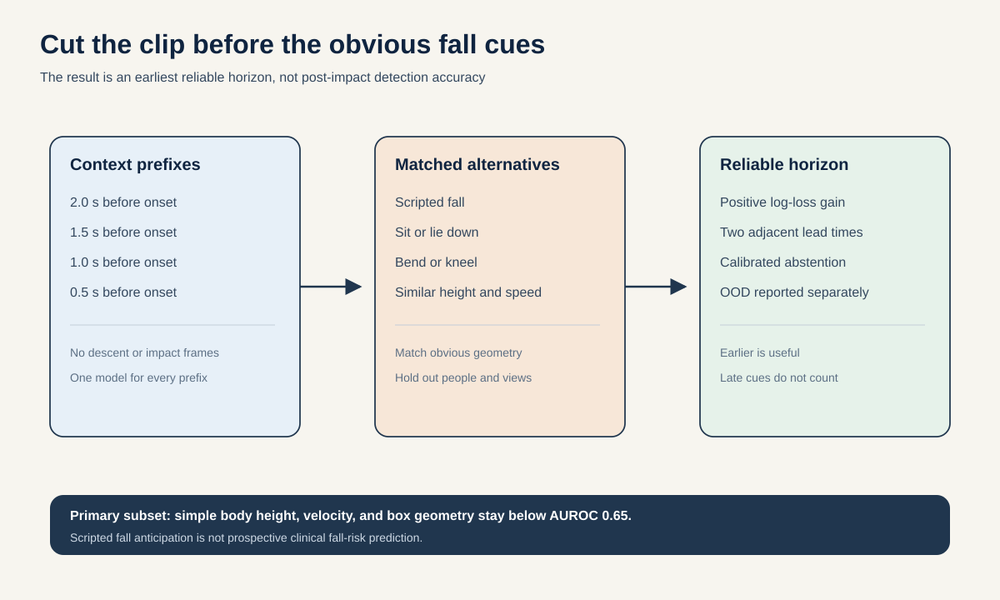
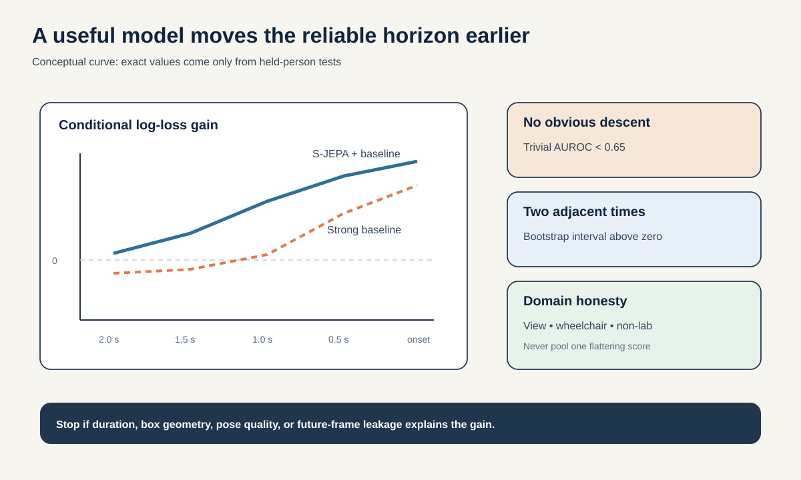

# Proposal 4: Pre-Impact Recoverability Horizon

## The idea in one sentence

Measure how early a skeleton world model can distinguish a labeled simulated fall from a visually similar safe action, while forbidding it from seeing impact, floor contact, or obvious descent.

## Why the timing question matters

Fall detection after a person reaches the floor is useful for alerts, but it says little about prediction. A model can use low body height, a horizontal torso, or impact motion. The harder question is whether the eventual event is distinguishable **before** these obvious cues appear.

[SAFER-Activities](https://safer-activities.github.io/) is unusually suitable because it contains more than 66 hours of untrimmed multi-camera video, 30 frame-level action classes, 5,406 simulated falls, look-alike actions such as sitting and lying down, aligned 2D and lifted 3D pose, frozen RGB features, person-held splits, view-held splits, a wheelchair subset, and a non-lab test set. The data are public after accepting contact-sharing terms.

This proposal does not claim real accidental-fall risk. It defines a stricter benchmark for **pre-impact event identifiability** in scripted data.

## Research question

> Within two weeks, at what lead time before annotated fall onset does a frozen or lightly adapted S-JEPA first achieve a positive person-held conditional log-loss gain over raw center-of-mass, body-height, velocity, duration, pose-quality, and frozen RGB baselines, and does that reliable horizon transfer across camera views, the wheelchair subset, and non-lab videos?

The contribution is the horizon and its controls, not one fall-detection accuracy.

## Define the benchmark before training

For every labeled fall interval, let $t_0$ be its annotated start. Create contexts ending at:

$$
t_0 - \tau, \qquad \tau \in \{0.25, 0.5, 0.75, 1.0, 1.5, 2.0\}\,\mathrm{s}
$$

The target is whether the next labeled event is a fall or a matched nonfall look-alike. Negative examples come from sitting, lying down, bending, kneeling, stumbling-like transitions if present, and other classes with similar direction and body-height change. Match positives and negatives inside training folds on:

- person and camera when possible;
- current body height and vertical velocity;
- movement direction and speed;
- distance to the annotated event boundary;
- visible context duration;
- pose quality and bounding-box scale.

Call a context **pre-obvious** only if a frozen rule using body height, torso angle, center-of-mass velocity, and bounding-box aspect ratio cannot exceed AUROC 0.65. Report all contexts, but make pre-obvious contexts primary.

## The recoverability curve

At each lead time $\tau$, fit the same model and compute conditional log loss on unseen people. Let $L_{\mathrm{B}}$ denote the strong baseline's loss and $L_{\mathrm{B+S}}$ the loss after adding S-JEPA. Define:

$$
G(\tau) = L_{\mathrm{B}}(\tau) - L_{\mathrm{B+S}}(\tau)
$$

Positive $G$ means S-JEPA adds information beyond obvious kinematics and frozen RGB. The **reliable horizon** is the earliest lead time where the 95% participant-bootstrap interval for $G(\tau)$ stays above zero for two adjacent lead times.

This rule prevents selecting one lucky time point.

## Method

### 1. Use past-only skeleton prediction

The current local S-JEPA is a masked interpolator. For this study, freeze its encoder and train a small past-to-future predictor over whole-body skeleton tokens. The predictor sees only context ending at $t_0 - \tau$. Compare:

- raw 2D and lifted 3D skeleton histories;
- frozen local S-JEPA tokens;
- a rank-8 predictive adapter initialized at zero;
- an equal-capacity temporal transformer on raw coordinates.

Training from scratch is not the contribution. The model is a small probe of a fixed representation.

### 2. Predict a distribution, not a hard label only

Output the probability that the next event is a labeled fall, plus a three-bin time-to-event distribution. Optimize proper log loss. Calibrate with participant-held temperature scaling inside each training fold.

### 3. Test domain shifts separately

Use the official person-held split as primary. Then test:

- held camera views;
- wheelchair users;
- non-lab videos;
- cross-dataset public fall videos only if frame boundaries can be audited.

Do not pool these domains into one score. A model may work in the lab and fail elsewhere.

## 48-hour gate

First verify access and annotation semantics. Load 200 fall events and 200 matched look-alike events from development participants. Build lead-time contexts at 0.5, 1.0, and 1.5 seconds.

Advance only if:

- all contexts end strictly before the annotated event;
- the trivial kinematic model stays below AUROC 0.65 on the pre-obvious subset;
- at least one frozen representation adds positive participant-held log-loss gain over the full strong baseline;
- time-shuffled skeleton adds no gain;
- a model using only duration, bounding box, pose confidence, and camera cannot match the result.

If access approval is delayed beyond day 1, do not schedule this as the flagship.

## Full evaluation

| Result | Measurement | Required result |
| --- | --- | --- |
| Earlier prediction | Reliable horizon | At least 0.5 seconds earlier than the strongest baseline. |
| Conditional value | Participant-held log-loss gain | Positive 95% interval at two adjacent lead times. |
| Calibration | ECE and Brier score | ECE at most 0.05 after fold-local calibration. |
| Pre-obvious validity | Trivial kinematic AUROC | Below 0.65 on the primary subset. |
| View transfer | Held-view log-loss gain | Positive, without retuning thresholds. |
| OOD honesty | Wheelchair and non-lab risk-coverage curves | Reported separately; abstention beats forced prediction. |

Secondary metrics are AUROC, average precision, time-dependent concordance, and false alarms per hour on untrimmed videos. The headline remains the reliable horizon under conditional log loss.

## Baselines and leakage traps

- body height, torso angle, center-of-mass position and velocity;
- bounding-box aspect ratio, area, vertical drift, and foreground area;
- clip duration and distance to annotation boundary;
- pose confidence and missingness;
- camera and participant identity inside training folds;
- frozen CLIP, DINOv3, and VideoMAE features supplied by the dataset;
- V-JEPA 2.1 frozen features from the same context;
- raw 2D and lifted 3D temporal models;
- persistence, linear dynamics, and periodic gait template;
- random S-JEPA encoder;
- time-shuffled, reversed, and phase-shuffled skeleton;
- future-frame leakage test that replaces all pixels after the context boundary;
- label-boundary jitter of plus or minus 0.25 seconds.

Scripted participants may prepare differently for a fall than for a safe action. Match on early kinematics and report person-level error cases. Never translate this result into individual future fall risk.

## Two-week schedule and compute

- Day 1: accept data terms, download pose, annotations, splits, and frozen features.
- Day 2: execute the access, boundary, and trivial-signal gate.
- Days 3 to 5: fit frozen and raw baselines across all lead times.
- Days 6 to 8: train one rank-8 adapter only if frozen features pass.
- Days 9 to 10: held-view, wheelchair, and non-lab tests.
- Days 11 to 12: matching sensitivity, boundary jitter, calibration, and abstention.
- Days 13 to 14: three seeds, participant bootstrap, and claim audit.

Because aligned pose and frozen RGB features are supplied, the first result needs no video reprocessing. Cap trainable work at 20 H100-hours.

## Novelty boundary

SAFER-Activities already benchmarks fall detection and action recognition. [MotionMap](https://arxiv.org/abs/2412.18883) already predicts multiple human-motion futures with confidence. Many fall-prediction studies already report high accuracy near impact.

This proposal contributes a controlled **pre-obvious reliable horizon** after matching trivial motion and recording variables, plus person, view, wheelchair, and non-lab transfer. It asks when useful information appears, not whether a classifier recognizes a fall.

## Interpretation

A positive result would show that predictive skeleton features contain early event information beyond obvious descent and large RGB features in scripted data. A negative result would show that impressive fall scores begin only after simple geometry reveals the event. Both outcomes are useful, and neither is evidence of prospective clinical fall risk.
