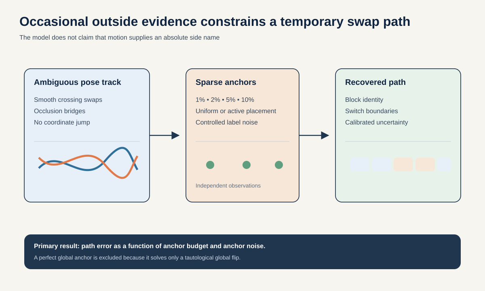
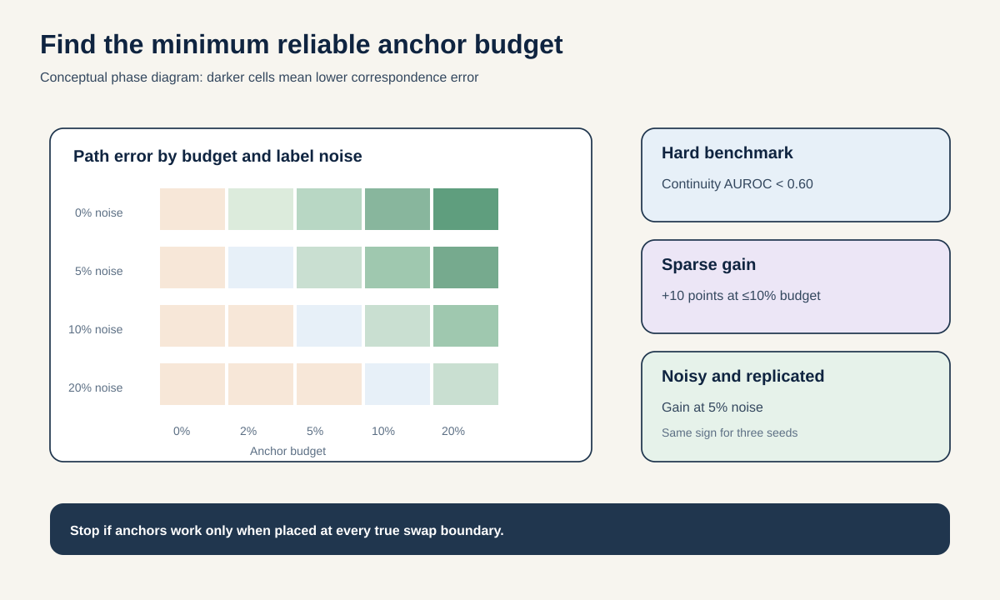

# Proposal 5: Sparse Anchor Budget for Temporary Correspondence

## The idea in one sentence

Measure how many occasional, independently observed left-right identity anchors are needed to keep a skeleton track correctly named through temporary swaps, occlusions, and anchor mistakes.

## Why the question changed

The latest local laterality experiment reached an important negative result. SG-JEPA's learned structured posterior was marginally worse than a fixed 50/50 uncertainty control. The existing synthetic swap benchmark was also solved perfectly by a simple continuity rule. These results rule out two easy stories:

- motion alone recovers a globally correct anatomical side name;
- learned correspondence is needed when swaps create obvious coordinate jumps.

Global left-right sign is not identifiable from symmetric motion without an independent anchor. Giving the model one perfect global bit would solve that ambiguity by definition. That is not a research contribution.

Real pose tracks have a harder problem: identity can switch temporarily during crossing limbs or occlusion, then switch back. Occasional external evidence may be available from a visible shoe, asymmetric clothing, a manual label, or a high-confidence multi-view frame. The scientific question is how sparse and noisy that evidence can be before correct correspondence collapses.

## Research question

> Within two weeks, can sparse anchors on no more than 10% of four-frame blocks improve temporary left-right correspondence recovery by at least 10 percentage points over the strongest continuity and uniform-uncertainty baselines on unseen AMASS identities, while retaining at least half of that gain when 5% of anchors are wrong?

The output is an **anchor-budget curve** and a practical rule for where anchors should be placed. It is not a claim that motion reveals anatomical side without outside information.

## Build a nontrivial corruption benchmark

Let $c_t \in \{0, 1\}$ denote whether bilateral joint identities are correct or swapped at block $t$. Generate temporary swap intervals with durations from 2 to 12 blocks. The input coordinates must not reveal the switch through an obvious discontinuity.

Create three continuity-matched corruption families:

1. **crossing swap:** begin and end the swap when counterpart limbs are close in position and velocity;
2. **smooth transport:** interpolate identities over two blocks while preserving per-joint velocity and approximate bone length;
3. **occlusion bridge:** hide the relevant joints around the switch and reconstruct both possible paths with identical boundary continuity.

Reserve one corruption generator for test. Match clean and corrupted windows on local velocity, acceleration, occlusion length, and limb separation. Verify that a continuity classifier stays below AUROC 0.60 before training anything.

## Define an anchor

An anchor is a block with an independently observed correspondence label $a_t$. It may say “this track is the left limb” or “this pair is currently swapped.” In the synthetic benchmark, anchors come from ground truth and then receive controlled noise. The model never treats its own prediction as an anchor.

Test budgets of 0%, 1%, 2%, 5%, 10%, and 20% of blocks. Compare three placement policies:

- uniform spacing;
- confidence-first, where anchors are placed near uncertainty peaks;
- boundary-aware oracle placement, used only as an upper bound.

Add 0%, 2%, 5%, 10%, and 20% anchor-label noise. The product of budget and reliability is more informative than a perfect-anchor result.

## Method

### 1. Preserve the existing gauge model as a baseline

Reuse the local paired-chart benchmark, even and odd channels, and identity-held splits. Do not alter the sealed test. Run at least seeds 7, 19, and 31 on validation identities before choosing any method.

### 2. Add sparse evidence to path inference

The current posterior supplies a per-block likelihood over $c_t$. Combine it with:

- a transition cost that prefers, but does not force, persistence;
- anchor likelihood with a known or calibrated error rate;
- a duration prior over temporary swap intervals.

Inference can be a two-state hidden Markov model or a small conditional random field. This model is intentionally simple. The contribution is the identifiability curve, not a new sequence architecture.

### 3. Ask where each additional anchor is worth the most

Starting with no anchors, choose the next anchor by expected reduction in path entropy. Compare this active policy with uniform spacing and confidence-first. Evaluate realized path improvement after revealing the anchor.

The final practical output is: “For tracks with this noise and occlusion profile, one independent anchor every $k$ seconds keeps expected correspondence error below $x$.”

## 48-hour gate

Use the existing AMASS validation cohort and implement all three continuity-matched corruption families. Before testing sparse anchors, verify:

- continuity and coordinate-jump rules stay below AUROC 0.60;
- a global anchor bit cannot resolve temporary swaps;
- an oracle per-block anchor resolves the path;
- raw coordinates and the model receive observation-identical paired chart views;
- the current uniform-posterior control is reproduced.

Then add 10% uniformly spaced anchors. Advance only if path accuracy improves by at least 10 percentage points over continuity and at least five points over the unanchored learned posterior. Repeat with 5% anchor noise.

## Full evaluation

| Quantity | Measurement | Pass condition |
| --- | --- | --- |
| Path recovery | Identity-macro block accuracy and switch F1 | At least 10-point gain over continuity at 10% budget. |
| Calibration | Path negative log likelihood and Brier score | Better than fixed 50/50 uncertainty. |
| Anchor robustness | Gain retained at 5% anchor noise | At least half the clean-anchor gain. |
| Placement value | Active versus uniform anchors at equal budget | At least 20% fewer anchors for the same error. |
| Downstream value | Odd-channel readout after correction | Positive improvement over uniform posterior on a majority of identities. |
| Replication | Seeds 7, 19, and 31 before sealed test | Same sign for the anchor gain on all seeds. |

Plot path error and uncertainty as a function of anchor budget, anchor noise, swap duration, occlusion length, and limb separation. Do not collapse this into one chosen threshold.

## Controls that can kill the idea

- local continuity, global assignment, Hungarian matching, and dynamic time warping;
- coordinate jump, velocity jump, bone-length, and acceleration rules;
- uniform 50/50 posterior;
- oracle path, oracle boundary, and oracle anchor placement ceilings;
- random anchors and adversarially misplaced anchors;
- redundant anchors that come from the same motion heuristic rather than independent evidence;
- learned posterior with anchor labels shuffled;
- raw coordinates, correction-first representation, SG-JEPA, and random encoder;
- matched corruptions with and without occlusion;
- global sign-only corruption, reported separately as an unidentifiable special case.

If continuity solves the new benchmark, redesign the corruption before running the model. If anchors help only because they reveal every swap boundary, the budget is not sparse enough.

## Two-week schedule and compute

- Days 1 to 2: implement and validate continuity-matched temporary swaps; run the gate.
- Days 3 to 4: add noisy anchor likelihood and fixed-placement curves.
- Days 5 to 7: entropy-based active placement and equal-budget comparisons.
- Days 8 to 10: seeds 19 and 31, representation ablations, and downstream odd/even readouts.
- Days 11 to 12: freeze the method and open the sealed test once.
- Days 13 to 14: identity bootstrap, phase diagram, and claim audit.

Most work is inference over cached local outputs. New S-JEPA training is unnecessary unless a prespecified seed checkpoint is missing. Expected compute is below 12 H100-hours.

## Novelty boundary

This proposal is deliberately narrower than the existing latent-laterality study. It accepts the local conclusion that global sign requires independent information. It also differs from Side-Anonymous Predictive Asymmetry, which avoids side names and measures counterpart-orbit error.

The new contribution is a **minimum evidence budget for time-varying correspondence**, including placement and label-noise phase transitions. It turns an impossibility statement into an experimentally useful question: how much external information is enough?

## Interpretation

A positive result would guide annotation, camera, and wearable design for skeleton pipelines. A negative result would show that sparse side anchors do not propagate reliably through realistic temporary swaps, so correspondence must be solved locally or with richer appearance. Neither result makes a clinical gait claim.
