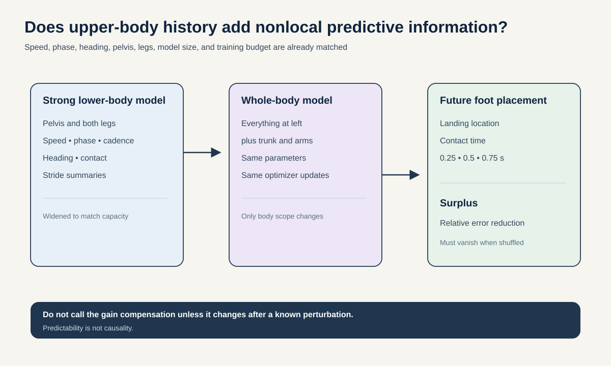
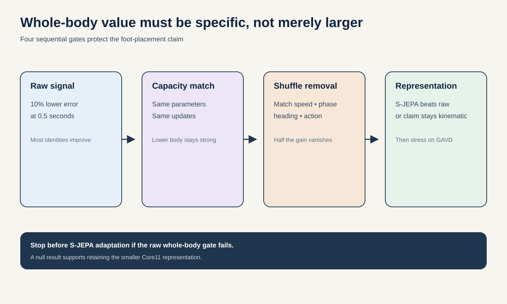

# Proposal 6: Nonlocal Predictive Surplus for Foot Placement

## The idea in one sentence

After a model already knows the pelvis, legs, speed, cadence, heading, and gait phase, test whether earlier trunk and arm motion still improves where the next foot lands.

## Why this is a useful mechanistic question

Core11 excludes the trunk and arms. That makes training cheaper, but it also assumes that lower-body history contains everything needed for lower-body prediction. Whole-body balance strategies can move angular momentum through the trunk and arms before the next step.

Simply showing that a larger whole-body model predicts better would prove little. It has more inputs and may recover speed, activity, or phase more accurately. The useful object is **nonlocal predictive surplus**: the remaining improvement after lower-body state and model capacity are matched.

The proposal does not call this compensation. Predictability alone is not causal. “Compensation” is permitted only in a secondary perturbation analysis where the surplus changes after a known disturbance.

## Research question

> Within two weeks, does whole-body history reduce 0.5-second held-identity foot-placement error by at least 10% relative to a parameter-matched lower-body model that already receives pelvis translation, heading, speed, cadence, phase, contact state, and the complete lower-body history, and does the gain disappear when upper-body trajectories are shuffled within speed, phase, and action strata?

AMASS is primary because it contains full-body motion and is already on HAIC. GAVD is an in-the-wild transfer stress test only.

## Define the target and surplus

For a context ending at time $t$, predict the next left and right foot contact locations relative to the pelvis and heading frame at $t$. Use horizons of 0.25, 0.5, and 0.75 seconds. A contact is defined from foot height and velocity with thresholds fixed on training identities.

Let $E_L(h)$ be error from the complete lower-body model and $E_W(h)$ be error from the whole-body model. Define normalized surplus:

$$
S(h) = \frac{E_L(h) - E_W(h)}{E_L(h)}
$$

$S = 0.10$ means whole-body history lowers error by 10%. Report Euclidean landing error, contact-time error, and negative log likelihood of the predicted landing distribution.

## Method

### 1. Build an identity-held full-body AMASS cohort

Use walking, turning, speed changes, step-over motions, and locomotion transitions. Keep identities disjoint. Do not let near-duplicate mocap clips cross folds. Normalize global translation only after saving speed, heading, and pelvis variables for both models.

Use a 22-joint body skeleton with pelvis, spine, neck, shoulders, elbows, wrists, hips, knees, ankles, heels, and forefeet when available. Map every source topology once and record residuals.

### 2. Make the lower-body baseline unusually strong

Give the lower-body model:

- pelvis position, velocity, and acceleration;
- heading and turn rate;
- bilateral hips, knees, ankles, heels, and forefeet;
- phase, cadence, speed, and contact state;
- recent stride length, width, and foot-clearance summaries;
- motion-class probabilities learned inside the training fold.

The whole-body model receives exactly the same inputs plus spine, shoulder, elbow, and wrist history. Match trainable parameters by widening the lower-body predictor or adding null tokens.

### 3. Use a frozen predictive representation

Compare four input encoders:

1. raw coordinates with a temporal transformer;
2. frozen local Core11 S-JEPA;
3. frozen whole-body S-JEPA initialized from the local encoder with new joint embeddings and only those embeddings trained;
4. random encoders with identical heads.

The main contribution is the body-region ablation and conditional surplus, not training a new S-JEPA.

### 4. Localize where the surplus comes from

Add trunk only, arms only, and shoulders only. Shuffle each region within narrow bins of person-independent speed, phase, heading change, and motion class. Time-shift upper-body motion by half a gait cycle. Replace it with another person's upper-body motion matched on the same bins.

If the apparent gain survives every mismatch, it is probably capacity or nuisance leakage rather than coordinated motion.

## 48-hour gate

Sample at least 100 AMASS identities and fit raw lower-body and whole-body heads at the 0.5-second horizon. Use fixed parameter counts and three train-validation identity splits.

Advance only if:

- whole-body error is at least 10% lower than the complete lower-body baseline;
- the gain is positive for a majority of identities;
- upper-body shuffle removes at least half the gain;
- random upper-body noise gives no gain;
- phase, speed, and action decoding from the two models is matched.

If this raw-input gate fails, do not train a whole-body S-JEPA adapter.

## Full evaluation

| Test | Measurement | Required result |
| --- | --- | --- |
| Whole-body value | $S(0.5\,\mathrm{s})$ on unseen identities | At least 0.10 with a positive identity-bootstrap interval. |
| Coordination specificity | Surplus after within-stratum upper-body shuffle | At least half of the original surplus disappears. |
| Capacity control | Whole-body versus widened lower-body model | Whole-body remains better at equal parameters and updates. |
| Representation value | Frozen S-JEPA versus raw head | Positive gain beyond raw for most identities, or no S-JEPA claim. |
| Region localization | Arms-only and trunk-only ablations | Reproducible region-by-horizon map across three seeds. |
| In-the-wild stress | GAVD future foot-location error | Direction of effect preserved on unseen source videos. |

GAVD transfer uses no presentation labels. Evaluate only clips with adequate whole-body coverage and report pose-quality strata separately.

## Baselines and failure modes

- persistence, constant velocity, periodic template, and linear state-space prediction;
- full raw lower-body kinematics and handcrafted gait summaries;
- parameter-matched and compute-matched temporal transformers;
- phase, cadence, speed, heading, turn rate, and motion-class-only heads;
- random upper-body tokens and learned static person embeddings;
- within-stratum upper-body shuffle, half-cycle shift, and person mismatch;
- trunk-only, arms-only, and shoulder-only inputs;
- future upper-body leakage test;
- random encoder and untrained joint embeddings;
- GaitDynamics completion as an optional laboratory-kinematics baseline.

The most dangerous shortcut is motion class. Turning and stepping over obstacles use both arms and different foot placements. Strict within-class analysis is therefore primary.

## Two-week schedule and compute

- Days 1 to 2: full-body mapping, contact targets, raw-input gate.
- Days 3 to 5: parameter matching, shuffle controls, and horizon curve.
- Days 6 to 8: frozen Core11 and whole-body S-JEPA features.
- Days 9 to 10: region localization and action-stratified analyses.
- Days 11 to 12: GAVD source-held stress test.
- Days 13 to 14: three seeds, identity bootstrap, and final audit.

Cap learned work at 24 H100-hours. The raw gate prevents spending compute when whole-body information is absent.

## Novelty boundary

Biomechanics already studies relationships between upper-body motion and foot placement. The repository's Conditional Coordination Graph already tests conditional joint relations, and Past-Only Predictive Surplus already asks whether history predicts future skeleton targets.

This proposal is a stricter specialization: a predeclared action, foot placement, with exhaustive lower-body conditioning, parameter matching, and within-stratum upper-body shuffles. Its strongest output is a region-by-horizon information map. It should be a secondary mechanistic paper unless the surplus is large and transfers beyond AMASS.

## Interpretation

A positive result would justify moving beyond Core11 for predictive gait models. A null result would justify the smaller representation and save later compute. Neither result shows that arm motion causes foot placement or that the measured surplus is a clinical compensation strategy.
