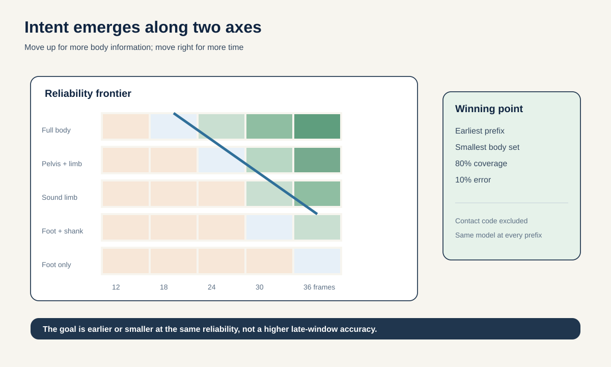
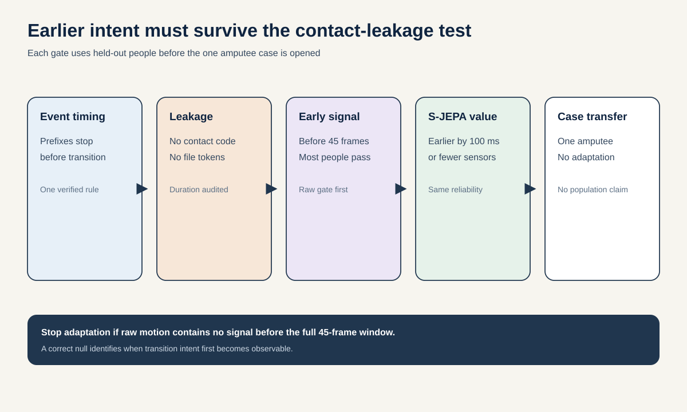

# Proposal 7: Transition Intent Frontier

## The idea in one sentence

For a person approaching stairs, a ramp, or level ground, find the earliest moment and smallest body region from which the next locomotion mode becomes reliably predictable.

## Why this is more informative than one intent score

The new [GaitIntent dataset](https://www.nature.com/articles/s41597-026-07799-8) contains 1,430 trials from 11 people, 13 locomotion modes, eight steady-to-transition modes, raw 388-dimensional full-body IMU-derived kinematics, processed 18-dimensional sound-limb features, and public code. The processed benchmark uses 45 frames at 96 Hz, roughly 0.47 seconds.

The dataset paper already establishes that the modes are classifiable. A new classifier on the full 45-frame window would be incremental. The open question is **when the intent becomes identifiable and which body signals carry it**.

This matters for assistive control. A perfectly accurate decision made after the transition is less useful than a calibrated decision made early enough to act.

## Research question

> Within two weeks, can a frozen or lightly adapted predictive skeleton representation identify the next terrain-transition mode on held-out people at least 100 milliseconds earlier than the best raw-IMU baseline at the same 80% coverage and 10% error, and can it do so from the sound limb alone without using contact-state leakage?

The single participant with transtibial amputation is a final transfer case, not a training fold or a population claim.

## Two axes form the frontier

### Time axis

Create prefixes of 6, 12, 18, 24, 30, 36, and 45 frames. A model at each prefix sees only data available up to that moment. The contact-state code is removed from the primary input because it may directly reveal terrain contact. It returns as a named oracle baseline.

### Body axis

Compare:

1. foot only;
2. foot plus shank;
3. complete sound limb;
4. pelvis plus sound limb;
5. full body;
6. full body with one region missing at a time.

For every time-body pair, report accuracy, macro-F1, log loss, calibration, and coverage after abstention. The **intent frontier** is the set of smallest prefixes and body subsets that reach the target reliability.

## Method

### 1. Convert full-body records to a common skeleton

The raw release contains calculated motion for 21 body nodes. Convert node positions and orientations into a fixed whole-body kinematic graph. Preserve velocities, accelerations, angular velocities, and validity flags as channels. Record the conversion and verify it against the processed sound-limb files.

### 2. Freeze the representation, train small heads

Compare:

- the dataset's classical, TCN, and transformer benchmarks;
- a parameter-matched temporal transformer on raw channels;
- frozen local whole-body S-JEPA features after a small input projection;
- S-JEPA plus a rank-8 adapter trained on healthy training people only;
- random encoders with the same heads.

An optional AMASS or BABEL pretraining route can teach general full-body transitions, but it is not a dependency. The first result uses only public GaitIntent data and frozen local weights.

### 3. Use one prefix model, not seven separately tuned models

Train with random prefix truncation and a prefix token. At test time the same model evaluates every prefix. This prevents each lead time from receiving a custom architecture or hyperparameter search.

### 4. Calibrate an abstain option

At each prefix, the model may say “not enough evidence yet.” Use fold-local conformal risk control or a locked confidence threshold to target 10% conditional error. Measure the fraction of trials covered. Define earliest reliable time as the first prefix with at least 80% coverage and no more than 10% error for two adjacent prefixes.

### 5. Test the sound-limb claim honestly

Compare sound-limb prediction with full body and with a size-matched random body subset. Remove ground-contact state, trial length, file naming, and post-transition samples. A sound-limb advantage must survive left-right reflection and sensor-channel permutation audits.

## 48-hour gate

Download the public [Figshare release](https://doi.org/10.6084/m9.figshare.31436731), reproduce its leave-one-subject-out benchmark, then evaluate raw temporal baselines at 12, 24, and 36 frames.

Advance only if:

- the label can be determined from filenames without leakage into features;
- prefix extraction ends before the mode transition under one verified event definition;
- a raw model beats phase, contact-free kinematics summary, and majority baselines before 45 frames;
- trial length and contact state alone do not explain the result;
- at least five healthy held-out participants show above-baseline early prediction.

If no signal appears before the full 45 frames, report the dataset's identifiability boundary and stop model adaptation.

## Full evaluation

| Question | Measurement | Required result |
| --- | --- | --- |
| Is prediction earlier? | Earliest prefix at 80% coverage and 10% error | At least 100 ms earlier than the strongest raw baseline. |
| Is less body sufficient? | Smallest body subset on the frontier | Sound limb reaches within two points of full-body macro-F1. |
| Is S-JEPA useful? | Held-person conditional log-loss gain over raw | Positive participant-bootstrap interval. |
| Is contact leaking? | No-contact versus contact-oracle comparison | Primary result remains positive without contact code. |
| Is uncertainty useful? | Risk-coverage area | Better than maximum-softmax raw baseline. |
| Does it transfer? | One amputee participant, no adaptation | Report all 130 trials with uncertainty, no population inference. |

Report all 10 healthy people individually. With only 10 training-evaluation participants, one pooled score can hide subject failure.

## Baselines and leakage controls

- published classical, TCN, and transformer benchmarks;
- majority and transition-frequency priors;
- prefix duration and file-name token audit;
- ground-contact code alone as an oracle leakage baseline;
- phase, acceleration extrema, angular velocity, and foot orientation;
- raw full-body and processed sound-limb temporal models;
- random body subsets with equal channel count;
- random encoder and equal-capacity raw transformer;
- time shuffle, within-phase shuffle, channel permutation, and left-right reflection;
- one model per prefix as an optimistic upper bound;
- full 45-frame model as the late-decision ceiling.

The most likely trivial signal is terrain contact. The primary claim excludes contact state and any sample after first new-terrain contact.

## Two-week schedule and compute

- Days 1 to 2: download, reproduce benchmark, verify prefix and leakage gates.
- Days 3 to 5: raw prefix-body frontier and per-person results.
- Days 6 to 8: frozen S-JEPA projection and random-encoder controls.
- Days 9 to 10: one rank-8 adapter if the frozen mechanism passes.
- Days 11 to 12: abstention, contact removal, and body-region omission.
- Days 13 to 14: amputee transfer, participant bootstrap, and final audit.

The data are small. Cap trainable work at 12 H100-hours. Most runs should fit on one GPU and parallelize across held-out participants.

## Novelty boundary

GaitIntent already introduces sound-limb motion-intent recognition. [GaitForeMer](https://arxiv.org/abs/2207.00106) already uses future-coordinate pretraining for gait severity. [Zero-Shot Skeleton-Based Action Anticipation](https://arxiv.org/abs/2608.14243) already studies action anticipation from partial skeleton sequences.

The contribution here is not generic intent recognition. It is a calibrated **time-by-body sufficiency frontier** with no-contact leakage controls and a prespecified decision deadline. This is a compact, practical study, but it ranks seventh because the dataset paper already occupies much of the application claim.

## Interpretation

A positive result would show that predictive representations buy real decision time or sensor reduction. A null result would identify the earliest physically available signal and warn against claims built from post-contact leakage. The amputee result is one case study, never evidence of clinical generalization.
