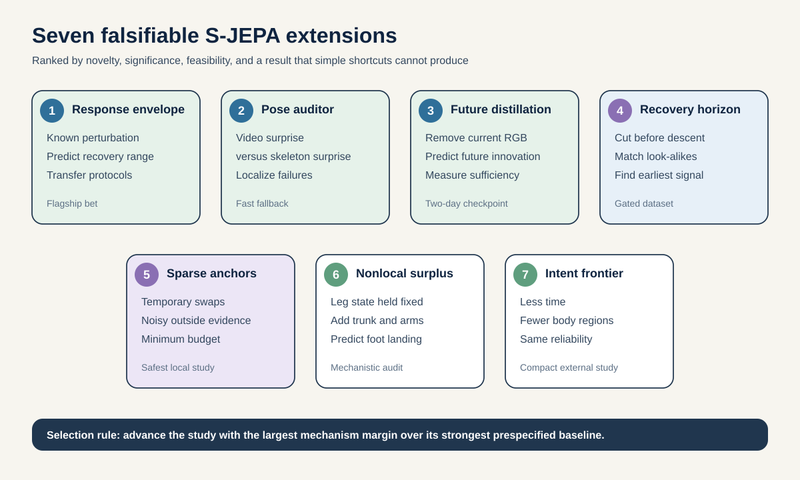

# Seven falsifiable extensions for S-JEPA

**Decision portfolio, 3 September 2026**

This portfolio is designed around one constraint: a useful result must reveal something that a trivial signal, a source-specific shortcut, or an untrained encoder cannot reveal. It does not propose another normal-versus-abnormal GAVD classifier. It does not require new clinical collection, force plates, or training a foundation model from scratch.

The strongest bet is **Cross-Protocol Perturbation Response Prediction**. It asks whether a small predictive model can forecast how a person will recover from a known disturbance, then carry that prediction across two independent public perturbation protocols. The intervention is known, the future response is measured, and the decisive comparison is against a phase, direction, and magnitude conditional mean. This is a more demanding object than gait classification and a more defensible one than inferring hidden force from ordinary video.

The fastest high-value result is **Predictive Pose-Tracker Auditor**. It uses the disagreement between a frozen video future model and a skeleton future model to locate pose failures. Its central test is on known errors, not GAVD labels. It could produce a useful quality-control tool even if no clinical representation claim survives.

## Ranked decision table

Scores use a five-point scale. The total gives novelty and significance twice the weight of feasibility because the goal is one important contribution, not seven small wins.

| Rank | Proposal | Novelty | Significance | Feasibility | Wow | Weighted total / 30 | Decisive 48-hour gate |
| ---: | --- | ---: | ---: | ---: | ---: | ---: | --- |
| 1 | [Cross-Protocol Perturbation Response Prediction](01-cross-protocol-response.md) | 5 | 5 | 4 | 5 | **29** | Raw pre-perturbation kinematics must beat a phase, direction, and magnitude conditional mean by at least 10% on held-out people. |
| 2 | [Predictive Pose-Tracker Auditor](03-predictive-pose-auditor.md) | 5 | 5 | 4 | 4 | **28** | Localize known joint-block failures at AUROC at least 0.80 and at least 0.10 over the strongest nonlearned or dual-tracker baseline. |
| 3 | [Future-Innovation Distillation](02-future-innovation-distillation.md) | 5 | 4 | 4 | 5 | **27** | Skeletons must add at least 0.05 out-of-source R-squared beyond current RGB latent and nuisance features, and twice the gain of time-shuffled skeletons. |
| 4 | [Pre-Impact Recoverability Horizon](04-recoverability-horizon.md) | 4 | 5 | 4 | 4 | **26** | Before visible descent, the model must improve conditional log loss beyond COM, height, velocity, duration, and frozen RGB baselines on held-out people and views. |
| 5 | [Sparse Anchor Budget for Temporary Correspondence](05-sparse-anchor-budget.md) | 4 | 4 | 5 | 4 | **25** | At no more than 10% anchored blocks, path recovery must improve by 10 percentage points over continuity and remain useful with 5% anchor noise. |
| 6 | [Nonlocal Predictive Surplus for Foot Placement](06-nonlocal-predictive-surplus.md) | 3 | 4 | 5 | 3 | **22** | Whole-body history must reduce 0.5-second foot-placement error by 10% after phase, speed, heading, pelvis, and capacity are matched. |
| 7 | [Transition Intent Frontier](07-transition-intent-frontier.md) | 3 | 4 | 3 | 4 | **21** | The next terrain mode must become reliably predictable before the transition and earlier than the published 45-frame endpoint on held-out people. |

## One recommendation

Run Proposal 1 first. Run Proposal 3 in parallel only through its frozen-inference gate, because it is cheap and can quickly establish whether V-JEPA 2.1 contains a useful video-side signal. Keep Proposal 2 ready as the highest-value fallback if perturbation parsing or cross-protocol variable alignment fails.

The best attainable flagship claim is:

> A compact predictive representation can forecast a person's recovery response to a specified walking perturbation, generalize to unseen people and held-out interventions, and retain useful structure when transferred across independent measurement protocols.

This claim is meaningful even without disease labels. It is falsifiable because intervention parameters are observed and recovery unfolds after the prediction point.

## Why these seven survived adversarial review

Several attractive ideas were removed:

- Generic action anticipation now collides with V-JEPA 2, Human-JEPA, and zero-shot skeleton anticipation.
- Generic perturbed-motion forecasting collides with Latent Differentiable Physics. Proposal 1 instead predicts a calibrated response envelope and tests cross-protocol transfer.
- A global laterality anchor is tautological. Proposal 5 studies noisy, temporary correspondence and the minimum anchor budget needed to resolve it.
- Generic gait description generation now collides with AGIR, BiomechGPT, and recent automated gait-assessment work.
- A 100-person prospective screen was not retained because the endpoint is self-report, public outcome linkage still needs verification, and the statistical ceiling is low.
- Cross-topology skeleton transfer is occupied by recent arbitrary-topology and heterogeneous-skeleton models.

The portfolio also avoids duplicating the repository's previous [proposal set 1](../proposals-01/) and [proposal set 2](../proposals-02/README.md). Each document includes an explicit collision boundary and a result that would kill the idea.

## Fixed evidence rules

Every proposal follows the [evidence and execution contract](00-evidence-and-execution-contract.md):

- people, source videos, and trials are split before learned preprocessing or tuning;
- the headline result is conditional improvement over strong raw and nuisance baselines;
- random encoders, shuffled inputs, and equal-capacity heads are mandatory;
- a mechanism can fail even when a downstream score rises;
- no GAVD presentation label is called a diagnosis;
- no model-derived force is called a measurement;
- no result from a simulated fall is called clinical fall prediction;
- all checkpoints must be publicly downloadable before day 1.

## Two-week portfolio strategy

Do not execute all seven. Use the first two days to run the gates for Proposals 1, 2, and 3. Select one flagship using this rule:

1. Choose Proposal 1 if a person-specific perturbation signal exists beyond the conditional-mean baseline.
2. Otherwise choose Proposal 3 if cross-modal disagreement localizes realistic tracking errors.
3. Otherwise choose Proposal 2 if skeleton history explains a nontrivial fraction of future V-JEPA innovation.
4. If all three gates fail, Proposal 5 is the safest rigorous study because its data and code already exist locally.

Proposal 4 is a strong external study but depends on accepting the SAFER-Activities data agreement. Proposals 6 and 7 are useful lower-risk studies, but they should not displace a passing top-three mechanism.

## Contents

- [Evidence and execution contract](00-evidence-and-execution-contract.md)
- [Proposal 1: Cross-Protocol Perturbation Response Prediction](01-cross-protocol-response.md)
- [Proposal 2: Future-Innovation Distillation](02-future-innovation-distillation.md)
- [Proposal 3: Predictive Pose-Tracker Auditor](03-predictive-pose-auditor.md)
- [Proposal 4: Pre-Impact Recoverability Horizon](04-recoverability-horizon.md)
- [Proposal 5: Sparse Anchor Budget for Temporary Correspondence](05-sparse-anchor-budget.md)
- [Proposal 6: Nonlocal Predictive Surplus for Foot Placement](06-nonlocal-predictive-surplus.md)
- [Proposal 7: Transition Intent Frontier](07-transition-intent-frontier.md)
- [Adversarial review and revision log](adversarial-review.md)
- [References and access ledger](references.md)
