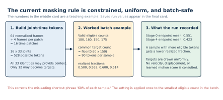
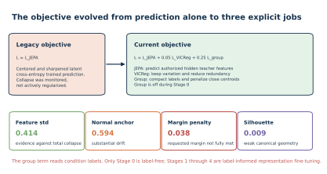
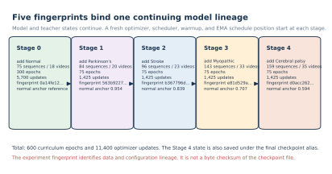
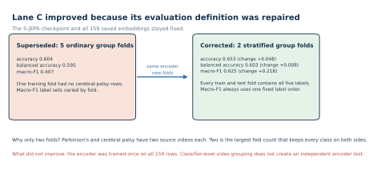
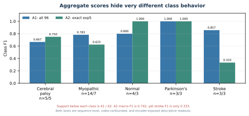

# S-JEPA evolution notebook for maintainers

This note is the implementation companion to [docs/staged_evolution.md](../../../docs/staged_evolution.md). It explains how to trace each methodology change through the notebooks, artifacts, and historical notes.

Use this file when:

- checking whether an old note still describes the current model;
- adding a new experiment without mixing it with the completed run;
- investigating why a checkpoint or result is missing;
- deciding whether a change improved the model or only changed evaluation;
- preparing a result table, chart, paper, or presentation.

## 1. Start with the source hierarchy

Not every file in notes describes the current system.

Read evidence in this order:

1. Executable notebook code.
2. Fingerprinted real artifacts.
3. classifier_contract.json and result_history.csv.
4. Current README and docs tutorials.
5. Historical notes and archived plans.

The current final experiment is:

~~~text
checkpoint:
cache/artifacts/real/sjepa_curriculum_final_augmented.pt

fingerprint:
d0acc2628d134959d8b91e96d5112fc3bed560fe8feb9569e5b13b11a8b614d1

corpus:
159 sequences from 35 source videos
~~~

The two archived planning files begin with explicit warnings:

- [Archived improvement plan](../../archive/early_plans/improvement_plan.md)
- [Archived execution prompt](../../archive/prompts/improvement_instruction.md)

They contain ideas that were considered, not a record of everything that was implemented.

## 2. Map the notes directory to the project history

|File|Historical role|How to use it now|
|---|---|---|
|01_train_sjepa.md|Original tutorial and research brief|Explains the stable normal-first and fixed-whitelist goals.|
|02_paper_draft.md|Early paper framing|Preserves the 82-feature motivation and condition background.|
|03_nextstep_improvements.md|Request for a systematic improvement plan|Explains why the audit began.|
|04_improvement_plan.md|Failure analysis and experiment proposals|Use for hypotheses only. Verify every idea against current code.|
|05_improvement_instr.md|Archived execution prompt|Do not treat its success criteria as completed results.|
|06_literature_findings.md|Citation verification log|Use to avoid known citation errors and to find primary sources.|
|07_adding_diversity.md|Method pivot instruction|Introduces the five-stage curriculum, VICReg, and fixed mapping-based targets.|
|08_codex_review_log.md|Late adversarial review record|Useful but incomplete. It starts after the core training changes.|
|09_diagram_design_system.md|Vector-graphic rules|Use when adding or revising tutorial SVGs.|
|10_sjepa_evolution_tutorial.md|Current evolution map|Use as the maintainer entry point.|

## 3. Generation 1: reconstruct the legacy baseline

The legacy result was not simply a smaller version of the current training run. It represented a different methodology layer.

### Legacy training facts

|Item|Legacy state|
|---|---|
|Normal sequences|12|
|Normal source videos|1|
|Eligible landmark identities|10|
|Representation stages|1 normal-only stage|
|Objective|Centered and sharpened JEPA cross-entropy|
|Active anti-collapse regularizer|None|
|Downstream vector|384-dimensional global and authorized mean/std|
|Main exact-exp5 result|0.619 accuracy, 0.613 macro-F1|

The retained file sjepa_normal.pt contains a normal-only real checkpoint for 12 sequences and one video. Its current stored dataset fingerprint begins fe86339a. The historical 0.619 and 0.613 result values remain rounded ledger records rather than fully artifact-recomputed values.

### Why the baseline was still useful

It established that:

- the video-to-pose-to-token path ran end to end;
- a target encoder and predictor could be trained on real skeleton data;
- a frozen 384-dimensional readout could feed the same style of Random Forest used in the comparison;
- the main weaknesses could be measured rather than guessed.

### What not to say

Do not say that the legacy 61.9 percent result measured unseen-video performance. Every exact-split test video overlapped classifier training, and the dataset was too small to support an independent five-class pipeline test.

## 4. The six-part audit that motivated the redesign

The archived improvement plan identified six root causes. The current repository addresses some, but not all, of them.

|Audit finding|Evidence|Current response|Remaining issue|
|---|---|---|---|
|Normal pretraining used one source video|12 rows, one video|Added 17 normal videos and accepted 63 windows|Added-normal acquisition differs from abnormal acquisition|
|Only ten landmark identities were eligible|Legacy whitelist|Restored heels 29 and 30 for a 12-identity whitelist|Whitelist is still a project rule|
|No active anti-collapse term|JEPA-only objective|Added VICReg|VICReg did not create clean five-class geometry|
|Only normal data shaped the representation|Normal-only checkpoint|Added four cumulative condition stages|Later stages use labels and are not pure SSL|
|Sequence splits reused source videos|Leakage audit|Added explicit A1/A2 warnings and grouped-RF Lane C|Encoder still saw all evaluated rows|
|Mean/std pooling removed temporal order|384-D readout|Documented clearly|Dynamics-preserving pooling is still proposed|

## 5. Generation 2: understand the added-normal pipeline

The added cohort was not produced by copying arbitrary pose files into a folder. It used a separate annotation, tracking, windowing, extraction, and coverage path.

### 5.1 Subject selection

The annotation script can inspect up to three pose candidates. It scores:

- visible body area;
- landmark confidence;
- continuity with the previously selected location.

The continuity term reduces identity switches when more than one person appears.

### 5.2 Bounding-box construction

The selected pose creates a box that is:

1. padded;
2. filled across short gaps;
3. smoothed over time;
4. clamped to valid frame coordinates.

These are automatic project boxes. They are not human-authored GAVD boxes.

### 5.3 Cycle-based windowing

The script uses ankle-separation autocorrelation to estimate periodic motion. It searches a plausible step-period region, converts that to a stride estimate, and cuts windows of about two cycles.

Windows overlap by 50 percent. A clip must contain at least 24 frames, and no clip contributes more than eight windows.

This means:

> 63 accepted windows are not 63 independent people.

The defensible diversity statement is:

> The Stage 0 training set contains normal windows from 18 source videos, including 17 added videos.

### 5.4 Coverage selection

The extraction report is the cohort contract:

~~~python
accepted = neuro_observed >= 0.45
~~~

One candidate had 0.027 coverage and was rejected. Notebook 04 and notebook 06 both resolve accepted sequence IDs from the report and require their pose files to exist.

### 5.5 Provenance caution

Sixty-three of 75 normal Stage 0 rows use this added path. All abnormal rows use the canonical path.

The path-label association can create a shortcut even when source videos are grouped at the classifier.

## 6. Generation 2: trace the 10-to-12 target change

The executable whitelist is:

~~~python
MASK_KEYPOINTS = [
    11, 12,
    23, 24,
    25, 26,
    27, 28,
    29, 30,
    31, 32,
]
~~~

The new identities are:

|Index|Landmark|
|---:|---|
|29|Left heel|
|30|Right heel|

The current set therefore covers shoulders, hips, knees, ankles, heels, and foot indices.

All 33 identities may remain visible. Only the 12 listed identities may become hidden prediction targets.

### 6.1 Verify the invariant

Notebook 03 checks:

~~~python
forbidden = sorted(set(range(33)) - set(MASK_KEYPOINTS))
assert not mask[:, :, forbidden].any()
~~~

If this assertion fails, the method has changed. That change needs a new fingerprint and a new experiment name.

### 6.2 Understand the common-count rule

Suppose a batch has valid eligible counts:

~~~text
180, 160, 150, 175
~~~

The mask count is:

~~~text
floor(0.60 x 150) = 90
~~~

Every sample receives 90 targets. Only the sample with 150 eligible positions realizes 0.60.

The final Stage 0 endpoint recorded 0.551 mean eligible masking. Stage 4 recorded 0.423.

Do not write “the method hides 60 percent of every sample.” Write:

> The configured fraction is applied to the smallest valid eligible count in the batch, and the resulting common target count is used for every sample.

## 7. Generation 3: trace the three-part objective

The total current loss is:

$$
L = L_{\mathrm{JEPA}} + 0.05L_{\mathrm{VICReg}} + 0.25L_{\mathrm{group}}.
$$

### JEPA job

Predict the target encoder's latent distribution at valid authorized hidden positions.

### VICReg job

Use two transformed views to:

- align representations of the same sequence;
- keep each projected dimension variable;
- reduce off-diagonal covariance.

### Group job

After Stage 0:

- pull each sample toward its condition centroid;
- penalize centroid pairs closer than margin 1.0.

The group term reads condition labels. Use the following language:

- Stage 0: label-free normal-gait representation learning.
- Stages 1 to 4: label-informed representation fine-tuning.

Do not describe the complete curriculum as purely self-supervised.

## 8. Generation 3: trace what continues and what restarts

The model lineage is continuous. The optimizer lineage is not.

### State that continues

- view encoder;
- predictor;
- EMA target encoder;
- target center;
- VICReg projector;
- normal anchor for drift measurement.

### State that restarts at each stage

- AdamW optimizer;
- optimizer moments;
- learning-rate scheduler;
- warmup position;
- EMA schedule position.

Notebook 04 makes this explicit in train_stage:

~~~python
optimizer = torch.optim.AdamW(...)
scheduler = ...
~~~

These objects are created for each stage. The checkpoint does not store optimizer or scheduler state.

### Why restart deliberately

Stage 0 uses learning rate 0.001. Later stages use 0.0003. Restarting gives each new condition stage a fresh lower-rate schedule without discarding the learned model parameters.

### Balanced replay example

At Stage 4, five conditions are active and each contributes four rows per batch:

~~~text
5 conditions x 4 rows = batch size 20
~~~

The largest group has 75 rows:

~~~text
ceil(75 / 4) = 19 batches per epoch
~~~

Smaller groups cycle through repeated permutations. This balances condition contribution per batch, not the number of unique rows in storage.

## 9. Follow the checkpoint contract instead of filenames alone

The current Stage 4 fingerprint chain is:

~~~text
0a14fe12... normal
    -> 563b9227... add Parkinson's
    -> b367796d... add stroke
    -> e81d529a... add myopathic
    -> d0acc262... add cerebral palsy
~~~

The final alias and the Stage 4 checkpoint contain the same final model state:

~~~text
sjepa_stage_04_cerebralpalsy_augmented.pt
sjepa_curriculum_final_augmented.pt
~~~

### 9.1 Why the old FileNotFoundError happened

The completed run used the augmented cohort, so notebook 04 produced the augmented final alias. A later notebook asked for the canonical alias:

~~~text
sjepa_curriculum_final.pt
~~~

That file represented a different cohort contract and did not exist.

The current selection rule is:

~~~text
SJEPA_INCLUDE_AUGMENTED_NORMAL=1
    -> sjepa_curriculum_final_augmented.pt
~~~

Notebook 05 and notebook 06 list available final files and fail clearly when the requested cohort variant is missing. They do not silently fall back to a different run.

### 9.2 What consumers verify

- run mode;
- five completed stages;
- condition order;
- 12-identity whitelist;
- sequence and video counts;
- checkpoint fingerprint;
- embedding fingerprint;
- accepted augmented cohort;
- exact split identifiers.

## 10. Read training health as a set of tests

Ask one question at a time.

### Did training finish?

Yes. All stages completed and all planned checkpoint aliases were written.

### Did every feature become constant?

The final feature standard deviation was 0.414, not near zero. Pair cosine was 0.609, not near one. These are signals against total collapse.

### Did the normal representation remain stable?

Normal-anchor cosine changed:

~~~text
Stage 1: 0.954
Stage 2: 0.839
Stage 3: 0.707
Stage 4: 0.594
~~~

Replay did not prevent substantial drift.

### Did the group term produce clean clusters?

No. The final margin penalty remained positive. Notebook 05 also found a canonical cosine silhouette of 0.009.

### Why not compare all centroid numbers directly?

The Stage 4 training diagnostic uses Euclidean distance over the active training representations. Notebook 05 uses cosine distance over 384-dimensional canonical pooled vectors. They use different vectors, corpora, and metrics.

## 11. Understand the 384-D bottleneck

The current vector is:

~~~text
global valid mean          96
global valid std           96
authorized valid mean      96
authorized valid std       96
-----------------------------
total                     384
~~~

This design is:

- parameter-free;
- easy to audit;
- relatively stable for a tiny classifier sample.

It does not preserve:

- the order of the 16 time patches;
- native duration after resizing;
- native frame rate;
- when left-right asymmetry occurs.

The dynamics-preserving readout on the right side of the figure is proposed, not implemented.

## 12. Explain why geometry and Random Forest accuracy can disagree

Canonical geometry was:

~~~text
cosine silhouette                  0.008975
minimum centroid distance          0.036718
mean centroid distance             0.292119
mean within-condition distance     0.119521
~~~

The all-96 Random Forest accuracy was 0.793.

These facts are not contradictory.

A centroid audit asks whether each condition forms one compact global group. A Random Forest can divide feature space with nonlinear local rules. It can also exploit:

- source-video identity;
- person appearance expressed through pose;
- crop style;
- missingness;
- extraction provenance;
- condition labels already used during encoder training.

Therefore a high exposed-corpus readout does not imply a clean or generalizable representation geometry.

## 13. Trace result evolution at the correct layer

### Model revision on the same exact split

|Metric|Legacy|Current|Approximate change|
|---|---:|---:|---:|
|Accuracy|0.619|0.714|+0.095|
|Macro-F1|0.613|0.742|+0.129|

Data, targets, objective, curriculum, and training exposure changed together. This is not an ablation.

### Evaluation repair on the same current checkpoint

|Metric|Superseded five-fold|Corrected two-fold|Change|
|---|---:|---:|---:|
|Accuracy|0.604|0.653|about +0.048|
|Balanced accuracy|0.595|0.603|about +0.008|
|Macro-F1|0.407|0.625|about +0.218|

The second table is an evaluation change only.

### Additional historical regression checks

The expanded result ledger preserves these legacy-to-current accuracy changes:

|Readout|Legacy|Current|
|---|---:|---:|
|All-96 five class|0.621|0.793|
|Parkinson's versus normal|0.714|1.000|
|Stroke versus normal|0.857|1.000|
|Myopathic versus normal|0.778|0.944|
|Cerebral palsy versus normal|0.889|0.889|

The binary tests have only 7 to 18 rows and remain encoder-exposed. Use them as regression checks, not generalization claims.

## 14. Use class-level examples

A2 macro-F1 was 0.742. Stroke F1 was only 0.333.

The error file contains:

~~~text
5gpoegYv1hs:
  2 stroke rows -> myopathic

DlPDuHBAP7A:
  2 cerebral-palsy rows -> myopathic

05oyBOE_0UE:
  1 myopathic row -> stroke

HDkWDe6FZDg:
  1 myopathic row -> stroke
~~~

When two errors come from the same video, they are not two independent source failures. This is why the error table keeps video_id.

## 15. Keep the three evaluation lanes separate

### A1

- 96 canonical rows;
- stratified 67/29 sequence split;
- all 16 test videos overlap classifier training;
- all 29 test rows trained the representation.

### A2

- historical 68-row subset;
- exact 47/21 assignment;
- all nine test videos overlap classifier training;
- all 21 test rows trained the representation.

### Lane C

- 159 rows;
- classifier folds group source videos;
- the representation encoder trained once on all 159 rows.

The correct Lane C phrase is:

> classifier-video-disjoint, encoder-transductive.

The actual five-class Lane C majority is:

~~~text
normal = 75 / 159 = 0.472
~~~

The canonical-96 majority is different:

~~~text
myopathic = 47 / 96 = 0.490
~~~

## 16. The still-required outer-fold experiment

For a valid new-video estimate:

1. Split source videos first.
2. Fit every data-dependent rule on outer-training videos only.
3. Initialize a fresh S-JEPA model.
4. Train all five stages using outer-training rows only.
5. Freeze the representation pipeline.
6. Fit the readout on outer-training embeddings.
7. Evaluate once on held-out source videos.
8. Save fold-level predictions and exposure audits.

Grouping only the Random Forest is not sufficient.

## 17. Proposed work that remains unimplemented

The following items are still experiments:

- per-segment temporal pooling;
- raw frame rate, duration, cadence, or autocorrelation features;
- explicit visibility as an encoder input channel;
- MediaPipe FULL;
- One-Euro or Savitzky-Golay smoothing in the canonical path;
- linear or SVM probes;
- logit adjustment;
- handcrafted plus embedding fusion;
- all-joint block or tube masking;
- motion or velocity targets;
- width sweep over 96, 128, 192, and 256;
- EMA capped below 1.0;
- topology bias;
- attentive pooling;
- fold-local five-stage representation training.

Some conflict with the project's fixed-whitelist rule. If tested, they need a separate experiment name and must not silently replace the current baseline.

## 18. Maintainer checklist for the next change

Before editing:

- Write the exact hypothesis.
- Label the change as data, preprocessing, model, objective, readout, evaluation, or reporting.
- Decide whether the current fingerprint must change.
- Decide which current result is the comparison anchor.

During implementation:

- Keep canonical and added cohorts separate.
- Preserve sequence_id and video_id.
- Add an assertion for the intended invariant.
- Save fold predictions, not only aggregate metrics.
- Record encoder exposure.
- Keep smoke and real outputs separate.

After implementation:

- Re-run notebook syntax checks.
- Confirm the final checkpoint exists.
- Confirm the fingerprint in embeddings and metrics.
- Compare against majority and missingness controls.
- Inspect confusion and error tables by source video.
- Update result_history.csv.
- Mark the old result superseded instead of deleting it.
- Rebuild vector figures from artifacts.
- Update both docs/staged_evolution.md and this note.

## 19. Useful audit commands

From the `gavd4-vicreg` root:

~~~bash
MPLCONFIGDIR=cache/matplotlib .venv/bin/python docs/make_figures.py
MPLCONFIGDIR=cache/matplotlib .venv/bin/python docs/make_evolution_figures.py
~~~

Check the current contract:

~~~bash
jq '{
  encoder_checkpoint,
  checkpoint_fingerprint,
  curriculum_complete,
  conditions_seen,
  mask_keypoints,
  feature_count
}' cache/artifacts/real/classifier_contract.json
~~~

Inspect current result history:

~~~bash
column -s, -t < docs/result_history.csv
~~~

Inspect leakage:

~~~bash
column -s, -t < cache/artifacts/real/leakage_audit.csv
~~~

Check SVG structure:

~~~bash
find docs/figures images -name '*.svg' -print0 |
  xargs -0 -n1 xmllint --noout
~~~

## 20. Final maintainer summary

The current checkpoint represents real progress:

- 18 normal source videos instead of one;
- 12 eligible landmark identities instead of ten;
- active VICReg pressure;
- one five-stage model lineage;
- balanced condition replay;
- explicit label-aware group pressure;
- 11,400 optimizer updates;
- fingerprinted embeddings and results;
- stronger controls and corrected grouped evaluation.

The current evidence also remains limited:

- normal features drifted to anchor cosine 0.594;
- canonical silhouette was 0.009;
- provenance differs by label;
- current readouts are encoder-exposed;
- no complete fold-local representation test exists.

The next milestone should be defined by independence of the evaluation pipeline, not by the largest in-corpus score.
