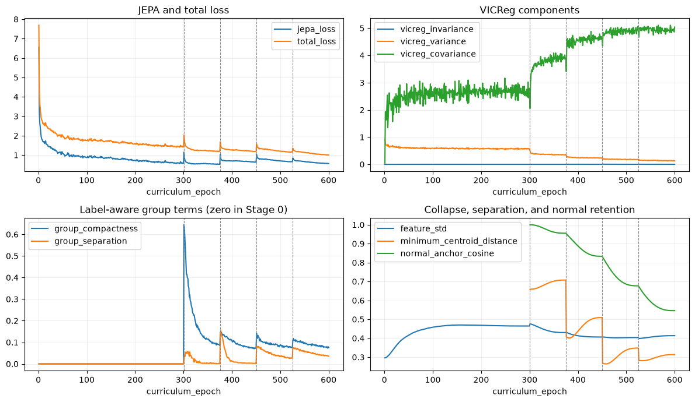

# From video to a movement model

## The idea in plain language

The early notebooks build a careful path from a walking video to a computer model that summarizes movement. First, the project finds the source videos. Next, it turns each person into a moving stick figure. Then it trains a model to notice what parts of a walk belong together. Finally, it checks whether that model is learning movement rather than an accidental clue from the video.

The model is called a skeleton JEPA. Think of it as a student of motion. It hides part of a walking sequence and tries to describe the missing part from the movement it can still see. It is not asked to redraw every joint exactly or to predict a person's future. Instead, it is asked to form a useful internal impression of a walk.

## What the notebooks contribute

The notebooks each protect a different part of the research process.

| Part of the work | What it does | Why it matters |
|---|---|---|
| Define the learning task | Hides part of a movement and asks the model to describe it | Gives the model a reason to pay attention to how motion fits together |
| Organize the videos | Records where every sequence came from | Prevents clips from the same source being mistaken for independent people |
| Extract skeletons | Finds body landmarks and keeps track of uncertain detections | Makes tracking mistakes visible instead of silently treating them as real movement |
| Choose movement landmarks | Limits the body points used by the learning task | Makes the experiment easier to inspect, while avoiding a claim that these points capture every aspect of gait |
| Train the representation | Lets the model learn broad movement structure before adding labelled material | Separates learning a movement description from reading a final label |
| Audit the representation | Looks for warning signs such as a model giving almost everything the same internal answer | Checks that an apparently successful model is not empty inside |
| Add simple readouts | Tests what a small classifier can find in the representation | Helps reveal both useful patterns and possible shortcuts |

## What the training and checks show

The saved training graph shows that the model became better at its own practice task. It also shows that its internal features continued to vary, which is a basic sign that the model did not settle on one identical answer for every walk.

*Figure. This is the unaltered graph saved by the training notebook. It describes how the model behaved while learning from its known video collection. It is not a test of diagnosis, clinical usefulness, or performance on unfamiliar people.*

This is encouraging but limited evidence. A falling training curve means the model learned the exercise it was given. It does not tell us whether it understands disease, strength, pain, or a new person's gait. The later training stages also use folder labels, and the source videos were processed in different ways. Either choice can give a model an easy clue that has little to do with gait itself.

The later checks found that broad condition groups overlap in the learned movement space. A simple classifier can sort some clips within this same collection, but it may be relying on camera angle, video source, missing landmarks, or how the clips were prepared. That is why these early classifier results are best treated as a description of this collection, not as a medical test.

## Why the project narrows to GaitParity

Broad health labels are a messy target. They can reflect a person's movement, but they can also reflect the camera, the source video, or missing data. GaitParity asks a narrower and more checkable question: can a model tell whether a walking quantity leans more to the right or to the left?

This question comes with a built-in honesty check. If we make an anatomical mirror image of a person, the meaning of right and left must switch. A model can therefore be tested in two ways: whether it predicts something useful, and whether it respects that mirror rule. Either test can fail, and neither failure can be hidden by the other.

## Bottom line

The early notebooks create a useful research instrument and make its weaknesses visible. They show a model that has learned more than a trivial constant pattern, but not a model ready for clinical claims. The next step is a narrower question with an independent measurement and a clear left-right rule that the model must obey.
