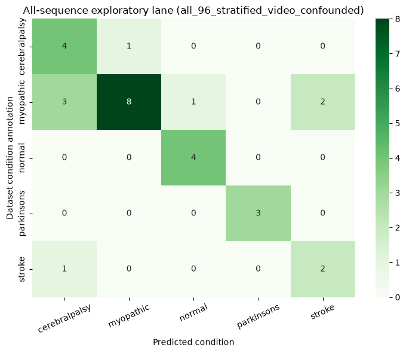

# Reading the notebook graphs

This guide explains the saved notebook outputs used in the tutorials. The graphs are shown as the notebooks produced them. They are evidence from the current experiments, not polished illustrations of a hoped-for future result.

## The early training graph

The training graph appears in [Tutorial 1](./01-foundations-notebooks-00-06.md#what-the-training-and-checks-show). It follows the model while it practices describing hidden portions of walking motion.

What to look for: the learning curve moves in the expected direction, and the feature-variation display does not suggest that every walk receives the same internal description. These are basic signs that the training procedure ran sensibly.

What not to infer: a smoother learning curve is not proof that the model understands disease, force, or an unfamiliar person. This graph comes from the collection used to develop the model.

## The signed-laterality probe

*Figure. Original saved notebook output. The left plot compares estimates with a constructed left-right movement score. The right plot checks whether estimates reverse under an anatomical mirror.*

The useful pattern would be simple. In the left plot, estimates would line up with the target direction. In the right plot, mirroring a walk would reverse the estimate. The saved output does not show either pattern clearly.

That makes this a useful negative result. The older representation and this simple reading method did not recover the constructed signed score. The graph does not test forces, and it does not tell us how the method will behave for someone outside the source collection.

## The within-collection classifier graph

*Figure. Original saved notebook output. A cell on the main diagonal represents a folder label that matched the classifier's answer. A cell away from the diagonal represents a mismatch.*

This graph is an error map. It helps show which folder labels were mixed up with which others inside this video collection. It is more informative than a single summary score because it makes uneven success and failure visible.

It is not a diagnosis chart. Clips from the same video sources can appear on both sides of the evaluation, and the representation had already been trained using the collection. Camera, source identity, landmark visibility, and preparation choices may all contribute to the pattern.

## The mirror-aware architecture audit

*Figure. Original saved notebook output. The panels check mirror consistency, the amount and variety of the left-right-sensitive channel, training behaviour, and representation health.*

The key point is comparative. The mirror-aware model follows the rule it was designed to follow, while the deliberately unrestricted comparison does not always do so. This is evidence that the implementation check can catch a broken mirror relationship.

The graph also checks that the changing channel is not simply blank. Those checks are necessary, but they are not the same as showing that the channel represents a useful gait property. The graph contains no independent force target, no new-person evaluation, and no clinical outcome.

## What these graphs establish

Together, the notebook outputs show that the training pipeline runs, the earlier signed readout fails its intended test, and the new architecture can be checked for the mirror rule without an obviously empty left-right channel.

They do not show force prediction, clinical usefulness, a diagnosis, or superiority on a meaningful real-world task. Those claims require the independent, person-held-out force-plate study described in [Tutorial 3](./03-planned-research-direction.md).
