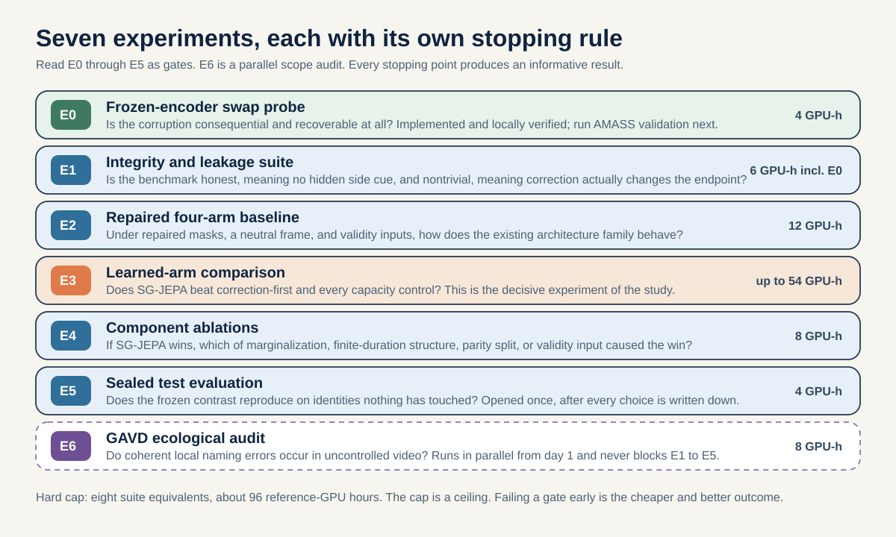
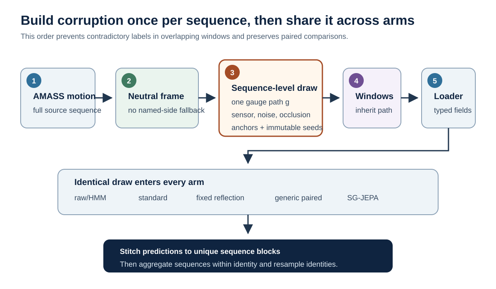
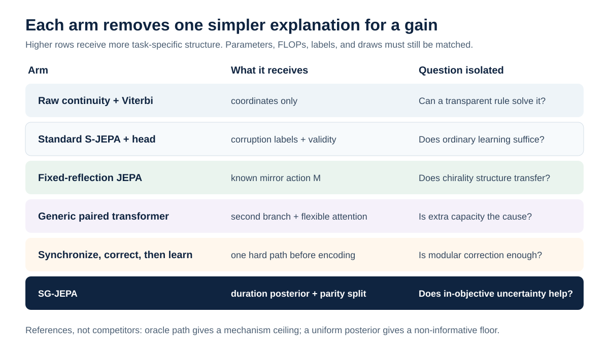
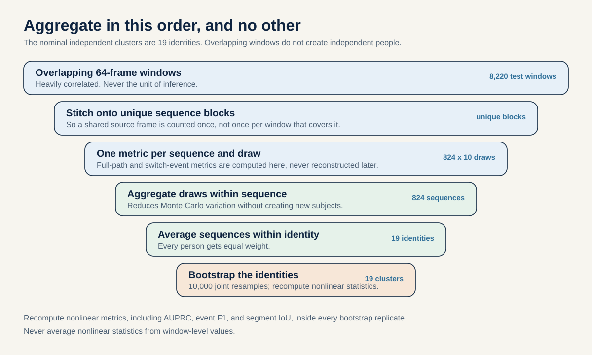

# Experiments: the Latent Laterality study program

This is the experiment guide for Study 02. It is organized around the
**questions we are going to ask the data**, in the order we ask them, and it
walks you from the repository's current state to a state where each experiment
can actually be run.

Two things this guide tries to do that a conventional runbook does not:

1. **Every setup step says why**, not only what. A change that you do not
   understand is a change you will silently revert under time pressure.
2. **Every experiment carries its own stopping rule.** Each one can end the
   study with a scientifically informative answer. None of them is a formality.

| Companion document | What it is for |
| --- | --- |
| [proposal.md](./proposal.md) | The scientific case, hypotheses, and claim boundaries |
| [theory.md](./theory.md) | Definitions, the identifiability result, estimands, and background reading |
| [swap-probe.md](../../docs/studies/latent-laterality/swap-probe.md) | The E0 code and verification guide; the local implementation suite is green |

---

## 1. The program at a glance



| ID | Experiment | Question it answers | Cost | Status | If it fails |
| --- | --- | --- | ---: | --- | --- |
| **E0** | Frozen-encoder swap probe | Is the corruption consequential and recoverable at all? | ~4 GPU-h, inside E1 cap | Implementation verified locally | Stop. Redesign the corruption or the endpoint |
| **E1** | Integrity and leakage suite | Is the benchmark honest, and is it nontrivial? | 6 GPU-h total, including E0 | To build | Stop. Fix the data contract before any training |
| **E2** | Repaired four-arm baseline | Does the existing architecture family work under repaired masks? | 12 GPU-h | To build | Fix the scaffold; do not proceed to E3 |
| **E3** | Learned-arm comparison | Does SG-JEPA beat correction-first and every capacity control? | up to 54 GPU-h | To build | Report the simpler method as the result |
| **E4** | Component ablations | Which component causes the gain, if there is one? | 8 GPU-h | To build | The gain is real but unattributed; say so |
| **E5** | Sealed test evaluation | Does the frozen contrast survive on untouched identities? | 4 GPU-h | To build | Report the negative confirmatory result |
| **E6** | GAVD ecological audit | Do these events occur in uncontrolled video? | 8 GPU-h | To build | Report the audit; make no in-the-wild claim |

The total hard cap is eight current-suite equivalents, roughly 96
reference-GPU hours if one 12-hour four-arm suite occupies one accelerator.
E0's four hours are part of E1's six-hour integrity allocation, not an extra
line item. The four-hour confirmation or job-failure reserve in Section 6 is
also inside the 96-hour cap.
**The cap is a ceiling, not a target.** Failing a gate is cheaper than
exhausting the budget, and it is also a better outcome than an uninterpretable
full matrix.

### 1.1 What "done" means

At day 14, a complete study contains:

1. an immutable, gauge-neutral AMASS-Gauge dataset manifest;
2. repaired no-copy masks and a validity-aware common input contract;
3. raw and Viterbi, correction-first S-JEPA, fixed-reflection, generic paired,
   and SG-JEPA comparisons;
4. three seeds for SG-JEPA and the strongest non-oracle baseline;
5. one sealed corpus-qualified identity-disjoint test evaluation with shared
   corruption draws;
6. identity-clustered statistics and calibrated anchored and unanchored outputs;
7. an explicit simpler-method and null-result branch; and
8. an optional GAVD audit whose claims are excluded unless its gate passes.

Do not make an external force cohort a dependency. Do not add a loopy graph, a
product group for individual joints, architecture search, or a clinical
endpoint unless the core result is already complete.

### 1.2 How hypotheses map to experiments

E0 is a feasibility screen and does not test a proposal hypothesis. The formal
hypotheses enter only after E1 fixes the benchmark and analysis contract.

| Proposal claim | Experiments that supply evidence | Frozen decision |
| --- | --- | --- |
| **H1: relative evidence** | E1 integrity, E3 validation, E5 test | Identity-mean lower 95% bound for improvement in length-normalized equivalence-class path NLL over the input-free duration prior is above zero |
| **H2: representation value** | E3 validation, E5 test | Identity-mean lower 95% bound for relative common-target error reduction versus the selected correction-first baseline exceeds 0.05 in the one frozen primary corruption cell |
| **H3: identifiability integrity** | E1 leakage tests, E3 calibration and anchor study, E5 test | Absolute-gauge probe remains at chance under global randomization; relative probabilities are calibrated; an independent anchor improves signed recovery |
| **H4: no clean-data tax** | E3 validation, E5 test | Upper 95% bound for clean error increase is below 0.02 and upper bound for absolute edge-Brier difference is below 0.01 |
| **H5: ecological occurrence** | E6 only | Weighted one-sided 95% lower prevalence bound above 1%, plus at least 20 confirmed events across 10 videos and two view strata |

---

## 2. Where you are starting from

Before changing anything, be clear about what already exists and what it is
worth. Half of the setup work below exists because the current artifacts cannot
answer the questions we want to ask.

### 2.1 Code and data inventory

| Path | Status | Purpose |
| --- | --- | --- |
| `manifests/amass_core11_conversion.csv` | Available | Current 8,854-sequence Core11 conversion manifest |
| `manifests/amass_subject_splits.csv` | Available | Corpus-qualified identity split source |
| `uv run gavd6 amass convert` | Available | Converts AMASS to 30 Hz, 11-joint tensors with provenance |
| `src/gavd6_sjepa/research_directions/reflection_equivariance/jepa_model_architecture.py` | Available | Standard and paired fixed-reflection model components |
| `src/gavd6_sjepa/research_directions/reflection_equivariance/amass_core11_training_pipeline.py` | Available | Streaming dataset, losses, checkpointing, evaluation |
| `uv run gavd6 amass train` | Available | AMASS training entry point |
| `src/gavd6_sjepa/research_directions/reflection_equivariance/swap_probe_evaluation_pipeline.py` | Available | E0: typed corruption, path inference, frozen encoding, metrics |
| `uv run gavd6 swap-probe run` | Available | E0 command-line entry point |
| `slurm/run-swap-probe.sbatch` | Available | E0 four-hour H100 job |
| `slurm/train-amass-core11-full.sbatch` | Available, not matrix-safe | Selects seed 7 and standard S-JEPA only; it does **not** launch all arms |
| `outputs/repaired-jepa-seed7-v2/` | Available, diagnostic only | Four pre-orbit-mask seed-7 artifacts; config and summary reflect only the last arm |
| `uv run gavd6 gavd download` | Available | Resumable unique-source downloader; expects a sequence manifest no standalone script builds yet |
| `work/artifacts/real/poses/` | Available, small | 96 sequences from 18 source videos, one pose extractor |
| `uv run gavd6 gavd evaluate-core11` | Available | Existing frozen GAVD probe; not a latent-laterality evaluator |

**Not yet implemented:** the SG-JEPA model, the sequence-level gauge generator,
the gauge evaluator, the paired GAVD extractor, and the human-audit tool.
Commands below labelled **target interface** describe what implementation
should expose. They are not runnable today.

### 2.2 Current AMASS snapshot

| Split | Identities | Sequences | Eligible sequences (>= 64 frames) | Windows |
| --- | ---: | ---: | ---: | ---: |
| Train | 151 | 7,217 | 6,921 | 79,535 |
| Validation | 19 | 769 | 722 | 5,936 |
| Test | 19 | 868 | 824 | 8,220 |

Two facts about this snapshot shape the setup work.

The manifest has `valid_fraction=1.0` everywhere, so **existing training says
nothing about behavior under missing joints.** Occlusion is exactly the
condition under which naming errors occur, so this is not a detail we can defer.

The stored histories report 79,552 training-window exposures per epoch because
79,535 windows are padded to 2,486 complete batches of 32, repeating 17
examples in the last batch. That number is expected and is not a manifest
discrepancy. However, the run recorded absolute cluster paths rather than
manifest and code hashes, so the exact input cannot be authenticated from the
copied artifacts alone.

### 2.3 Verdict on the stored checkpoints

The four checkpoints in `outputs/repaired-jepa-seed7-v2` are useful for exactly
three things: testing that loading works, extracting features, and inspecting
the old architecture. They are not results.

- Every checkpoint lacks `metadata.paired_mask_contract`. The models predate
  branch-specific orbit-closed masks. This exposes a physical counterpart only
  in paired models with cross-branch interaction, but every paired arm still
  needs one recorded mask contract before it can be believed.
- The top-level `run_config.json` and `summary.csv` were overwritten by the
  final standard-only invocation, so per-arm runtime and memory are lost.
- Test evaluation was off.
- **Do not copy their validation KL into a model leaderboard.** Each arm was
  scored against its own EMA teacher, so the numbers are not on a common scale.

---

## 3. Setup, and the reason for each step

Six changes stand between the current repository and E1. Each is presented as
*symptom, change, reason*. Do them in order; later steps assume earlier ones.



### S1. Build a gauge-neutral coordinate contract

**Symptom.** The existing conversion frequently uses named hips to decide which
way the body faces. 64.60% of sequences use a named-left/right
`hip_facing_fallback`, and a further 5.95% use a related fallback after anatomy
and trajectory disagree. Only 2,607 of 8,854 sequences use the side-neutral
travel-based method.

**Change.** Create `gauge-neutral-v1` with these rules:

1. use world or trajectory information that never inspects left-versus-right
   names;
2. exclude or separately stratify near-stationary windows where trajectory is
   undefined;
3. sample a hidden lateral sensor reflection **independently** of the semantic
   gauge, so coordinate sign cannot reveal the token convention;
4. apply the sensor action to coordinates only, and the semantic action to
   token-indexed fields only; and
5. preserve raw world coordinates for leakage audits.

**Why.** If the body frame is built from named hips, then the absolute naming
convention is already baked into the coordinates before the corruption is
applied. A model can then read the answer straight off the geometry. The entire
identifiability argument in [theory.md](./theory.md) assumes no such cue
survives, so without this step every downstream result is uninterpretable, and
the "unanchored" condition is not actually unanchored.

**Attrition, and what to do about it.** Naively excluding every fallback leaves
roughly 10,921, 942, and 1,551 train, validation, and test windows, and 107,
14, and 15 represented split identities instead of 151, 19, and 19. That drops
four current test identities. Emit an attrition table before training. Prefer a
genuinely orientation-free or random-yaw contract that can retain valid
stationary motion; otherwise revise the sample-size, runtime, and uncertainty
plan to the retained identities and say so in the paper.

### S2. Generate corruption at sequence level, before windowing

**Symptom.** Windows overlap. If each window samples its own convention path,
the same source frame receives contradictory latent states in different
windows, and the "ground truth" is self-inconsistent.

**Change.** Generate exactly one path per full sequence and corruption draw.
Windows inherit their parent sequence's path. Record every field below in an
immutable manifest.

| Field | Meaning |
| --- | --- |
| `identity`, `motion_id`, `split` | Independent unit and immutable split |
| `corruption_draw` | Deterministic draw ID shared across models |
| `block_frames` | Four, in the minimum model |
| `gauge_path_rle` | Run-length encoded coherent Core11 swap path |
| `switch_frames` | Exact event boundaries, before window slicing |
| `semantic_scope` | `core11_all_pairs` for in-model data; partial scopes are out-of-model |
| `sensor_reflection_bit` | Independent hidden coordinate-frame action |
| `latent_chart_bit` | Random global semantic re-expression applied jointly to the teacher convention and the saved path; required for unanchored batches |
| `occlusion_seed`, `occlusion_mask` | Exact missingness action |
| `noise_seed`, `noise_scale` | Exact coordinate perturbation |
| `anchor_blocks`, `anchor_error_rate` | Supplied anatomical convention evidence |
| `generator_version`, `source_sha256` | Reproducibility |

**Why.** Three separate reasons. Consistency, as above. Comparability, because
every arm must see the identical draw or the paired statistics are invalid.
And auditability, because the switch boundaries recorded before slicing are the
reference against which event localization is scored; boundaries reconstructed
after windowing are already contaminated by the slicing.

**Design cells.** Use 20% clean training examples. Sample in-model local
segments of 1, 2, 4, and 8 blocks, plus repeated low-rate Markov switches.
Include evaluation-only off-block boundaries and partial joint-chain swaps to
measure misspecification. The provisional confirmatory cell is one 4-block
(16-frame) local segment with moderate boundary-centered distal-joint occlusion
and noise. Freeze the numeric noise standard deviation, occlusion probability,
joint set, temporal support, and seed list on validation data before opening
test. Use exactly 10 deterministic test draws that are identical across arms.

### S3. Make validity an input, not an accident

**Symptom.** A missing joint currently arrives as a coordinate of zero, which
is indistinguishable from a valid joint that happens to sit at the origin.

**Change.** Add a learned validity embedding or an explicit validity channel to
every learned arm. Apply $P$ and every mask to validity and confidence exactly
as to coordinates. AMASS has no detector confidence, so do not invent one; the
GAVD adapter may add confidence later as a separately declared channel.

**Why.** Occlusion is the mechanism that generates naming errors in the first
place, so the model must be able to tell "I cannot see this" from "this is at
zero." Without that distinction, an occlusion pattern silently becomes a fake
coordinate pattern, and any measured robustness is measuring the wrong thing.

### S4. Verify the repaired masks and record the contract

**Symptom.** The legacy checkpoints hide the same index in both paired
branches. Because branch one sees $Px$, that legacy rule can leave the physical
counterpart visible in the other branch. The current source has already added
`orbit_closed_target_masks`; the missing evidence is a fresh full run under
that code path.

**Change.** Keep the implemented rule: if branch zero hides mask $m$, branch
one hides $P(m)$, and validity is transported the same way. Run the no-copy
tests and require every fresh checkpoint to contain:

```text
paired_mask_contract = branch-specific-p-closed-v1
```

**Why.** Without orbit-closed masks, a cross-attending paired model can copy
the answer from the other branch instead of predicting it. A zero commutation
residual does **not** detect this leak. The code repair and the fresh-checkpoint
evidence are separate requirements, which is why the stored checkpoints remain
diagnostic only.

### S5. Snapshot provenance before every full-study run

**Change.** Before any E1 through E6 run, record:

- git commit and dirty diff;
- Python lockfile hash;
- raw, conversion, and split manifest hashes;
- effective per-arm model configuration **after** capacity resolution;
- corruption-generator version and manifest hash;
- paired-mask contract;
- Slurm job ID, GPU model, wall time, peak memory, and measured GPU-hours.

**Why.** The current directory records a nominal 96-dimensional template while
the effective checkpoints are 64-dimensional, and its summary was overwritten
by a later job. Both failures are cheap to prevent and expensive to discover
afterwards. Recording the *effective* config, per arm, is the specific fix.

### S6. Adopt one artifact contract per run

Each E1 through E6 run directory must be immutable and self-describing:

```text
run-id/
├── effective_config.json
├── environment.json
├── hashes.json
├── capacity_and_compute.csv
├── data_manifest.json
├── corruption_manifest.parquet
├── STATUS.json
├── seed-<n>_<variant>_best.pt
├── seed-<n>_<variant>_history.csv
├── seed-<n>_<variant>_validation_predictions.parquet
└── COMPLETE.json
```

`data_manifest.json` stores a resolvable immutable URI, schema version, row
count, and SHA-256 digest for every source manifest. If the full corruption
manifest is too large to copy, store an immutable content-addressed URI and a
small run-specific slice instead. A bare digest with no object or resolvable
location is not reproducible.

The sealed evaluator writes test predictions into a **new** evaluation
directory, never into a training directory. `STATUS.json` is written as
`running`, then atomically changed to `complete` or `failed` with the Slurm job
ID and failure reason. A central expected-run ledger is joined to every status
file and `COMPLETE.json`, so failed and missing jobs remain visible. The index
is never maintained by letting separate jobs overwrite one shared
`summary.csv`, which is exactly how the current directory lost its per-arm
records.

E0 predates this full-study contract and writes the smaller, explicitly listed
artifact set in [swap-probe.md](../../docs/studies/latent-laterality/swap-probe.md#7-output-artifacts).
That exception is acceptable for the validation screen, but E0 must still save
its command, manifest and checkpoint hashes, effective corruption settings, and
an explicit `test_split_evaluated=false` completion marker.

---

## 4. The experiments

### E0. Frozen-encoder swap probe

| | |
| --- | --- |
| **Question** | Under a controlled 16-frame naming swap hidden among reflection, noise, and occlusion, can a relative corrector recover the convention and protect a frozen readout? |
| **Cost** | About 4 GPU-hours, validation only |
| **Status** | Implementation verified locally. Run the real AMASS validation job first |
| **Full guide** | [swap-probe.md](../../docs/studies/latent-laterality/swap-probe.md) |

E0 trains no JEPA. It applies typed corruption to non-overlapping windows,
fits lightweight edge heads on training identities, and evaluates five
correction arms through the frozen seed-7 standard S-JEPA encoder. Its purpose
is to reject an inconsequential benchmark before spending anything on E1
through E5.

**Do not proceed past E0 without a positive oracle-consequence result.** If
knowing the true path does not improve the odd-target error, then nothing
downstream can, and the correct move is to redesign the corruption or the
endpoint.

### E1. Integrity and leakage suite

| | |
| --- | --- |
| **Question** | Is the benchmark honest (no hidden side cue), and is it nontrivial (correction actually matters)? |
| **Cost** | 6 GPU-hours, including short integration runs |
| **Prerequisites** | S1 through S6 |

E1 has three gates. All three must pass before any full training run.

**Gate 0A: typed transformations.** Unit tests must prove:

- $P^2 = I$, $M^2 = I$, and $P \ne M$ on a non-symmetric fixture;
- $P$ exchanges token contents and does not negate any coordinate;
- $M$ exchanges pairs and negates only the declared mediolateral channel;
- validity, confidence, targets, and masks follow the correct token action;
- sequence corruption is identical on overlapping source frames;
- relative-edge logits are invariant to a global semantic chart flip; and
- applying the saved inverse path reconstructs the clean tensor exactly, before
  added noise and occlusion.

*Why this set:* each line corresponds to a way the three transformations of
[proposal.md](./proposal.md#2-the-failure-coordinates-stay-plausible-while-names-drift)
can be silently conflated in code. The last line is the strongest single test,
because exact invertibility means the generator did what the manifest says.

**Gate 0B: no-copy masks and checkpoint metadata.** A copyability test must
show that neither branch can attend to the other branch's physical target.
Fresh checkpoints must record `paired_mask_contract`. Also require
optimizer and reload equality, deterministic evaluation, nonzero even and odd
variance, and a tied-model float32 commutation residual of at most $10^{-5}$.

**Gate 0C: benchmark consequence.** On validation data:

| Check | Must show | Why it matters |
| --- | --- | --- |
| Oracle path | Materially improves corrupted common-target odd error | If not, the corruption does not touch the endpoint. Stop |
| Unanchored absolute-offset probe | Stays at chance, upper 95% bound below 0.55 AUROC | Otherwise the coordinates leak the answer and S1 failed |
| Relative edge oracle | Reconstructs paths up to one global bit | Confirms the relative problem is well posed |
| Uniform 0.5 on every edge | Scores poorly on relative-edge discrimination | Prevents "maximally uncertain" from looking like success |

### E2. Repaired four-arm baseline

| | |
| --- | --- |
| **Question** | Under repaired masks, a neutral frame, and validity inputs, how does the existing architecture family behave? |
| **Cost** | 12 GPU-hours, validation only |
| **Arms** | `standard_sjepa`, `paired_shared_no_cross`, `reflection_equivariant`, `paired_unconstrained` |

E2 exists to **replace** the invalid artifacts in
`outputs/repaired-jepa-seed7-v2`, not to extend them. It is a clean baseline
suite on the new data contract, at seed 7, with per-arm effective configuration
and compute recorded.

Exit condition: common-target metrics are valid, features have not collapsed,
and every arm writes a complete artifact directory.

### E3. Learned-arm comparison

| | |
| --- | --- |
| **Question** | Does joint posterior-aware predictive learning add value over every simpler explanation? |
| **Cost** | Up to 54 GPU-hours, and this is a ceiling, not a plan |
| **Confirmatory seeds** | 7, 19, 31, but only for SG-JEPA and the selected baseline |



This is the decisive experiment. Each arm is designed to remove one alternative
explanation for an SG-JEPA win.

| Arm | Training | Expected clean behavior | Expected corruption behavior | What a surprise would mean |
| --- | --- | --- | --- | --- |
| Raw continuity plus HMM/Viterbi | CPU, no encoder | No representation | Strong when gait is smooth and visible; weaker at occluded boundaries | If it solves every realistic cell, SG-JEPA is unnecessary |
| Corruption-trained standard S-JEPA plus gauge head | Same data and validity | Strong ordinary baseline | Can learn detection, but a detached hard correction discards uncertainty | If it matches SG-JEPA, joint marginalization adds nothing |
| Repaired fixed-reflection JEPA plus the same head | Uses the known $M$ paired lift | Exact anatomical-reflection commutation | No guarantee for latent semantic $P$ | Success would show useful transfer from chirality, not latent-laterality novelty |
| Generic paired temporal transformer | Capacity and FLOP sensitivity | Flexible, more compute | May fit swaps without exact parity or calibration | A win means constraints hurt, or capacity matching was incomplete |
| Synchronization then S-JEPA | Edge classifier, Viterbi, corrected input | Strong decisive baseline | Good when one hard path suffices | Matching SG-JEPA favors the simpler modular system |
| **SG-JEPA** | Soft relative posterior inside the predictive loss | Must be within 2% of the best clean arm | Preserve even content, transport odd content, abstain when ambiguous | A gain only at extreme corruption narrows the claim |
| Oracle path | Evaluation-time upper bound | Same clean target | Maximum attainable benefit from correct transport | A small oracle gap means the task is not consequential |
| Uniform 50:50 | Evaluation-time lower bound | Uninformative | Correct global symmetry, poor edge information | Prevents calling maximal uncertainty a success |

**Protocol rules that make the comparison fair.**

Every learned gauge-head arm receives the same synthetic edge labels, BCE
supervision, masks, corruption draws, and anchor exposure. After BCE training,
freeze the edge head. On a fixed held-out calibration subset, fit the declared
duration prior and one CRF temperature by structured equivalence-class path NLL, then
detach the posterior weights inside the JEPA prediction loss. The calibration
subset never updates edge-head weights and is never the sealed test set.

*Why the freeze and detach matter:* if the posterior can move to reduce the
prediction loss, it stops being a correspondence posterior and becomes a
loss-selecting gate. The architecture comparison would then be confounded by
model-specific label access, and the calibration claim in H3 would be
meaningless.

Screen all learned arms at seed 7. Promote **only** SG-JEPA and the single
strongest non-oracle baseline to seeds 19 and 31. Choosing the strongest
baseline rather than the most convenient one is the difference between a test
and a demonstration.

### E4. Component ablations

| | |
| --- | --- |
| **Question** | If SG-JEPA wins, which of its four components caused the win? |
| **Cost** | 8 GPU-hours at seed 7 |

Remove exactly one item at a time:

| Ablation | Component removed | Rival explanation it eliminates |
| --- | --- | --- |
| Hard MAP transport | Marginalization | "Any correction would have worked" |
| Independent edge factors | Finite-duration chain structure | "Per-edge scores are enough" |
| No parity split | Exact even/odd channels | "A generic second branch is enough" |
| No validity embedding | Explicit missingness input | "The model just learned occlusion statistics" |

Only the single decisive ablation is repeated at seeds 19 and 31. Output
symmetrization and mirror augmentation are inexpensive secondary controls that
can run in the same block.

### E5. Sealed test evaluation

| | |
| --- | --- |
| **Question** | Does the frozen contrast reproduce on identities that were never touched? |
| **Cost** | 4 GPU-hours, run exactly once |

Open the test split only after architecture, corruption severity, temperature,
anchors, and margins are all frozen and written down. Use the 10 shared
deterministic draws. Write a test marker so the evaluation cannot silently
rerun. The evaluator must default to no test access and refuse an output
directory with incompatible run metadata.

### E6. GAVD ecological audit

| | |
| --- | --- |
| **Question** | Do coherent local naming errors actually occur in uncontrolled video? |
| **Cost** | 8 GPU-hours hard cap for paired extraction; retrieval and annotation are CPU work |
| **Scheduling** | Runs in parallel from day 1 and never blocks E1 through E5 |

Audit raw image-coordinate outputs **before** any body frame that uses named
hips, for the same reason as S1. Use two extractors only to diversify
candidates, never as two ground truths.

Two lanes, kept strictly separate:

| Lane | Sampling | What it may be used for | What it may never be used for |
| --- | --- | --- | --- |
| Probability lane | Source videos drawn within fixed camera-view and quality strata with known inclusion probabilities | Weighted prevalence, weighted calibration | |
| Enriched lane | Oversample low confidence, extractor disagreement, limb crossings, model-ranked switches | Error taxonomy, examples, ranking stress tests | Any unweighted prevalence or calibration estimate |

Two raters, blinded to model score, label each candidate as a coherent
whole-lower-body convention swap, a whole-limb-chain or joint-specific swap, a
person-track or identity error, no swap, or indeterminate anatomical
visibility. Adjudicate disagreements and report rater agreement. The source
video is the bootstrap unit.

**Pass the broad ecological gate only if all of the following hold:** the
probability sample's inclusion-weighted proportion of retrievable source videos
containing a local coherent event has a one-sided 95% lower bound above 1%;
there are at least 20 such events across at least 10 source videos and two view
strata; the events cause a consequential change in an odd feature; and failures
remain after the transparent corrector. Report retrieval response by stratum
and restrict inference to retrievable videos if nonresponse cannot be adjusted.
Global per-video naming differences do not justify a temporal representation
model.

---

## 5. Commands

### 5.1 Available now: E0

The full walkthrough is in
[swap-probe.md](../../docs/studies/latent-laterality/swap-probe.md). The short
version, on the cluster:

```bash
cd "$GAVD6_ROOT"
export HAIC_ACCOUNT=mind  # Replace with the allocation you are authorized to use.
export AMASS_RUN_ROOT="$GAVD6_ROOT/outputs"
export SWAP_PROBE_OUTPUT_DIR="$AMASS_RUN_ROOT/swap-probe-seed7-initial"

sbatch --account="$HAIC_ACCOUNT" --export=ALL slurm/run-swap-probe.sbatch
```

### 5.2 Available now: inspect and rerun the fixed-reflection scaffold

Dry configuration, no test access, no training:

```bash
AMASS_RUN_ROOT="$GAVD6_ROOT/outputs" \
AMASS_OUTPUT_DIR="$GAVD6_ROOT/outputs/dry-config-seed7" \
AMASS_PROFILE=full AMASS_DEVICE=cuda AMASS_SEEDS=7 \
AMASS_EVALUATE_TEST=0 AMASS_RUN_TRAINING=0 \
uv run --no-sync train-amass-core11
```

After the repaired mask and metadata tests pass, run each seed or Slurm-array
task into a **unique** directory:

```bash
export AMASS_RUN_ROOT="$GAVD6_ROOT/outputs"
export AMASS_RUN_ID=repaired-baseline-seed7
export AMASS_OUTPUT_DIR="$AMASS_RUN_ROOT/runs/$AMASS_RUN_ID"
AMASS_RUN_TRAINING=1 AMASS_PROFILE=full AMASS_DEVICE=cuda \
AMASS_SEEDS=7 AMASS_NUM_WORKERS=4 AMASS_EVALUATE_TEST=0 \
AMASS_VARIANTS=standard_sjepa,paired_shared_no_cross,reflection_equivariant,paired_unconstrained \
uv run --no-sync train-amass-core11
```

`AMASS_RUN_ROOT` selects the manifest and tensor defaults. It does not select
the trainer output directory, so `AMASS_OUTPUT_DIR` is explicit in both
examples.

Two warnings that come from the current failure mode. Do not launch independent
variants into one reused directory until summary and configuration
consolidation is fixed, because the last job wins and the others are lost. Do
not assume the existing Slurm time limit fits a three-seed matrix; use a seed
job array with unique run IDs.

### 5.3 Target interface: not implemented yet

These paths are design placeholders. Implement small composable commands with
these responsibilities:

```text
gavd6 laterality build-manifest        # neutral conversion plus sequence paths
src/gavd6_sjepa/train_amass_gauge.py    # learned arms; validation only by default
scripts/evaluate_amass_gauge.py         # sealed shared-draw test evaluation
scripts/extract_gavd_pose_pair.py       # two extractor outputs in the raw image frame
scripts/audit_gavd_laterality.py        # probability and enriched samples plus adjudication
```

Intended usage after implementation:

```bash
uv run --no-sync gavd6 laterality build-manifest \
  --source-manifest manifests/amass_core11_conversion.csv \
  --source-tensor-root "$GAVD6_ROOT/outputs/core11" \
  --subject-splits manifests/amass_subject_splits.csv \
  --coordinate-contract gauge-neutral-v1 \
  --output-root /hai/scratch/tedmui/amass-gauge-v1

AMASS_GAUGE_RUN_TRAINING=1 AMASS_GAUGE_EVALUATE_TEST=0 \
AMASS_GAUGE_VARIANT=sg_jepa AMASS_GAUGE_SEED=7 \
AMASS_GAUGE_MANIFEST=/hai/scratch/tedmui/amass-gauge-v1/manifest.parquet \
AMASS_GAUGE_DATA_ROOT=/hai/scratch/tedmui/amass-gauge-v1 \
AMASS_GAUGE_OUTPUT_DIR=/hai/scratch/tedmui/runs/sg-jepa-seed7 \
uv run --no-sync python -m gavd6_sjepa.train_amass_gauge

uv run --no-sync python scripts/evaluate_amass_gauge.py \
  --frozen-protocol configs/amass-gauge-v1-frozen.json \
  --run-index outputs/amass-gauge-run-index.csv \
  --split test --evaluate-once
```

The final interface may use different names, but three properties are not
negotiable: it defaults to no test evaluation, it refuses an output directory
with incompatible run metadata, and it writes atomically after every completed
arm.

---

## 6. Schedule and budget

| Phase | Days | GPU cap | Main work | Exit condition |
| --- | --- | ---: | --- | --- |
| Specification and integrity (E0 and E1) | 1 to 2 | 6 h total | E0 screen, hashes, neutral frame, sequence generator, raw/HMM/oracle, masks, leakage tests | E0 verification green; absolute-gauge upper CI below 0.55; oracle consequence present |
| Integration | 3 | included above | Short seed-7 health runs only; profile I/O and FLOPs | All artifacts reload; no-copy and commutation pass |
| Repaired baseline (E2) | 3 to 4 | 12 h | Fresh clean and corruption baseline suite, validation only | Common-target metrics valid; no collapse |
| Learned-arm screen and finalists (E3) | 3 to 7 | up to 54 h | Screen at seed 7; seeds 19 and 31 only for SG-JEPA and the selected baseline | Ceiling, not required spend; finalists frozen on validation |
| Ablations (E4) | 6 to 8 | 8 h | Four seed-7 component removals | One causal explanation identified, or the gain is judged uninterpretable |
| Confirmation and contingency | 8 | 4 h | Repeat one decisive ablation, or recover one failed job if budget remains | Architecture, temperature, and protocol frozen |
| Sealed AMASS test (E5) | 9 | 4 h | 10 shared draws, no tuning | Test marker written; evaluation cannot silently rerun |
| GAVD extraction (E6) | 1 to 8 | 8 h | Hard-capped extraction only; retrieval and annotation on CPU | Audit proceeds, or is reported incomplete, without delaying AMASS |
| Statistics and writing | 10 to 14 | none expected | Aggregate identity-first; figures; claims table | Reproducible package and bounded conclusion |

Run full-GAVD retrieval, paired extraction, and annotation preparation in
parallel from day 1. The existing downloader is resumable, but first convert
notebook-only sequence-manifest creation into a standalone, hashable step, and
merge shard reports before quoting coverage.

---

## 7. Evaluation and aggregation

### 7.1 Use common targets, not per-model KL

Do not compare each model's own EMA KL as the primary endpoint. Use common
coordinate or kinematic targets, or one frozen canonical teacher, for anchored
evaluation. In unanchored evaluation, globally randomize and orbit-score the
teacher's odd targets so its canonical convention cannot act as an undeclared
anchor.

Recommended common probes:

| Type | Probe | Role |
| --- | --- | --- |
| Odd | Right-minus-left ankle-speed energy; right-minus-left leg excursion, with a training-defined near-zero zone for sign scoring | The quantity the corruption threatens |
| Even | Forward speed; total lower-limb motion energy | Must not degrade |
| Structured equivariant | Future centered joint coordinates, scored only after declared path alignment or global orbit minimization | Tests transport, not just detection |
| Gauge | Relative edges and paths, up to one global flip | Tests the posterior itself |

These are representation and mechanism targets. They are not force measurements.

### 7.2 Metrics

| Question | Primary or diagnostic metrics |
| --- | --- |
| Relative path | Equivalence-class path NLL; edge Brier and log loss; Hamming error minimized over the global flip |
| Switch events | AUPRC; event precision, recall, and F1 within one block; segment IoU; boundary error |
| Anchored odd readout | Normalized MAE; predictive NLL; sign accuracy outside the near-zero zone |
| Unanchored odd readout | Orbit MAE; symmetric-mixture NLL; calibration and sharpness, never two-sign coverage alone |
| Even and clean preservation | Common-target error against the 2% clean non-inferiority margin |
| Selective use | Risk-coverage curve; area under the selective-risk curve |
| Representation health | Feature variance, covariance, effective rank, odd energy |
| Geometry and integrity | Exact parity; commutation; no-copy masks; absolute-gauge leakage; sensor-bit decodability |
| Resources | Parameters, FLOPs, wall time, GPU model, peak memory, actual GPU-hours |

### 7.3 Aggregate in this order, and no other



The independent unit is the **corpus-qualified identity**, not the window.
Thousands of overlapping windows from 19 identities carry roughly 19 identities
worth of information, and analyses that ignore this produce confidence
intervals that are far too narrow.

1. **Stitch first.** Average or stitch overlapping-window logits and latent
   predictions onto each unique source-sequence block, so overlapping source
   frames are not counted repeatedly. For additive common-target losses,
   deduplicate source target blocks before averaging, or preregister an
   explicitly window-weighted estimand instead.
2. **Compute per sequence and draw.** Full-path and switch-event metrics are
   computed once per sequence and corruption draw.
3. **Average draws within sequence.**
4. **Average sequences within identity.**
5. **Compare models on the same identity and paired seed.**
6. **Report** every seed, the seed mean and range, the identity-level effect
   size, a 10,000-resample identity-cluster bootstrap 95% interval, and a
   paired identity-level randomization test.

Pair seed IDs 7, 19, and 31 across SG-JEPA and the selected baseline. The
confirmatory effect is the average of the three seed-specific identity effects;
the bootstrap resamples identities jointly with the fixed seed set, so the
interval is conditional on those seeds while the per-seed range is descriptive.

**Nonlinear metrics are never averaged from window-level versions.** Prespecify
both the pooled **micro** estimand and an **identity-macro** sensitivity
estimate for AUPRC, event F1, segment IoU, and boundary error. Reliability, ECE,
risk-coverage, and AURC are pooled diagnostics. Every cluster-bootstrap
replicate resamples identities (or source videos for E6) and recomputes the
complete nonlinear statistic, including event matching and curve construction.

---

## 8. How to read the results

| Observed pattern | Interpretation | Next action |
| --- | --- | --- |
| Oracle transport does not improve odd common-target error | The corruption is not consequential for the endpoint | Stop or redesign the endpoint; do not train SG-JEPA |
| Absolute gauge is decoded from "unanchored" inputs | A coordinate or metadata leak is acting as an anchor | Fix neutralization and regenerate the data |
| Raw or HMM correction fixes at least 95% of natural candidate events | The representation architecture is unnecessary here | Report the correction result; stop the main architecture claim |
| SG-JEPA lowers path NLL but not common-target error | Better tracking only | Do not claim a representation improvement |
| SG-JEPA improves odd error but harms clean or even by more than the margin | A robustness tradeoff | Report it honestly; inspect the parity or capacity constraint |
| Hard MAP equals marginalization, with equal calibration | The posterior mixture adds no measured value | Prefer the simpler hard corrector |
| Marginalization improves ambiguous cells and risk-coverage without clean cost | The intended mechanism is supported | Repeat the decisive contrast across seeds and report a bounded claim |
| The fixed-reflection model solves semantic $P$ | Known chirality transfers better than predicted | Reframe novelty around empirical transfer, not a unique architecture |
| The generic paired transformer wins | Flexibility or compute matters more than gauge structure | Audit FLOPs and constraints; do not claim an inductive-bias benefit |
| Unanchored global entropy collapses despite chance-neutral data | The model violates the output contract or exploits a leak | No identifiability-aware claim is licensed |
| Only severe synthetic cells show gains | Controlled stress robustness | Remove real-world and broad-usefulness language |

---

## 9. Final reproducibility and claim checklist

- [ ] Test identities were never used for architecture, severity, temperature,
      anchor, checkpoint, or margin selection.
- [ ] Effective model configs, not only a nominal base config, were saved.
- [ ] Every paired checkpoint records the repaired mask contract.
- [ ] Data, code, split, corruption, and environment hashes resolve.
- [ ] Gauge paths are defined at sequence level and agree across overlaps.
- [ ] The unanchored leakage probe passed before training.
- [ ] Common targets, rather than per-model EMA KL, drive the main comparison.
- [ ] Results aggregate to identities before inference.
- [ ] Every seed and every failed job is visible; no best-seed selection occurred.
- [ ] Wall time, FLOPs, peak memory, and GPU-hours accompany parameter counts.
- [ ] Unanchored results are scored as a distribution or an orbit, never as a
      forced sign.
- [ ] Partial swaps are labelled out-of-model rather than counted as coherent
      gauge successes.
- [ ] GAVD prevalence uses probability weights; enriched samples are reported
      separately.
- [ ] Kinematic targets are not described as force, balance, diagnosis, or
      clinical outcomes.
- [ ] The conclusion follows the outcome table in Section 8, including the
      simpler-method and null branches.
