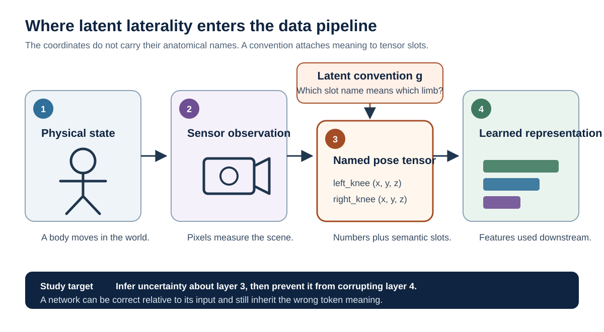
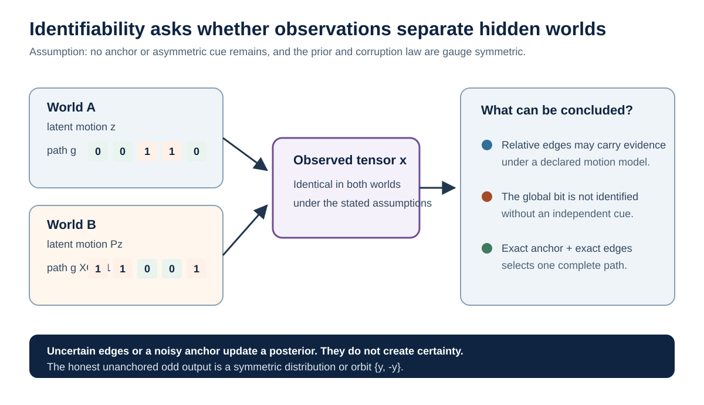
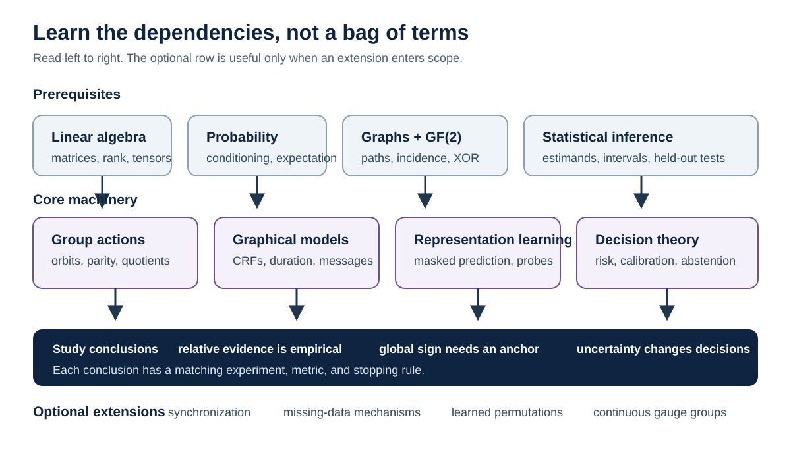

# Theory of latent laterality: prediction when anatomical names are uncertain

These notes build the Latent Laterality study from the basic distinction between
a moving body, a sensor measurement, and the names assigned to entries in a
data table. No knowledge of group theory or graphical models is assumed. The
first two sections explain the problem in ordinary language. Later sections
introduce only the mathematics needed to state what can be learned, what cannot
be learned, and how those claims are tested.

The word **latent** means unobserved. Relative to raw video, a person's
three-dimensional pose may already be latent. The additional latent variable
studied here is the temporary convention that says which tensor slot means
anatomical left and which means anatomical right. The word **gauge** is used as
a finite, operational analogy for that choice of convention. It does not claim
a new physical gauge theory.

The central distinction is between:

- **structural non-identifiability:** two states give the same observable law
  but require different signed answers;
- **statistical uncertainty:** the observations favor one answer but not with
  certainty; and
- **empirical rarity:** the ambiguity is mathematically possible but too rare
  or too easy to correct to justify a new model.

The algebra establishes only the first point. AMASS-Gauge and the GAVD audit
must establish whether the second and third matter in practice.

## 1. From a moving body to a tensor

A person walking is a physical process. A camera records light from that
process. A pose estimator converts each frame into coordinates for named body
landmarks. The resulting skeleton sequence is therefore already a
**representation**: it retains selected geometric information and discards
appearance, texture, and most of the image.

For one frame, imagine a table with rows named `left_knee`, `right_knee`, and
`pelvis`, and columns holding horizontal and vertical coordinates. The numbers
do not contain their row names. A coordinate such as $(0.31, 0.74)$ has no
intrinsic anatomical side. Its meaning comes from the row in which the pose
system stores it. This gives four distinct layers:

1. **Physical state:** the actual body and its anatomical limbs.
2. **Sensor observation:** pixels or other measurements produced by the camera.
3. **Tokenized pose:** coordinates stored in slots with semantic names.
4. **Learned representation:** a vector computed from those tokens for later
   prediction or decision making.

Latent Laterality studies an error at the boundary between layers 2 and 3. The
pose remains geometrically plausible, but the map from a physical limb to a
named token changes. That error can then propagate into layer 4 even when the
neural network is functioning exactly as programmed.

A 64-frame input in this repository is stored as a three-axis tensor. If $T$
is the number of frames, $J$ the number of joints, and $d$ the number of spatial
coordinates, then

$$
x\in\mathbb R^{T\times J\times d}.
$$

The tensor shape tells us how many values are present. It does not guarantee
that joint index $j$ carries the anatomical meaning assigned to it. This is the
first principle on which the entire study rests.

## 2. Three questions that must remain separate

The study becomes much easier to reason about once three questions are kept
distinct.

**What moved?** A change in body pose is a physical event. A coordinate-frame
rotation is a sensor or preprocessing event. A left/right slot exchange is a
semantic event. These transformations can produce superficially similar arrays
but demand different mathematical actions.

**Which facts survive a naming change?** Walking speed does not depend on which
leg is called left. A right-minus-left ankle statistic does. The first is an
invariant, or even, quantity. The second is an equivariant, or odd, quantity:
it should change sign predictably rather than disappear.

**How certain is the correspondence?** A hard correction chooses one token
assignment. A posterior distribution gives a probability to each assignment.
These are different outputs. A posterior is useful only if its probabilities
are calibrated, meaning that events assigned probability $p$ occur about a
fraction $p$ of the time among comparable cases.

The central limitation follows before any neural-network detail. If swapping
the underlying anatomical labels and flipping every hidden convention bit
produces exactly the same observed tensor, the data cannot distinguish those
two worlds. Relative changes in convention may still leave temporal evidence,
but the single global left/right orientation requires an independent anchor.

## 3. Objects, notation, and typed transformations

Let a 64-frame training window be divided into $K=16$ blocks, each containing
$S=4$ frames. The formulas use $K$ for the number of blocks under inference;
stitched full-sequence evaluation substitutes that sequence's block count. In
block $k$:

- $z_k\in\mathbb R^{S\times J\times d}$ is a latent, anatomy-indexed pose;
- $x_k$ is the observed pose tensor;
- $v_k$ is its validity mask;
- $g_k\in\mathbb Z_2=\{0,1\}$ is the latent convention mapping observed slots
  to anatomical slots;
  and
- $p:J\rightarrow J$ exchanges every declared bilateral joint pair and fixes
  the pelvis.

The permutation $P$ induced by $p$ acts on joint slots:

$$
(Pz)_{s,j,:}=z_{s,p(j),:},\qquad P^2=I.
$$

It must act on coordinates, validity, detector confidence, masks, and joint
metadata in the same way. Applying it only to coordinates creates a malformed
example.

Although $z$ is written in one anatomy-indexed chart, $Pz$ in a gauge
reparameterization means the same physical motion re-expressed in the opposite
semantic chart, not a physically reflected pose. The latent parameter space
and prior are assumed closed under this chart relabeling.

Three transformations must never be conflated:

| Transformation | What changes | Core11 action |
| --- | --- | --- |
| Semantic permutation $P$ | Which observed slot is called left or right | Exchange the five bilateral pairs: hip, knee, ankle, heel, and forefoot; do not negate a coordinate |
| Sensor action $C_R$ | Camera or coordinate frame | Apply the declared coordinate transform $R$; do not exchange anatomy unless the sensor contract requires it |
| Anatomical reflection $M$ | Counterfactual physical side | In a centered frame, exchange bilateral slots and reflect the declared mediolateral coordinate: $M=PC_{R_{\mathrm{ref}}}$ |

Thus $P\ne M$ and, in general, $P\ne C_R$. The old Ideas 05/09 experiment
studied the known action $M$. Latent Laterality studies an unknown, possibly local
action $P^{g_k}$.

An outcome $y$ has **even parity** if $y(Pz)=y(z)$ and **odd parity** if
$y(Pz)=-y(z)$, where $P$ is interpreted as exchanging the latent anatomical
side labels. Speed and total range of motion are even. A right-minus-left
kinematic functional is odd. A GAVD normal/abnormal label is *modeled* as even
because its definition is side-agnostic; this is not a universal property of
all clinical labels.

## 4. Observation model

The minimum coherent model is

$$
x_k=P^{g_k}z_k+\epsilon_k,\qquad g_k\in\mathbb Z_2,
$$

with validity $v_k=P^{g_k}v_k^{\mathrm{canonical}}$. The additive notation is
only shorthand: structured occlusion may instead be generated by an
equivariant corruption operator $Q(P^{g_k}z_k,\epsilon_k)$. What matters is
that the noise and missingness law is declared and transforms consistently
under $P$.

A geometric Markov switch prior is the simplest input-free baseline:

$$
\Pr(g_{k+1}\ne g_k)=\alpha.
$$

The switch rate $\alpha$ is fixed from training or validation data and then
tested under distribution shift. It must not be estimated from the test set.
Because independent geometric switches do not couple the relative edge bits,
the main SG-JEPA posterior adds the finite-duration state defined in Section 6.
That addition is what turns independent edge evidence into a genuinely
structured temporal posterior.
Real pose errors may exchange one joint, one limb chain, or the entire lower
body. The first two do not obey this single coherent $\mathbb Z_2$ model. Study
02 treats them as prespecified misspecification stress tests, not as in-model
examples.

Two sources of absolute convention must be distinguished. In controlled AMASS,
the clean generator convention can supervise or anchor a synthetic batch, but
it is not an independent deployment measurement. A deployment anchor $a$ is
external anatomical evidence, such as a verified limb marker or audited
side-to-contact assignment, that fixes one root convention. A noisy binary
anchor can be written

$$
a=g_r\oplus\eta,\qquad \eta\sim\operatorname{Bernoulli}(e_a),
$$

for reference block $r$. Calling an experiment “unanchored” while exposing the
clean AMASS convention to the loss would be contradictory; it must instead be
randomized and quotient-scored. A force plate is an external anchor only if the
foot-to-plate assignment was independently verified; it does not by itself
make force predictable from pose.

## 5. What is and is not identifiable

### 5.1 A two-world thought experiment

Suppose World A contains a correctly named motion $z$ and a hidden convention
path $g$. World B relabels the latent motion as $Pz$ and complements every bit
of the path. In each block, the extra relabeling in the motion cancels the extra
relabeling in the path. Both worlds therefore produce the same observation.
If the target is right-minus-left, however, the required answers have opposite
signs.

This thought experiment is an **identifiability argument**. Identifiability asks
whether different hidden states imply different distributions of observable
data. It is stronger than asking whether a finite model can classify examples
well. If two hidden states produce the same observable law, no increase in
sample size or network capacity can distinguish them without adding another
assumption or measurement.

### 5.2 Proposition: the unanchored global sign is not identifiable

For a global bit $b\in\mathbb Z_2$, define the reparameterization

$$
T_b:(z_{1:K},g_{1:K},y)\mapsto
(P^b z_{1:K},g_{1:K}\oplus b,(-1)^b y).
$$

Here $g_{1:K}\oplus b$ applies the same bit to every block. Because $P^2=I$,

$$
P^{g_k\oplus b}P^b z_k=P^{g_k}z_k.
$$

Assume that the latent-motion prior and corruption law are equivariant under
this reparameterization and that no anchor or retained visual cue distinguishes
the pair. Then, for every observable event $B$,

$$
\Pr_{\theta}(X\in B)=\Pr_{T_b\theta}(X\in B).
$$

If $y\ne0$ is odd, $\theta$ and $T_1\theta$ have identical observable laws
but require $y$ and $-y$. Signed $y$ is therefore structurally
non-identifiable from $X$ under these assumptions.

With equal prior mass on the two observationally equivalent states, every
deterministic sign decision has Bayes error at least $1/2$. If the alternatives
are $+m$ and $-m$, the squared-error Bayes point estimate is zero and has
risk $m^2$. This is missing information, not insufficient network capacity.

The orbit

$$
[y]=\{y,-y\}
$$

removes this particular sign ambiguity, as do even functionals such as
$|y|$. Neither is guaranteed to be otherwise accurate: magnitude can remain
uncertain because of noise, occlusion, or domain shift. A two-element set also
has trivial sign coverage, so it must be scored for orbit error and set
efficiency rather than celebrated for “containing the answer.”

### 5.3 Escape hatches

The proposition does not say that all monocular gait video is ambiguous.
Pixels, appearance, verified viewpoint, a wearable marker, a trusted first
frame, or an asymmetric population prior can favor a global convention. Those
cues must be named and evaluated. Statistical predictability from a biased
population is not the same as structural identification for an individual.

## 6. Relative gauge and temporal synchronization

Although absolute convention can be unidentifiable, relative convention is
unchanged by a global flip:

$$
r_{ij}=g_i\oplus g_j.
$$

This invariance does not guarantee recoverability. Relative convention is
statistically identifiable only when the declared motion and corruption laws
assign different observable distributions to $r_{ij}=0$ and $r_{ij}=1$.
Perfect bilateral symmetry, severe occlusion, or a genuinely abrupt movement
can erase that contrast. The controlled benchmark therefore measures relative
recovery as an empirical question and includes ambiguous cases in its
calibration analysis.

Exact relative edges on a connected $K$-node graph determine all $g_k$ up
to one global bit. Over the finite field $\mathrm{GF}(2)$, the incidence
matrix of a connected graph has rank $K-1$; every connected component needs
one independent anchor for absolute orientation.

On a graph with cycles, consistent edges satisfy

$$
\bigoplus_{(i,j)\in\mathcal C}r_{ij}=0
$$

for every cycle $\mathcal C$. This diagnostic is vacuous for the minimum
chain implementation because a chain has no cycles. Skip or overlap edges may
be added only after the chain is validated.

Independent edge scores are not yet a temporal model. With a uniform root and
only factors of the form $\psi(g_k\oplus g_{k+1})$, the change of variables from
node labels to one root bit plus $K-1$ edge bits is bijective. The edge posterior
then factorizes, and ordinary forward-backward adds no coupling. The minimum
SG-JEPA model must therefore include a genuine segment-duration factor.

One convenient implementation augments each block state with a capped run
length. Let $u_k=(g_k,d_k)$, where $d_k\in\{1,\ldots,D_{\max}\}$ records how
long the current convention has persisted. Let $T_\eta(u_{k+1}\mid u_k)$ be a
prespecified or validation-fitted transition table that assigns probabilities
to continuing a segment or starting a new one. It is zero for transitions that
violate the run-length update. A normalized discriminative posterior is

$$
q_{\phi,\eta}(u_{1:K}\mid x_V,a)
=\frac{1}{Z}
A_a(g_{1:K})\rho(u_1)
\prod_{k=1}^{K-1}
T_\eta(u_{k+1}\mid u_k)
\exp s_\phi(g_k\oplus g_{k+1},x_V),
$$

where $x_V$ contains only visible context, $Z$ is the partition function,
$\rho$ gives equal mass to the two root conventions when no anchor is present,
and $A_a$ is the product of any declared anchor likelihoods. For one noisy
anchor $a$ at block $r$,

$$
A_a(g_{1:K})=
\begin{cases}
1-e_a,&g_r=a,\\
e_a,&g_r\ne a.
\end{cases}
$$

This is a finite-duration, or expanded-state, chain CRF. A BCE-trained edge
classifier's training prior must be removed from its logit before the logit is
used as $s_\phi$; otherwise the path prior is counted twice. Forward-backward
computes its marginals in $O(KD_{\max}|\mathbb Z_2|^2)$ time, which is linear
in sequence length for fixed $D_{\max}$. The final posterior over convention
paths is obtained by summing out duration states,
$q_{\phi,\eta}(g\mid x_V,a)=\sum_d q_{\phi,\eta}(g,d\mid x_V,a)$.
For readability, the scoring formulas below abbreviate this marginalized path
posterior as $q(g\mid x_V,a)$.

The no-duration ablation replaces $T_\eta$ with the geometric, independent-edge
prior. In that limiting model the posterior factorizes over relative edges, so
it is reported as an independent-edge baseline rather than as evidence that
message passing helped. The final marginals
$\Pr_q(r_k=1\mid x_V)$, not unnamed raw potentials, are evaluated for edge
calibration with held-out synthetic labels.

Because relative gauge must survive a global chart flip, the edge evidence has
the contract $s_\phi(r,Px_V)=s_\phi(r,x_V)$. Enforce it by a symmetric
construction or logit averaging and verify it numerically; a merely uniform
root prior cannot repair globally side-leaking edge scores.

For a true path $g^*$, the length-normalized unanchored equivalence-class path
negative log-likelihood is

$$
\ell_{\mathrm{path}}=-\frac1{K-1}\log\left[
q(g^*\mid x_V)+q(g^*\oplus1\mid x_V)\right].
$$

This unanchored score is defined for $K>1$ and normalizes by the $K-1$
identifiable relative decisions. With an anchor the declared score is
$-K^{-1}\log q(g^*\mid x_V,a)$, which also includes the root decision.
These are full-path mass scores; they are not sums of independently scored edge
NLLs. Edge log loss is reported separately, and anchored and unanchored values
are not pooled.

The MAP path is useful for a hard-correction baseline, but it discards
posterior uncertainty. The main model must retain the path distribution.

## 7. Exact even and odd representation channels

Let $F$ be any shared block encoder whose outputs use the same coordinate
system. Define the Reynolds parity projections

$$
h^+(x)=\frac{F(x)+F(Px)}{2},\qquad
h^-(x)=\frac{F(x)-F(Px)}{2}.
$$

Then, exactly,

$$
h^+(Px)=h^+(x),\qquad h^-(Px)=-h^-(x),
$$

and $F(x)=h^+(x)+h^-(x)$. These identities do not prove that $h^-$ is
informative, statistically independent of $h^+$, or semantically correct.
The odd channel can collapse to zero. Its variance, effective rank, and
downstream information must be checked, and the doubled encoder evaluation
needs a compute-matched control.

If block $k$ is transported to reference block $r$, its odd feature is

$$
h^-_{k\rightarrow r}=(-1)^{g_k\oplus g_r}h^-(x_k).
$$

Under uncertainty, the model should retain the mixture over transported
features. The posterior-mean multiplier is

$$
\mathbb E[(-1)^{r_{kr}}\mid x]=1-2\Pr(r_{kr}=1\mid x).
$$

It goes to zero at a 50:50 posterior. That shrinkage means “orientation is
unresolved,” not “the underlying motion has no parity-sensitive information.”

## 8. Gauge-marginal predictive learning

The proposed model is **Semantic-Gauge JEPA (SG-JEPA)**. The student sees
masked and semantically corrupted blocks. A stop-gradient EMA teacher supplies
latent targets. A gauge head estimates relative edge potentials from visible
context only, preventing the hidden target from leaking into the path estimate.

Let $t^+,t^-$ be masked teacher targets and let $\mu^+,\mu^-$ be predictor
means. Two diagonal sign operators are needed:

$$
D_{\mathrm{abs}}(g)_{kk}=(-1)^{g_k},\qquad
D_r(g)_{kk}=(-1)^{g_k\oplus g_r}.
$$

$D_{\mathrm{abs}}$ expresses every block in the independently anchored
anatomical convention. $D_r$ aligns every block to reference block $r$ while
remaining unchanged under a global path flip. An anchored, normalized
conditional mixture is

$$
\begin{aligned}
p_{\theta,\phi}(t\mid x_V,a)=\sum_{g_{1:K}}&q_{\phi,\eta}(g_{1:K}\mid x_V,a)\\
&\mathcal N(t^+;\mu^+,\sigma_+^2I)
\mathcal N(t^-;D_{\mathrm{abs}}(g)\mu^-,\sigma_-^2I),
\end{aligned}
$$

with loss

$$
\mathcal L_{\mathrm{mix}}=-\log p_{\theta,\phi}(t\mid x_V,a).
$$

The Gaussian covariance is diagonal (or factorized by temporal block), so
forward-backward evaluates the path sum. The variances or equivalent
temperatures are fixed or tuned on validation data only. Without normalized
component densities, the corresponding log-sum-exp expression is a
**soft-orbit energy**, not a likelihood, and must be named accordingly.

For genuinely unanchored batches, the global AMASS convention is hidden by a
recorded random chart bit and the root bit is quotiented. Let
$[g]=\{g,g\oplus1\}$,
$q_{\phi,\eta}([g]\mid x_V)=q_{\phi,\eta}(g\mid x_V)
+q_{\phi,\eta}(g\oplus1\mid x_V)$.

Choosing either representative $g$ from each class gives the normalized
unanchored mixture

$$
\begin{aligned}
p_{\theta,\phi}(t\mid x_V,\text{no anchor})
=\sum_{[g]}q_{\phi,\eta}([g]\mid x_V)\frac12\sum_{b\in\mathbb Z_2}
&\mathcal N(t^+;\mu^+,\sigma_+^2I)\\
&\mathcal N(t^-;(-1)^bD_r(g)\mu^-,\sigma_-^2I).
\end{aligned}
$$

This double marginal retains uncertainty over relative paths and both root
orientations. Its NLL is the preferred objective. If normalized densities are
replaced by distances, the analogous quantity is explicitly a soft-orbit
energy:

$$
\mathcal L_{\mathrm{orbit}}=-\tau\log\left[
\sum_{[g]}q_{\phi,\eta}([g]\mid x_V)\frac12\sum_{b\in\mathbb Z_2}
\exp\left(-\frac{d((\mu^+,(-1)^bD_r(g)\mu^-),(t^+,t^-))}{\tau}\right)
\right].
$$

This trains predictions only up to global convention. Anchored and unanchored
batches and results remain separate.

Training is staged so that the correspondence posterior cannot learn to select
whichever path makes the representation loss smallest.

**Stage 1: fit correspondence.** Train the correspondence feature extractor and
edge head on training-only synthetic relative labels:

$$
\mathcal L_{\mathrm{gauge}}(\phi)
=\mathcal L_{\mathrm{BCE}}(r,\hat p_\phi).
$$

Freeze that complete correspondence network, not only its final linear head.
On a disjoint calibration subset, fit the duration parameters $\eta$ and one
CRF temperature by structured equivalence-class path NLL. Edge Brier score and
log loss remain secondary calibration checks.

**Stage 2: fit the predictive representation.** With
$q_{\phi,\eta}$ frozen and detached, optimize

$$
\mathcal L_{\mathrm{repr}}(\theta)
=\mathcal L_{\mathrm{pred}}(\theta;q_{\phi,\eta})
+\lambda_{\mathrm{VICReg}}\mathcal L_{\mathrm{VICReg}}(\theta),
$$

where $\mathcal L_{\mathrm{pred}}$ is the anchored mixture or unanchored orbit
loss and VICReg guards against constant embeddings. A jointly updated gauge
network can be explored as an ablation, but its outputs are not treated as a
calibrated correspondence posterior without a new calibration step. Low
entropy by itself does not demonstrate calibration.

VICReg's invariance term is also parity typed. For two stochastic views $u,v$
whose relative synthetic gauge is $r_{uv}$, it compares $h^+(u)$ with $h^+(v)$
and $h^-(u)$ with $(-1)^{r_{uv}}h^-(v)$. Variance and covariance penalties are
applied within each aligned parity channel; they never force odd features from
opposite orientations to be equal, which would collapse the odd channel.

Paired masks must be orbit-closed. If student branch zero hides joint $j$,
branch one must hide $p(j)$, and validity must be transported in the same
way. Otherwise cross-attention can copy the physical answer from the other
branch. New SG-JEPA runs must implement and record this contract.

## 9. Decisions, readouts, and risk

An even head reads $h^+$ and needs no side anchor. An anchored odd head uses
the root posterior to express the output in verified anatomical convention.
Without an anchor, an odd head returns either an orbit or a symmetric mixture:

$$
p(y\mid h)=\tfrac12p_0(y\mid h)+\tfrac12p_0(-y\mid h).
$$

Orbit error is measured with the distance

$$
d_G(\hat y,y)=\min_{b\in\mathbb Z_2}|(-1)^b\hat y-y|.
$$

For a hard-gauge readout, suppose $y=(-1)^g m$,
$\hat y=(-1)^{\hat g}\hat m$, and $|m|,|\hat m|\le B$. Then

$$
|\hat y-y|\le |\hat m-m|+2B\mathbf1[\hat g\ne g],
$$

so

$$
\mathbb E|\hat y-y|
\le \mathbb E|\hat m-m|+2B\Pr(\hat g\ne g).
$$

This bound makes the practical point precise: signed risk contains both
aligned-readout error and gauge error. A calibrated posterior also supports
abstention; risk-coverage curves show whether withholding high-uncertainty
cases improves retained-case error.

## 10. Statistical objects used by the study

The AMASS experimental unit is the corpus-qualified identity, not a window.
Windows, corruptions, and motions from the same identity are nested repeated
observations. The confirmatory estimand is the paired identity-level difference
between SG-JEPA and the strongest prespecified correction baseline in one
fixed local-swap-plus-occlusion regime. Seeds are paired by ID (7 with 7, 19
with 19, and 31 with 31); the single confirmatory contrast averages the three
seed-specific identity effects. The identity bootstrap resamples identities
jointly while retaining this fixed seed set, so its CI is conditional on these
training seeds. The analysis reports:

- the effect size in the original metric;
- a 95% identity-cluster bootstrap confidence interval;
- an exact or Monte Carlo paired permutation test across test identities; and
- each training seed separately, with mean and range across seeds.

There are too few training seeds to treat seed variability as precisely
estimated. Severity sweeps are secondary and use a prespecified Holm correction
or a clearly labeled descriptive hierarchy.

Overlapping-window evidence is first stitched or averaged onto each unique
source-sequence block. Path and event metrics are then computed once per
sequence and corruption draw. Additive losses may be averaged sequence to
identity, but AUPRC, F1, IoU, calibration, and risk-coverage curves are
recomputed from their constituent predictions in every identity-cluster
bootstrap replicate rather than averaged from window-level statistics.

For GAVD, the independent unit is the source video. A probability-stratified
sample with known inclusion probabilities can estimate prevalence and
calibration after weighting. Score-dependent candidate enrichment distorts
reliability, Brier, NLL, and prevalence unless inclusion probabilities are
known and used; the enriched lane is therefore reserved for error taxonomy and
ranking-sensitivity analysis. Human double annotation and adjudication provide
the reference; two pose extractors are two fallible measurements, not two
ground truths. The inference frame is retrievable source videos, retrieval
response is reported by stratum, and no broader claim is made if nonresponse
cannot be adjusted.

Masked latent losses from separately trained encoders need not be numerically
comparable because teacher entropy and latent scale differ. The primary model
comparison therefore uses a common downstream target/probe or common frozen
evaluator. Latent KL remains a within-run health and robustness diagnostic.

## 11. Assumptions and failure modes

The representation-learning contribution should be narrowed or rejected when:

1. natural errors are joint-specific rather than a coherent bilateral action;
2. local swaps are absent, only global, or corrected by a transparent rule;
3. the simple HMM/particle-filter corrector matches SG-JEPA;
4. the model uses a hidden absolute-side cue while claiming to be unanchored;
5. the odd channel has exact parity but negligible variance or probe value;
6. AMASS corruption does not resemble the GAVD error topology;
7. synthetic probabilities are miscalibrated under natural domain shift; or
8. the result exists only in window-level analyses that ignore identity/video
   dependence.

These outcomes falsify the empirical need or breadth of SG-JEPA, not the group
identities above. Neither AMASS nor GAVD contains measured kinetics, so this
study may demonstrate protection of biomechanically interpretable *kinematic*
signs, not force, balance, treatment, or clinical utility.

## 12. Technical learning path and course resources

The mathematics in this study comes from established subjects. The tables below
separate prerequisites, core machinery, and useful extensions so that a reader
can learn in dependency order. A resource is listed only when it teaches a
recognized AI, mathematics, or statistics topic rather than merely commenting
on this project. Stanford material is preferred, followed by CMU and the
University of Amsterdam when they offer a clearer treatment or an executable
notebook.

### 12.1 Prerequisites

| Topic | What to learn | Why it is needed here | Resource |
| --- | --- | --- | --- |
| Linear algebra and tensors | Vectors, matrices, linear maps, rank, eigenvectors, and tensor indexing | $P$ is a permutation matrix; effective rank and covariance diagnose representation collapse | [Stanford CS229 linear algebra review](https://cs229.stanford.edu/section/cs229-linalg.pdf) |
| Probability theory | Conditional probability, Bayes' rule, random variables, expectation, and Gaussian densities | Priors, posteriors, mixture likelihoods, and calibration all use this language | [Stanford CS229 probability review](https://cs229.stanford.edu/section/cs229-prob.pdf) |
| Graph theory and incidence matrices | Nodes, edges, paths, connectivity, incidence matrices, and rank | Temporal blocks form a graph; relative edges determine node labels up to one bit per connected component | [Stanford VMLS, Sections 7.3 and 17.3](https://web.stanford.edu/~boyd/vmls/vmls.pdf) |
| Finite-field linear algebra | Arithmetic over $\mathrm{GF}(2)$, XOR, linear systems, rank, and null spaces | Relative convention equations are binary linear constraints, and the one-dimensional null space represents the unresolved global flip | [Stanford notes on finite fields and $\mathrm{GF}(2)$ vector spaces](https://cioffi-group.stanford.edu/doc/book/AppendixB.pdf) |
| Statistical inference | Estimands, sampling distributions, hypothesis tests, confidence intervals, and train-validation-test separation | The study must distinguish descriptive model variation from uncertainty over independently sampled identities | [Stanford MS&E 226 lecture notes](https://web.stanford.edu/class/msande226/l_notes.html) |

### 12.2 Core mathematical and machine-learning machinery

| Topic | What to learn | Direct connection to Latent Laterality | Resource |
| --- | --- | --- | --- |
| Groups, group actions, and orbits | Identity, inverse, group action, stabilizer, orbit, and quotient | The two naming conventions form $\mathbb Z_2$; unanchored targets live on the orbit $\{y,-y\}$ | [Stanford Math 120: Modern Algebra](https://math.stanford.edu/~vakil/08-120/) |
| Representation theory | Linear group representations, invariant subspaces, and the trivial and sign representations | The even and odd channels are the two real irreducible representations of $\mathbb Z_2$ | [Stanford Math 210B representation theory notes](https://math.stanford.edu/~conrad/210BPage/handouts/repthy.pdf) |
| Latent-variable models and label switching | Hidden variables, observational equivalence, and permutation non-identifiability | The global convention is a binary label-switching ambiguity, while relative edges may remain statistically recoverable under stated assumptions | [Stanford CS229T notes on identifiability up to label permutation](https://web.stanford.edu/class/cs229t/notes) |
| Markov chains and hidden Markov models | State transitions, emission evidence, filtering, smoothing, and Viterbi decoding | A persistent swap path is a two-state temporal process; Viterbi supplies the hard-correction baseline | [Stanford CS229 HMM notes](https://see.stanford.edu/materials/aimlcs229/cs229-hmm.pdf) |
| Conditional random fields and message passing | Potentials, partition functions, forward-backward, sum-product, and MAP inference | The gauge head produces input-dependent edge evidence and the chain CRF computes exact path marginals | [Stanford CS228 probabilistic graphical model notes](https://ermongroup.github.io/cs228-notes/) |
| Representation and self-supervised learning | Learned state summaries, pretext targets, masked prediction, and downstream probes | JEPA learns by predicting hidden embeddings, while probes test what information those embeddings retain | [Stanford CS231A representation-learning notes](https://web.stanford.edu/class/cs231a/course_notes/07-representation-learning.pdf) and [Stanford CS231n self-supervised learning lecture](https://cs231n.stanford.edu/2024/slides/2024/lecture_12.pdf) |
| Equivariance and invariant theory | Invariance, equivariance, group averaging, and irreducible feature types | Reynolds averaging constructs exact even and odd feature channels | [UvA Group Equivariant Deep Learning course](https://uvagedl.github.io/) |
| Probabilistic forecasting and proper scoring rules | Calibration, sharpness, Brier score, log loss, and reliability diagrams | A correspondence probability must be judged as a probability, not only by its most likely class | [Stanford STATS 311, Chapters 11 and 12](https://web.stanford.edu/class/stats311/lecture-notes.pdf) |
| Statistical decision theory | Decision rules, loss functions, risk, Bayes estimators, and minimax reasoning | Identifiability changes which point, set, distribution, or abstention decision is rational under a given loss | [Stanford STATS 300A, Session 1](https://web.stanford.edu/class/stats300a/Sessions/Session1.pdf) |
| Bootstrap and clustered dependence | Empirical resampling, cluster bootstrap, block bootstrap, and recomputation of nonlinear statistics | Windows from one identity are dependent, so uncertainty is obtained by resampling whole identities | [Stanford STATS 202 bootstrap notes](https://web.stanford.edu/class/stats202/notes/Resampling/Bootstrap.html) and [CMU dependent-data bootstrap notes, Section 5](https://www.stat.cmu.edu/~cshalizi/402/lectures/08-bootstrap/lecture-08.pdf) |

### 12.3 Useful extensions that are not required for the minimum experiment

These topics are valuable for extensions or for recognizing failure modes, but
the binary-convention chain experiment can be understood and implemented
without them.

| Topic | When it becomes useful | Resource |
| --- | --- | --- |
| Group and permutation synchronization | When relative correspondences are estimated on a graph with skip edges, multiple views, or cycles rather than a chain | [Stanford-hosted notes on group synchronization](https://web.stanford.edu/~montanar/RESEARCH/FILEPAP/grid-synch.pdf) |
| Canonicalization and quotient spaces | When choosing one representative per symmetry orbit, or when designing an output that should not choose one | [Stanford Math 120 group actions and quotients](https://math.stanford.edu/~vakil/08-120/) |
| Missing-data mechanisms | When natural occlusion depends on motion, viewpoint, or detector failure rather than the synthetic independent mask used by the probe | [Stanford STATS 306B notes on learning with missing data](https://web.stanford.edu/class/stats306b/doc/stats306b-spring14-lecture16_scribed.pdf) |
| Selective prediction and abstention | When a deployed system may decline to report a signed output at high posterior uncertainty | [Stanford selective prediction under domain shift](https://nlp.stanford.edu/pubs/kamath2020selective.pdf) |
| Learned permutations | When the correspondence group is larger than the two declared bilateral charts and exact enumeration is no longer practical | [UvA notebook on Gumbel-Sinkhorn latent permutations](https://uvadlc-notebooks.readthedocs.io/en/latest/tutorial_notebooks/DL2/sampling/permutations.html) |
| Bayesian and ensemble uncertainty | When separating parameter uncertainty from ambiguity in the observation model | [UvA uncertainty-quantification notebook](https://uvadlc-notebooks.readthedocs.io/en/latest/tutorial_notebooks/DL2/Bayesian_Neural_Networks/dl2_bnn_tut2_student_with_answers.html) |
| Geometric deep learning on manifolds | When extending the finite naming convention to local frames, meshes, or continuous transformation groups | [Stanford CS468: Non-Euclidean Methods in Machine Learning](https://graphics.stanford.edu/courses/cs468-20-fall/) |

### 12.4 Suggested study order

Read linear algebra and probability first. Then work through group actions and
the CS228 sections on Markov random fields, belief propagation, and latent
variables. Read the CS231A representation notes before the self-supervised
lecture, because they explain what a representation is before describing how
to learn one. Finally, use the UvA equivariance course and latent-permutation
notebook to connect the algebra to code. The extensions in Section 12.3 should
be read only when the corresponding experimental extension is in scope.

## 13. Glossary

This glossary defines the AI/ML, mathematical, and statistical terms used by
the four Latent Laterality documents. Symbols are defined at first use above; ordinary
biomechanical terms are explained in context.

| Term | Definition in this study |
| --- | --- |
| Absolute convention or gauge | Assignment of the latent binary naming chart relative to independently verified anatomical left/right. Relative edges alone cannot determine it. |
| Absolute error; squared error; zero-one loss | Respectively $\lvert \hat y-y \rvert$, $(\hat y-y)^2$, and an indicator that a discrete decision is wrong. |
| Ablation | Controlled removal or replacement of one model component to identify its contribution. |
| Abstention or selective prediction | Allowing a model to withhold a decision at high uncertainty; evaluated by error versus retained coverage. |
| Aleatoric uncertainty | Irreducible variation under the stated observation model. It is not ignorance caused by limited training data. |
| Anchor | Independent evidence that fixes one connected component's global gauge. Its provenance and reliability must be documented. |
| Anatomical reflection | A counterfactual physical mirror, represented after declaring both a joint permutation and a coordinate reflection. |
| Anti-collapse regularization | A loss term, here VICReg, intended to prevent constant or non-informative embeddings. |
| AUPRC | Area under the precision-recall curve. It is useful for rare events and depends on event prevalence. |
| AURC | Area under a risk-coverage curve; lower values indicate a better uncertainty ranking for selective prediction. |
| AUROC | Area under the true-positive-rate versus false-positive-rate curve. It can appear favorable under strong class imbalance. |
| Bayes estimator; Bayes risk | A decision minimizing posterior expected loss; that minimum expected loss. |
| Bernoulli distribution | Probability distribution for a binary variable, parameterized by its probability of being one. |
| Bilateral involution | A joint-index map $p$ satisfying $p(p(j))=j$, exchanging paired sides and fixing midline joints. |
| Binary cross-entropy (BCE) or log loss | Proper binary probability loss $-[r\log p+(1-r)\log(1-p)]$. |
| Boundary error | Temporal distance between a matched predicted switch boundary and its annotated reference boundary. |
| Brier score | Mean squared probability error, $N^{-1}\sum_i(p_i-r_i)^2$; a proper score sensitive to calibration and discrimination. |
| Calibration | Agreement between predicted probabilities and observed frequencies among comparable cases; distinct from accuracy or low entropy. |
| Calibration curve or reliability diagram | Plot or bin summary comparing predicted probability with empirical event frequency. |
| Canonical convention; canonicalization | A selected representative of an orbit. Canonical AMASS side labels are supervision/an anchor, not neutral information. |
| Capacity-matched control | Baseline adjusted so parameter count, representation width, exposure, and preferably computation are comparable. |
| Checkpoint | Saved model and training state. A selected checkpoint uses validation data, never test data. |
| Class imbalance | Unequal event and non-event frequencies, motivating precision-recall metrics and careful sampling. |
| Cluster bootstrap | Resampling whole independent clusters, such as identities or source videos, while retaining their nested observations. |
| Commutation | Equality of “transform then model” and “model then transform,” the operational test of exact equivariance. |
| Common target or evaluator | The same outcome definition or frozen reference applied to every model, making performance numerically comparable. |
| Confidence interval (CI) | Repeated-sampling uncertainty interval for an estimand; unrelated to a pose detector's keypoint confidence. |
| Connected component | Maximal graph subset joined by paths. Each component retains one global gauge without an anchor. |
| Conditional random field (CRF) | Normalized conditional distribution whose chain factorization combines input-dependent compatibility scores with transition structure. |
| Coordinate frame | Origin and axes used to express coordinates. A frame change is a sensor action, not automatically an anatomical reflection. |
| Corruption-supervised learning | Training with automatically generated corruption labels. It uses no manual outcomes but is more specific than purely self-supervised learning. |
| Coverage; set efficiency | Frequency with which a set contains the target; its cardinality or width. Both prevent vacuous large sets. |
| Cycle consistency | Requirement that relative transformations around a graph cycle compose to identity; vacuous on a pure chain. |
| Data-generating distribution | Probability law assumed to produce latent motions, observations, corruptions, and targets. |
| Data leakage; mask leakage | Test information entering training/selection; a hidden target remaining accessible through a transformed branch. |
| Decision rule | Mapping from observations or a posterior to a point, set, distribution, or abstention action. |
| Detector confidence | A pose estimator's joint-quality score. It is neither a confidence interval nor necessarily a calibrated side probability. |
| Domain shift | Difference between training and deployment distributions, especially synthetic AMASS corruption versus natural GAVD errors. |
| Dynamic programming | Reusing subproblem calculations; forward-backward avoids enumerating every gauge path. |
| Effect size | Magnitude of a model or phenomenon contrast in interpretable units, reported with uncertainty. |
| EMA teacher | Target encoder updated as an exponential moving average of the student and not by prediction-loss gradients. |
| Embedding, feature, latent representation | Learned vector used as a predictive target or downstream summary. “Latent” means it is learned rather than directly observed. |
| Energy or soft-orbit loss | Unnormalized score over alternatives. It is not a likelihood unless its components are normalized distributions. |
| Entropy | $-\sum_g q(g)\log q(g)$, a summary of distributional spread; not proof of calibration. |
| Equivalence-class path NLL | Negative log posterior mass of the true path plus its global flip, divided by the $K-1$ identifiable relative decisions; a full-path score, not a sum of independent edge losses. |
| Epistemic uncertainty | Uncertainty due to limited data or model knowledge; separating it from aleatoric uncertainty needs extra assumptions or ensembles. |
| Equivariance | Transforming the input transforms the output in a declared way: $f(gx)=\rho(g)f(x)$. |
| Estimand | Precisely defined population quantity the analysis aims to estimate. |
| Experimental or independent unit | Smallest independently sampled unit: an AMASS identity or GAVD source video here. |
| Expected calibration error (ECE) | Bin-dependent average confidence-frequency gap; a secondary diagnostic because it is unstable in small samples. |
| F1 score | Harmonic mean $2PR/(P+R)$ of precision and recall under a prespecified event-matching rule. |
| False-positive rate; true-positive rate | $FP/(FP+TN)$ and $TP/(TP+FN)$, the axes of an ROC curve. |
| Finite field $\mathrm{GF}(2)$ | Two-element arithmetic system whose addition is XOR. |
| FLOPs; GPU-hours | Approximate floating-point operation count; number of accelerators multiplied by elapsed hours. Both complement parameter count when comparing compute. |
| Forward-backward algorithm | Exact sum-product inference for state marginals in a chain-structured HMM or CRF. |
| Gauge | Choice of local representation or naming chart that does not change the underlying motion. Here it is a finite $\mathbb Z_2$ analogy, not a physical field theory. |
| Gauge action or transformation | Simultaneous reparameterization $z\mapsto P^b z$, $g\mapsto g\oplus b$ that leaves the observation unchanged. |
| Gauge posterior | Conditional distribution over gauge paths under a stated probabilistic model or calibrated discriminative approximation. |
| Graph; node; edge; path | Relational structure; here temporal blocks are nodes, relative comparisons are edges, and a path is a connected edge sequence. |
| Group | Set with associative composition, identity, and inverses. |
| Group action | Rule describing how group elements transform objects while respecting composition. |
| Group orbit | All values reachable under a group action; $\{y,-y\}$ for an odd scalar under $\mathbb Z_2$. |
| Group representation | Operators $\rho(g)$ respecting group composition. The trivial representation is even; the sign representation is odd. |
| Hidden Markov model (HMM) | Chain latent-state model with Markov transitions and local evidence, used here for piecewise-constant binary gauges. |
| Hamming error | Fraction or number of discrete path positions whose predicted state differs from the reference after allowed global alignment. |
| Holm correction | Sequential procedure controlling family-wise error over a prespecified family of hypothesis tests. |
| Identifiability | Property that different parameter or target values imply different observable laws. Equal laws make them structurally unidentifiable. |
| Incidence matrix; rank | Edge-node matrix of a graph; number of independent linear constraints it contains. |
| Independence; i.i.d. | Probabilistic factorization; independent and identically distributed sampling. Overlapping windows are not i.i.d. |
| Inductive bias | Assumption built into model structure, such as exact parity or gauge persistence. |
| Identity-macro; micro aggregation | Macro gives each identity equal weight after within-identity aggregation; micro pools constituent predictions/events. Both must be prespecified for nonlinear metrics. |
| Invariance | Output remains unchanged under an action: $f(gx)=f(x)$. |
| Involution | Transformation equal to its inverse, such as $P^2=I$. |
| Intersection-over-union (IoU) | Size of predicted/reference segment overlap divided by their union; one measure of event localization. |
| Inverse-probability weighting | Weighting an observed unit by the inverse of its known inclusion probability to recover a defined sampling-frame estimand. |
| JEPA | Joint Embedding Predictive Architecture: predicts target embeddings from context instead of reconstructing raw values. |
| KL divergence | Relative-entropy discrepancy between probability distributions. Here it is a JEPA diagnostic, not automatically comparable across teachers. |
| Label switching | Permutation non-identifiability of latent states; semantic gauge is a structured temporal side-label instance. |
| Likelihood; negative log-likelihood (NLL) | Normalized probability or density assigned to observed targets; its negative logarithm. |
| Linear or shallow probe | Low-capacity supervised readout on frozen representations, used to assess accessible downstream information. |
| Log-sum-exp or soft minimum | Smooth aggregation of alternatives; $-\tau\log\sum\exp(-D/\tau)$ approaches the minimum as $\tau\to 0$. |
| MAP estimate | Maximum a posteriori path: the single most probable latent configuration. |
| Markov property | Conditional dependence in which the next state depends on the current state rather than the complete earlier path. |
| Marginalization | Summing or integrating latent alternatives instead of selecting one. |
| Mean absolute error (MAE); normalized MAE | Average absolute prediction error; MAE divided by a prespecified target scale for unitless comparison. |
| Masked latent prediction | Predicting held-out teacher embeddings from visible context. |
| Message passing | Graph inference using local potentials. It is exact on a tree with sum-product and generally approximate on loopy graphs. |
| Mixture distribution | Weighted sum of normalized component distributions, here one component per gauge alternative. |
| Model misspecification | Mismatch between the coherent $\mathbb Z_2$ swap assumed by the model and actual partial or joint-specific errors. |
| Monte Carlo | Approximation by repeated random samples; here used when exact enumeration of a randomization distribution is unnecessary. |
| Multiple comparisons | Increased false-discovery risk from many metrics or regimes; handled with a primary contrast and prespecified hierarchy/correction. |
| Nested or repeated observations | Windows, corruptions, or frames sharing an identity/video and therefore statistically dependent. |
| Nuisance variable | Unknown quantity affecting observations but not itself the target, such as viewpoint for a side-agnostic task. |
| Non-inferiority margin | Largest prespecified degradation considered practically acceptable when showing that a new method preserves baseline behavior. |
| Normal or Gaussian distribution | Continuous probability density parameterized here by a mean and variance, used as a normalized mixture component. |
| Odd; even; parity | Changes sign; remains fixed; the declared transformation behavior of a quantity. |
| Orbit-closed masking | Hiding each physical target in every transformed branch so it cannot be copied. |
| Orbit distance or loss | Metric minimized over unresolved group actions, such as $d_G$. |
| Oracle baseline | Evaluation-only method supplied the true latent gauge; estimates the maximum benefit possible from perfect correspondence. |
| Paired comparison | Model contrast on the same identities, windows, and corruption draws, reducing unrelated variation. |
| Paired permutation test | Randomly flips identity-level model differences to test a null of exchangeable signs. |
| Parameter; trainable capacity | Learned numeric weight; total set or count of weights updated by optimization. |
| Parity or Reynolds projection | Averaging plus or minus a transformed evaluation to construct exact even/odd functions. |
| Potential; partition function | Nonnegative local compatibility score; normalizing sum $Z$ that turns products of potentials into a probability distribution. |
| Permutation matrix | Binary matrix that reorders slots. The bilateral permutation satisfies $P^2=I$. |
| Posterior; prior | Conditional distribution after evidence; distribution before that evidence. |
| Precision; recall | $TP/(TP+FP)$; $TP/(TP+FN)$. Event matching rules must be fixed in advance. |
| Preregistration | Freezing hypotheses, outcomes, margins, exclusions, and analysis before viewing the confirmatory test result. |
| Pretext task | Automatically constructed training problem used to learn representations without manual outcome labels. |
| Prevalence | Population frequency of verified events under a defined sampling frame; not estimable unweighted from an enriched sample. |
| Probability or stratified sample | Units selected with known probabilities; selection separately within predefined groups such as camera view. |
| Proper scoring rule | Score whose expected optimum is the true predictive distribution, including Brier and log loss. |
| Quotient or orbit-valued target | Treating gauge-related values as one equivalence class, removing only ambiguity induced by that group. |
| Random seed | Initial state controlling stochastic training or corruption; multiple seeds reveal some optimization variability. |
| Relative gauge | $r_{ij}=g_i\oplus g_j$, unchanged by a simultaneous global flip. |
| Relative reduction or increase | Difference divided by baseline error: $(E_{\mathrm{base}}-E_{\mathrm{new}})/E_{\mathrm{base}}$ for reduction and $E_{\mathrm{new}}/E_{\mathrm{base}}-1$ for increase. |
| Risk | Expected loss under a specified data-generating distribution. |
| Risk-coverage curve | Selective-prediction error versus fraction retained as the uncertainty threshold changes. |
| Semantic gauge | Latent mapping between observed left/right token names and anatomical sides; not a synonym for image reflection. |
| Sensor action | Camera or preprocessing coordinate transformation with a declared effect on inputs and targets. |
| Self-supervised learning | Representation learning whose targets are constructed from the data rather than manually labeled task outcomes. |
| Sharpness | Concentration or narrowness of a predictive distribution/set; evaluated with calibration so unjustified overconfidence is not rewarded. |
| Sign representation | $\mathbb Z_2$ representation $\rho(b)=(-1)^b$ for odd quantities. |
| Source-video-grouped split | All sequences and windows from one source video stay in the same fold. |
| Stabilizer | Group elements leaving an object unchanged; for $y=0$, the two signs are the same value. |
| Stop-gradient | Preventing prediction-loss gradients from updating the teacher through its targets. |
| Stratification weight | Population stratum proportion divided by sampled stratum proportion when combining estimates. |
| Structural, statistical, practical identifiability | Distinguishability in observable laws; recoverability through distributional cues; recoverability with finite noisy data. |
| Synchronization | Recovering node group elements from noisy relative measurements, only up to global action without anchors. |
| Teacher-student learning | A target encoder supplies embeddings and a student/predictor learns from corrupted or masked context. |
| Temperature | Positive scale controlling mixture or energy softness; selected on validation data. |
| Train, validation, test split | Data used to fit parameters, choose procedures/checkpoints, and evaluate once after decisions are frozen. |
| Transition or switch prior | Model of gauge persistence, such as $\Pr(g_{k+1}\ne g_k)=\alpha$. |
| Uncertainty | Predictive distributional spread under a declared model; distinct from entropy, calibration, and detector confidence. |
| Validity mask; missingness | Indicator that a joint measurement exists; process producing absent data. Coordinate zero alone is not a missingness code. |
| Feature variance; covariance; odd energy; effective rank; collapse | Mean per-dimension population variance; matrix of pairwise centered feature products; mean squared odd feature; $\exp[-\sum_i p_i\log p_i]$ with $p_i$ the normalized covariance eigenvalues; degeneration to an uninformative representation. These are the implemented Study 01/02 health definitions. |
| VICReg | Variance-Invariance-Covariance regularizer that penalizes insufficient feature variance and redundant covariance. |
| Video-cluster bootstrap | Resample source videos with all their sequences and events intact. |
| Viterbi algorithm | Dynamic-programming algorithm for the MAP path in an HMM. |
| XOR ($\oplus$) | Addition modulo two: $1\oplus 1=0$. |
| $\mathbb Z_2$ | Two-element group $\{0,1\}$ under XOR, representing identity versus bilateral-name swap. |
