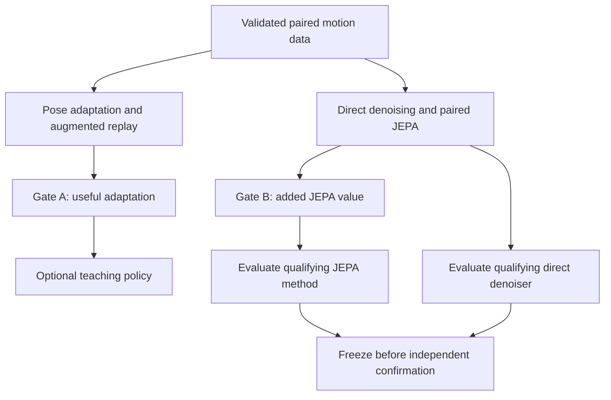

# A stronger synthetic-training and S-JEPA study

**Evidence and literature reviewed: 18 September 2026.** This is a prospective research plan, not a report of new experiments. The completed pilot remains unchanged. The companion [implementation prompt](../04_improvement_instr.md) turns this plan into instructions for a coding agent.

## 1. Recommendation

Make the central question: **Can paired synthetic motion teach a pose system to remove errors caused by imaging conditions without erasing the timing and left/right differences that make gait informative?** Test whether a temporal skeleton JEPA provides an advantage over ordinary, equally capable temporal denoising.

This is a stronger and more directly testable direction than making the existing lesson selector larger. It connects synthetic generation to a real measurement problem in ambient intelligence: a distant camera, blur, or partial obstruction can make someone appear to move differently. A useful system must improve the observation while retaining genuine variation in the person's movement. Simulated unusual movement is a controlled test signal, not a diagnosis.

Pursue three directions in this order:

1. **Establish a trustworthy synthetic-data baseline.** Pair rendering interventions on the same motion; add augmented-real-image controls; verify that adaptation actually changes each model usefully.
2. **Run a bounded temporal S-JEPA experiment.** Compare paired synthetic latent prediction with direct coordinate denoising and ordinary masked JEPA, using common observable endpoints and equal information access.
3. **Revisit personalized lesson selection only if a new development panel shows meaningful opportunity.** Keep scene-based selection as the anchor. Dense video features and complementary training probes are optional extensions, not prerequisites.

The likely scientific value is a carefully established tradeoff between correcting observation errors and preserving motion. The JEPA architecture alone is not a novelty claim. Success, transfer, and publication significance remain hypotheses.

For the **first implementation milestone**, build the paired track dataset, strong direct denoisers, one ordinary JEPA control, and one paired JEPA candidate. The broader pose-adaptation calibration is a supporting branch, not a prerequisite for training the temporal model. Personalized teaching, video transfer, and clinical generation stay outside this milestone.

The immediate coding deliverable is tested modules and runnable fixture/source notebooks with concrete empirical commands. Human annotation and protected confirmation are later evidence milestones, not results that a coding agent can manufacture.

## 2. What the completed pilot establishes

The independent artifact audit reconciled **2,304 source outcome rows, 6,912 selector decision rows, and 144 selector configurations**. There were no duplicate source measurement keys, and every saved decision error exactly matched its source outcome. These counts describe repeated measurements and comparisons, not independent experiments.

Evidence: [source trials](../../notebook_runs/synthetic-training/run-02-v1/source/), [validation predictions](../../notebook_runs/synthetic-training/run-03-v1/selectors/validation_predictions.csv), [validation summary](../../notebook_runs/synthetic-training/run-03-v1/selectors/validation_summary.csv), and [frozen selection](../../notebook_runs/synthetic-training/run-03-v1/selectors/selection.json).

At the frozen 75-update setting, lower mean visible-joint error is better:

| Method | Validation error | Interpretation |
| --- | ---: | --- |
| Replay after the common probe | 0.02732054 | Matched branch baseline |
| Full-budget replay from the original checkpoint | 0.02731485 | Accounts for probe updates |
| Pooled synthetic training | 0.02703672 | Simple useful comparator |
| Full response-based selector | 0.02702648 | Approximately 1.08% better than matched replay |
| Matched source-progress selector | 0.02702576 | Essentially the same result without target-response features |
| Fixed `front` lesson | 0.02689916 | Beats the full selector |
| Scene/domain selector | **0.02678074** | Strongest of these achieved policies |
| Best shared lesson per condition, retrospective oracle | 0.02667588 | Uses outcomes unavailable at deployment |
| Best lesson per student and condition, retrospective oracle | 0.02666506 | Also uses unavailable outcomes |

The full selector changes only **3 of 48** decisions relative to its matched source-progress control. One change helps, one harms, and one changes the lesson without changing the error. Two RTMPose-S conditions account for about 74.3% of its net disadvantage against scene selection. Its 75-update choices harm matched replay in 10 cases, improve it in 37, and tie in one; it never chooses the replay fallback.

The extra oracle benefit from choosing separately for each student, beyond the best shared action for each condition, is only **0.0406% relative error reduction** on these validation models. Shared scene choices account for approximately **95.4% of the oracle opportunity beyond fixed `front`**. This is a diagnostic of this small model panel and lesson library, not a universal upper bound on personalization or on improving the current imperfect scene selector.

The correct conclusion is that the pipeline runs and synthetic adaptation sometimes helps, while this implementation does not establish useful response-based personalization. It does not test, much less disprove, trained S-JEPA gait representations.

## 3. Implementation weaknesses that the next study must address

| Finding | Why it matters | Required change |
| --- | --- | --- |
| No JEPA is trained in synthetic training. The V-JEPA predictor is deleted and frozen encoder tokens are pooled. | The method is pose-head adaptation with a video descriptor, not predictive gait representation learning. | Name it accurately; introduce an explicit trainable temporal branch if making an S-JEPA claim. |
| Prediction and response summaries aggregate across frames; context features are also averaged across clips. | Response summaries discard temporal order. Pooled contextual video tokens may still encode order, but their temporal location is lost. | Preserve joint-by-time observations, confidence, validity, and timestamps. Test temporal information with matched controls. |
| Rendering recipes use different AMASS motion files. | A lesson comparison changes both motion content and imaging conditions. | Use matched motion windows for nuisance interventions; study motion coverage separately. |
| The library samples eligible AMASS motions, not a verified walking subset. | Existing examples include nonwalking poses. | Create an audited locomotion manifest; separate turns/transitions and broader poses into declared stress tests. |
| Two reference motions per role are rendered under 24 recurring scene conditions. | Thousands of rows cannot replace independent people, motions, or adaptation runs. | Expand independent units before expanding render counts; hold out nuisance combinations. |
| Only pose heads are adapted, with 20 common-probe and 50/150 subsequent synthetic draws. | HRNet's small response may reflect recipe, capacity, labels, or output discretization. Its cause is not established. | Inspect gradients, parameter changes, prediction displacement, and learning curves before choosing an adaptation recipe. |
| Scene features include explicit coarse viewpoint metadata. | A visual representation comparison is unfair if only one arm gets useful metadata. | Report metadata-assisted and image-derived scene baselines separately; equalize metadata access. |
| Augmented COCO replay is absent. | Benefits may come from ordinary image degradation training rather than synthetic motion coverage. | Add replay with matched blur, downsampling, and obstruction. |
| Scores measure 12 visible 2D body landmarks. | They do not establish gait timing, clinical severity, real hidden-joint recovery, or 3D accuracy. | Retain this endpoint and add separately supported temporal measurements. |
| Cache filenames do not fully identify model/configuration/content. | Changed inputs could reuse old features; this is a risk, not a demonstrated pilot defect. | Bind caches to hashes of manifests, weights, preprocessing, schema, and code. |

Code evidence: [context extraction](../../src/gavd6_sjepa/research_directions/synthetic_training/context_features.py), [measurement summaries](../../src/gavd6_sjepa/research_directions/synthetic_training/measurements.py), [data construction](../../src/gavd6_sjepa/research_directions/synthetic_training/data.py), [training branches](../../src/gavd6_sjepa/research_directions/synthetic_training/trials.py), [pose adaptation](../../src/gavd6_sjepa/research_directions/synthetic_training/estimators.py), [selectors](../../src/gavd6_sjepa/research_directions/synthetic_training/selectors.py), and [rendering](../../src/gavd6_sjepa/research_directions/synthetic_training/rendering.py).

Preserve the existing strengths: source/target separation, cloned weights and buffers, fresh branch optimizers, full-budget replay, missing-prediction penalties, strict checkpoint checks, and frozen artifact protection. Preserve the working HAIC environment, including **Torch 2.6.0+cu124**.

## 4. Earlier repository evidence changes the research bet

Three earlier findings argue against simply adding a larger video teacher:

- The historical skeleton-JEPA experiment's movement readouts were worse after training than at initialization: initialized R² was approximately 0.223 versus 0.101–0.114 for trained teachers. This is recorded evidence for that experiment, not a general collapse diagnosis. See the [temporal-gait evidence ledger](../../docs/studies/temporal-gait/development/evidence-ledger.md).
- The repaired future-feature experiment found a skeleton increment of −0.000242 R² beyond its RGB/nuisance control, with an interval spanning zero. It reached a valid development STOP after numerical repairs. See [gate results](../../docs/studies/future-feature-prediction/gate/results.md).
- The skeleton-accessible teacher follow-up also found no supported primary temporal lead. Its estimate was +0.001994 R², with a 95% interval of approximately [−0.00667, 0.01261]. See [accessibility results](../../docs/studies/future-feature-prediction/accessibility/results.md).

The newer [temporal-gait implementation](../../src/gavd6_sjepa/research_directions/temporal_gait/) has useful time, validity, training, and provenance contracts. Its [result status](../../docs/studies/temporal-gait/results/README.md) is software verification, not completed real GAVD experiments. Reuse that implementation selectively; do not relabel its fixtures as empirical success or another real-data failure.

The proposed change is therefore substantive: **use paired synthetic observation interventions and a common coordinate/motion endpoint**, rather than predicting an unvalidated teacher feature and interpreting low latent loss as useful gait information.

## 5. Literature: what is established and what remains open

These sources were checked on 18 September 2026. “Public” here describes verified links, not a guarantee of compatibility with this environment. Recheck revisions, licenses, and artifact access when implementation begins.

| Primary source | Relevant finding | Consequence for this study |
| --- | --- | --- |
| [S-JEPA, ECCV 2024](https://www.ecva.net/papers/eccv_2024/papers_ECCV/papers/04755.pdf); [author project](https://sjepa.github.io/) | Masked skeleton latent prediction, EMA targets, motion-aware masking; action-recognition evaluation. | Skeleton JEPA and motion-aware masking already exist. Author weights were not verified; use the local adaptation with an accurate name. |
| [V-JEPA, 2024](https://arxiv.org/abs/2404.08471); [official code](https://github.com/facebookresearch/jepa) | Video representations learned through masked feature prediction. | Frozen features are a baseline; recognition accuracy does not establish joint-level gait information. |
| [V-JEPA 2, 2025](https://arxiv.org/abs/2506.09985); [official releases](https://github.com/facebookresearch/vjepa2) | Video pretraining and separate action-conditioned robotic learning. | Predicting robot outcomes does not establish prediction of pose-estimator optimizer updates. |
| [V-JEPA 2.1, arXiv 2603.14482](https://arxiv.org/abs/2603.14482), March 2026, revised June 2026 | Dense visible/masked-token and intermediate-layer supervision. Official releases include an 80M-parameter ViT-B/16 at 384 pixels. | A frozen local-token probe is feasible to investigate; foundation-model training is unnecessary. Venue publication was not verified. |
| [LeJEPA, arXiv 2511.08544](https://arxiv.org/abs/2511.08544); [official code](https://github.com/galilai-group/lejepa) | Predictive learning with SIGReg distributional regularization, without an EMA teacher in this formulation. | Optional anti-collapse comparator, not a reason to rewrite the first experiment. Its theory does not guarantee preservation of gait measurements. |
| [seq-JEPA, NeurIPS 2025](https://proceedings.neurips.cc/paper_files/paper/2025/file/2f63d2963526bdd9ff1b8bcc2dc9905a-Paper-Conference.pdf) | Transformation-conditioned sequences and invariant/equivariant representations. | Generic factorization of nuisance and dynamics is already studied. Specify the observable preservation problem. |
| [GaitForeMer, MICCAI 2022](https://arxiv.org/abs/2207.00106); [official code/weights](https://github.com/markendo/GaitForeMer) | Forecasting pretraining for gait-impairment estimation. Pretraining combines forecasting with NTU action labels. | A relevant forecasting precedent, not wholly label-free pretraining. Its clinical data are private; GAVD labels are not MDS-UPDRS scores. |
| [FSGait, ACCV 2024](https://openaccess.thecvf.com/content/ACCV2024/html/Duan_FSGait_Fine_Grained_Self-Supervised_Gait_Abnormality_Detection_ACCV_2024_paper.html) | Normal-gait reconstruction and temporal prediction for abnormality detection. | Reconstruction/prediction residuals as anomaly scores are not novel and can confuse observation corruption with unusual motion. Code/weights were not verified. |
| [Skeleton SSL scaling, AAAI 2026](https://ojs.aaai.org/index.php/AAAI/article/view/37340); [full text](https://arxiv.org/html/2504.07598v1) | Identity recognition improves with data and compute; 2.7M pretraining sequences are private. | Do not plan around downloading that corpus or inherit pace/smoothing/mirroring invariances for functional gait measurement. |
| [GaitPT, IEEE FG 2024](https://arxiv.org/abs/2308.10623); [official repository](https://github.com/AndyCatruna/GaitPT) | Hierarchical temporal/spatial skeleton modeling for identity. | Useful architectural precedent; identity and motion-quality objectives differ. Review the restrictive repository license before reuse. |
| [H-MoRe, IEEE/CVF CVPR 2025](https://openaccess.thecvf.com/content/CVPR2025/papers/Huang_H-MoRe_Learning_Human-centric_Motion_Representation_for_Action_Analysis_CVPR_2025_paper.pdf) | Human-focused motion representations using flow. | Motivates person-region features rather than scene pooling. The advertised repository returned 404 during this review; it is not an assured runnable baseline. |
| [SM-SGE, ACM Multimedia 2021](https://arxiv.org/abs/2107.01903); [official implementation](https://github.com/Kali-Hac/SM-SGE) | Self-supervised multiscale skeleton encoding for person re-identification. | Skeleton graph SSL is established; a small reconstruction/graph baseline deserves consideration before a large transformer. |

An emerging close precedent is **GaitJEPA**, listed on the [authors' university publication page](https://www.uco.es/investiga/grupos/ava/publicaciones/) and announced by its authors for IJCB 2026. Its silhouette-based gait-identification scope overlaps any claim of “first JEPA for gait.” An IEEE proceedings record and usable released artifacts were not verified here; treat it as a related-work lead with qualified status.

Synthetic teaching also has close predecessors: [Task2Sim, CVPR 2022](https://arxiv.org/abs/2112.00054) adapts simulation choices; [PoseExaminer, CVPR 2023](https://openaccess.thecvf.com/content/CVPR2023/html/Liu_PoseExaminer_Automated_Testing_of_Out-of-Distribution_Robustness_in_Human_Pose_and_CVPR_2023_paper.html) searches pose failures; [PoseSyn, ICCV 2025](https://arxiv.org/abs/2503.13025) uses challenging poses and synthetic motion; [MM-ACL, CoLLAs 2023](https://proceedings.mlr.press/v232/xu23a.html) models cross-task learning progress. Adaptive simulation or response-conditioned teaching alone is not a new contribution.

The **closest restoration precedents** must also shape the baseline. [SmoothNet, ECCV 2022](https://www.ecva.net/papers/eccv_2022/papers_ECCV/papers/136650615.pdf), with [official code](https://github.com/cure-lab/SmoothNet), already refines estimated tracks and evaluates transfer across estimators. [PoseBERT](https://arxiv.org/abs/2208.10211), with [official code/models](https://github.com/naver/posebert), learns masked motion-capture representations for refinement, completion, and forecasting in 3D. [DeciWatch, ECCV 2022](https://arxiv.org/abs/2203.08713) combines sampling, denoising, and recovery. Include a trained SmoothNet-style temporal MLP as a practical competitor; label a body-12/schema adaptation accurately. A new 2D pipeline cannot claim generic temporal correction, MoCap pretraining, or estimator transfer as its invention.

For clinical and generative extensions, [CARE-PD, NeurIPS 2025 Datasets & Benchmarks](https://proceedings.neurips.cc/paper_files/paper/2025/file/bedc73979a95be7727af0c9a99c675ce-Paper-Datasets_and_Benchmarks_Track.pdf) provides [released derived motion and benchmark code](https://github.com/TaatiTeam/CARE-PD), not a verified raw clinical RGB release. Its meshes have mixed acquisition origins and are not all motion-capture truth. [GAITGen, WACV 2026](https://openaccess.thecvf.com/content/WACV2026/html/Adeli_GAITGen_Disentangled_Motion-Pathology_Impaired_Gait_Generative_Model_--_Bringing_Motion_WACV_2026_paper.html) already studies motion/pathology generation and preservation; its [repository](https://github.com/TaatiTeam/GAITGen) still lists pretrained checkpoints and preprocessed representations as unreleased. Its PD-GaM cohort overlaps CARE-PD. [DiffuseGaitNet, IEEE TNSRE 2025](https://doi.org/10.1109/TNSRE.2025.3589074) studies clinical-feature-conditioned diffusion augmentation; [code is public](https://github.com/arshakRz/DiffuseGaitNet), but its original clinical data are private. These are novelty boundaries and optional external resources, not mandatory new dependencies.

Recent preprints further limit broad mechanism claims. [Factorized Latent Dynamics for Video JEPA, May 2026](https://arxiv.org/abs/2605.17165) already tests factorization, motion objectives, and masking changes, with task-dependent results. [When Graph-JEPA Learns the Wrong Thing, August 2026](https://arxiv.org/abs/2608.20516) illustrates that healthy global embedding diagnostics can miss loss of task-relevant distinctions. The latter concerns document graphs, not gait; it is a methodological analogy, not a diagnosis of this pilot. Neither paper's peer-reviewed venue status was verified here.

**Novelty to test:** a reproducible account of when synthetic training improves pose observation while preserving independently measured temporal variation, including whether paired JEPA shifts that tradeoff beyond direct denoising under unseen observation conditions and pose extractors. A positive result needs a useful effect and independent real confirmation; adding components or obtaining a lower latent loss is insufficient.

## 6. Define one task before adding components

Keep three claims distinct:

| Claim | Necessary evidence | Insufficient evidence |
| --- | --- | --- |
| Better pose observation | Independent visible-landmark accuracy, failure rate, clean-condition retention | Lower training loss or smoother output |
| Better preservation of gait motion | Timed trajectories or event references; amplitude, phase, laterality, and timing error | Four isolated annotated frames; normal/abnormal labels |
| Clinical value | Appropriate clinical labels, population, and validation protocol | Synthetic perturbations, GAVD presentation labels, or predicted biomechanics |

The first new temporal experiment is **offline sequence restoration**. It may use the entire declared observed clip, including later frames within it. Every restoration baseline gets the same frames. Do not call this causal forecasting or zero-latency monitoring. A causal sliding-window variant is a later deployment comparison with measured latency.

The primary skeleton schema is the existing **12 common COCO body joints in 2D**, with an explicit ordered mapping. Do not silently pad it to the temporal-gait module's hardcoded 33 joints. Use configurable joint embeddings and validated adapters. Retain full AMASS/SMPL-H motion for provenance and separate synthetic diagnostics; do not pretend 2D estimated tracks are measured 3D motion.

The initial scope is top-down pose estimation with supplied person boxes. Record where those boxes come from. The current synthetic renderer supplies exact foreground boxes, which are privileged compared with real detector boxes. Use a common documented box source for every arm, add a development box-perturbation test, and evaluate detector/tracker boxes before claiming an automatic ambient pipeline. Real annotation boxes used only to normalize evaluation error must not silently become inference inputs.

## 7. Data and configuration changes

### 7.1 Paired intervention library

For each base window, record person ID, motion file/hash, time interval, original sampling rate, body shape, camera, appearance, background, light, render seed, and joint schema. Render the same timestamps under a clean condition and declared interventions. Never allocate a different motion to each corruption recipe.

Use three separate experimental axes:

- **Imaging:** person pixel height, blur, lower-body obstruction, and background. Within a matched pair, change only the declared variable. Changing person size through camera distance changes projection; preserve this in metadata and use the correct same-view projected target.
- **View:** front, oblique, side, with known projection and matched motion. View changes are not identity transformations of 2D coordinates. Train same-view clean targets first; test cross-view robustness separately.
- **Motion coverage:** genuinely different locomotion windows or collections under matched imaging distributions. This asks whether motion diversity adds beyond ordinary image augmentation.

Record achieved pixel height, visible-joint fraction, clipping, depth, and camera adjustment. Full-trajectory framing can change the requested scale. Reject invalid renders explicitly; never silently replace difficult motions with easier ones. Review a fixed random contact sheet and a predeclared set of difficult examples.

Create walking eligibility from metadata plus a documented motion/video audit. Do not use outcome scores to select motions. Distinct windows from one recording remain grouped; overlapping windows and all their rendering variants stay in the same split.

### 7.2 Pilot size and splits

Start with **24 training people and 8 development people, up to four eligible nonoverlapping windows each**, subject to actual availability and existing reservations. At one initial view, 32 people × up to 4 windows × 6 variants gives at most **768 clips**. Six includes the clean view: provisionally clean, small person, blur, obstruction, small+blur, and small+obstruction. Reserve small+obstruction from model fitting as a development nuisance-combination test; rendered examples need not all become training examples. Additional viewpoints multiply this count and belong in a later measured expansion. This is a feasibility pilot, not a powered final sample. If walking eligibility cannot support these counts, report the shortage and revise the scope before training.

After measured throughput and variance justify expansion, consider 64 training people and 16 development people, with at least one unseen nuisance combination and one held motion collection where the existing identity partitions permit it. These are planning sizes, not claims about currently available untouched data.

Use the existing AMASS identity/exposure registry. Previously examined validation models and conditions are development evidence now. A new seed or directory does not make them independent confirmation. Reserve genuinely unexamined people/motions and a held pose extractor before selecting a method; if prior exposure prevents this, report a development-only study instead of manufacturing a new test split.

For GAVD, split by recording and duplicate/alias groups. Recording separation is not verified participant separation. Preserve existing protected recordings and disclose pretrained-model exposure uncertainty.

### 7.3 Time and observation contract

Starting window: **64 samples on a 25 Hz physical-time grid**, spanning 2.52 seconds between the first and last sample. Preserve source timestamps; do not stretch arbitrary motion durations into 64 frames. Select longer windows only through a declared development change when gait-cycle coverage is inadequate.

Each example supplies `xy[T,12,2]`, `confidence[T,12]`, `observed[T,12]`, `timestamps[T]`, and normalization metadata. Store clean synthetic projections and their validity separately as privileged training/evaluation targets. Missing coordinates must not become plausible zeros, and interpolation must not manufacture valid measurements.

Input observation masks come from the pose extractor and declared preprocessing, **not exact renderer visibility or known prediction error**. Target/evaluation visibility is a separate field. Calibrate estimator confidence on source data only. The clean teacher may use synthetic target validity during training; the deployed encoder/readout cannot receive it.

The existing `MMPoseEstimator.predict` returns coordinates and currently discards keypoint scores. Add a separate structured track-extraction API that retains scores, missing detections, schema, and box provenance without breaking its historical coordinate-only return. Define confidence thresholds on training/development data and report their coverage. Unsupported scores must be flagged, not synthesized from true joint errors.

Before large training, apply a **landmark-convention gate**: inspect a fixed sample of rendered overlays, compare anatomical definitions, and measure systematic per-joint offsets against an independently annotated source/development sample. A clean-render estimator disagreement alone cannot identify which convention is correct. Projected SMPL-H joint centers can pull an already accurate COCO prediction toward a different anatomical location. If this bias is material relative to the proposed gain, resolve the mapping or restrict the claimed endpoint before proceeding. Without independent annotations, label results as synthetic-proxy accuracy and keep the real anatomical-accuracy claim pending.

Use one declared input-derived scale and reference frame for both input and output. Keep the transformation needed to recover image coordinates. A stable clip scale is appropriate for this offline task; do not use clean target boxes to normalize noisy inputs. Do not normalize every frame independently in a way that removes meaningful motion. Confidence, support, and timing channels appear once and identically in comparisons that claim to isolate coordinate motion.

## 8. Experiment A: make synthetic pose adaptation convincing

Before testing a learned selector, measure these branches from the same original checkpoint:

1. No adaptation.
2. COCO replay with the same total number of updates.
3. COCO replay with matched downsampling, blur, and obstruction.
4. Fixed paired synthetic lesson plus replay.
5. Pooled paired synthetic lessons plus replay.
6. A scene-conditioned policy, with separate metadata-assisted and image-derived versions.

All branches share allowed source data, scheduling opportunities, evaluation motions, and seed identities. Account for probes in total update, inference, and GPU cost. Avoid giving a synthetic branch more labeled real images or a more favorable model-selection budget. Compare equal-cost results and report learning curves; equal updates do not ensure equal compute across architectures.

Run a small development calibration, not a full Cartesian sweep: head-only versus head plus final backbone stage, synthetic fractions 0.1 versus 0.25, and cumulative update checkpoints such as 75, 250, and 750. Start with two released estimators and one seed; retain only scientifically viable recipes before repeating the finalists with three seeds. Treat learning rates such as head 1e-4/backbone 1e-5 as starting values to validate, not established cross-architecture defaults.

Audit loss conventions, trainable parameter counts, nonzero finite gradients, buffer behavior, parameter deltas, and prediction displacement. Keep a disjoint COCO retention panel. Diagnose HRNet flatness before interpreting it as an architectural property.

**Gate A:** rendered data must add a meaningful benefit over augmented-real replay or demonstrate a distinct motion-coverage benefit, without unacceptable retention loss. If it does not, retain the stronger augmentation baseline and report the limitation. Do not require a selector to rescue ineffective lessons.

Gate A controls continued pose-estimator adaptation and teaching-policy work. **Gate B is independent:** a temporal restorer may learn from paired tracks even when synthetic image finetuning does not improve the image estimator. Both branches require valid paired data; neither requires the other's positive result.

## 9. Experiment B: a real, bounded temporal S-JEPA comparison

### 9.1 Model and objective

Reuse the small [temporal-gait encoder and training machinery](../../src/gavd6_sjepa/research_directions/temporal_gait/models.py), adapting its schema and separating restoration from its past-only forecasting API. Start with width 96, four encoder layers, two predictor layers, four attention heads, and four-frame patches. These are a local S-JEPA-inspired configuration, not a reproduction of the published training regime.

The online encoder receives imperfect tracks extracted from a rendered clip. It retains a temporal token grid. The EMA target encoder receives the clean projected motion for **the same view and times**. A predictor estimates masked target tokens. Stop gradients through target embeddings. In schematic form:

\[
L_{\mathrm{paired}} = \operatorname{mean}_{(t,j)\in M}
\ell\left(p_\theta(f_\theta(x_{\mathrm{observed}})),
\operatorname{sg}[f_{\bar\theta}(x_{\mathrm{clean}})]\right)_{t,j}.
\]

Use the existing centered/sharpened target-distribution loss as the initial shared recipe; keep the same target normalization and anti-collapse mechanism in ordinary and paired JEPA. The clean teacher uses synthetic projected coordinates, so describe the method as **self-supervised representation learning with privileged synthetic motion supervision**, not supervision-free learning. A feature-regression or LeJEPA objective is a separately named later ablation, not an unreported substitution.

This candidate combines established components. Do not name it an official “S-JEPA v2” or claim a new architecture without demonstrating its distinction from existing temporal refinement. The primary hypothesis concerns a controlled empirical advantage.

Begin with masking 50% of eligible tokens in joint/time blocks. Log realized masks over all tokens and over valid tokens. Calibrate EMA behavior against actual optimizer steps; record online and teacher results, effective teacher lag, target entropy, feature variance/rank, and initialized checkpoints. None of these training diagnostics replaces downstream accuracy.

Use a small, explicit starting configuration rather than a search over every choice:

| Setting | Development starting point |
| --- | --- |
| Optimizer | AdamW, learning rate 3e-4, weight decay 0.01, gradient-norm cap 1.0 |
| Batch and precision | 64 sequences if measured memory permits; optional H100 bfloat16 forwards with losses/normalization diagnostics in float32 |
| Schedule | 5% warmup then cosine decay; 200-update smoke test, at most 2,000 updates for the first screening run |
| EMA | Start at 0.99 and increase toward 0.999; log the actual schedule and remaining initialization contribution |
| Centered loss | Initial student/teacher temperatures 0.1/0.06, matching the local objective's conventions |
| Repeats | One seed to verify feasibility; three fixed seeds for the selected decisive comparison |

These are proposed engineering defaults, not optimized settings. Apply equal tuning opportunities to coordinate baselines, inspect loss/gradient behavior, and freeze the final recipe before confirmation. Extending training requires a measured learning-curve justification and room within the compute cap. Synthetic-pair counts and repeated windows must remain visible even when many optimizer steps reuse them.

After pretraining, freeze the encoder and train a small, identical temporal coordinate readout on training-only synthetic pairs. It predicts residual corrections in the declared coordinate system. Score restored coordinates against common reference observations. The readout cannot see clean targets, intervention identity, or renderer metadata at deployment. Do not pool all tokens before a temporally resolved output.

Define three independent masks: **input observed**, **artificially hidden for pretraining**, and **target valid for loss/scoring**. The current temporal encoder hides only observed tokens and zeros invalid token outputs; reusing that behavior unchanged would exclude genuinely missing inputs. The restoration adapter needs a fixed time×joint query grid, with learned queries where an input coordinate is absent. A missing input can have a valid synthetic target. The readout must emit an absolute coordinate for that case; a residual added to NaN is not a prediction. Queries may know time and joint identity, but never target validity. Add a missing-input/valid-target fixture that verifies predictions and losses without target-mask leakage.

### 9.2 Essential comparisons

| Arm | What it resolves |
| --- | --- |
| Unchanged pose tracks; simple interpolation/filtering with documented latency | Whether correction helps beyond cheap processing; filters can distort motion |
| SmoothNet-style temporal MLP trained on the same pairs | Strong inexpensive prior-art competitor for estimator-independent refinement |
| Raw-coordinate temporal model trained directly on noisy-to-clean coordinates | Whether ordinary supervised denoising already solves the task |
| Coordinate-reconstruction pretraining, then the same frozen-encoder readout | Separates latent prediction from pretraining/data exposure |
| Initialized frozen encoder with the same trained readout | Separates learned representation from architecture and decoder capacity |
| Ordinary masked JEPA on observed tracks, same readout | Establishes the value of paired clean targets |
| Paired clean-target JEPA, same readout | Candidate method |
| Paired JEPA with shuffled pairing, and a non-temporal input control | Tests whether alignment and ordered motion matter |

For the primary latent-versus-coordinate pretraining comparison, match encoder/readout architecture, source examples, synthetic labels available to the coordinate arm, training steps, seeds, and downstream readout selection. Report parameter and GPU-hour differences caused by the latent predictor. Also give the direct end-to-end denoiser a comparable **total** training budget, including JEPA pretraining and readout fitting; it is the practical competitor even if its optimization is different.

These are two explicit contrasts: **matched data/steps** for objective attribution, with measured unequal costs where unavoidable; and **equal total compute** for practical utility, allowing different update counts. Do not claim that steps, exposure, and GPU cost are all exactly equal when the teacher/predictor adds work. Fix candidate/tuning budgets in both comparisons.

The readout has the same architecture and training-label access in each arm, but its weights are fitted separately for each representation. The ordinary noisy-target JEPA arm tests the effect of privileged clean targets; it does not by itself isolate the benefit of latent rather than coordinate prediction.

Do not interpret an unnatural shuffle's failure as biological causality. The static comparator predicts each output frame from that frame's coordinates, with the same support/confidence/time channels as its temporal comparator; remove neighboring coordinate history, not those auxiliary channels. Define shuffled-pair donors within training groups and matched nuisance strata, avoiding accidental same-window pairs. Shuffled pairing changes pretraining only; score every model on correctly paired, natural validation examples. Keep any test-time perturbation analysis separate from primary held-out performance.

**Gate B:** paired JEPA must improve a common observable endpoint beyond competent direct denoising and initialized/readout controls, while preserving supported motion variation. If it only helps a linear probe but not a modest nonlinear readout, claim improved accessibility under that probe. If direct denoising wins, close JEPA-specific expansion; a separately labeled real-transfer evaluation of the qualifying denoiser can still proceed.

### 9.3 Prevent an oversmoothing result from becoming a gait claim

Measure the same reference observables from predictions and truth: signed left/right ankle separation, body-relative joint displacement over declared time intervals, motion amplitude, and timing of reproducible events where reference support exists. Use fixed definitions and units. Compare estimated **differences between paired motion conditions** with the true differences, rather than rewarding output similarity alone.

Include natural slower/faster or asymmetric movement examples when available. Controlled time changes and local trajectory perturbations can calibrate sensitivity, but they are not evidence of pathology or realistic disease generation. A calibrated timing change must change its target accordingly; it must never become a positive invariance pair.

Do not make time warping, time reversal, bilateral exchange, or trajectory smoothing default positive augmentations. Anatomical left/right must survive reflection through a correct label transformation. Report performance on genuine motion variation separately from camera corruptions.

If the candidate is useful but demonstrably loses a measured quantity, a later, bounded ablation may anchor that quantity with an explicit auxiliary coordinate/displacement loss. Give the same auxiliary supervision to the direct denoiser. This is a new hybrid experiment, not evidence that the original JEPA objective preserved it.

## 10. Experiments C and D are conditional extensions

**C: temporal response for personalized teaching.** First recompute the shared-scene and student-specific oracle gap on new development motions, multiple seeds, and genuinely distinct extractors/training histories. Set a useful-effect threshold before inspecting this new panel. If the gap is still negligible, close this branch.

If there is headroom, predict lesson gain with a regularized scene-plus-state model and then add temporal response. Compare the added response with a matched source-progress model using identical features otherwise, parameter capacity, regularization opportunities, and data. Estimate residual gains using source-held fitting or a joint regularized model; do not regress on a flexible baseline's own in-sample residuals. Preserve an exact scene-only/no-addition option and a no-adaptation action. Log neighbors, blockwise distances, predictions, margins, and actual harms. An uncertainty threshold is a calibrated policy to test, not a guarantee under distribution shift.

Only then test two or three complementary disposable probes. Reset each to the same checkpoint and compare with equal **total** probe/update/inference cost. Predicting an optimizer intervention is not established merely by borrowing the term “world model.”

**D: frozen video evidence.** Test the existing V-JEPA descriptor against person-region temporal tokens from a verified compatible V-JEPA 2.1 checkpoint, starting with the released small backbone. Fit small heads on cached training features; compare against raw skeleton histories and equal-information scene features. Account for representation size and inference cost. Require an observable advantage before adding video distillation or joint training. Do not upgrade Torch to make an optional model load.

C and D have independent gates. A lack of personalization opportunity does not establish that image evidence is useless, and a video-feature gain does not rescue a failed response-personalization claim.

## 11. Evaluation, uncertainty, and independent confirmation

Name one primary metric per experiment. For pose adaptation and the first real restoration comparison, use person/recording-balanced **visible body-12 landmark error normalized by an independently specified box diagonal**, with missing-prediction penalties. Report lower-limb and worst-condition results separately. Synthetic all-joint/occluded-joint error is a separate endpoint with synthetic truth; real hidden joints remain unscored without an independent reference.

Motion preservation is a required companion assessment: displacement error at fixed elapsed times, amplitude attenuation, phase/timing error on supported trajectories, and clean-condition retention. Lower acceleration or jitter alone is never success. Report a distortion-versus-preservation plot with coordinate accuracy on one axis and error in a predeclared motion observable on the other; plots must come from saved predictions.

Use paired uncertainty with AMASS person as the outer sampling unit and motions nested inside people. For GAVD use recording/verified-person groups according to actual metadata. Average or explicitly model render repetitions; do not bootstrap thousands of correlated frames as independent trials. Report training-seed variability separately. With only a few model families, report each family and leave-family-out transfer descriptively rather than claiming a well-estimated population of architectures.

Provisional planning targets are a 2% relative visible-joint improvement over the strongest practical comparator, a 5% relative reduction in a predeclared temporal error, and less than 1% relative clean-condition degradation. These are **proposed meaningful-effect targets**, not established clinical margins or a rule tuned to pass the pilot. Use fresh development variance and annotation repeatability to finalize feasible margins/sample sizes before confirmation. Do not lower a margin after seeing confirmation outcomes. Report absolute effects and intervals even when a gate fails.

The real panel needs independent visible-landmark annotations across time. Start by timing annotation of four development clips, then size the panel. A possible planning budget is 40 independent recordings split into development and protected confirmation, with a densely annotated subset for temporal endpoints and double annotation of at least 20% to measure repeatability. This is not a power calculation. Existing four-frame-per-clip annotations cannot establish temporal preservation; missing annotations must remain a declared blocker for that claim. Coding agents can build annotation tools and manifests but cannot invent human references.

Optional clinical external validation may use an accessible, appropriately licensed gait dataset after verifying its schema, labels, and independence. It is not a prerequisite for the first source/real-pose result, and must not substitute identity recognition for functional gait measurement.

## 12. Proposed new notebook suite and code ownership

Create an additive namespace such as `notebooks/synthetic_training_v2/`, `src/gavd6_sjepa/research_directions/synthetic_training_v2/`, and `outputs/synthetic-training-v2/<run-id>/`. These names are proposed; check existing layout registration before implementation. Preserve all existing executed notebooks and results. Use a notebook builder, shared modules, and configuration files rather than duplicating algorithms in cells.

| Notebook | Required output and decision |
| --- | --- |
| `00_evidence_and_protocol.ipynb` | Reproduce pilot table; exposure inventory; hypotheses, controls, endpoint and cost plan; no training |
| `01_paired_motion_data.ipynb` | Walking/split manifests, pairing checks, projection/schema/time audits, contact sheets, achieved-size table |
| `02_adaptation_baselines.ipynb` | Supporting branch: gradient/parameter audits, augmented-COCO controls, learning curves, retention; Gate A, independent of notebook 04 |
| `03_temporal_information.ipynb` | Raw-history versus static/support controls; normalization and perturbation calibration; available motion signal |
| `04_paired_skeleton_jepa.ipynb` | Matched denoising/reconstruction/initialized/JEPA fits, checkpoints, per-example predictions; Gate B |
| `05_transfer_and_preservation.ipynb` | Held-motion/nuisance/extractor development results; distortion-preservation frontier; real-development annotation audit |
| `06_optional_teaching_and_video.ipynb` | Oracle opportunity first; explicit skipped outputs when C/D gates fail |
| `07_freeze_and_confirm.ipynb` | Lock configuration and manifests; separate explicit confirmation execution; independent uncertainty and harm report |
| `08_research_report.ipynb` | Artifact-derived tables, failed as well as passed gates, claim-to-evidence matrix, costs and limitations |

Each notebook should explain the question, inputs, computation, expected artifacts, checks, and interpretation in plain language. Show success, failure, and unsupported cases without success-biased selection. Separate software fixtures, real development runs, and protected confirmation in every output label.

## 13. Feasibility and HAIC execution

Use the validated study interpreter and **Torch 2.6.0+cu124, Torchvision 0.21.0+cu124**, retaining the compatible MMCV build. Do not run a root-project synchronization that reinstalls the old Torch stack. Resolve dependencies through the working study environment. Check CUDA arithmetic and Torchvision/MMCV operators on an allocated H100 before new model work.

Use Slurm batch jobs on HAIC; the configured `hai` partition rejected interactive allocation. Separate manifest/annotation preparation from body-model execution, rendering, feature extraction, training, and reporting. Body-model execution and EGL rendering may require GPUs; inspect the actual path before choosing resources. Consult the existing synthetic-training runbook for account/environment settings rather than hardcoding guessed paths or CUDA toolkit installations. A local CPU check does not verify the HAIC GPU runtime.

A suggested initial ceiling is **48 H100 GPU-hours for a development tranche**, not an estimate of required runtime or authorization to spend it: up to 4 for compatibility/throughput, 8 for optional adaptation calibration, 24 for core data/temporal comparisons, and 12 reserved for transfer/repeats. Count all GPU body-model/rendering work, pose extraction, and feature caching within this cap. Exclude optional video/probe expansion unless capacity remains and its gate passes. Measure a small batch first and recompute this allocation; reduce optional branches before compromising the core comparison or independent evaluation. Track CPU-only preparation, storage, annotation effort, and queue time separately. Do not promise completion in a week without these measurements.

Proceed in milestones: artifact audit → paired-data smoke test → one-estimator/one-seed method screen → matched finalists with three seeds → independent real development → frozen confirmation. A failed scientific gate produces a complete negative report and stops that branch; it does not trigger automatic hyperparameter expansion.

## 14. Evidence, adversarial review, and completion criteria

The current review used independent code, quantitative-result, and literature agents. The implementation should repeat independent review at protocol, code, and claim stages using Codex, with Claude Code coordinating bounded subagents when it is the executing host. Reviewers must inspect the artifacts themselves and identify the strongest simpler explanation, not merely approve a summary.

Draft review led to concrete revisions: adding the closest temporal-refinement baselines, separating the two research gates, specifying confidence and person-box provenance, requiring a landmark-convention audit, supporting missing inputs without target-mask leakage, distinguishing step matching from compute matching, and counting GPU rendering in the resource ceiling. These reviews improve the protocol; they do not validate a new model or guarantee novelty.

Before training, reviewers should challenge split exposure, paired interventions, information/compute equality, readout supervision, metric support, objective identifiability, closest prior art, and annotation feasibility. After implementation, fault-test target isolation, time/schema errors, stale caches, missing observations, resume identity, and unsupported stages. After results, recompute primary tables from saved predictions and challenge every novelty and clinical claim.

The immediate implementation is complete when the new notebooks and modules execute on explicit fixtures, the old pilot is unchanged, HAIC commands are concrete and environment-safe, all source-stage artifacts and gates are defined, and empirical stages are accurately marked run/pending/blocked. A stronger research claim additionally requires the corresponding measured benefit and independent confirmation. A correct negative result remains a valid completion of the experiment.

The most important changes are paired motions, stronger ordinary baselines, real temporal references, and an actual controlled JEPA comparison. More selectors, larger encoders, or more notebook outputs cannot substitute for them.
