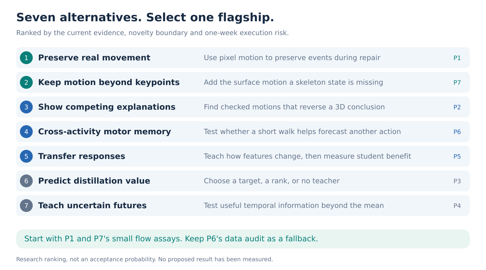

# Seven research proposals for S-JEPA

**Decision portfolio, reviewed 12 to 13 September 2026. One week. Eight H100s.**

> **Current selection:** [Motion preservation](../../docs/studies/motion-preservation/README.md) is the active study. The six other proposals are deferred alternatives. The selection and resource-allocation discussion below is retained decision context; use the active study guide for execution.

My strongest recommendation is **[Preserve real movement while repairing tracking failures](../../docs/studies/motion-preservation/protocol/proposal.md)**. Test whether pretrained motion models delete genuine, unusual movement while cleaning tracking errors. Then build a small adapter that preserves the real movement at the same level of noise removal. The first useful result should be reachable within 48 hours, before substantial training.

The conceptual shift is to judge a world model by the evidence it preserves and the decisions it improves. Better latent reconstruction, more plausible animation and another gait classification score are insufficient. The current repository makes this shift urgent: its expanded experiment still stopped, and mismatched skeletons produced a larger increment than aligned skeletons.

## Ranked proposals

Scores are judgments on a five-point scale, not probabilities. **Novelty** evaluates the proposed distinction after checking close papers; **significance** evaluates the scientific payoff if the full claim works; **feasibility** evaluates a decision-ready result within one week; **wow** evaluates how clearly the result could demonstrate a surprising capability. Rank also reflects evidence and failure risk, so it is not a sum of these scores.

| Rank | Proposal | Novelty | Significance | Feasibility | Wow | First decisive result |
| ---: | --- | ---: | ---: | ---: | ---: | --- |
| **1** | [P1. Preserve real movement](../../docs/studies/motion-preservation/protocol/proposal.md) | 4 | 5 | 4 | 5 | More true event retained at matched tracking-error removal, beyond optical flow and simple gates. |
| **2** | [P7. Keep motion beyond keypoints](proposals/motion-beyond-keypoints.md) | 3 | 5 | 3 | 5 | Preserve visible surface transport omitted by joint positions, then improve forecasts with a few flow tokens. |
| **3** | [P2. Show a competing motion](proposals/motion-ambiguity.md) | 4 | 4 | 4 | 5 | Valid conclusion-changing alternatives found more efficiently than articulated geometry alone. |
| **4** | [P6. Cross-activity motor memory](proposals/cross-activity-prediction.md) | 3 | 4 | 3 | 4 | A person's walk improves actual forecasts of another activity beyond body shape and a matched donor. |
| **5** | [P5. Transfer movement responses](proposals/response-distillation.md) | 3 | 4 | 4 | 4 | Teacher responses survive appearance changes and improve real student forecasts beyond existing KD. |
| **6** | [P3. Predict distillation value](proposals/distillation-value.md) | 2 | 4 | 5 | 3 | Target/rank/no-teacher decisions outperform existing criteria and short student pilots. |
| **7** | [P4. Teach uncertain futures](proposals/probabilistic-forecasting.md) | 3 | 4 | 3 | 4 | Future-distribution scores improve while an interval supports equivalence of mean errors. |

These are not seven equally strong ICLR bets. The search found direct prior work against several attractive ideas. P7 has high conceptual upside but a demanding real-motion gate, and I would not currently sell P3 as a new general theory of distillation. Their documents retain precise tests and useful outcomes, rather than claiming novelty that the literature does not support.

**Optical flow materially changed the selection.** P1 now explicitly tests flow-supported motion against proposed pose repairs. The new P7 replaces the old constraint-conflict reserve. It asks whether forcing flow to agree with a skeleton removes visible movement that the skeleton cannot represent. Read the [optical-flow analysis](references/optical-flow.md) for the distinction, public checkpoints and new literature checks.

## Why P1 is the best use of the week

It has an observable failure, independent reference motion, a cheap first experiment and a meaningful corrective capability. The decisive comparison is difficult to dismiss: **retain a real movement while removing a tracking error of similar size, with both allowed to occur together**. The model gets the same video evidence as strong optical-flow and tracker baselines. It cannot win by copying every coordinate or by smoothing everything.

A compelling flagship claim would be:

> Pretrained motion priors can improve average reconstruction while deleting supported movement events. A small evidence-conditioned adapter improves the preservation-versus-repair tradeoff across unseen events and prior families.

That is a hypothesis. The repository's existing representation failures motivate it but do not establish it. A generic reconstruction-hallucination finding is already known; the new result must be the controlled temporal tradeoff and a nontrivial improvement over the best measurement checks.

P7 has the strongest new optical-flow opportunity: keep visible motion between landmarks instead of assuming that correct joint positions describe all relevant movement. Exact matched-input constructions establish the limitation; actual future-motion improvement on untouched recordings must establish its practical importance. Flow and skeleton fusion alone is already known.

P2 has another clear demonstration: two checked motions match the observation but reverse a precise movement conclusion. It is attractive because it turns uncertainty into something inspectable. Its risk is equally clear: if geometry already finds the alternatives, the pretrained model has little to contribute.

P6 is the independent fallback. Its data-only pilot asks a different question, so it protects against the two leading hypotheses failing. Count eligible people and activities first. Prior style-personalization work is close, and a recognizable animation is not success; the method must forecast what a held-out person actually does next.

## How to commit resources

Run P1's initial erasure assay and P7's input-ambiguity and flow assay on days 1 and 2, sharing renders and frozen extraction. These are two small pilots, not two full training programs. If P1 passes its strong baseline gate, select it. Otherwise select P7 only if estimated flow and natural-motion forecasting both pass. Audit P6's person/activity availability on CPU as a fallback. If the leading gates fail, P2's geometry-only assay and P6's raw-support assay determine the next choice. Keep the corrected P3 panel as a cheap continuation only if the HAIC artifacts are readily usable.

Do not reinterpret a failed gate as a reason for larger adapters. If every cheap explanation survives, the honest outcome of the week is a revised research direction. A one-week window can produce compelling evidence; it cannot make ICLR quality likely by assumption.

## How this improves the earlier proposals

The previous strongest future-innovation proposal required a 0.05 skeleton increment over RGB. The latest increment was approximately 0.000357, and the frozen outcome remains `development_stop`. This portfolio neither revives that gate nor calls its small positive interval a useful transfer result.

The literature review also changed the recommendation. Student-attainable targets, criteria for distillation benefit, gait health foundation models, motion personalization, physical scoring and constrained motion generation all have close precedents. Each proposal names those precedents and states the additional result needed to earn a contribution. The [access and literature ledger](references/literature.md) records the requested inspiration papers, recent collisions and usable checkpoints.

Whole-body AMASS is the main controlled motion resource. GAVD is the real-world video resource and the primary classification dataset whenever classification is used. Neither GAVD binary classification nor inferred clinical forces is a headline. Exact model schemas, participant/source grouping and prefix-only preprocessing are specified in the [evidence and execution contract](references/execution-contract.md).

## Reading order and review record

Read P1, P7 and the common execution contract first. Read P2 and P6 if deciding between alternatives. P3 and P5 are the closest methodological continuations of the existing code. P4 is the distributional hypothesis the mean-based study did not test. The earlier [constraint-conflict draft](references/reviews/rejected-constraint-conflicts.md) remains archived with its review, outside the final seven.

The portfolio includes **15 original SVG diagrams**, two per proposal plus the ranking map. They are conceptual diagrams, not invented experimental curves. The [adversarial review and revision record](references/review.md) records scientific and visual corrections. The [figure generator](render_figures.py) and [layout checks](figures/layout-checks.json) make the visual assets reproducible.

Research memos preserve the reasoning behind the selection: [local evidence](references/reviews/evidence-audit.md), [gait models and data](references/reviews/gait-models.md), [world models](references/reviews/world-models.md), and [portfolio critique](references/reviews/portfolio-critique.md). These are working evidence records; the seven proposal files and this decision page are the final recommendations.
