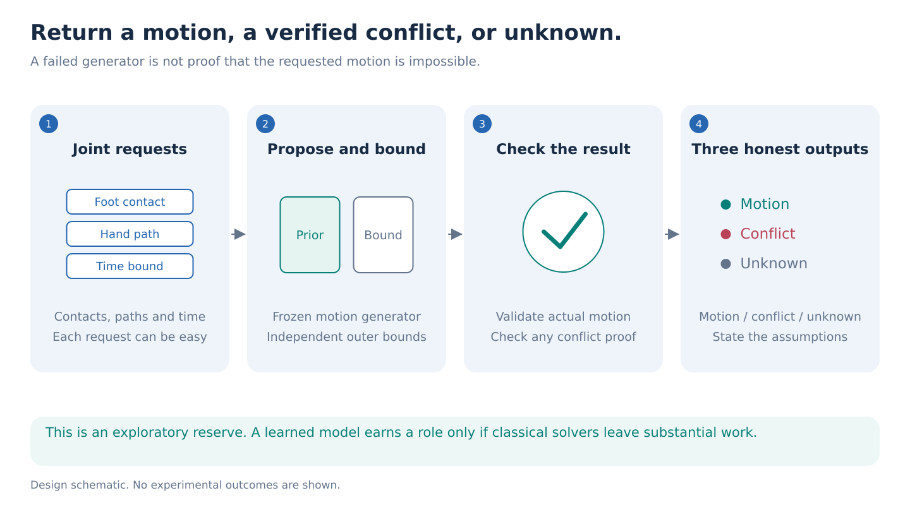
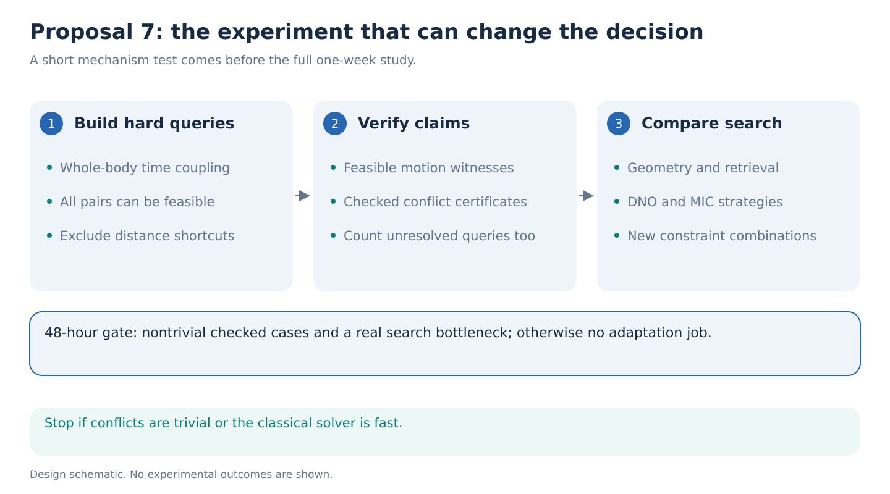

> Archived candidate, replaced by the optical-flow proposal in the final seven.

# 07. A motion model that can explain conflicting requests

**Decision: exploratory, lowest priority. No training job is recommended yet.** A generator that returns a verified motion, a verified conflict, or an honest unknown would be useful. However, explaining incompatible constraints is established in planning, and an ICLR-level advantage over classical solvers is currently unproven.

**The one-week question.** Can a small S-JEPA-guided search around a frozen motion generator resolve difficult combinations of movement requests faster than retrieval and constraint solvers, while supporting every claimed conflict with a checkable proof? The first 48 hours must establish a nontrivial setting before any model adaptation.

## The idea in plain language

Imagine asking a motion generator to keep one foot planted during an interval, pass a hand through a sequence of target regions, keep the trunk within a corridor, and finish before a deadline. Each request might be possible alone. Together, they may disagree. A generator often returns an attractive compromise that quietly violates one request.

The proposed interface instead has three answers:

1. **A motion that passes all declared checks.** The output includes its measured constraint residuals.
2. **A conflicting subset of requests.** The output identifies the incompatible rules and the assumptions used to establish the conflict.
3. **Unknown within the search budget.** This includes unsuccessful sampling and cases where available mathematics cannot decide feasibility.

For example: “The planted-foot interval, hand-target sequence and allowed joint-speed bounds conflict.” That statement is permitted only when a separate checker verifies it. “The model tried 100 times” is never a proof.

## What is being claimed, and what is not

The task concerns **explicit kinematic requirements under a declared mathematical model**. Kinematics describes where body parts can move. It does not infer muscle strength, pain, clinical capacity or force from video. Bounds on joint speed or acceleration are experiment inputs, not discovered physiological limits. A conflict under those bounds does not mean that a real person cannot perform the movement.

This differs from merely scoring an unusual gait. The latest repo evidence shows that plausible latent-prediction improvements can have weak movement significance. Here, every useful result must change a concrete search decision and survive an independent check. It also differs from constructive ambiguity: that task finds two compatible explanations of one observation, while this task asks whether several requested constraints can coexist.

## A restricted setting where conflict claims can be justified

Use whole-body AMASS sequences to define body dimensions, initial poses and witnessed feasible examples. Construct timing, waypoint-region and contact requirements from those sequences, then create new combinations. Keep original motions and people disjoint across training and evaluation. Match clip duration, spatial extent and constraint count, then test nuisance-only predictors; matching alone does not rule out shortcuts. GAVD supplies no ground-truth human reachability labels and is not needed for the first result.

Begin with positions at a fixed set of time points. Declare waypoint boxes, fixed contact intervals, velocity and acceleration upper bounds, bone-length tolerances and joint limits. Construct a convex **outer relaxation**, a larger set containing every motion satisfying these original requirements. Retain upper distance bounds between connected joints while dropping lower distance bounds and nonconvex joint limits. This makes the easier problem more permissive; its solutions need not be valid full-body motions.

If this larger set is empty, the original set is also empty. For the first prototype, use outward-rounded linear bounds and independently check a linear infeasibility certificate with exact rational arithmetic. Such a certificate combines the declared inequalities into a contradiction. A solver status or small floating-point residual is insufficient. Failed certificate checks become unknown. A feasible relaxation is also unknown until an actual motion passes all original checks. Proofs apply only to the declared discrete-time problem; continuous-time claims require separate verified interpolation bounds.

Find a small conflicting subset by removing rules and checking again. Claim inclusion-minimality only if deleting each remaining rule restores feasibility, demonstrated by an actual motion satisfying the original remaining requirements. A feasible outer relaxation cannot establish this. Otherwise report a verified conflicting subset without claiming minimality.

## Where S-JEPA and a pretrained generator enter

Freeze a public motion generator. A small S-JEPA head receives the observed history plus a structured list of requested constraints and proposes which motion or constraint subset to examine first. Its score affects search order only. The independent checker decides acceptance or rejection.

FrankenMotion offers a concrete, publicly released whole-body diffusion checkpoint, `frankenmotion.ckpt`, with configuration and normalizers. It is a reasonable optional proposal engine, not a proof engine. Its official code supports body-part motion composition; it needs compatible AMASS SMPL-H assets. The reviewed model card and preprocessing README disagree on feature dimensionality, so verify the actual checkpoint/configuration contract before using it. [Paper](https://arxiv.org/abs/2601.10909), [code](https://github.com/Coral79/FrankenMotion-Code), [public checkpoint tree](https://huggingface.co/Coral79/frankenmotion/tree/main).

No language model is needed to invent explanations. Render a short sentence from verified constraint identifiers and residuals. This keeps the explanation as reliable as the checker.

## The decisive experiment

Freeze a query-generating process before comparing search methods and retain every sampled query in the evaluation denominator. Separately maintain a reference bank of witnessed feasible cases and certified conflicts for checker validation. Unknown is a method's status at a time budget, not a third ground-truth label. Never build the headline test only from cases that the proposed method has already solved.

Include conflicts coupling several body parts over time. Claim that every pair of requests is feasible only when an actual motion witnesses each pair under the original requirements. Exclude single-distance impossibilities from the headline. Evaluate on new combinations and held-out motion collections; report coverage over the fixed query sample, including all unresolved cases.

Compare against a geometry-only solver with classical conflict extraction; simple constraint-slack and graph-ordering heuristics; randomized search; nearest-motion retrieval; direct coordinate optimization; frozen generation with rejection; DNO; retrieval-guided DNO; and MIC-style control. Compare the learned head with raw-coordinate and random-encoder heads of equal capacity. All receive the same checker, observation, query, resource limits and end-to-end wall-clock allowance. Report CPU time, GPU time and adaptation cost separately. Where released code cannot be verified, reproduce the stated strategy on the common generator and label that adaptation explicitly.

The primary metric is certified resolution coverage at fixed wall-clock budgets: the fraction returning a checked motion or checked conflict. Also report time to resolution, unresolved coverage and constraint residuals. The common checker should reject unsupported confident answers for every method, so its correctness is not a learned-model improvement. Use the witnessed feasible bank to measure successful recovery separately from conflict detection. Evaluate conflict subsets for checked inconsistency and reduction in query size, not agreement with a language-model judge.

An interesting result would halve end-to-end search time at comparable resolution coverage on queries that geometry and retrieval cannot settle cheaply. Generator and solver call counts are secondary because their costs differ. Include the number of queries needed to recover the adaptation cost. These are proposed practical targets, not expected outcomes.

## Prior work and why this is risky

DNO already optimizes diffusion noise to satisfy motion objectives. Retrieval-guided DNO handles difficult combinations and parses related constraints. MIC supports heterogeneous, including nondifferentiable, constraints. Conflict-driven task-and-motion planning already extracts incompatible nonlinear-constraint subsets. The novelty cannot be “constraints,” “explanations,” or “training-free generation.” [DNO](https://arxiv.org/abs/2312.11994), [retrieval-guided DNO](https://arxiv.org/abs/2605.08054), [MIC](https://arxiv.org/abs/2607.01990), [conflict-driven planning](https://arxiv.org/abs/2211.15275).

The possible advance is a useful division of labor between a learned human-motion prior and a verifier for declared kinematic queries, with substantial search gains on new combinations. At present that is a research bet. If classical solvers resolve the restricted benchmark immediately, adding S-JEPA has no compelling purpose.

## Forty-eight-hour stop test and optional week budget

The initial phase uses CPU constraint construction and at most **16 H100-hours** for frozen-model smoke tests. By hour 48, require a fixed pilot of at least 100 nontrivial queries, a functioning independently checked certificate path, witnessed feasible controls, correct handling of unresolved cases, and evidence that geometry and retrieval leave substantial work for the prior. If certificates are unavailable, all conflicts are trivial, or classical solvers already resolve the task cheaply, stop. Do not replace the proof requirement with a learned probability of infeasibility.

Only after that gate, permit a total cap of **160 H100-hours**: 16 for the pilot, 64 for bounded generator comparisons, 32 for small-head adaptation, and 48 for held-out queries and independent seeds. Measure throughput first because DNO can require hundreds of optimization iterations. Days three and four test search ordering; days five through seven test new constraint combinations and audit every claimed conflict. This remains a longer-term exploratory direction unless the first gate produces an unusually clear advantage.
