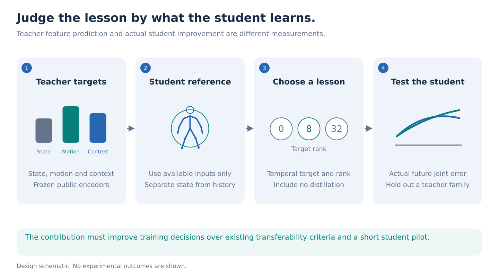
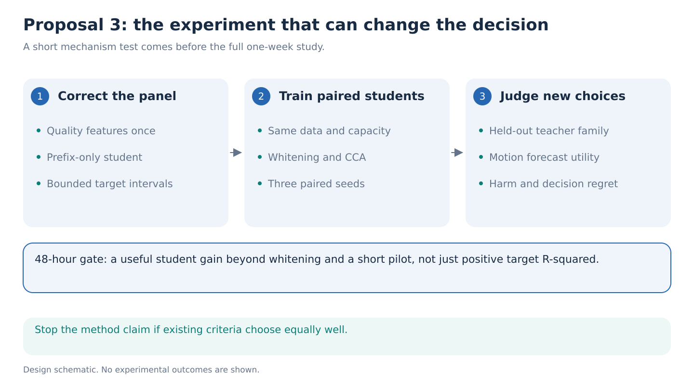

# 3. Predict whether a teacher will help before training the student

**Decision:** The closest continuation of the current experiments, with excellent infrastructure fit but substantial novelty risk. Run its corrected measurement cheaply. Do not make another positive teacher-feature score the paper's result.

**One-week question.** Can a decision rule choose a temporal target, its dimension, or no distillation, and predict actual improvements in a small skeleton student's future-motion error on a teacher family excluded from selection?

## The idea in ordinary language

A large video model can describe clothes, background, posture and motion. A small skeleton model cannot learn all of that from joint coordinates. Even the learnable parts compete for its limited capacity. A teacher can therefore be easy to imitate without being useful for the motion question we care about.

Think of selecting lessons for a student. We should measure what the student gains after taking the lesson, not how accurately it repeats the teacher's vocabulary. The proposed output is a concrete training decision: **use these temporal directions, at this dimension, or keep the original student**.

## What the current result says

The expanded experiment reached RGB predictive R² of 0.662830. Adding real skeleton history improved it by only 0.0003571, while mismatched skeletons added 0.0006029. The frozen decision was `development_stop`. Those results concern prediction after an RGB reference. They do not measure the value of teacher supervision for a skeleton-only student. See the [original analysis](../../../../../notebook_runs/future-innovation/haic-run-02/ANALYSIS.md) and [ICLR strategy](../../../../../docs/studies/future-feature-prediction/scaling/research-strategy.md).

The next measurement must condition on information available to the student. Removing everything explained by RGB could remove the very shared motion information the student needs.

## What would be new

Predicting distillation benefit is already a research topic. [Information-Theoretic Criteria for Knowledge Distillation](https://arxiv.org/abs/2510.13182) proposes a cross-modal complementarity criterion and tests actual students. [Modality Focusing Hypothesis](https://zihuixue.github.io/MFH/index.html) studies shared modality information. [ATLAS](https://papers.ssrn.com/sol3/papers.cfm?abstract_id=7346910) explicitly proposes student-attainable targets; only its indexed primary abstract was accessible in this review. [LogME](https://proceedings.mlr.press/v139/you21b.html) is an established inexpensive transferability score.

Consequently, neither an accessibility score nor a residual loss is a novel headline. The narrower opportunity is a **decision study of temporal supervision**, with a fixed student, realistic positive and negative transfer cases, and a rule evaluated on a held-out teacher family. A compelling result would show that the rule saves training and avoids harmful temporal lessons better than existing criteria and a short student pilot. If it cannot do that, use the best existing method.

## Method and exact information boundary

Start with publicly released [V-JEPA 2](https://github.com/facebookresearch/vjepa2) and a verified public motion prior from the [access ledger](../../../references/papers-and-checkpoints.md). Use the repository S-JEPA implementation as the small student. The official S-JEPA page does not provide a verified author checkpoint; report local weights as local weights.

Let `H` be the observed skeleton history. Let `C` contain pose quality, timing, current pose and velocity, all computed from `H`. Compare a predictor using `C` with one using all of `H`, on the same frozen teacher targets. Confidence and validity enter the common reference once. The proposed comparison varies coordinates, not duplicate confidence columns.

For each training-only target direction, estimate the reduction in held-out squared error obtained by using history. Select a small set of stable directions. The candidate target is the teacher feature minus its cross-fitted prediction from `C`, projected into those directions. This is standard residual prediction and reduced-rank selection, not a new spectral theorem.

History increment is a candidate decision heuristic, not a necessary condition for useful distillation. Teacher supervision can help a finite student learn a current-state function even when longer history contains no additional population information. The student experiments must be allowed to expose that failure of the heuristic.

Use ranks `{0, 8, 32}` and distillation weights `{0, one fixed nonzero weight}` in the first pilot. Rank zero means no added teacher objective. Rebuild every reference, scaler and projection inside the relevant training fold. A selected rank-zero option does not itself guarantee harmlessness under noisy selection.

Teacher features must come from explicitly bounded target intervals. The old target at nominal frames 38 to 39 was contextualized by the full 64-frame clip. Audit later-frame sensitivity before assigning a physical forecast horizon. Training may observe future targets, but the deployed student may observe only the prefix.

## Experiments that determine whether this earns a paper

Use held-participant AMASS motion for independent coordinate outcomes. Start with 1 second of history and forecast 0.5 and 1 second of future whole-body movement. Preserve root-relative joint positions and a separate root trajectory. Evaluate Core11 and 22-body-joint students at equal parameter count. Do not let a wider whole-body model win through capacity alone.

The first panel has at most 12 configurations in total, including comparison methods, teacher choices and target settings, with three paired student seeds. Include full-feature distillation, whitening, residual reduced-rank regression or partial CCA, the proposed selection rule, and no distillation. Freeze the exact matrix before running it; do not multiply another method grid into this cap. All methods receive the same examples and outcome labels. A short student pilot gets a matched selection-compute budget that includes rendering, teacher inference, reference fitting, projections and pilot training. Correlated ranks and layers are not independent teacher replications.

Primary outcomes are actual future joint error, selected-policy regret relative to the best measured candidate, and harmful-transfer frequency. The measured winner is a noisy finite-panel benchmark, not the true oracle; report its selection uncertainty or evaluate its choice on independent groups. The policy never sees final student outcomes before choosing. A secondary GAVD test uses a locked source-grouped multiclass presentation readout. GAVD cannot validate precise 3D forecasts or participant-level generalization.

**First 48 hours.** Reconstruct the corrected student-input panel from verified HAIC caches, then train a small paired student panel. Continue only if at least one nonzero target improves future-motion error by a prespecified practically useful amount, provisionally 5%, and the ordering is not already explained by whitening or a short training pilot. This threshold is a planning choice, not an observed effect or a significance threshold.

**Days 3 to 5.** Freeze the complete rule, including shrinkage and all selection thresholds, using one teacher family. Test it on the other family and a held AMASS source dataset, separating participants where identity metadata permits. This supplies one directional family-transfer test. It cannot establish general teacher-selection reliability from many correlated layers or ranks.

**Days 6 to 7.** Repeat the selected comparison with three actual optimization seeds and locked motion groups. Add the GAVD secondary audit only if the independent motion outcome passes. Stop expanding the target grid after looking at final groups.

Budget at most **500 H100 GPU-hours**, including feature extraction and paired student runs. This is an unmeasured cap. Use two GPUs for caching and up to six for independent small runs; measure throughput before scheduling all configurations.

## The strong claim and the failure that would change our mind

The attainable claim is that a fixed decision rule improves temporal-supervision choices in one held-family test. Broader reliability needs more independent teacher and task families. A tiny positive target R² does not support either claim. If residual CCA, the complementarity criterion or a short student pilot makes equally good decisions after all selection costs are counted, the novel method claim fails. The corrected panel remains useful infrastructure, but this direction should then move out of the flagship slot.

This proposal directly extends the ICLR strategy. It does not pretend that an earlier idea becomes new because its name changed.
