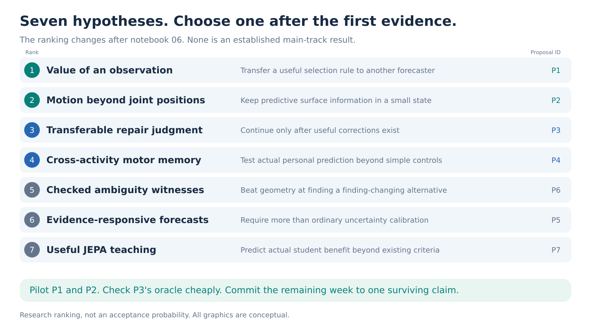

# Seven JEPA proposals after the motion-preservation diagnostics

**Continued-search recommendation:** [teach the estimator from unlabeled video](proposals/synthetic-training-selection.md), using a short training probe to select useful AMASS lessons for an unfamiliar pretrained model. Read the [independent review](reviews/synthetic-teaching.md) for the evidence, novelty limits and remaining risks. This is a new research recommendation, with no new measured result or numerical success estimate. The earlier P2 probability estimate remains withdrawn.

The seven-proposal portfolio below is retained as the earlier decision record.

**Original portfolio recommendation: pilot P1, the value of an additional observation, alongside P2, motion information beyond joint positions. Choose one flagship after 48 hours. Keep P3, transferable repair judgment, conditional on finding genuinely useful corrections.**

This portfolio is reviewed as of 14 September 2026. It replaces the earlier recommendation to make MoMask-based preservation the unconditional first choice. It retains useful questions from the previous portfolio, changes their methods and decision gates, adds observation-value transfer as the leading new direction, and removes response distillation as a standalone bet after close prior-work comparisons.

There is currently no evidence-based reason to call any option a high-probability ICLR acceptance. The goal is to maximize the chance of discovering one substantial result quickly, rather than inflate seven uncertain hypotheses. Frozen public models and standard small heads make experiments feasible. They do not guarantee novel effects. No proposed gain below has been measured.

**The ranking reflects novelty, impact, practical risk and the current evidence.** Scores run from 1 to 5 and are judgments, not probabilities. Novelty refers to the specific full claim after comparison with prior work; significance is conditional on that claim succeeding; feasibility concerns a decision-ready experiment in one week; wow factor concerns how clearly a strong result could demonstrate the capability. Rank is not the sum of the scores.

| Rank | Proposal and concrete question | Novelty | Significance | Feasibility | Wow | Main risk |
| ---: | --- | ---: | ---: | ---: | ---: | --- |
| **1** | [P1. Learn which observation improves the answer](proposals/observation-selection.md). Can an evidence-selection rule transfer to another forecaster? | 3 | 5 | 4 | 5 | Active acquisition is established; transfer beyond one decoder must be substantial. |
| **2** | [P2. Keep motion that joint positions leave out](proposals/motion-beyond-joints.md). Can eight surface-motion tokens recover useful missing predictive state? | 3 | 5 | 3 | 4 | Direct flow fusion or simple compression may solve the problem. |
| **3** | [P3. Learn when a correction helps](proposals/repair-verification.md). Can local repair judgment transfer across correction generators? | 4 | 5 | 2 | 5 | A useful correction family has not yet been demonstrated. |
| **4** | [P4. Use a walk to forecast another activity](proposals/cross-activity-prediction.md). Does personal motion memory add value beyond shape and current history? | 3 | 4 | 3 | 4 | Only about eleven test people appear potentially eligible; simple personalization may suffice. |
| **5** | [P6. Show a checked alternative](proposals/motion-ambiguity.md). Can JEPA help find conclusion-changing motion explanations that geometry misses? | 3 | 4 | 3 | 4 | A strong geometric search may leave little headroom. |
| **6** | [P5. Make uncertainty respond correctly to evidence](proposals/uncertainty-and-evidence.md). Can an observation-response correction survive new overlap and visibility conditions? | 2 | 4 | 3 | 3 | Fusion, redundancy weighting and calibration already cover much of the method. |
| **7** | [P7. Teach only useful targets](proposals/distillation-target-selection.md). Can a cheap criterion predict actual student benefit and avoid harmful distillation? | 2 | 4 | 4 | 3 | Existing transfer criteria, whitening or short student pilots may be equally good. |

P5 and P6 have different identifiers and ranks intentionally. The seven files are alternatives, not a recommendation to train seven systems. The lower-ranked proposals have potentially significant outcomes but stronger novelty or evidence risks. A technically successful small experiment can still fail its standalone-paper test.

**Why P1 is the leading new bet.** Its action is to inspect another permitted part of an existing video, so it avoids the unresolved requirement that a generative reconstruction already be a good repair. The learning target is directly observable during training: how much the additional measurement changes actual future error. A frozen encoder supplies context; a small head learns value. There is no dependency on a human action-conditioned checkpoint or photorealistic simulation.

The scientifically ambitious result would be:

> A model trained to value observations for one forecaster retains that judgment for a different forecaster and a new observation failure, improving real motion forecasts at a fixed measurement budget.

This would support a reusable capability rather than one model's crop preference. Active feature acquisition already optimizes useful information; that principle is not new. Also, new weighted combinations of outputs that were already trained are only a compositional check. The hard transfer experiment, strong acquisition baselines, actual forecast benefit and real-video corroboration are essential. If simple uncertainty or flow rules match the result, stop the JEPA claim.

**Why P2 runs beside it.** A joint-position state can omit visible segment or surface movement. That physical possibility does not depend on MoMask. Its cheapest experiment asks whether estimated surface transport improves forecasts on untouched natural AMASS motion beyond a strong full-body joint history. The later method must preserve the benefit in a small state more effectively than ordinary fusion or compression. An exact constructed twist is a useful explanation, but cannot supply the paper's main result.

The two pilots share rendered prefixes, frozen video features and flow extraction, but test different claims. P1 learns what to inspect. P2 studies what the predictive state must retain after inspection. If the same experiment supplies both gains, present them as one integrated paper rather than two independent confirmations.

**What changed after the real results.** Notebook 06 showed large clean-motion reconstruction damage and a narrow MoMask mixture oracle, not an otherwise effective denoiser that selectively removes unusual movement. P3 now learns signed correction benefit across candidate families and begins with a realistic action-space test. Its original 25% repair and 15-point retention target remains on the original controlled condition. Natural-motion confirmation uses reference error, not an invented event counterfactual.

The older feature-prediction experiment's tiny skeleton increment is also not discarded. It motivates testing actual physical outcomes and strong simple-state controls. It does not imply that video cannot improve a skeleton model, that a skeleton student cannot benefit from a teacher, or that dense local features are useless. The [evidence page](references/portfolio-evidence.md) separates those questions and records all numerical claims.

**The first 48 hours should produce a decision, not seven training runs.**

| Time | Work | Required artifact or decision |
| --- | --- | --- |
| First 4–6 hours | Resolve actual eligible files, timing and prefix handling. Reuse frozen V-JEPA and SEA-RAFT. Count motion/subject coverage on CPU. | One small aligned natural-motion batch and measured extraction throughput. No new backbone training. |
| Day 1 | P1 evaluates all allowed queries offline on a small cohort; P2 compares joints, exact transport and estimated transport. Read P3's cached curves and compute the actual-block oracle if inexpensive. | Headroom tables, natural-motion errors and per-person effects. Exact transport and best-query oracles stay labeled privileged. |
| Day 2 | P1 compares acquisition rules and a small selector. P2 compares direct flow and simple compression. | A practical gain over the strongest relevant baseline, or a documented stop. |
| End of day 2 | Choose one surviving claim using development groups only. | A locked primary endpoint, comparison set and transfer condition. If neither pilot passes, use P3 only if its correction gate passed; otherwise reconsider scope. |
| Days 3–5 | Run the selected method, strong baselines, three seeds and one meaningful held-condition test. Annotate the selected GAVD panel if required. | A result with real physical utility and an explicit novelty comparison. |
| Days 6–7 | Evaluate protected groups once, inspect failures, report uncertainty and write figures. | An evidence-based paper decision, including limitations. |

Start with up to four H100s on P1, three on P2 and one available for a bounded diagnostic. CPU rendering and data movement may be the bottleneck. Cap each leading pilot at 100 GPU-hours, then allocate resources by measured throughput. A selected study's own total allowance is typically 200–350 GPU-hours, including its pilot. Allow roughly **550–650 GPU-hours for the whole selected workflow**, including the other pilot and contingency, rather than filling all 1,344 theoretical hours. The per-proposal budgets are alternatives and must not be added as seven commitments.

**The data are sufficient for bounded motion studies, with important limits.** AMASS contributes 8,854 eligible motions from 189 audited people, including full-body parameters. GAVD contributes 1,874 sequences from 348 recordings, without verified person IDs or measured 3D truth. Use the protected existing splits. Do not invent clinical severity, forces, pathology labels for AMASS, or participant identities for GAVD.

Quantitative real-video corroboration needs a small visible-2D reference panel that is not yet annotated. The shared plan uses 240 frames from 60 clips, budgets 8–12 human hours, and holds its recording IDs out of head training. If that work is unavailable, say that GAVD is qualitative and reduce the real-world claim. Rendered captured motion and in-the-wild RGB answer different validation questions.

**What would justify a main-track paper?** The selected result should establish a reusable capability, improve an independent physical endpoint by a meaningful amount, survive cheap competing explanations, and transfer beyond the setting used to select it. The same pixels, history and compute must be available to strong baselines. A good-looking animation, a synthetic classifier, a small latent-score improvement or a model that always declines cannot satisfy that standard.

The 5%, 10%, 15-point and related thresholds are prospective planning decisions, not estimates of significance or acceptance probability. The independent group counts may still be too small to resolve a real effect. A first positive result in two days is feasible; a strong main-track claim in one week remains conditional on its size and generality.

**Reading and review.** Start with P1 and P2, then the [common evidence and execution limits](references/portfolio-evidence.md). The [reference ledger](references/portfolio-literature.md) covers all eight requested inspiration papers, current competing work and public model access. Read [P3](proposals/repair-verification.md) before restarting the motion-preservation training path.

There are **15 original SVG schematics**, two per proposal plus this ranking map, stored in [figures](figures/). They depict methods and tests, not fabricated results. The [review record](reviews/portfolio-revisions.md) records the concrete scientific and visual changes made after adversarial review. The previous portfolio remains at [the September 12–13 archive](archive/2026-09-13/README.md) for historical comparison.
