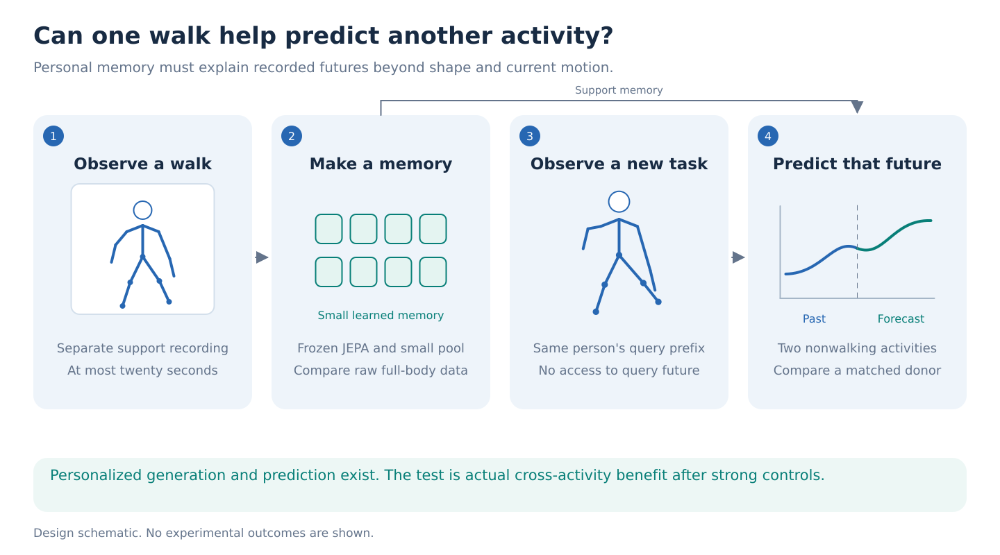
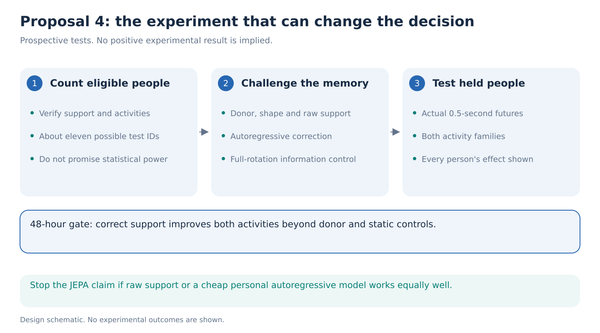

# 04. Can a short walk improve forecasts of another activity?

> **Decision stage: September 14 seven-proposal comparison.** Priority statements describe [that comparison](../proposal-comparison.md). See the [research agenda](../README.md) for the latest recommendation.

**Decision: a scientifically distinct reserve with a serious sample-size risk.** First test whether personal walking information adds anything beyond a strong motion-history baseline. The proposed contribution is transferable predictive information, not a personalized animation or a health score.

**Hypothesis.** Within seven days, a memory extracted from at most twenty seconds of walking will reduce error when predicting the same person's recorded movement in two other activities. The gain must survive controls for body proportions, current movement, recording source, and a matched donor's walk.

Imagine two people reaching forward with similar recent hand positions and velocities. Earlier walks show different arm and trunk coordination. Does the correct walk help predict the next half-second of reaching? That is measurable. These data cannot establish strength, diagnosis, or treatment response.

**Step 1: establish that the required people and activities exist.** AMASS provides verified person groupings and natural whole-body motion. However, the current metadata screen suggests only about **eleven likely eligible test people**, before checking usable walking support and separate query activities. This is an upper bound, not eleven confirmed participants with every required recording. See the [evidence audit](../references/portfolio-evidence.md).

Count available support duration and distinct query recordings for each person. Choose two nonwalking activity families using verified motion descriptions and training-side coverage before scoring predictions. Do not infer clinical traits from filenames. Preserve the existing person splits, and keep all windows from one recording together. If fewer than eight final people have both activities, demote this one-week study to exploratory evidence. Eight is a provisional feasibility floor, not a power calculation. With roughly eleven people, even a real effect may remain statistically unresolved.

**Step 2: build a small memory without adapting a motion generator.** Render each natural support walk using the existing AMASS pipeline. Pass short support windows through the downloaded, frozen V-JEPA encoder. Pool their features into a learned 32-number memory. The [official V-JEPA releases](https://github.com/facebookresearch/vjepa2#models) make this feasible without foundation-model training.

For each query, supply the same two seconds of observed 22-joint motion to a small temporal predictor. It predicts the next half-second and receives either the walking memory or a control input. Train only the pooling layer and forecasting head. Support and query come from separate recordings. The support memory never contains the query future, and no test-person update uses that future. Camera placement, coordinate alignment, and normalization must use permitted observations only.

Why JEPA? Its frozen features might summarize coordinated movement across appearance changes. A matched raw-support encoder receives the full walking trajectory and the same memory dimension, so JEPA must earn its role. Also include support from full recorded joint rotations and body parameters as a privileged comparator: rendered video contains surface information absent from 22 joint positions. A gain over positions alone cannot be attributed solely to a better representation. Core11 and whole-body support are alternatives at equal output size. Neither arm input nor compact memory is itself novel.

**Step 3: make personal motion compete with simpler explanations.** Use a common query predictor and equal training budgets for these arms:

| Support information | Explanation tested |
| --- | --- |
| No support, with matched predictor capacity | Current history may already suffice |
| Body proportions, cadence, and speed | Simple personal measurements may explain the gain |
| Order-free support poses | Static posture may explain the gain |
| Another person's matched walk | The recording may help without being personal |
| Correct person's raw walking trajectory | A foundation representation may be unnecessary |
| Correct person's frozen JEPA memory | Proposed transferable representation |

Match donors within source and walking speed, cadence, and morphology. Randomize rendering appearance independently of identity and repeat with a common body shape. Report how much matching reduces coverage. Include the same memory head on frozen image features and random video features, with identical support pixels, to test whether JEPA pretraining matters. Compare linear forecasting and a small recursive autoregressive correction fitted only from available support and query-prefix observations. This is a particularly strong inexpensive comparator motivated by [Personalized Pose Forecasting](https://arxiv.org/abs/2312.03528).

**Step 4: score the recorded future.** The primary endpoint is mean Euclidean error across the 22 joints and all frames in the next 0.5 seconds, expressed relative to the last observed pelvis frame. Average within recordings, then equally across the two activities and people. Report global pelvis displacement separately so alignment does not hide poor travel forecasts.

Select the strongest baseline on calibration people. Provisionally require **at least 5% relative error reduction** over that baseline and over matched-donor support, with paired person-level intervals above zero. Report every person's effect and leave-one-person-out sensitivity because the final cohort is small. Repeat training three times. These are practical research gates, not promised statistical power or acceptance criteria.

GAVD is supplementary. An earlier walk and later turn within one continuous recording can support a visible 2D forecast test after landmark verification. Its absent participant IDs prevent a cross-recording personal-memory claim. Do not describe this supplementary test as the same independent-person experiment as AMASS.

**Step 5: decide within 48 hours.** Day 1 audits support/query coverage and runs raw-support, donor, linear, and autoregressive baselines. Day 2 tests a small frozen-feature memory. Continue only if correct support improves development forecasts beyond donor and static controls, with a provisional 5% gain and consistent direction across both activities. If raw support fully explains the effect, retain the information finding but stop claiming a JEPA advantage.

Days 3 to 5 run fixed comparisons and seeds; days 6 and 7 evaluate protected people, inspect failures, and write the result. Allow **200 to 300 H100 GPU-hours**, mostly rendering and frozen extraction. This is a planning cap, not measured runtime. Time the first representative batch and shrink windows before exceeding it.

**What would be new, and what would kill the claim?** [PersonaBooth](https://arxiv.org/abs/2503.07390) already personalizes motion generation, [STyMo](https://arxiv.org/abs/2609.04500) transfers style from short examples, and personalized forecasting already exists. The required distinction is actual cross-activity forecast improvement beyond raw support and cheap personalization. See the [reference ledger](../references/portfolio-literature.md).

The fatal counterexample is that a matched donor or body-shape summary works equally well. Then the memory has not demonstrated transferable personal movement information. Attractive animations or successful identity recognition cannot rescue that conclusion.
