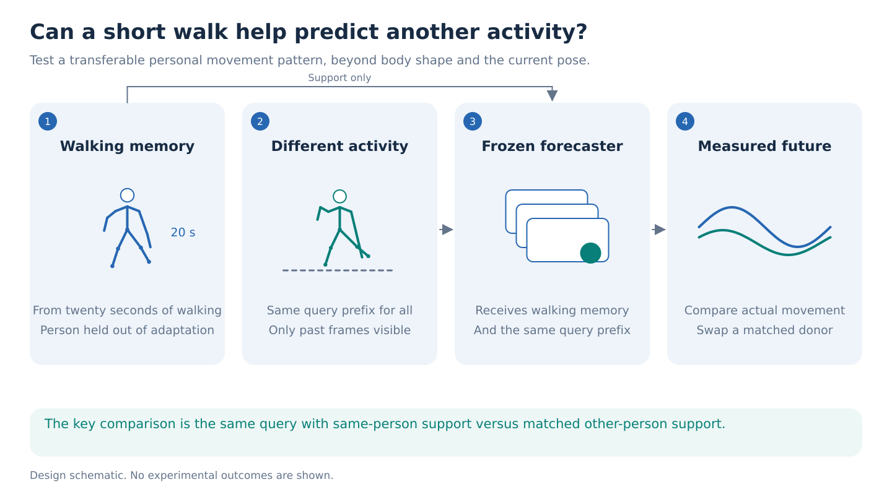
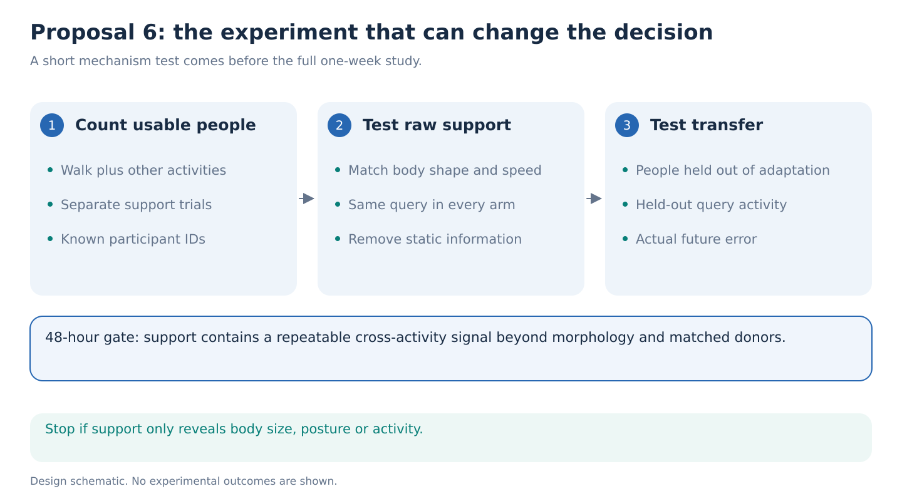

# 6. Cross-activity motor memory

**Can twenty seconds of walking help predict how the same person will move during a different activity?**

Imagine observing two people at the same point in a reaching movement. Their current poses and velocities are similar. You also have a short earlier recording of each person walking. Does that recording improve the forecast of what each person actually does next?

This proposal tests whether walking reveals a reusable pattern of movement. It asks for measured predictive value beyond body proportions, speed and the immediate motion history. A successful result would give a small skeleton encoder a practical role: supplying a personal memory to a frozen motion model.

## The question and the one-week decision

Within seven days, can a memory built from at most twenty seconds of a person held out from adapter training reduce that person's future-motion error during at least two other activities by **5% relative to the strongest matched baseline**, at a 0.5-second horizon? Require a positive person-bootstrap interval and a benefit from the correct person's walk over a morphology-and-speed-matched donor walk. Being unseen during foundation pretraining is a separate claim requiring verified exclusion.

The 5% threshold is a proposed minimum useful effect. Fix eight samples per prefix and use their mean trajectory as the point forecast in every arm, averaging joint error equally across people and activities. Never select a sample using the true future. Report 0.25- and 1-second error, joint-angle error and a proper distributional score separately. Every arm sees the same prefix and predicts the same recorded future.

## Why this could matter

Most personalization papers ask whether generated motion looks like a person's style. This study asks whether personal information improves a forecast of a real event. Success would support a stronger interpretation of the memory: it contains something useful across activities, beyond producing recognizable animation.

The repository does not establish such memory. Its latest teacher-prediction experiment ended in a development STOP, and trained representations lost linear access to one movement observable. Those results motivate an independent physical outcome, not an expectation of success. See the [evidence audit](../references/reviews/evidence-audit.md).

Whole-body AMASS is important here. A walk contains trunk, shoulder and arm movement as well as legs. Compare a Core11 memory with a whole-body memory. A larger input alone earns no contribution: match memory dimension, trainable parameters and tuning budget.

## A small adaptation of an available model

Use the public **MDM HumanML3D 512-dimensional encoder, 50-step checkpoint** as the frozen motion prior. Its [official repository](https://github.com/GuyTevet/motion-diffusion-model) lists the weights, and the linked [checkpoint file page](https://drive.google.com/file/d/1cfadR1eZ116TIdXK7qDX1RugAerEiJXr/view) resolves. Binary download and inference remain a day-1 check.

The proposed system has three parts:

1. **Walking memory.** Divide the support walk into short blocks. A small S-JEPA-style skeleton encoder pools them into a 32-number memory. Use the repository's compatible checkpoint when available; otherwise train only this small branch alongside the adapter. Its pretraining is not the contribution.
2. **Current motion.** Supply one second of the query activity. A shared adapter turns the frozen MDM into a prefix-conditioned forecaster. All comparison arms receive this same adaptation opportunity. The unknown future starts as noise, and observed prefix values remain fixed during sampling.
3. **Personal adjustment.** A zero-initialized conditioning branch injects the walking memory into MDM. Train the memory branch and conditioning parameters on support/query pairs from training people, with recorded query futures as supervision. At test time, compute the memory from walking alone. Do not update from the test person's query future.

Use an empty text condition in the primary experiment. An activity label inferred from later frames must not enter through a caption. Convert AMASS into MDM's expected representation with an explicit joint map. Recompute velocities and contact features at the observation boundary using permitted samples only. Scaling, floor estimation and imputation must not inspect the query future.

## The experiment that distinguishes memory from identity shortcuts

AMASS is on HAIC, but usable person-and-activity coverage remains unverified. Before adaptation, enumerate people with walking support and separate recordings of at least two nonwalking activities, such as reaching, sitting or squatting. Record counts after every eligibility and matching requirement, separately for training, development and test. Choose the activity pair from verified annotations before scoring. Withhold one query activity from adapter training and personal support; the pretrained base may have seen it.

Require at least twenty eligible held-out people for the main evaluation, plus separate training and development people. If this is unavailable, stop this one-week proposal. Split people before creating windows. Keep source motions, repeated recordings and near duplicates together. Audit the pretrained checkpoint's HumanML3D/AMASS overlap and use demonstrably nonoverlapping evaluation motions; do not claim people were unseen in pretraining without evidence.

For each query, compare:

| Arm | What it tests |
| --- | --- |
| Current history, no memory | Whether personalization adds anything |
| Body proportions and walking speed | Whether simple personal measurements suffice |
| Static walking poses without their order | Whether posture alone explains the memory |
| Another person's matched walk | Whether the correct person's motion matters |
| Correct person's walk | The proposed useful-memory effect |
| Raw trajectory retrieval and a same-capacity raw support encoder plus direct forecaster | Whether equally rich support information works without a frozen prior |
| Ordinary few-shot adaptation | Whether the proposed memory improves on standard personalization |

All arms retain identical support budgets and query prefixes, including current pose and velocity. Include a query-only model with the same total trainable parameters. Normalize skeletal proportions in one prespecified analysis and supply morphology explicitly in another. Match donors within source, body size, cadence and duration, reporting coverage lost. A different-dataset donor is an easy acquisition-style contrast, not convincing personal-memory evidence.

Use nonoverlapping 5-, 10- and 20-second support budgets where available. Multiple windows from one person remain one statistical unit. Repeat neural training with three seeds and report that variability separately from uncertainty across people. GAVD cannot establish this experiment's person-level result because its local manifest lacks verified participant identities.

## What is already known, and what would be new

[MetaGait's 2026 few-shot framework](https://pmc.ncbi.nlm.nih.gov/articles/PMC12886945/) already personalizes gait generation and reconstruction from a few cycles. [PersonaBooth](https://arxiv.org/html/2503.07390v2) is closer: it extracts personal style from basic motions and adapts frozen MDM to generate other motion content. [STyMo](https://arxiv.org/html/2609.04500v1) transfers style from seconds of paired neutral and stylized motion, including transfer across activities. Neither a personal token nor a walk-to-other-action animation is a defensible new claim.

[UMO](https://arxiv.org/html/2603.15975v1) also adapts a motion foundation model to prediction and other temporal tasks. Its [official repository](https://github.com/Oliver-Cong02/UMO) still lists code and models as forthcoming at this check, so it is related work, not a required dependency.

The potential contribution is **person-specific predictive information that transfers across activities after current-state and morphology controls**. Compare released personalization methods when usable, and implement their simple conditioning alternatives at equal budget. STyMo requires paired style examples that this protocol does not provide; report that difference instead of inventing equivalent supervision. A style-recognition score or attractive animation does not establish the proposed claim.

## Forty-eight-hour stop rule and compute

Day 1 audits data, overlap, checkpoint inference and prefix handling. Day 2 runs a small paired pilot. Stop if correct-person memory does not beat both no memory and matched donor memory, or if a static/morphology baseline explains the improvement. Check whether the model simply ignores the memory before interpreting a null scientifically.

If the pilot passes, days 3–5 run fixed comparisons and three seeds; days 6–7 cover held-person evaluation, source sensitivity and the report. Reserve approximately **400–550 H100 GPU-hours** for this proposal if selected, including pilot, adapter training, frozen-model sampling and verification. This is a planning allowance, not measured throughput; cap the experiment after a timed pilot. It fits within a week on eight H100s without training the foundation model again.

The most convincing figure would show the correct walking memory improving two different actual future activities, while matched donor and static memories fail. A null after these controls would be informative, but would not by itself make an ICLR paper. Even a positive result describes transferable movement information, not diagnosis, impairment or a person's physical capability.
