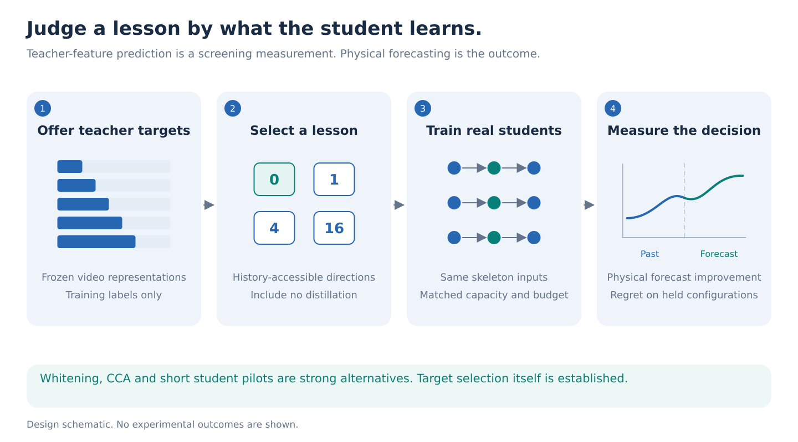
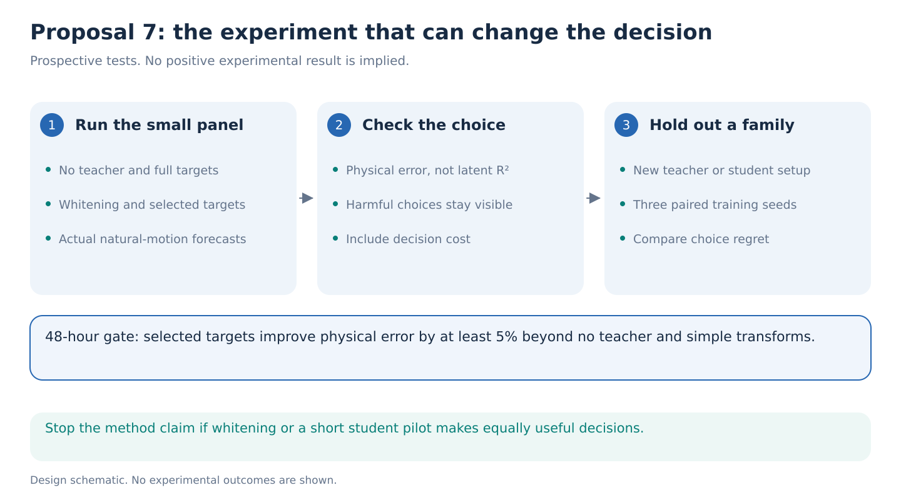

# 07. Predict whether a JEPA lesson will help a motion student

> **Decision stage: September 14 seven-proposal comparison.** Priority statements describe [that comparison](../proposal-comparison.md). See the [research agenda](../README.md) for the latest recommendation.

**Question.** Can a cheap, training-data-only test choose teacher targets that improve a small skeleton model's actual motion forecasts, including correctly choosing no distillation? The endpoint is the value of the training decision, not agreement with a teacher's feature vector.

**Decision.** This is the closest continuation of the original ICLR feature-prediction study, but a lower-priority novelty bet. Run it only if existing caches make the pilot inexpensive or the front runners fail. Target selection, predictive subspaces and knowledge distillation already have strong precedents.

**Step 1: separate copying from learning.** A video teacher might represent background, appearance, posture and movement. A skeleton-only student cannot see all those properties. Even the part it can predict may spend its small capacity on easily repeated posture information. Copying the teacher more accurately can therefore fail to improve a useful forecast. That is a hypothesis about finite models, not a conclusion already established by this repository.

The expanded run obtained a skeleton increment of only 0.000357 R² beyond RGB, below the mismatched control and the frozen target. That measures information added to an RGB predictor. It does not measure what a skeleton-only student learns from a teacher. The next experiment must cross that gap directly. See the [historical strategy](../../../docs/studies/future-feature-prediction/scaling/research-strategy.md) and [common evidence](../references/portfolio-evidence.md).

**Step 2: define a forecast the student must improve.** On natural AMASS, give the student a one-second full-body joint history and predict the next 0.5 seconds of root-relative joint displacement. The primary physical loss is person-averaged joint MSE. Report ordinary distance error, root motion and 0.25/1-second horizons secondarily. Use 22 joints, with a matched Core11 ablation. Render aligned videos from the same captured motion to obtain frozen V-JEPA targets during training. At deployment the student receives joints only.

The teacher may encode training future frames to supply supervision, just as future joints supply labels. The student and all its normalization, contact and velocity features may only use the prefix. No text inferred from the future is permitted. Main scores use untouched trajectories, not hand-created semantic labels.

**Step 3: estimate which targets are accessible from the student's information.** Let `H` denote the full permitted skeleton history. Let `C` be a strong summary computed from that same history: confidence once, endpoint pose, velocity and an order-invariant history summary. Let `Y` be the frozen teacher's future representation.

Within training-person folds, fit small predictors from `C` to `Y` and from `H` to `Y`. Evaluate both on training people excluded from their fit. A residual is a prediction error; covariance records which errors vary together. Their residual-error covariance difference identifies candidate directions, meaning weighted combinations of teacher numbers, in which history helped prediction. A direction with large predicted variation but poor actual error reduction should not be rewarded. Use low-rank shrinkage, a standard way to limit noisy estimates, because people rather than windows determine the effective sample size.

Choose 0, 1, 2, 4, 8 or 16 directions on separate inner folds. Zero means no extra teaching. The estimated covariance difference can have negative eigenvalues; do not interpret every direction as useful information. Retain directions only when their held-group error reduction supports that choice, and allow the selected rank to fall to zero. Residualize targets against `C`, not RGB, because removing what RGB can predict could discard exactly the information a skeleton student should learn. Refit every map within the relevant training boundary. This conditional error-reduction construction already appears in the repository's strategy; its algebra is not claimed as a new theorem.

**Step 4: test whether the cheap measurement predicts an expensive decision.** Train matched small students with no auxiliary target, the full teacher, whitened features, PCA, partial CCA, the selected subspace and a matched random subspace. Give every arm the same physical forecast loss, capacity, training examples and optimization allowance. Auxiliary loss strength includes zero.

Use frozen V-JEPA 2.1 first. If the pilot works, add a released V-JEPA 2 backbone and [DINOv2](https://github.com/facebookresearch/dinov2) image features as a deliberately different teacher family. Public file listings are available, but these additional local loads remain untested. Averaged image features are an appearance/posture comparator, not a temporal world model. Multiple layers of the same network do not count as independent teacher families.

The selector must be judged on configurations excluded from its own selection: a new teacher family and a new student capacity or forecast horizon. Lock the selection rule, rank grid, scoring metric and loss-strength rule before evaluating those configurations. Fitting a new teacher's transform on permitted training people is allowed; retuning the criterion from its evaluation outcomes is not. This is a held decision configuration, not a claim that the method never sees that teacher's training features. Define decision regret as `physical loss of the chosen student - physical loss of the best trained candidate in the same panel`. The latter is a retrospective diagnostic oracle. Include a short actual student-training pilot as a strong competing selector and count its cost. A criterion that merely beats random choice is not enough.

**Step 5: insist on physical benefit and a transferable decision.**

Within 48 hours, run no-teacher, full-feature, whitening/CCA and selected-target students on one modest training cohort. Continue only if selected targets reduce development physical MSE by at least 5% against both no teacher and the strongest ordinary target transform. This is a provisional effect threshold. A better latent R² does not qualify.

For the one-week claim, require useful physical gains with three paired seeds and lower held-configuration regret than both published transferability criteria and the short student pilot at a stated decision budget. Report harmful choices as well as beneficial ones. If rank zero wins throughout, the selector correctly avoids harm but has not demonstrated beneficial transfer. If whitening or a short pilot makes the same decisions, stop the standalone method claim.

The shared GAVD visible-2D panel can test a separately trained image-coordinate forecasting student with recording-separated evaluation. Never mix that 2D endpoint with AMASS 3D errors or call tracker pseudo-labels exact truth. Existing GAVD teacher-feature caches can motivate target availability; they cannot serve as a replacement for the new physical outcome.

**What would be new?** [LogME](https://proceedings.mlr.press/v139/you21b.html), [predictive-state regression](https://arxiv.org/abs/1505.05310), [VAMP](https://arxiv.org/abs/1707.04659), and [generalized distillation](https://arxiv.org/abs/1511.03643) establish much of the surrounding machinery. The [teacher-complementarity criterion](https://arxiv.org/abs/2510.13182) is a particularly close modern comparison. The potential contribution is a reliable, inexpensive decision about temporal teaching that predicts real student benefit across held configurations. Target residualization by itself is incremental. The latest negative gate motivates this test without supplying a positive result.

**One-week allocation.** Day 1 confirms aligned natural-motion features and creates the small target panel. Day 2 runs the four-arm physical pilot. Days 3–5 expand only successful conditions to held teachers/capacities and three seeds. Days 6–7 complete GAVD corroboration, regret and uncertainty analysis. Allow 30–80 H100-hours for the pilot and 180–320 total if selected, including teacher extraction. Do not launch a large architecture search. The [reference ledger](../references/portfolio-literature.md) records verified access and unresolved comparisons.
