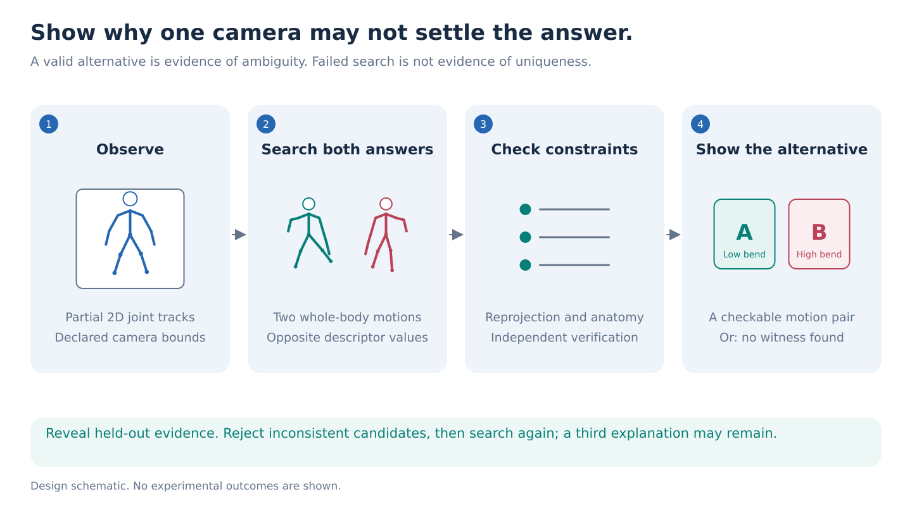
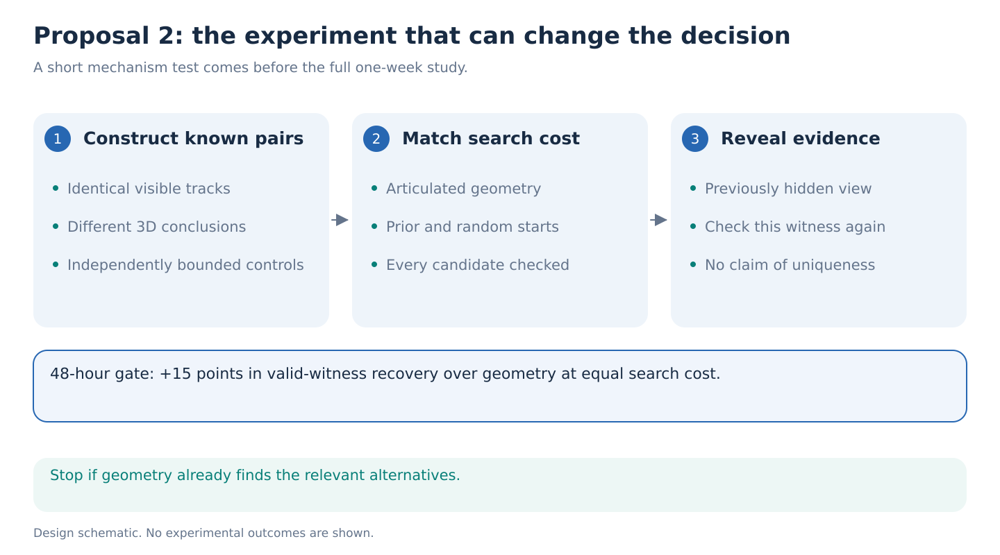

# 2. Show a competing motion when the video cannot support a unique conclusion

**Decision:** A low-training, high-concept alternative. Its greatest threat is that geometric interval methods may already do the useful work.

**Research question:** Within seven days, can a frozen motion prior help find two motions satisfying explicit kinematic constraints that explain the same partial observation but imply opposite answers to a movement question, more effectively than geometry alone?

## The idea from first principles

A camera collapses depth. A person moving toward the camera and another moving partly sideways can produce similar joint tracks. Missing joints make the ambiguity worse. A plausible 3D reconstruction is therefore not necessarily the only plausible explanation.

Most systems return one skeleton, sometimes with an uncertainty score. This proposal returns something easier to inspect: **a competing motion**. Both reconstructions match the observed joints, but the movement conclusion changes. That pair demonstrates that the observation does not uniquely determine the answer under the declared assumptions.

For example, a frontal recording may be compatible with two different ranges of knee bending. One reconstruction exceeds a chosen angular threshold and the other does not. The output is not “this person has a disorder.” It is “this recording does not settle this particular 3D movement question.”

## The proposed contribution

The research object is a **conclusion-changing ambiguity witness**: two explicit trajectories, a reproducible observation-fit check, and a movement property on which they disagree. Each is kinematically admissible under declared constraints; this is not a guarantee of human physical feasibility.

Sample variance does not answer this question. A biased prior may never search the right alternative, while several different-looking motions may support the same conclusion.

The novelty claim must survive strong existing ideas: geometric bounds, multiple-hypothesis 3D pose recovery, posterior sampling, and uncertainty calibration. [Diffusion inverse-problem research](https://arxiv.org/html/2606.02331v1) already distinguishes plausible output from measurement-supported content. Earlier repository proposals already studied sparse anchors. This proposal is competitive only if its explicit counterexamples reveal consequential failures missed by those alternatives and guide a useful clarification.

## Model, data and representation

Start from the public 50-step [Human Motion Diffusion Model](https://github.com/GuyTevet/motion-diffusion-model). Use its frozen motion generator as a source of initial candidates, not as the authority deciding which motions are possible. [MoMask](https://github.com/EricGuo5513/momask-codes) is an optional fast second prior after its official weight download and load pass. No model is trained from scratch.

Convert existing AMASS motion to 22 body joints and the released HumanML3D 263-channel representation at 20 Hz. Preserve arms and trunk, with Core11 as an ablation. Verify a conversion round trip before searching.

The primary observations are calibrated 2D projections with controlled missingness and noise. Complete trajectories are available only to the evaluator. Split people and motions before generating variants, and audit prior-training overlap separately.

GAVD is a final in-the-wild demonstration. Its unknown cameras, estimated poses and unknown person identities make it unsuitable for proving the true 3D answer. Report witnesses relative to a declared range of camera and noise assumptions. Conclusions concern the visible movement geometry, never diagnosis or severity.

## A concrete search that can be implemented quickly

Choose two joint-defined questions before testing. Knee flexion is 180 degrees minus the angle between hip-minus-knee and ankle-minus-knee vectors. Trunk-pelvis yaw is the signed angle between left-to-right shoulder and hip axes projected onto the plane perpendicular to the pelvis-to-shoulder-midpoint axis. Declare side, sign, angular unwrapping and degenerate-axis exclusions. These descriptors use joint geometry, not unobserved bone twist.

For each descriptor, measure its range over a fixed two-second window at 20 Hz, excluding cases with insufficient valid observations. Set thresholds and a nonzero decision margin on development data: the two witness values must fall below threshold-minus-margin and above threshold-plus-margin. These are movement thresholds, not medical cutoffs.

For each observation, search twice: once for a trajectory giving an answer below the threshold and once for an answer above it. Initialize each search from a mixture of frozen-prior samples, geometric lifts and perturbed known-valid training motions. Optimize joint rotations and camera parameters only within the declared bounds.

An admissible candidate must satisfy a fixed reprojection tolerance at every observed joint, bone-length constraints, joint-angle limits and a temporal-acceleration bound computed using physical timestamps. Fix these bounds on training and calibration data and publish their residuals. Exclude global reflection, rescaling and left-right relabeling as witness-generating transformations. Smoothness does not guarantee human feasibility. A prior score may guide search but cannot define admissibility by itself.

If both searches succeed, save the pair and verify all constraints with an independent checker. If only one succeeds, report **no competing motion found within the search budget**. Never translate search failure into proof that the answer is identifiable.

A compact S-JEPA head can learn to propose promising search initializations from partial skeleton history. Its only credited benefit is finding more valid witnesses at a fixed compute budget. Compare with a same-size coordinate head. A change in uncertainty calibration alone is not enough.

## How to know whether the witnesses are useful

Build known ambiguous pairs with an articulated geometric construction independent of the evaluated prior and search head. Both members share model-visible observations and disagree beyond the declared descriptor margin. Hold out a second construction family and include natural-motion-derived cases. Report recovery by construction and margin, rather than pooling easy cases with difficult ones.

Exact fully observed 3D trajectories provide unit checks, but are too easy as the only negative control. Add partial-observation cases whose independently computed geometric descriptor intervals lie entirely on one side of the threshold. Allow measurement tolerance in those bounds. Near-threshold noisy 3D cases cannot automatically be labeled unambiguous, nor can ordinary monocular cases merely because the true trajectory is known.

The headline is the **fraction of known ambiguous cases with a verified competing pair, at a fixed search budget**. Invalid proposals count as failures and consume budget. Separately measure false certainty on balanced pairs with identical observations and opposite reference answers, using probability error or decision coverage. This tests that constructed distribution. A compatible alternative can invalidate a uniqueness claim without proving that the original answer was physically wrong. It does not establish natural ambiguity prevalence or GAVD calibration.

The hardest baseline searches directly over articulated geometry without a learned prior. Other baselines include per-frame depth intervals, temporal geometric optimization, random multistart search, ordinary prior samples and a public multiple-hypothesis pose method if its checkpoint is verified. Use a common wall-clock budget on declared hardware and CPU-thread allocations, including sampling, conversion and checking. Report candidate counts and CPU/GPU cost separately. Count search-head training and the queries needed to amortize it.

Choose one extra camera view or hidden time block using only current observations and candidate disagreement. Then reveal that evaluator-held evidence. Compare with random reveal and a geometric rule. Either, both or neither candidate may be rejected because neither found motion must equal the reference. Measure rejection of this particular pair, then rerun search under a fixed additional budget. Rejecting one pair does not rule out a third alternative. Report “no new witness found” when appropriate, never proof of uniqueness from search failure. This is offline measurement selection using existing data.

## First result and stop rules

**By 24 hours:** Verify conversion and construct approximately 100 ambiguous and 100 fully observed control cases. Check paired observations independently and optimize geometric baselines. These are workload targets, not estimates of natural ambiguity prevalence.

**By 48 hours:** Require at least a 15 percentage point improvement in verified-witness recovery over the strongest geometry baseline at equal search cost on development cases. Publish no witness failing the independent check. A paired person-level bootstrap must support improvement, grouping all trials and variants; use a weaker recording-level claim only when identity is unavailable. Keep final construction and observation shifts untouched. These are selection rules, not predicted effects.

Stop if geometry alone already finds nearly every relevant witness, if prior samples improve realism but not valid recovery, or if the proposed witnesses depend on implausible depth and joint-angle choices. A success restricted to trivial front/back reflection is insufficient.

## One-week allocation

| Work | Estimated H100 GPU-hours | Timing |
| --- | ---: | --- |
| Data conversion, prior load and constructed cases | 24 | Day 1 |
| Geometry and prior-guided search pilot | 40 | Day 2 |
| Passing method, two descriptors and corruption shifts | 56 | Days 3 to 4 |
| Optional small search head, three seeds | 40 | Day 5 |
| Extra-observation and GAVD demonstrations | 24 | Day 6 |
| Independent checking and contingency | 16 | Day 7 |
| **Budget cap** | **200** | **One alternative study** |

These are unmeasured allowances. Measure throughput on day 1. Parallelize independent cases across eight GPUs. If no learned head is needed, spend that allocation on stronger baselines and verification.

## What would justify an ICLR paper

A strong paper would establish that confident motion models miss conclusion-changing alternatives, then provide a fast method that finds them and selects extra observations that eliminate specific witnessed ambiguities. Generalization must hold across descriptors and observation shifts, with independently checked kinematic candidates. A claim that a finding becomes uniquely determined requires a separate geometric bound.

If geometric bounds perform equally well, the result remains a useful limit-of-evidence study. It would not demonstrate a new role for S-JEPA or pretrained world models. The proposal should then be demoted instead of relabeled as a successful model contribution.
