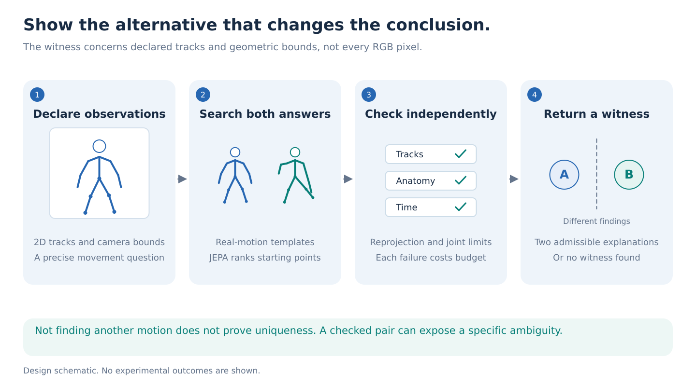
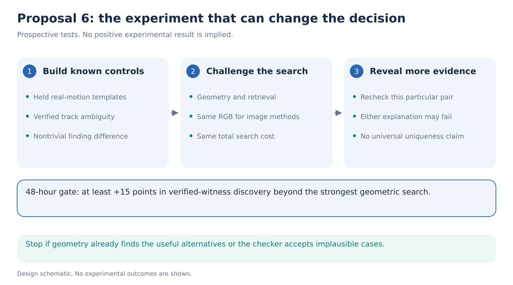

# 06. Show a checked alternative that changes the movement conclusion

> **Decision stage: September 14 seven-proposal comparison.** Priority statements describe [that comparison](../proposal-comparison.md). See the [research agenda](../README.md) for the latest recommendation.

**Decision: lower-priority alternative.** This can produce an understandable result quickly, but geometry and ordinary retrieval may already provide the useful capability.

**One-week question.** Can frozen JEPA features help find conclusion-changing alternative motions at least 15 percentage points more often than the strongest geometric search, under the same total compute budget?

This proposal checks explanations of observed movement; Proposal 05 evaluates future probabilities. See the common [evidence](../references/portfolio-evidence.md) and [references](../references/portfolio-literature.md).

## Step 1: Ask a precise question that a camera may not settle

A frontal view hides depth. Two knee trajectories may agree with the visible joint tracks while having different bending ranges. A single reconstructed skeleton can conceal this ambiguity.

Choose two movement quantities before testing: left-knee flexion range and trunk-versus-pelvis turning range over a fixed two-second window. Knee flexion is 180 degrees minus the hip-knee-ankle angle. Define turning from projected shoulder and hip axes around the torso axis, with explicit sign and degeneracy rules. Neither quantity is a diagnosis.

Set a threshold and nonzero margin on training/calibration data. Search for one trajectory below threshold minus margin and another above threshold plus margin. Their disagreement must be large enough to change the declared movement conclusion.

## Step 2: Define what an alternative must explain

The primary observation is a set of calibrated 2D joint tracks, timestamps, and visibility indicators. Every candidate must meet fixed reprojection tolerances at observed joints, body-dimension bounds, joint-angle limits, and temporal bounds expressed in physical time.

Use whole-body AMASS with arms, trunk, and feet retained. Split people and source motions before rendering views or building a retrieval library. All variations of one original recording remain together. Controlled cameras let the evaluator test projected observations against independent AMASS trajectories.

Two candidates must satisfy these constraints and disagree about the finding. The witness concerns the declared track-and-geometry observations, not every pixel in the RGB video. Kinematic admissibility does not prove human physical feasibility or agreement with clothing and shading. RGB can guide search without becoming a condition certified by the checker. Exclude global reflection, arbitrary rescaling, and left-right relabeling as sources of a witness.

## Step 3: Search using real motion and existing tools

Build a library from training AMASS motions only. Standard nearest-neighbor retrieval supplies motion templates with similar visible joint histories. Optimize their joint rotations and permitted camera parameters within the fixed bounds, separately seeking each side of the finding threshold. Include geometry-only multistart initialization so the search is not restricted to the library's preferred answer.

The proposed addition uses frozen V-JEPA video tokens to rank promising templates and search initializations. Encode training-template renders and fit only a small compatibility head where necessary. It estimates which starting points are likely to yield valid, contradictory explanations after optimization. It does not certify feasibility or generate a new body model. Use the user's available encoder or an [official public checkpoint](https://github.com/facebookresearch/vjepa2); no pretrained S-JEPA checkpoint is assumed.

Keep templates supporting both finding values during proposal selection. A similarity ranker that retrieves only typical motion could hide the alternative we need. Compare joint-coordinate retrieval, raw-flow retrieval, and equal-capacity non-JEPA ranking with the same library. All image-aware ranking baselines receive the same RGB; geometry-only search remains a useful cheaper comparison, not the only opponent.

The unedited library supplies real starting motions without MoMask or another generator. Record possible foundation-pretraining overlap separately from retrieval/adaptation holdout.

## Step 4: Check the answer independently

After optimization, a separate numerical checker recomputes every constraint from the returned trajectories. Save candidate motion, projected tracks, constraint residuals, and the two finding values. Invalid candidates consume search budget and count as failures.

If two valid candidates cross the threshold margin, return the pair as an **ambiguity witness**. If search finds only one, say “no competing motion found within this budget.” Failed search cannot prove uniqueness, and a plausible-looking animation cannot replace the checks.

GAVD can demonstrate the procedure on visible 2D observations with declared camera and noise assumptions. It supplies no 3D certification or natural ambiguity prevalence estimate. Do not score against another model's reconstructed skeleton as if that were independent truth.

## Step 5: Measure discovery rather than sample diversity

Construct known ambiguous controls independently of the search model, using articulated geometry initialized from held-out real motions. Verify that paired observations match within the declared tolerance and that reference findings cross the margin. Hold out entire motion-template and construction families. Also test untouched natural-motion observations, reporting discovery rates without assuming which unwitnessed cases are identifiable.

The primary metric is the fraction of known ambiguous cases yielding a verified pair at equal wall-clock search cost. Count feature extraction, retrieval, optimization, checking, and invalid proposals; report CPU/GPU allocations. Compare geometric interval methods, temporal constrained optimization, coordinate retrieval, random multistart, and the same library without JEPA ranking.

For a useful secondary demonstration, reveal an evaluator-held time block or camera view and recheck the pair. Either, both, or neither candidate may survive. Eliminating a particular alternative does not exclude every possible third trajectory. This uses controlled observations, not oracle truth as a search feature.

## Step 6: Decide whether the novelty survives

[DiffPose](https://arxiv.org/abs/2211.16487), [D3DP](https://arxiv.org/abs/2303.11579), and [FMPose3D](https://arxiv.org/abs/2602.05755) already address multiple plausible 3D poses. Generating alternatives is not new. The prospective contribution is efficiently discovering **checked, finding-changing explanations** that ordinary posterior samples or geometry miss, with transfer to unseen templates. If geometry performs equally well, this remains a useful analysis tool rather than a new JEPA method.

By hour 24, establish valid constructed controls and strong geometric baselines. By hour 48, require a 15-point recovery improvement at matched cost on development, supported by person-grouped uncertainty. Stop if geometry already solves almost every case, ranking adds no benefit, or success depends on implausible constraints.

If successful, spend days three to five on fixed searches and held-template tests, and days six and seven on additional-evidence checks and GAVD demonstrations. Cap the study at **180 H100-hours**, including extraction, optional small-head training, and contingency; measure CPU search throughput too. A null is informative, but neither a null nor a single dramatic witness establishes an ICLR-level contribution.
