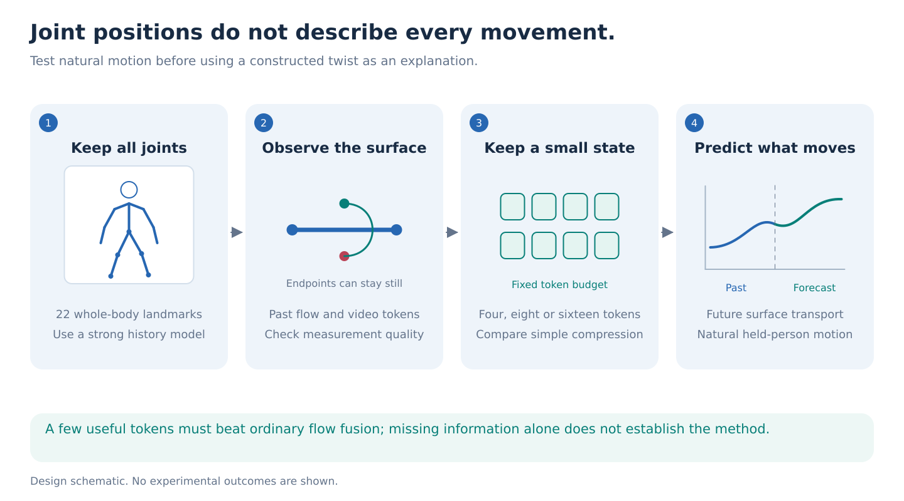
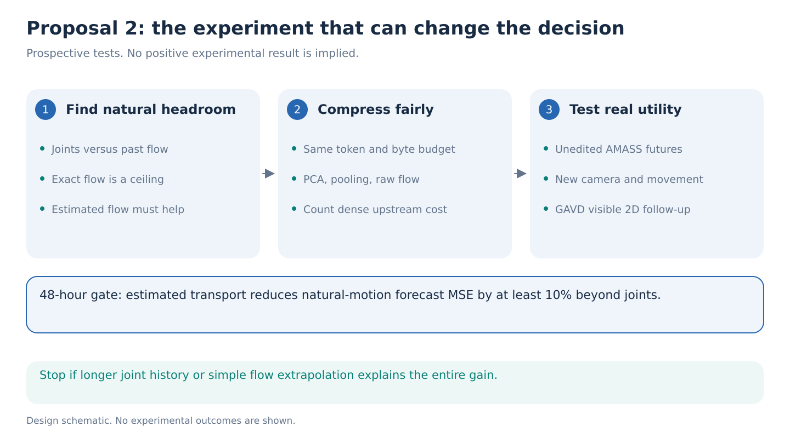

# 02. Keep the movement that joint positions leave out

> **Decision stage: September 14 seven-proposal comparison.** Priority statements describe [that comparison](../proposal-comparison.md). See the [research agenda](../README.md) for the latest recommendation.

**Question.** Can eight additional surface-motion tokens preserve most of the useful forecasting information missing from a full-body skeleton, across unseen people and camera conditions? Test natural captured motion first. A constructed example alone cannot establish practical importance.

**Decision.** Run the inexpensive information test alongside P1. This is the strongest independent representation hypothesis because it does not require a useful MoMask reconstruction. Its method-level novelty remains conditional on beating direct flow fusion and ordinary compression.

**Step 1: understand what the skeleton records.** Turn a forearm around the line between elbow and wrist. Those endpoints can stay still while a point on the sleeve moves. A list of joint positions can omit this motion. A full-body 22-joint input includes arms and trunk, but does not automatically represent every segment rotation or surface movement.

Optical flow estimates the displacement of visible image material. It can carry some of this omitted information. A material point is a fixed spot on a modeled body surface followed through time, rather than a new pixel chosen in each frame. Flow also contains camera motion, occlusion errors, and clothing movement. It is derived from the same video as the skeleton, so it is not an independent sensor and does not uniquely reveal 3D rotation.

The first claim to test is therefore modest and concrete: **past surface observations improve predictions of actual future movement after a strong full-body joint-history baseline has used everything it can.** The prior feature study's tiny skeleton increment beyond RGB does not establish this claim or refute it. It tested a different conditional information question. See the [evidence record](../references/portfolio-evidence.md).

**Step 2: measure natural headroom before constructing a demonstration.** Use untouched AMASS trials. Observe one second and predict at 0.25 and 0.5 seconds. Start with 32 training people and the existing calibration/development roles, keeping final people sealed. Retain the full 22-joint history, current velocity, body size and timestamps. Compare longer two-second histories where available so that extra flow is not merely compensating for a weak temporal baseline.

Render captured motion with fixed cameras first. Select a fixed set of material points on forearms, upper arms, shanks and torso without looking at future errors. The primary endpoint is mean squared error in the change of each point's pelvis-relative image offset from the cutoff to the future time, normalized by prefix person height. Explicitly, the target is `(point_future - pelvis_future) - (point_cutoff - pelvis_cutoff)` in image coordinates. Report pixels alongside it. Use the same evaluation points and reference visibility for every method, with visible and occluded strata reported separately. Local segment-rotation error is secondary. AMASS rotations and rendered surfaces are fitted-model references, not measured skin or clothing truth.

Compare joints alone, joints plus exact past renderer transport, and joints plus estimated SEA-RAFT transport. Exact transport is an information ceiling, not a deployable input. If only the exact version helps, the missing information exists but the proposed measurement route has failed.

**Step 3: build the small state.** Freeze SEA-RAFT and the locally available V-JEPA 2.1 encoder. At each permitted past time, form local records containing flow, location relative to nearby joints, validity and dense video features. A small attention pool compresses these records into K = 4, 8 or 16 tokens of fixed dimension. A small temporal head combines these tokens with the joint history and predicts the physical targets.

Train on unedited training motion. Include raw transport and a joint-motion-relative version; subtracting an imperfect skeletal reference must not be the only input. The model's hypothesis is that video features help retain useful local evidence when flow alone is ambiguous. Compare with no JEPA, random frozen features, and identical pooling over raw flow. No large backbone training or human-action-conditioned predictor is required.

All flow pairs and encoder frames end by the cutoff. Select tokens using the prefix only. Count dense extraction separately: an eight-token downstream state does not imply that optical flow or the video encoder was computed only eight times. Report downstream bytes, latency and total upstream cost distinctly.

**Step 4: defeat the easy explanations.** The required alternatives are full-body coordinate forecasting, velocity extrapolation, constant-flow extrapolation, direct joint-plus-flow concatenation, uniform/energy-based token selection, mean pooling, PCA compression and equally sized learned pooling without JEPA. Include a static off-axis-point baseline with the same point identities and cutoff locations, but no transport history: extra pose geometry must not masquerade as temporal information. An extra off-axis landmark representation is a strong geometric alternative; specify whether its past coordinates are measured or privileged. Full recorded rotations are a labeled information ceiling, not a same-information competitor.

Match duration, body size, centroid displacement, cadence, motion energy and foreground extent. Test a last-image baseline. Hold out a camera/texture condition and a motion family after development. A gain confined to an artificially sparse Core11 baseline is insufficient.

Only then add an illustrative alias pair: two verified final joint-input tensors agree while surface motion differs. A forearm twist with compensating child rotation is a candidate construction, but skinning and joint regression may break equality. Verify the actual tensors and stated tolerance. Approximate equality supports a sensitivity result, not an impossibility theorem. This is a diagnostic explanation of the mechanism, not the source of the main forecast score.

**Step 5: require a result larger than ordinary fusion.**

By 48 hours, estimated transport should improve the strongest joint-only natural-motion forecast by at least 10% relative MSE. This is a proposed continuation threshold, not a prediction. Stop if longer joint history, simple flow extrapolation, or nuisance matching eliminates the opportunity.

For the selected full study, require the eight-token method to retain at least 90% of the measured dense-evidence gain and beat the strongest equal-budget compression/fusion baseline by at least 5% relative primary error, with a positive paired person interval. Define retained gain as `(joint-only error - compact error) / (joint-only error - dense-evidence error)` using the same endpoint; report it only when the denominator is meaningfully positive. If direct compression matches the method, the information finding may remain useful but the proposed adapter has not earned a standalone contribution.

Use the shared annotated GAVD panel for later visible landmark transport, with the same prefix boundary and no 3D claims. That test corroborates real-video forecasting; it does not directly validate latent segment twist. More detailed surface annotations would be a separate cost, not something the manifests already provide.

**What would be new?** [MC-JEPA](https://arxiv.org/abs/2307.12698) already combines content and flow learning. [JOPAT](https://arxiv.org/abs/2605.23856) uses point tracks in world-action models. [H-MoRe](https://arxiv.org/abs/2504.10676) and [H-Flow](https://arxiv.org/abs/2605.22629) already couple human structure and surface motion. The contribution must be a measured predictive limitation of the joint state on natural motion, plus a compact remedy that survives strong geometric and fusion alternatives. Neither adding flow nor showing a twist animation is new enough.

**One-week allocation.** Days 1–2 run the natural information assay and time extraction. Days 3–4 fit the small token heads if it passes. Days 5–6 run fixed unseen-condition comparisons and three seeds; day 7 finishes uncertainty, GAVD corroboration and figures. Allow 40–100 H100-hours for the pilot and 200–350 total if selected, subject to timed rendering and inference. No advertised gain is measured yet. Read the [source ledger](../references/portfolio-literature.md) before choosing optional comparison checkpoints.
