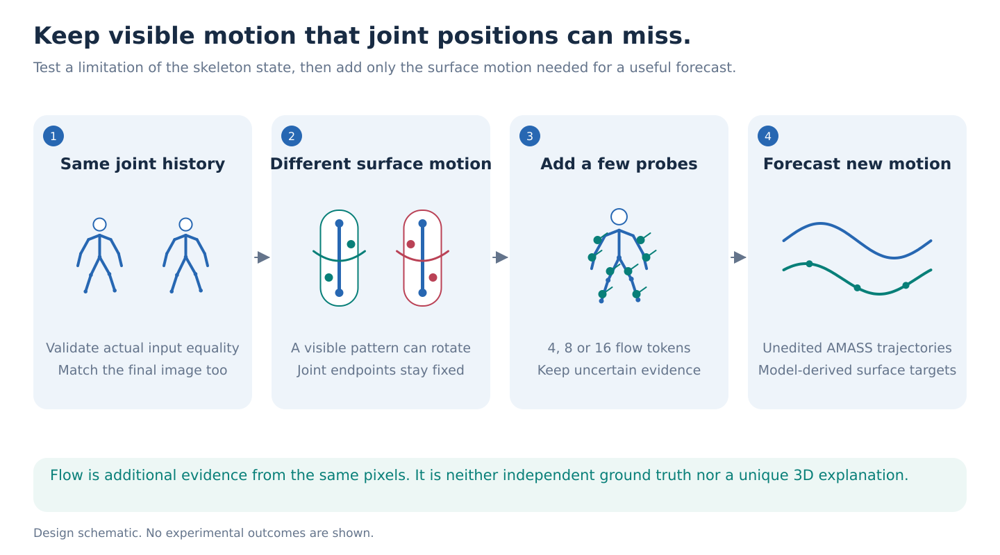
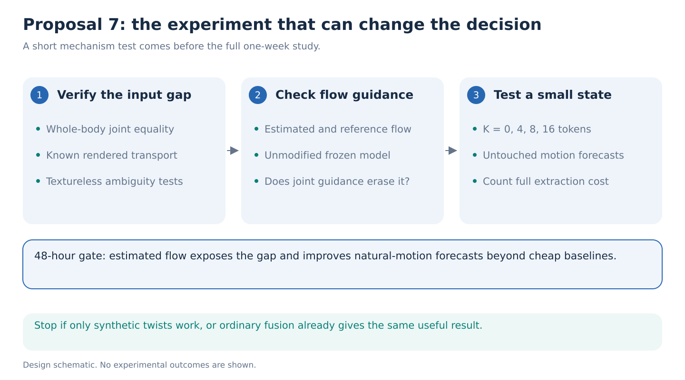

# 07. Keep motion that the skeleton cannot explain

**Decision: a testable replacement for the constraint-conflict reserve.** The opportunity is to identify a specific missing part of a predictive state, then recover it with a small amount of visible surface motion. Combining optical flow and skeletons is established work. This proposal needs a stronger result than useful fusion.

**The one-week question.** When two movements have the same joint-position history, can a small S-JEPA adapter retain the extra surface motion needed to predict what happens next? How much of the useful prediction gap can four, eight or sixteen added motion tokens close?

## Why joint positions can miss movement

Imagine turning a forearm around its length while its elbow and wrist stay in place. A pattern on the sleeve moves, although the line connecting those joints can remain unchanged. A model receiving only that line has lost an observation that the video still contains.

This example needs careful qualification. Real joint extraction can move when the surface changes. Clothing can move independently of the arm. Some rotations have no visible signature from a particular camera. The first experiment therefore verifies what is actually missing from this project's input, rather than assuming that every twist is invisible to a skeleton.

Optical flow estimates where image pixels correspond between frames. It can preserve visible surface transport between joints. It is derived from the same RGB video, so it is an additional representation, not an independent sensor. It does not uniquely determine 3D movement, contact force or muscle activity.

The latest run's real-skeleton increment was about 0.000357, below the mismatched-skeleton increment of 0.000603. That motivates checking what the input preserves. It does not show that missing surface motion caused the run's failure. See the [evidence audit](../references/reviews/evidence-audit.md).

## Establish the missing information before training

Use whole-body AMASS rotations and the exact body-model and joint-conversion pipeline used by S-JEPA. Fix the primary skeletal observation to 22 body-joint positions, with Core11 as an ablation. Fitted rotations are targets or labeled ceilings, never hidden input channels. A constructive starting point is a joint with one child. Rotate the parent about the axis pointing toward that child, then apply the compensating inverse rotation at the child. In ideal forward kinematics, the child position and downstream joints stay unchanged while surface points attached to the parent can move.

This construction is only a starting point. Skinning, pose-dependent shape changes and surface-regressed landmarks can break equality. Verify the **complete final S-JEPA input tensor**, including normalization, timestamps, confidence and masks, for every accepted pair. A Jacobian can suggest a direction that initially leaves joints unchanged; it cannot certify equality after a finite movement.

Publish the tolerance and outcome separation. An exact input-ambiguity claim requires byte-for-byte equality of the final input, after any measurement quantization declared for every method. If only approximate equality is attained, report an approximate ambiguity and sensitivity test rather than an impossibility proof. The [rotation-algebra check](../references/reviews/verify_alias_algebra.py) validates an ideal chain only, not SMPL or the actual input conversion. Use declared joint-angle and velocity ranges; kinematic validity alone does not establish human plausibility.

Construct paired histories that return to the same body configuration at the observation cutoff but arrive with different surface-motion histories. This can hold the final image fixed as well. Render both histories with identical shape, camera, texture, lighting and background. Save exact material-point correspondences and visibility from the renderer. These references are separate from estimated optical flow.

Constant-speed rotations only test the information gap. A simple flow extrapolator may solve their futures perfectly. They cannot be the paper's headline.

## The method: retain the part that joint motion leaves unexplained

Freeze SEA-RAFT. Use a frozen local S-JEPA checkpoint only after verifying its availability, provenance, 22-joint compatibility and prefix-only feature computation; none was loaded or confirmed for this review. Otherwise train a small S-JEPA-style skeleton branch with the adapter within the same budget, with matched coordinate and random-feature controls. The representation and measurement result must not depend on an unavailable author checkpoint. Use the joint tracks to construct a simple piecewise body-motion reference in image coordinates. Subtract that reference from estimated foreground flow. The remainder contains possible surface motion plus measurement error; it is not automatically a physical rotation or a mathematically exact invisible direction.

A small adapter receives joint features and a budget of **K = 0, 4, 8 or 16** additional motion tokens. Each token contains a short local flow or track history, its position relative to nearby joints, and visibility or consistency features. Include both raw and residual transport so a bad reference subtraction does not discard useful motion. Select locations using observed frames only, never future targets. Every image pair used for flow must end by the cutoff. Run any offline tracker on the prefix alone.

Train the adapter on unedited training motion to predict future material-point movement and segment orientation; retain constructed aliases as diagnostic fixtures. Compare fixed anatomical locations, uniform surface sampling and learned selection at each budget. Fix each token's dimension and history length, and report bytes and downstream computation. This identifies a useful budget among tested encodings, not a mathematical minimum. Dense flow still has to be computed before compression, so report total inference cost separately.

There is a specific related-method hypothesis. H-MoRe couples surface-flow direction and magnitude to nearby skeletal offsets. In some verified pairs, that preference could penalize real motion that the joint tracks do not explain. Compare unmodified flow, the published guidance strategy and a residual-preserving adapter. Measure any suppression against renderer correspondence. Do not assume it occurs in the original model: image terms, implementation details and handling of stationary joints can change the outcome. [H-MoRe](https://arxiv.org/html/2504.10676v1).

[H-Flow](https://arxiv.org/html/2605.22629v1) also couples surface motion to interpolated joint displacements, allowing a tolerance for deviations. Test that tolerance explicitly. Fix guidance weights using an independent development set and report both noise removal and real-motion retention. Arbitrarily increasing a penalty until motion disappears proves little.

## The decisive forecast experiment

After the construction test, use **unedited, held-out AMASS movement** as the primary forecast study. Observe one second, then predict material-point trajectories and segment orientations at 0.25 and 0.5 seconds. Freeze these horizons before fitting. Keep subjects, original trials and all rendered variants together when splitting. Audit source identities and bootstrap people, not rendered windows. [AMASS](https://arxiv.org/abs/1904.03278) fits body parameters to motion capture. Its rendered surfaces and twist angles are model-derived references, not direct measurements of skin or clothing motion.

Use fixed anatomical material points selected for visibility at the cutoff, identically across methods. The primary target is **2D image-space transport**: each point's change in offset from the projected pelvis between the cutoff and the future time. Express both endpoints in full-frame pixel coordinates and normalize with a fixed person-height estimate computed from the observed prefix only, shared by every method. Undo the known prefix crop transforms on flow endpoints before constructing inputs. Future renderer coordinates define evaluation targets, never crop or camera information available to the predictor. Report pixel error alongside normalized error.

Measure geodesic angular error for declared local segment rotations as a separate, model-derived 3D endpoint; image transport does not uniquely identify it. Separate future-visible and future-occluded points using renderer visibility and report coverage. Include every eligible point in the main comparison; any abstention rule is calibrated separately. Joint-position error is supplementary because some surface rotations need not change joint centers. Never score a prediction only against the flow estimator that supplied its input.

The critical comparisons are:

- Raw joint histories and equal-capacity random-encoder or coordinate heads.
- Constant flow velocity, a Kalman-style tracker and geometry-based flow-to-body fitting.
- Angular-velocity extrapolation and extra off-axis landmarks under a matched observation budget.
- Direct raw-flow forecasting and simple joint-plus-flow concatenation, with matched trainable capacity.
- Dense flow, past RGB/video features and a full RGB mesh-recovery pipeline given the same past frames.
- The published H-MoRe guidance strategy and unchanged SEA-RAFT.
- Full recorded rotations and exact renderer transport as separately labeled information ceilings.

The useful result is a forecast gain over the strongest simple explanation, together with a token-budget curve showing which extra observations matter. A small state that preserves most of the dense-flow benefit across unfamiliar movement and observation conditions would be interesting. A synthetic twist classifier or an improvement over skeleton-only prediction would be insufficient. Finding exact aliases proves information loss for those pairs; it does not establish how often natural movement suffers the same loss.

Match duration, foreground extent, centroid displacement and flow-energy summaries. Test whether those summaries predict the outcome. Keep a static final-image baseline to detect appearance leakage. Hold out a new movement family and a new texture/camera condition after development. Include textureless surfaces, repeated patterns, occlusion, moving texture on a static body and a moving camera viewing a static person. One background homography does not remove all camera parallax. Include 3D motions with identical projections: neither joints nor flow may settle their difference.

GAVD provides a later real-video stress test for visible correspondence and failure behavior. It does not supply exact 3D twist or material-point futures. A classification supplement would use its multiclass presentation labels and source-held-out protocol, but classification is not needed for this headline.

## What is new, and what already exists

[Pose from Flow and Flow from Pose](https://openaccess.thecvf.com/content_cvpr_2013/html/Fragkiadaki_Pose_from_Flow_2013_CVPR_paper.html) jointly improved articulated pose and motion in 2013. [Flow-based human-motion estimation](https://arxiv.org/abs/1703.00177) already fits a rendered body to optical flow. [MC-JEPA](https://arxiv.org/abs/2307.12698) jointly learns motion and content. [FOFPred](https://arxiv.org/abs/2601.10781) forecasts dense flow, while [JOPAT](https://arxiv.org/abs/2605.23856) combines visual and track predictions. H-MoRe directly covers human-centric flow, gait and generation.

H-Flow also evaluates dense surface motion using simulated material correspondence. The proposed opening is narrower: demonstrate an exact input ambiguity, measure the additional observation budget that repairs a useful forecast, and test when skeleton-guided constraints erase that information. Even this remains a novelty hypothesis. If generic fusion performs equally well, report a representation audit rather than claiming a new world-model method.

## Access, stop tests and one-week budget

SEA-RAFT's official loader points to a publicly listed **78.8 MB** [model.safetensors](https://huggingface.co/MemorySlices/Tartan-C-T-TSKH-spring540x960-M/blob/main/model.safetensors). Its [code](https://github.com/princeton-vl/SEA-RAFT) supplies image-pair inference. The file was inspected online but not downloaded or run here. RAFT is the fallback; WAFT and CoTracker3 are optional estimator checks. See the [flow evidence memo](../references/reviews/optical-flow-world-models.md).

The H-MoRe paper's repository link returned 404 during this review. Use original weights only after verifying another author release. Otherwise implement the published constraints on the common flow model and label this a reproduction, not a measured result from the original checkpoint. No primary experiment should depend on unavailable weights.

**By hour 24:** verify at least 100 nontrivial finite input-matched pairs from distinct source windows, correct renderer correspondence and the constant-flow baseline. Report the number of source people and trials. Stop if the alleged missing motion changes the actual skeleton input or exists only through a rendering artifact.

**By hour 48:** estimated flow must recover useful extra evidence across two cameras and textures, and a small natural-motion pilot must show a forecast benefit beyond extrapolation and a direct raw-flow head. Stop adaptation if only oracle flow works, simple fusion is sufficient, or natural-motion benefit is absent. A practical development gate is at least a 10% relative error reduction over the strongest cheap baseline with a group-bootstrap interval excluding zero, provided its absolute size matters; this is a proposed threshold, not a power guarantee.

Cap the selected one-week study at **350 H100-hours**: 30 for the pilot and conversions, 70 for rendering and frozen extraction, 150 for matched adapters and baselines, and 100 for held conditions, independent seeds and failure audits. Measure throughput first. The seven proposals remain alternatives; this budget is not added automatically to the flagship schedule. Conditional novelty is moderate, roughly 3 of 5 before the gates, with a credible upgrade only if the controlled limitation explains a useful natural-motion result.
