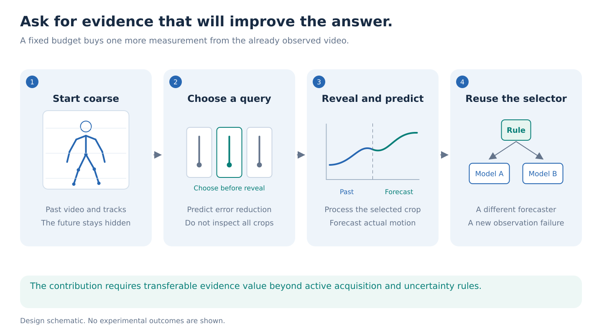
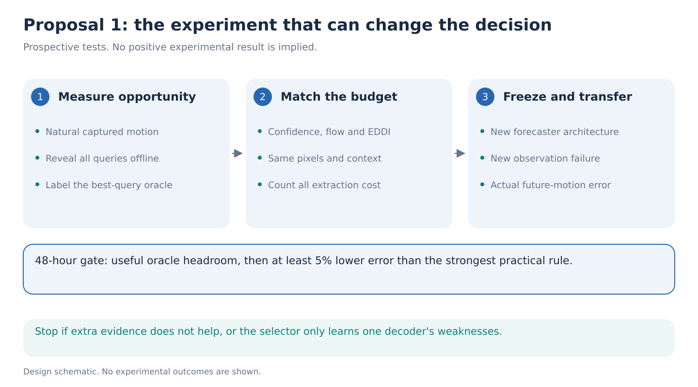

# 01. Learn which observation will improve the answer

> **Decision stage: September 14 seven-proposal comparison.** Priority statements describe [that comparison](../proposal-comparison.md). See the [research agenda](../README.md) for the latest recommendation.

**Decision:** A leading pilot, conditional on useful additional evidence existing. The proposed contribution is a reusable representation of observation value, not another frame-selection algorithm.

**One-week question:** Can a frozen JEPA encoder support a small selector that chooses useful past-video measurements, then transfers unchanged to a different forecaster and an unseen observation failure?

## Step 1. Understand the problem

Suppose a model must predict where someone's foot will be half a second later. It has a coarse video preview and noisy joint tracks. It can examine one additional high-resolution body region. The arm may be very uncertain yet irrelevant; a clearer view of the pelvis might reveal an approaching turn.

The useful observation is the one that improves the answer. Uncertainty alone does not identify it. This is a hypothesis about real forecasts, not an assumption that arms or pelvis always have these roles.

Notebook 06 showed why this change matters. A selector cannot produce useful repair when its proposed correction is mostly damaging. Here the selected action reveals more recorded evidence. Its benefit can be measured before learning the selector. Read the [evidence summary](../references/portfolio-evidence.md).

## Step 2. Fix what the model can observe

Use natural, unedited AMASS recordings with whole-body motion references. Render an observed one-second prefix and obtain noisy projected 22-joint histories. Start with declared tracking corruptions, then repeat the surviving result with the existing MediaPipe Lite route listed in the [model ledger](../references/portfolio-literature.md). Its 33 landmarks require a fixed common-joint mapping: unavailable internal joints remain masked, never filled with reference truth. Predict root-relative 3D joint positions at 0.25 and 0.5 seconds. Camera information, coordinate conventions, and prefix-derived normalization are identical across methods.

Every method initially receives the same low-resolution full-body preview and joint history. Initial tracking also runs only on that permitted preview; a full-resolution detector cannot secretly supply the withheld evidence. Freeze a short query menu: higher-resolution clips of four body regions, or denser past frames from two fixed temporal intervals. A query reveals only pixels already recorded before the forecast cutoff. It never supplies another camera or a future frame.

Match query sizes where possible and report actual pixels, encoder computation, and latency. Count the preview and pose-estimation costs for every method. A selector that encodes every high-resolution crop before choosing has already spent the supposed saving.

## Step 3. Give each question a precise meaning

Define a question by nonnegative weights over joint, coordinate, and forecast horizon, summing to one. For example, one question emphasizes future ankle height; another emphasizes the horizontal positions of both feet. The answer is a continuous position forecast. Its score is the weighted sum of squared coordinate errors.

Keep AMASS errors in square metres. Use one training-only scale for numerical optimization and invert it before aggregation. Freeze coordinate axes and horizon definitions. This makes question weights interpretable rather than mixing incompatible units.

Reserve some weight combinations entirely for evaluation. Success on them is **compositional transfer among known motion outputs**. It is not zero-shot support for arbitrary questions, diagnoses, or nonlinear knee-angle measurements. A genuinely new target family would require a separate experiment and suitable target description.

## Step 4. Teach observation value using actual outcomes

Freeze the locally available V-JEPA 2.1 B encoder. Its dense temporal features provide context for a small head; selected crops use the same frozen encoder. Fit a compact S-JEPA-style forecaster with shared observation handling. Backbone pretraining is not the contribution. The [official model release](https://github.com/facebookresearch/vjepa2) provides the encoder; no robot action-conditioned predictor is used.

First fit the forecaster on one training portion. On a separate training portion, reveal each allowed query and compute how it changes every future-coordinate error. These are labels for the selector:

`value = squared error before reveal - squared error after reveal`.

The selector predicts this vector from coarse context and query identity. The question weights turn it into an expected benefit. Choose the highest-benefit affordable query, reveal it, and forecast again. Include a no-query option. Begin with one reveal; test two sequential reveals only after the mechanism works.

Offline training may evaluate all queries. Test-time selection must inspect only the chosen one. Ground-truth future motion supplies training labels and evaluation, never selection inputs.

## Step 5. Separate useful selection from a novelty claim

Active acquisition is established. [EDDI](https://arxiv.org/abs/1809.11142) selects information about designated targets, and [GSM-AFA](https://arxiv.org/abs/2010.02433) uses a learned generative surrogate. [ActiveMoCap](https://arxiv.org/abs/1912.08568) chooses views for pose recovery. [Video Active Perception](https://arxiv.org/abs/2605.01662) selects frames for video questions. [Sensing clocks](https://arxiv.org/abs/2607.01537) determine when world models should receive new observations. See the [reference ledger](../references/portfolio-literature.md).

Our stronger test freezes the selector and changes both the forecasting architecture and an observation failure excluded from selector training. The second forecaster learns the same query interface from training people, without fitting a new selection policy. Does observation value transfer, or does it merely encode one decoder's weaknesses? This transfer is empirical, not guaranteed by the loss. New weighted combinations are a secondary compositional check, not the main novelty: summing already predicted coordinate gains is straightforward.

Compare uniform and stratified queries, querying the target limb, pose uncertainty, flow disagreement, motion energy, target-information acquisition, and an equally sized learned attention selector. Include coordinate-only and random-feature heads to establish what JEPA contributes. The oracle that knows every realized query gain is a labeled ceiling.

## Step 6. Make the decision within 48 hours

Split people and original recordings before windows or renders. Keep variants together. Report forecast error in physical units and relative improvement, with people as bootstrap units. Compare useful and irrelevant uncertainty reductions using the same measured future-error endpoint.

Stop if the best-query oracle removes less than 10% of forecast MSE beyond the strongest fixed-cost baseline. If headroom exists, seek at least 5% relative improvement over the strongest practical baseline, with a positive person-bootstrap interval. These are planning thresholds, not power calculations or predicted effects.

Budget 40 to 100 H100-hours for the pilot, adjusted after a timed batch. If selected, allow 200 to 350 H100-hours across the week for matched comparisons, three training seeds, and transfer tests. Frozen extraction and small heads should make the first result reachable in two days; throughput remains unmeasured.

For GAVD, use only recorded prefix frames and evaluate visible future 2D landmarks. Creating approximately 240 checked reference frames requires an explicit allowance of 8 to 12 human annotation hours. These annotations do not already exist. Without them, GAVD remains a qualitative stress test.

An ICLR-level result would show a substantial forecast benefit, transferred observation value, and clear evidence that JEPA adds more than inexpensive rules. A small gain restricted to one decoder would be a useful optimization, with insufficient support for the proposed broader contribution.
