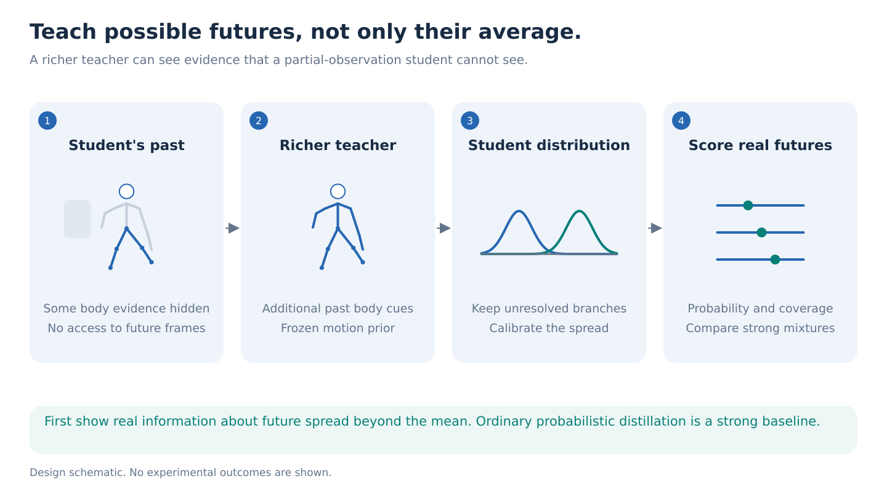
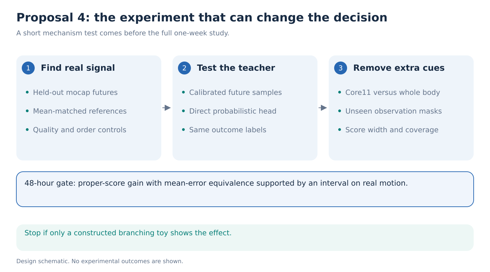

# 4. Teach the range of possible futures

**Decision:** A higher-risk scientific alternative. Its attraction is a precise blind spot in mean-based tests. It needs real motion evidence before any new distillation method is justified.

**One-week question.** Can skeleton history improve a calibrated distribution of future movement when it does not improve the conditional mean, and can a small student inherit that useful uncertainty from a richer pretrained teacher?

## Why a correct average can be a wrong description

Suppose a person may step left or right. The average of those futures is straight ahead, even if nobody actually follows that path. Another person might have the same average but a much narrower range of possible foot placements. Predicting one average cannot distinguish the two situations.

The proposed output is a distribution over a few measured future quantities, such as lateral foot displacement and trunk rotation. It should become narrower when the input provides more evidence and remain broad when relevant information is hidden.

The latest small RGB-conditioned mean increment does not establish this effect. It simply leaves the question open. We must not label pose noise, tracking failure or hidden future frames as meaningful behavioral uncertainty.

## A small example, with an important limitation

In a constructed example, future displacement is equally likely to be `+a` or `-a`. Its mean is zero. History might reveal `a`, so history can improve the predicted spread without changing the mean. This is elementary probability, not a new theorem or a result from GAVD.

The first empirical task is to find the corresponding distinction in real held-out motion. If the effect exists only because we manufacture random branches, it is a demonstration of the metric and cannot carry the paper.

## Method: match the student's information

Use existing AMASS with a 22-joint whole-body teacher and a Core11 or occluded-view student. Both see only past motion. The teacher's extra arm, spine or depth information is deliberately hidden from the student. This is a clean experiment about information availability; it does not assert that arms cause the future.

Start from the publicly released [Human Motion Diffusion Model](https://github.com/GuyTevet/motion-diffusion-model), using its documented motion representation and prefix-conditioned completion. Keep the pretrained network frozen. If sampling is too slow, cache frozen prefix features and fit a small probabilistic head. Verify that feature extraction never reads the actual future. A small S-JEPA adapter and mixture-density head are the candidate student. Every comparator gets the same supervision budget.

The teacher must first beat a simple whole-body probabilistic predictor on real held-out futures. A pretrained generator's samples are not ground truth. The first experiment fits eight scalar two-component mixtures: lateral and forward right-ankle displacement, trunk yaw change, and left-elbow displacement magnitude, each at 0.5 and 1 second. Use prefix-relative coordinates and a declared continuous unwrapping convention for yaw; exclude unsupported wrap cases by a fixed rule. These are marginal distributions, not a joint model of body coordination.

Let `H` be the student's past and `Z` the additional teacher-only evidence. The correct student target averages over teacher states compatible with `H`:

`student future distribution = average of teacher distributions over plausible Z given H`.

This statement is the law of total probability. Ordinary forward-KL distribution distillation can already perform this averaging in the population limit. Therefore, explicit averaging is **not** a new algorithm by itself. Test whether a finite-data implementation using training-only neighboring histories, with distance and matching tolerances selected inside training, improves calibration enough to matter. Report the bias introduced by approximate neighbors.

## The distinctive scientific test

Compare two nested references: current pose, velocity and quality; then full past history. Fit both with the same probabilistic head capacity. Ask whether history improves a proper distribution score after its mean-prediction gain is negligible. Repeat with order-free past summaries to distinguish dynamics from simple denoising.

Use negative log likelihood for the fixed mixture family and CRPS for each scalar outcome. Normalize aggregate CRPS with fixed training-side scales so radians and meters do not determine the ranking; also report every raw-unit score. Check 90% interval coverage and width together. Fix sample count and use the predictive mean for point error. Never choose the sample closest to the true future. Marginal score gains do not establish better joint coordination.

Training baselines include direct probabilistic coordinate forecasting, ordinary forward-KL distribution distillation, a same-capacity uncertainty head without a teacher, mixture versus single-Gaussian heads, and the frozen prior itself. Include temperature or variance calibration on independent training-side groups. A mean-only student is an explanatory comparison, not the strongest baseline.

Use real AMASS motion as the principal outcome source. Known-view projections let us remove depth or upper-body evidence while keeping the underlying motion fixed. Original motions and all their projections stay in the same split. Measure degradation as evidence is removed and recovery when it is restored. Whole-body input is valuable only if it improves these scores beyond an equal-capacity Core11 model.

## The one-week decision

**Days 1 to 2:** Audit approximately 500 windows and report their independent people and trials. Group uncertainty by person when identity is known. First compare the probabilistic raw-motion references and strong mean predictors. The blind-spot claim requires a paired 95% interval for relative mean-error improvement entirely within a prespecified ±1% equivalence margin, together with a supported CRPS gain of provisionally 5%. A small mean-gain point estimate or a nonsignificant test is insufficient. If equivalence remains unresolved, report better probabilistic prediction with unresolved mean contribution, and demote the blind-spot claim. The effect must also survive quality and order-free controls.

**Days 3 to 4:** Test whether the frozen richer teacher provides useful distributional targets. If direct probabilistic training matches it, stop the teacher-method branch. A clean finding about distributional information may still justify a narrower representation study.

**Days 5 to 7:** Train and compare three paired student seeds, repeat on a held AMASS source corpus, and test an unseen missing-observation pattern. GAVD may illustrate uncertainty under occlusion, but without independent future 3D truth it does not provide the headline calibration result.

Cap this alternative at **450 H100 GPU-hours**, with no more than 32 cached teacher samples per pilot prefix and a throughput check before scaling. These are planning limits, not measured runtimes.

## Prior work and the claim boundary

[HumanMAC](https://arxiv.org/abs/2302.03665) already frames probabilistic motion prediction as completion. [Generalized distillation](https://arxiv.org/abs/1511.03643) already handles privileged information. [SCDP](https://arxiv.org/abs/2603.09574) already distills locomotion under partial observations. [Aleatoric uncertainty with missing modalities](https://arxiv.org/abs/2601.21950) already treats modality-specific uncertainty explicitly.

Our possible contribution is the controlled discovery and transfer of useful **distributional temporal information missed by conditional-mean gates**, with matching student information and strong probabilistic baselines. It is not the first uncertain motion predictor or privileged teacher. If the only success is beating deterministic MSE with a mixture model, the result is incremental and should not become the ICLR submission.
